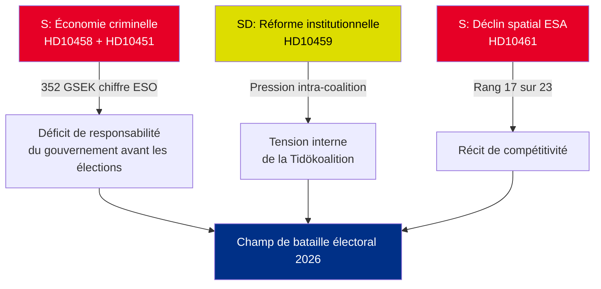

# Compte rendu exécutif — Interpellations 2026-05-01

**BLUF (Ligne directrice)** : Cinq interpellations déposées du 22 au 30 avril 2026 révèlent trois crises concomitantes — l'économie criminelle suédoise (352 GSEK/5,5 % du PIB), les violences de gangs et le déclin de la compétitivité dans le secteur spatial — qui convergent simultanément dans le calendrier politique pré-électoral. L'opposition S et le parti gouvernemental SD utilisent les interpellations pour façonner le récit électoral de l'été 2026.

## Décisions immédiates requises

1. **Ministre de la Justice Strömmer (M)** : Doit opérationnaliser « éradiquer la criminalité des gangs en 4 ans » avant la date de réponse HD10458 le 2026-05-19 — sous peine d'atteinte à la crédibilité avant la campagne électorale
2. **Ministre Edholm (L)** : Doit expliquer la chute de la Suède au rang 17 auprès de l'ESA avant la date de réponse HD10461 le 2026-05-19 — Rymdstyrelsen demande sensiblement plus que les 100 MSEK alloués
3. **Ministre civil Slottner (KD)** : Doit répondre à la demande de réforme constitutionnelle du SD (pouvoir de nomination au Riksdag) d'ici le 2026-05-20 — la réponse signalera la tolérance de la coalition envers les concessions au SD

## Récapitulatif de l'importance

| dok_id | Sujet | Score DIW | Priorité |
|--------|-------|-----------|---------|
| HD10458 | Promesse d'éradication de la criminalité des gangs | 8/10 | L2+ Priorité |
| HD10451 | Économie criminelle 352 GSEK | 7/10 | L2 Stratégique |
| HD10461 | Financement ESA/spatial en déclin | 7/10 | L2 Stratégique |
| HD10459 | Demande de réforme des agences activistes | 6/10 | L2 Stratégique |
| HD10460 | SFV bidragsfastigheter (RiR 2025:30) | 5/10 | L3 Opérationnel |

## Dynamique stratégique centrale

## Indicateurs à échéance critique

- **2026-05-19** : Strömmer (gangs) + Edholm (espace) répondent — dates les plus visibles
- **2026-05-20** : Slottner (activisme institutionnel) répond — tensions de coalition visibles
- **2026-05-21** : Brandberg (SFV) répond — visibilité la plus faible

**Évaluation** : La convergence des HD10458 + HD10451 crée le défi d'opposition le plus dangereux pour le gouvernement : un récit cohérent de « 352 GSEK d'économie criminelle + violence croissante + gouvernement sans outils », étayé par des sources indépendantes (ESO) et vérifiable.

---
*Analyste : Pipeline de renseignement agentique | Date : 2026-05-01 | Classification : NON CLASSIFIÉ*

---

## Ajouts du Passage 2 : Évaluation stratégique approfondie

### Lacune critique identifiée lors de la révision du Passage 1

Le gouvernement est confronté à un paradoxe structurel de responsabilisation : **les trois interpellations à la preuve la plus solide (HD10458, HD10451, HD10461) citent toutes des données de source indépendante** (ESO : 352 GSEK ; ESA : rang 17/23 ; violence : statistiques record 2025). Ceci est analytiquement inhabituel — les interpellations de l'opposition s'appuient typiquement sur un cadrage politique. Dans ce lot, S a ancré sa campagne sur des chiffres que le gouvernement ne peut pas contester de manière crédible sans remettre en question des organes d'experts indépendants (ESO) et Rymdstyrelsen.

### Arbre décisionnel amélioré

1. **Strömmer** (HD10458 + HD10451) : Annoncer un paquet législatif (transposition de la directive UE contre la criminalité organisée + confiscation d'avoirs) d'ici le 2026-05-12 (7 jours avant la date de réponse) — cela transforme un moment défensif en annonce de politique publique
2. **Edholm** (HD10461) : Le financement supplémentaire VÅP est la seule voie de réponse crédible ; doit être coordonné avec le Finansdepartementet
3. **Slottner** (HD10459) : Annoncer un examen ciblé des subventions à la société civile — concession partielle au SD sans engagement constitutionnel

### Contexte économique (FMI/SCB)
- PIB suédois 2025 : environ 6 400 GSEK (estimé)
- 352 GSEK d'économie criminelle = ~5,5 % du PIB (calcul ESO)
- Comparaison UE : l'ONUDC estime l'économie criminelle de l'UE à 2–4 % du PIB ; les 5,5 % de la Suède (si la méthodologie de l'ESO est cohérente) indiquent une pénétration supérieure à la moyenne

---
*Ajouts du Passage 2 : 2026-05-01*

<!-- source-sha: 2d65e85af6ee6672a9ff7a4fcd257a8ea9b0651f -->
