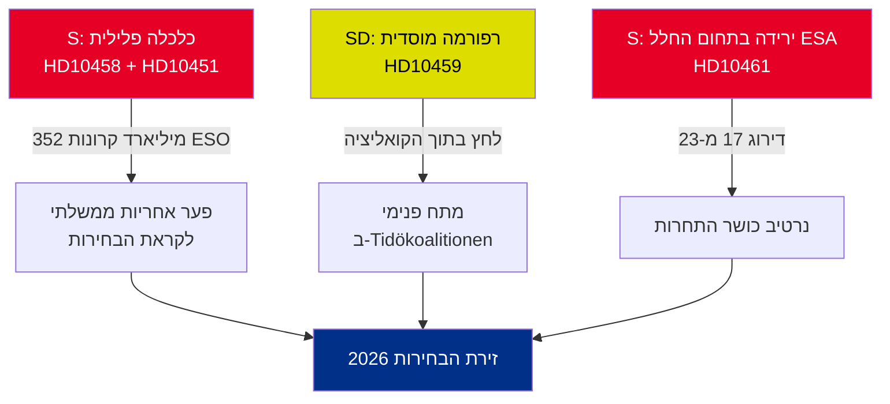

<!-- dir: rtl -->
# תקציר מנהלים — שאילתות לממשלה 2026-05-01

**תמצית (BLUF)**: חמש שאילתות שהוגשו בין 22 ל-30 באפריל 2026 חושפות שלוש משברים מתכנסים — הכלכלה הפלילית של שוודיה (352 מיליארד קרונות / 5.5% מהתוצר), אלימות כנופיות, ירידה בתחרותיות מגזר החלל — שכולם מגיעים בו-זמנית בלוח הזמנים הפוליטי לקראת הבחירות. האופוזיציה S ומפלגת הממשלה SD משתמשות בשאילתות לעיצוב נרטיב הבחירות של קיץ 2026.

## החלטות נדרשות מיידית

1. **שר המשפטים סטרומר (M)**: חייב לאפיין "מיגור פשע הכנופיות ב-4 שנים" לפני תאריך התשובה HD10458 ב-2026-05-19 — אחרת ייפגע האמינות לקראת מסע הבחירות
2. **השר אדהולם (L)**: חייב להסביר את ירידת שוודיה לדירוג 17 ב-ESA לפני תאריך התשובה HD10461 ב-2026-05-19 — Rymdstyrelsen מבקשת הרבה יותר מ-100 מיליון קרונות שהוקצו
3. **השר האזרחי סלוטנר (KD)**: חייב להגיב לדרישת SD לרפורמה חוקתית (סמכות מינוי לרישדאג) עד 2026-05-20 — התשובה תאותת על סבלנות הקואליציה כלפי פייסנות SD

## סיכום חשיבות

| dok_id | נושא | ציון DIW | עדיפות |
|--------|------|----------|-------|
| HD10458 | הבטחה למיגור פשע הכנופיות | 8/10 | L2+ עדיפות |
| HD10451 | כלכלה פלילית 352 מיליארד קרונות | 7/10 | L2 אסטרטגי |
| HD10461 | מימון ESA/חלל בירידה | 7/10 | L2 אסטרטגי |
| HD10459 | דרישה לרפורמה בסוכנויות פעילניות | 6/10 | L2 אסטרטגי |
| HD10460 | SFV bidragsfastigheter (RiR 2025:30) | 5/10 | L3 מבצעי |

## דינמיקה אסטרטגית מרכזית

## מדדים קריטיים בזמן

- **2026-05-19**: סטרומר (כנופיות) + אדהולם (חלל) מגיבים — תאריכים הנראים ביותר
- **2026-05-20**: סלוטנר (פעילנות ממסדית) מגיב — מתחי הקואליציה גלויים
- **2026-05-21**: ברנדברג (SFV) מגיב — נראות נמוכה ביותר

**הערכה**: התכנסות HD10458 ו-HD10451 יוצרת את האתגר האופוזיציוני המסוכן ביותר לממשלה: נרטיב קוהרנטי של "352 מיליארד קרונות כלכלה פלילית + אלימות מתגברת + ממשלה ללא כלים", המגובה על ידי מקורות עצמאיים (ESO) ואף ניתן לאימות.

---
*אנליסט: צינור מודיעין אגנטי | תאריך: 2026-05-01 | סיווג: לא מסווג*

---

## תוספות סיבוב 2: הערכה אסטרטגית מורחבת

### פגם קריטי שזוהה בסקירת סיבוב 1

הממשלה עומדת בפני פרדוקס אחריות מבני: **שלוש השאילתות בעלות הראיות החזקות ביותר (HD10458, HD10451, HD10461) כולן מצטטות נתוני מקור עצמאיים** (ESO: 352 מיליארד קרונות; ESA: דירוג 17/23; אלימות: סטטיסטיקות שיא 2025). זהו דבר יוצא דופן מבחינה אנליטית — בדרך כלל שאילתות האופוזיציה מתבססות על מיסגור פוליטי. בקבוצה זו, S עיגנה את מסע הבחירות שלה על נתונים שהממשלה אינה יכולה לחלוק עליהם באמינות מבלי לערער גופי מומחים עצמאיים (ESO) ו-Rymdstyrelsen.

### עץ החלטות משופר

1. **סטרומר** (HD10458 + HD10451): להכריז על חבילת חקיקה (יישום הנחיית האיחוד האירופי נגד פשע מאורגן + חילוט נכסים) עד 2026-05-12 (7 ימים לפני מועד התשובה) — הופך רגע הגנתי להכרזת מדיניות
2. **אדהולם** (HD10461): מימון VÅP הנוסף הוא המסלול היחיד בעל האמינות; יש לתאם עם משרד האוצר
3. **סלוטנר** (HD10459): להכריז על סקירה ממוקדת של סבסוד החברה האזרחית — פייסנות חלקית ל-SD ללא מחויבות חוקתית

### הקשר כלכלי (IMF/SCB)
- תמ"ג שוודיה 2025: כ-6,400 מיליארד קרונות (הערכה)
- 352 מיליארד קרונות כלכלה פלילית = ~5.5% מהתמ"ג (חישוב ESO)
- השוואה לאיחוד האירופי: UNODC מעריכה את הכלכלה הפלילית באיחוד ב-2–4% מהתמ"ג; 5.5% של שוודיה (אם מתודולוגיית ESO עקבית) מצביעה על חדירה גבוהה מהממוצע

---
*תוספות סיבוב 2: 2026-05-01*

<!-- source-sha: 2d65e85af6ee6672a9ff7a4fcd257a8ea9b0651f -->
