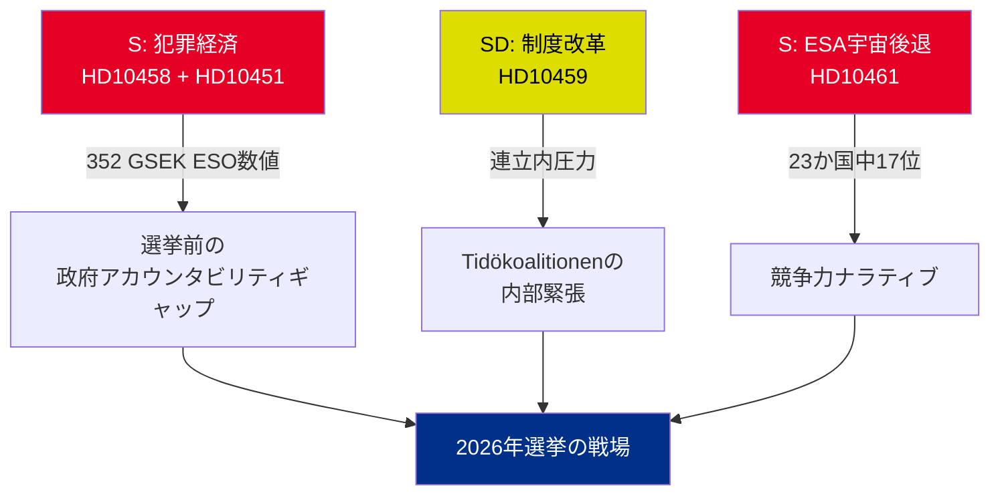

# エグゼクティブブリーフ — 政府質問書 2026-05-01

**BLUF（結論）**: 2026年4月22日から30日にかけて提出された5件の政府質問書は、3つの同時発生的な危機を明らかにしている — スウェーデンの犯罪経済（352 GSEK / GDP比5.5%）、ギャング暴力、宇宙セクターの競争力低下。これらはすべて、選挙前の政治カレンダーに同時に到来している。野党Sと与党SDは、2026年夏の選挙ナラティブを形成するために政府質問書を活用している。

## 即時対応が必要な決定事項

1. **法務大臣ストロマー（M）**: HD10458の回答期限2026-05-19までに「ギャング犯罪を4年で撲滅」を具体化しなければならない — さもなければ選挙運動前の信頼性に損害が生じる
2. **大臣エドホルム（L）**: HD10461の回答期限2026-05-19までにスウェーデンのESAでの順位17位への転落を説明しなければならない — Rymdstyrelsは割り当て額100 MSEKを大幅に超える要求をしている
3. **民政大臣スロットナー（KD）**: SDの憲法改革要求（リクスダーグへの任命権移譲）に2026-05-20までに回答しなければならない — 回答は連立内でのSD配慮の許容度を示す

## 重要度サマリー

| dok_id | テーマ | DIWスコア | 優先度 |
|--------|--------|-----------|-------|
| HD10458 | ギャング犯罪撲滅の公約 | 8/10 | L2+優先 |
| HD10451 | 犯罪経済352 GSEK | 7/10 | L2戦略的 |
| HD10461 | ESA/宇宙資金の減少 | 7/10 | L2戦略的 |
| HD10459 | 活動家機関の改革要求 | 6/10 | L2戦略的 |
| HD10460 | SFV bidragsfastigheter（RiR 2025:30） | 5/10 | L3作戦的 |

## 中心的な戦略的ダイナミクス

## 時間的に重要な指標

- **2026-05-19**: ストロマー（ギャング）+ エドホルム（宇宙）が回答 — 最も注目度の高い日程
- **2026-05-20**: スロットナー（機関活動主義）が回答 — 連立の緊張が可視化
- **2026-05-21**: ブランドベリ（SFV）が回答 — 最も注目度が低い

**評価**: HD10458とHD10451の収束は、政府にとって最も危険な野党の挑戦を生み出す：独立して裏付けられ（ESO）検証可能な「352 GSEKの犯罪経済 + 暴力の拡大 + 手段のない政府」という一貫したナラティブ。

---
*アナリスト：エージェンティック・インテリジェンス・パイプライン | 日付：2026-05-01 | 分類：非機密*

---

## パス2追加事項：強化された戦略的評価

### パス1レビューで特定された重要なギャップ

政府は構造的な説明責任のパラドックスに直面している：**最も証拠力の強い3件の質問書（HD10458、HD10451、HD10461）はすべて独立した情報源データを引用している**（ESO：352 GSEK；ESA：17/23位；暴力：2025年過去最高統計）。これは分析的に異例であり — 通常、野党の質問書は政治的フレーミングに依拠する。今回の一括審議では、Sは独立した専門機関（ESO）とRymdstyrelsを問題にすることなく政府が信頼性をもって反論できない数値に選挙運動を固定した。

### 強化された意思決定ツリー

1. **ストロマー**（HD10458 + HD10451）：2026-05-12（回答期限7日前）までに法律パッケージを発表（EU組織犯罪指令の実施 + 資産没収）— これにより防御的な局面が政策発表に転換
2. **エドホルム**（HD10461）：VÅP補足財政支援が唯一の信頼できる対応経路；Finansdepartementetとの調整が必要
3. **スロットナー**（HD10459）：市民社会補助金の対象審査を発表 — 憲法的コミットメントなしの部分的SD配慮

### 経済的文脈（IMF/SCB）
- スウェーデンGDP 2025：推定6,400 GSEK
- 352 GSEKの犯罪経済 = GDP比～5.5%（ESO計算）
- EU比較：UNODCはEUの犯罪経済をGDP比2–4%と推定；スウェーデンの5.5%（ESO手法が整合的であれば）は平均以上の浸透を示す

---
*パス2追加事項：2026-05-01*

<!-- source-sha: 2d65e85af6ee6672a9ff7a4fcd257a8ea9b0651f -->
