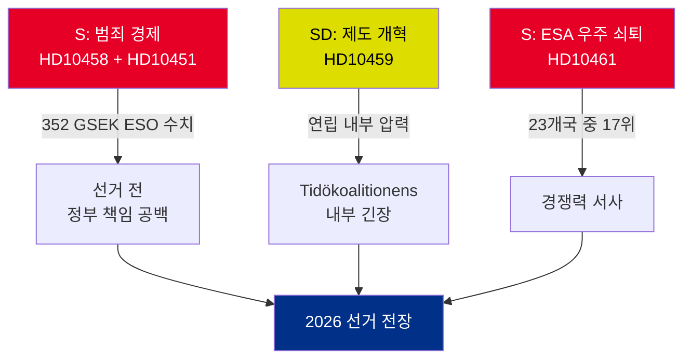

# 행정 브리핑 — 대정부 질문 2026-05-01

**BLUF（핵심 요약）**: 2026년 4월 22일부터 30일 사이에 제출된 5건의 대정부 질문은 세 가지 동시 위기를 드러냅니다 — 스웨덴의 범죄 경제(352 GSEK/GDP 대비 5.5%), 갱단 폭력, 우주 산업 경쟁력 저하 — 이 모든 것이 선거 전 정치 일정에 동시에 도래하고 있습니다. 야당 S와 여당 SD는 대정부 질문을 활용하여 2026년 여름 선거 내러티브를 형성하고 있습니다.

## 즉각적인 결정 사항

1. **법무장관 스트뢰메르(M)**: 2026-05-19 HD10458 답변 기한 전에 "4년 내 갱단 범죄 근절"을 구체화해야 함 — 그렇지 않으면 선거 캠페인 전 신뢰성 손상 위험
2. **에드홀름 장관(L)**: 2026-05-19 HD10461 답변 기한 전에 스웨덴의 ESA 17위 추락을 설명해야 함 — Rymdstyrelsen은 배정된 100 MSEK를 크게 초과하는 예산을 요청 중
3. **민정장관 슬로트네르(KD)**: 2026-05-20까지 SD의 헌법 개혁 요구(국회에 임명권 부여)에 답변해야 함 — 답변은 연립 내 SD 수용 범위를 시사

## 중요도 요약

| dok_id | 주제 | DIW 점수 | 우선순위 |
|--------|------|----------|---------|
| HD10458 | 갱단 범죄 근절 약속 | 8/10 | L2+ 우선 |
| HD10451 | 범죄 경제 352 GSEK | 7/10 | L2 전략적 |
| HD10461 | ESA/우주 자금 감소 | 7/10 | L2 전략적 |
| HD10459 | 활동가 기관 개혁 요구 | 6/10 | L2 전략적 |
| HD10460 | SFV bidragsfastigheter (RiR 2025:30) | 5/10 | L3 운용적 |

## 핵심 전략적 역학

## 시간적으로 중요한 지표

- **2026-05-19**: 스트뢰메르(갱단) + 에드홀름(우주) 답변 — 가장 가시적인 날짜
- **2026-05-20**: 슬로트네르(기관 활동주의) 답변 — 연립 긴장 가시화
- **2026-05-21**: 브란드베리(SFV) 답변 — 가시성 최저

**평가**: HD10458과 HD10451의 수렴은 정부에 가장 위험한 야당의 도전을 만들어냅니다: 독립적으로 근거가 있고(ESO) 검증 가능한 "352 GSEK 범죄 경제 + 증가하는 폭력 + 도구 없는 정부"라는 일관된 서사.

---
*분석가: 에이전틱 인텔리전스 파이프라인 | 날짜: 2026-05-01 | 분류: 미분류*

---

## 2차 검토 추가 사항: 강화된 전략적 평가

### 1차 검토에서 식별된 핵심 공백

정부는 구조적인 책임 역설에 직면합니다: **가장 강력한 증거를 가진 세 개의 질문(HD10458, HD10451, HD10461)은 모두 독립적인 원천 데이터를 인용하고 있습니다** (ESO: 352 GSEK; ESA: 17/23위; 폭력: 2025년 기록적 통계). 이것은 분석적으로 드문 일입니다 — 일반적으로 야당의 대정부 질문은 정치적 프레이밍에 의존합니다. 이번 패키지에서 S는 독립 전문가 기관(ESO)과 Rymdstyrelsen을 도전하지 않고서는 정부가 신뢰성 있게 반박할 수 없는 수치에 캠페인을 고정했습니다.

### 개선된 의사결정 트리

1. **스트뢰메르** (HD10458 + HD10451): 2026-05-12(답변 기한 7일 전)까지 법안 패키지 발표(EU 조직범죄 지침 시행 + 자산 몰수) — 이를 통해 방어적 순간을 정책 발표로 전환
2. **에드홀름** (HD10461): VÅP 추가 재정 지원이 유일하게 신뢰할 수 있는 대응 경로; Finansdepartementet와 조율 필요
3. **슬로트네르** (HD10459): 시민사회 보조금 대상 검토 발표 — 헌법적 약속 없는 부분적 SD 수용

### 경제적 맥락 (IMF/SCB)
- 스웨덴 GDP 2025: 약 6,400 GSEK (추정)
- 352 GSEK 범죄 경제 = GDP 대비 ~5.5% (ESO 계산)
- EU 비교: UNODC는 EU 범죄 경제를 GDP 대비 2–4%로 추산; 스웨덴의 5.5%(ESO 방법론이 일관적이라면)는 평균 이상의 침투를 나타냄

---
*2차 검토 추가 사항: 2026-05-01*

<!-- source-sha: 2d65e85af6ee6672a9ff7a4fcd257a8ea9b0651f -->
