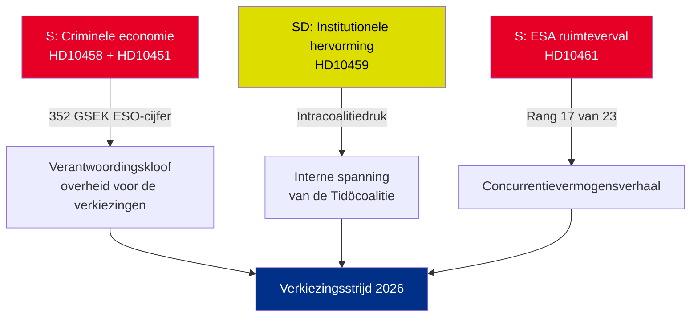

# Uitvoerende briefing — Interpellaties 2026-05-01

**BLUF (Kernboodschap)**: Vijf interpellaties ingediend van 22 tot 30 april 2026 onthullen drie samenlopende crises — de Zweedse criminele economie (352 GSEK/5,5 % van het bbp), bendegeweld en dalende concurrentiekracht in de ruimtesector — die allemaal gelijktijdig aankomen in de pre-electorale politieke agenda. De oppositiepartij S en de regeringspartij SD gebruiken interpellaties om het verkiezingsnarratief van zomer 2026 te vormen.

## Onmiddellijk vereiste beslissingen

1. **Minister van Justitie Strömmer (M)**: Moet "bendegeweld in 4 jaar uitroeien" operationaliseren vóór de antwoorddatum HD10458 op 2026-05-19 — anders riskert men geloofwaardigheidsverlies voor de verkiezingscampagne
2. **Minister Edholm (L)**: Moet de daling van Zweden naar rang 17 bij de ESA verklaren vóór de antwoorddatum HD10461 op 2026-05-19 — Rymdstyrelsen verzoekt aanzienlijk meer dan de toegewezen 100 MSEK
3. **Civiele minister Slottner (KD)**: Moet vóór 2026-05-20 reageren op SD's eis voor grondwettelijke hervorming (benoemingsbevoegdheid aan de Riksdag) — de reactie signaleert de tolerantie van de coalitie voor SD-tegemoetkomingen

## Significantieoverzicht

| dok_id | Onderwerp | DIW-score | Prioriteit |
|--------|-----------|-----------|----------|
| HD10458 | Belofte om bendegeweld uit te roeien | 8/10 | L2+ Prioriteit |
| HD10451 | Criminele economie 352 GSEK | 7/10 | L2 Strategisch |
| HD10461 | ESA/ruimtefinanciering in verval | 7/10 | L2 Strategisch |
| HD10459 | Eis tot hervorming van activistische instanties | 6/10 | L2 Strategisch |
| HD10460 | SFV bidragsfastigheter (RiR 2025:30) | 5/10 | L3 Operationeel |

## Centrale strategische dynamiek

## Tijdkritische indicatoren

- **2026-05-19**: Strömmer (bendes) + Edholm (ruimte) reageren — meest zichtbare data
- **2026-05-20**: Slottner (instantie-activisme) reageert — coalitiespaningen zichtbaar
- **2026-05-21**: Brandberg (SFV) reageert — minste zichtbaarheid

**Beoordeling**: De convergentie van HD10458 + HD10451 creëert de gevaarlijkste oppositie-uitdaging voor de regering: een coherent narratief van "352 GSEK criminele economie + toenemend geweld + regering zonder middelen", met onafhankelijke bronvermelding (ESO) en verifieerbaarheid.

---
*Analist: Agentische inlichtingenpijplijn | Datum: 2026-05-01 | Classificatie: NIET-GERUBRICEERD*

---

## Toevoegingen Doorloop 2: Uitgebreide strategische beoordeling

### Kritieke leemte geïdentificeerd bij beoordeling van Doorloop 1

De regering staat voor een structureel verantwoordelijkheidsparadox: **de drie interpellaties met de sterkste bewijsvoering (HD10458, HD10451, HD10461) citeren alle onafhankelijke brongegevens** (ESO: 352 GSEK; ESA: rang 17/23; geweld: recordcijfers 2025). Dit is analytisch ongebruikelijk — doorgaans steunen de interpellaties van de oppositie op politieke framing. In dit pakket heeft S haar campagne verankerd in cijfers die de regering niet geloofwaardig kan betwisten zonder onafhankelijke deskundigenorganen (ESO) en Rymdstyrelsen ter discussie te stellen.

### Verbeterde beslisboom

1. **Strömmer** (HD10458 + HD10451): Aankondiging wetgevingspakket (implementatie EU-richtlijn georganiseerde criminaliteit + vermogensbeslag) vóór 2026-05-12 (7 dagen voor de antwoorddatum) — dit zet een defensief moment om in een beleidsaankondiging
2. **Edholm** (HD10461): VÅP-aanvullende financiering is het enige geloofwaardige antwoordpad; moet worden gecoördineerd met het Finansdepartementet
3. **Slottner** (HD10459): Aankondiging gericht onderzoek naar subsidies aan maatschappelijk middenveld — gedeeltelijke SD-tegemoetkoming zonder grondwettelijke verbintenis

### Economische context (IMF/SCB)
- Zweeds bbp 2025: naar schatting 6.400 GSEK
- 352 GSEK criminele economie = ~5,5 % van het bbp (ESO-berekening)
- EU-vergelijking: UNODC schat de criminele EU-economie op 2–4 % van het bbp; Zwedens 5,5 % (als de ESO-methodologie consistent is) duidt op een bovengemiddelde infiltratie

---
*Toevoegingen Doorloop 2: 2026-05-01*

<!-- source-sha: 2d65e85af6ee6672a9ff7a4fcd257a8ea9b0651f -->
