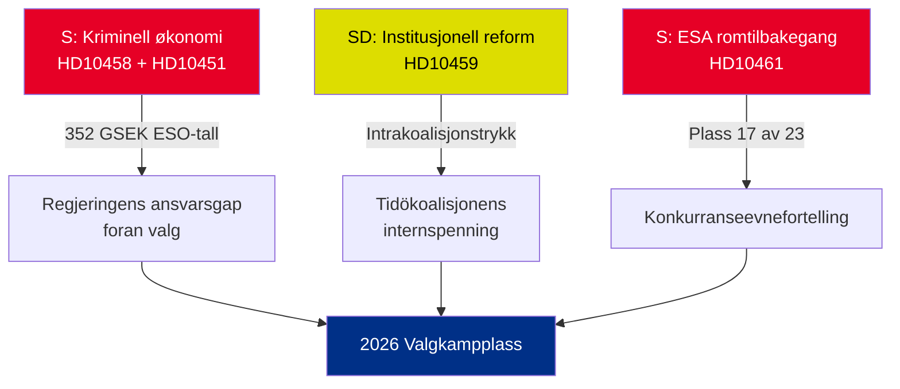

# Eksekutiv orientering — Interpellasjoner 2026-05-01

**BLUF (Bunnlinje)**: Fem interpellasjoner innlevert 22.–30. april 2026 avslører tre samtidige kriser — Sveriges kriminelle økonomi (352 GSEK/5,5 % av BNP), gjengerelatert vold og fallende konkurranseevne i romsektoren — som alle ankommer simultant i den forvalgspolitiske kalenderen. Opposisjonen S og regjeringspartiet SD bruker interpellasjoner til å forme sommer-2026 valgfortellingen.

## Beslutninger som kreves umiddelbart

1. **Justisminister Strömmer (M)**: Må operasjonalisere "utrydde gjengkriminalitet på 4 år" innen HD10458 svarsfrist 2026-05-19 — ellers risikeres troverdighetssskade foran valgkampen
2. **Minister Edholm (L)**: Må forklare Sveriges fall til plass 17 hos ESA innen HD10461 svarsfrist 2026-05-19 — Rymdstyrelsen anmoder om betydelig mer enn tildelte 100 MSEK
3. **Sivil statsråd Slottner (KD)**: Må svare på SDs krav om konstitusjonell reform (utnevnelsesmakt til Riksdagen) senest 2026-05-20 — svaret signaliserer toleransen for intrakoalisjons-SD-imøtekommelse

## Signifikansoppsummering

| dok_id | Tema | DIW-poeng | Prioritet |
|--------|------|-----------|----------|
| HD10458 | Løfte om å utrydde gjengkriminalitet | 8/10 | L2+ Prioritet |
| HD10451 | Kriminell økonomi 352 GSEK | 7/10 | L2 Strategisk |
| HD10461 | ESA/romfinansiering i tilbakegang | 7/10 | L2 Strategisk |
| HD10459 | Krav om reform av aktivistbyråkrater | 6/10 | L2 Strategisk |
| HD10460 | SFV bidragsfastigheter (RiR 2025:30) | 5/10 | L3 Operasjonell |

## Sentral strategisk dynamikk

## Tidskritiske indikatorer

- **2026-05-19**: Strömmer (gjeng) + Edholm (rom) svarer — mest synlige datoer
- **2026-05-20**: Slottner (byråkrataktivisme) svarer — koalisjonsspenninger synliggjøres
- **2026-05-21**: Brandberg (SFV) svarer — lavest synlighet

**Vurdering**: Konvergensen av HD10458 + HD10451 skaper den farligste opposisjonsutfordringen for regjeringen: en sammenhengende fortelling om "352 GSEK kriminell økonomi + eskalerende vold + en regjering uten verktøy" med uavhengig kildedekning (ESO) og verifiserbarhet.

---
*Analytiker: Agentisk etterretningspipeline | Dato: 2026-05-01 | Klassifisering: UGRADERT*

---

## Pass 2-tillegg: Utvidet strategisk vurdering

### Kritisk lakune identifisert ved gjennomgang av Pass 1

Regjeringen møter et strukturelt ansvarsskapende paradoks: **de tre interpellasjonene med sterkest evidens (HD10458, HD10451, HD10461) siterer alle uavhengige kildedata** (ESO: 352 GSEK; ESA: plass 17/23; vold: rekordtall 2025). Dette er analytisk uvanlig — typisk baserer opposisjonens interpellasjoner seg på politisk framing. I denne batchen har S forankret kampanjen sin i tall som regjeringen ikke troverdig kan bestride uten å utfordre uavhengige ekspertorganer (ESO) og Rymdstyrelsen.

### Forbedret beslutningsttre

1. **Strömmer** (HD10458 + HD10451): Kunngjør lovpakke (implementering av EUs direktiv mot organisert kriminalitet + aktivabeslagleggelse) senest 2026-05-12 (7 dager før svarsfrist) — dette gjør om et defensivt øyeblikk til en politikkunngjøring
2. **Edholm** (HD10461): VÅP-tilleggsfinansiering er den eneste troverdige svarsstien; må koordineres med Finansdepartementet
3. **Slottner** (HD10459): Kunngjør målrettet gjennomgang av sivilsamfunnssubsidier — delvis SD-imøtekommelse uten konstitusjonell forpliktelse

### Økonomisk kontekst (IMF/SCB)
- Sveriges BNP 2025: anslagsvis 6.400 GSEK
- 352 GSEK kriminell økonomi = ~5,5 % av BNP (ESO-beregning)
- EU-sammenligning: UNODC anslår EUs kriminelle økonomi til 2–4 % av BNP; Sveriges 5,5 % (hvis ESO-metodologien er konsistent) indikerer penetrasjon over gjennomsnittet

---
*Pass 2-tillegg: 2026-05-01*

<!-- source-sha: 2d65e85af6ee6672a9ff7a4fcd257a8ea9b0651f -->
