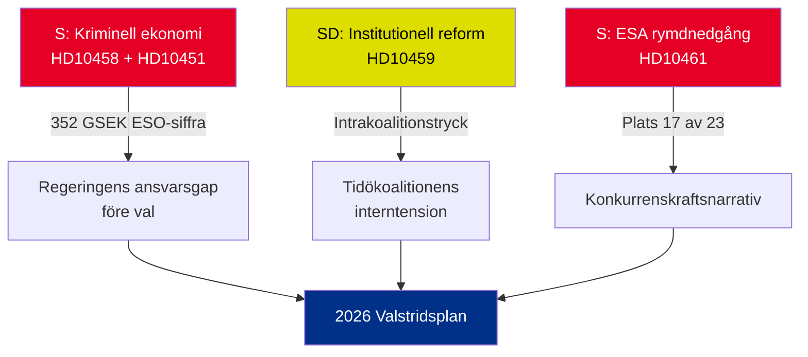

# Executiv sammanfattning — Interpellationer 2026-05-01

**BLUF (Kärnbudskap)**: Fem interpellationer inlämnade 22–30 april 2026 avslöjar tre sammanfallande kriser — Sveriges kriminella ekonomi (352 GSEK/5,5 % av BNP), gängrelaterat våld och sjunkande konkurrenskraft inom rymdssektorn — som alla anländer samtidigt i den förvalpolitiska kalendern. Oppositionen S och regeringspartiet SD använder interpellationer för att forma sommar-2026 valnarrativet.

## Beslut som krävs omedelbart

1. **Justitieminister Strömmer (M)**: Måste operationalisera "utrota gängkriminalitet på 4 år" före HD10458 svarstid 2026-05-19 — annars riskeras trovärdighetsskada inför valrörelsen
2. **Minister Edholm (L)**: Måste förklara Sveriges fall till plats 17 hos ESA före HD10461 svarstid 2026-05-19 — Rymdstyrelsen begär betydligt mer än tilldelade 100 MSEK
3. **Civilminister Slottner (KD)**: Måste svara på SD:s krav om konstitutionell reform (utnämningsmakt till Riksdag) senast 2026-05-20 — svaret signalerar toleransen för intrakoalitionellt SD-tillmötesgående

## Signifikanssummering

| dok_id | Ämne | DIW-poäng | Prioritet |
|--------|------|-----------|----------|
| HD10458 | Löfte om utrotning av gängkriminalitet | 8/10 | L2+ Prioritet |
| HD10451 | Kriminell ekonomi 352 GSEK | 7/10 | L2 Strategisk |
| HD10461 | ESA/rymdfinansiering i nedgång | 7/10 | L2 Strategisk |
| HD10459 | Krav på reform av aktivistmyndigheter | 6/10 | L2 Strategisk |
| HD10460 | SFV bidragsfastigheter (RiR 2025:30) | 5/10 | L3 Operationell |

## Central strategisk dynamik

## Tidskritiska indikatorer

- **2026-05-19**: Strömmer (gäng) + Edholm (rymd) svarar — högst synliga datum
- **2026-05-20**: Slottner (myndighetaktivism) svarar — koalitionsspänningar synliggörs
- **2026-05-21**: Brandberg (SFV) svarar — lägst synlighet

**Bedömning**: Konvergensen av HD10458 + HD10451 skapar den farligaste oppositionsutmaningen för regeringen: ett sammanhängande narrativ om "352 GSEK kriminell ekonomi + eskalerande våld + en regering utan verktyg" som har oberoende källstöd (ESO) och är verifierbart.

---
*Analytiker: Agentisk underrättelsepipeline | Datum: 2026-05-01 | Klassificering: HEMLIGHETSGRADERAS EJ*

---

## Pass 2-tillägg: Fördjupad strategisk bedömning

### Kritisk lucka identifierad vid genomgång av Pass 1

Regeringen möter ett strukturellt ansvarsskapande paradox: **de tre interpellationerna med starkast evidens (HD10458, HD10451, HD10461) citerar alla oberoende källdata** (ESO: 352 GSEK; ESA: plats 17/23; våld: rekordsiffror 2025). Detta är analytiskt ovanligt — typiskt förlitar sig oppositionens interpellationer på politisk framing. I detta paket har S förankrat sin kampanj i siffror som regeringen inte trovärdigt kan bestrida utan att utmana oberoende expertorgan (ESO) och Rymdstyrelsen.

### Förbättrat beslutsträd

1. **Strömmer** (HD10458 + HD10451): Tillkännage lagstiftningspaket (implementering av EU:s direktiv mot organiserad brottslighet + tillgångskonfiskation) senast 2026-05-12 (7 dagar före svarstid) — detta omvandlar en defensiv stund till ett politikbesked
2. **Edholm** (HD10461): VÅP-tilläggsfinansiering är den enda trovärdiga svarsstigen; måste samordnas med Finansdepartementet
3. **Slottner** (HD10459): Tillkännage riktad granskning av civilsamhällessubventioner — partiellt SD-tillmötesgående utan konstitutionsutfästelse

### Ekonomisk kontext (IMF/SCB)
- Sverigs BNP 2025: uppskattningsvis 6 400 GSEK
- 352 GSEK kriminell ekonomi = ~5,5 % av BNP (ESO-beräkning)
- EU-jämförelse: UNODC uppskattar EU:s kriminella ekonomi till 2–4 % av BNP; Sveriges 5,5 % (om ESO-metodiken är konsistent) indikerar penetration över genomsnittet

---
*Pass 2-tillägg: 2026-05-01*

<!-- source-sha: 2d65e85af6ee6672a9ff7a4fcd257a8ea9b0651f -->
