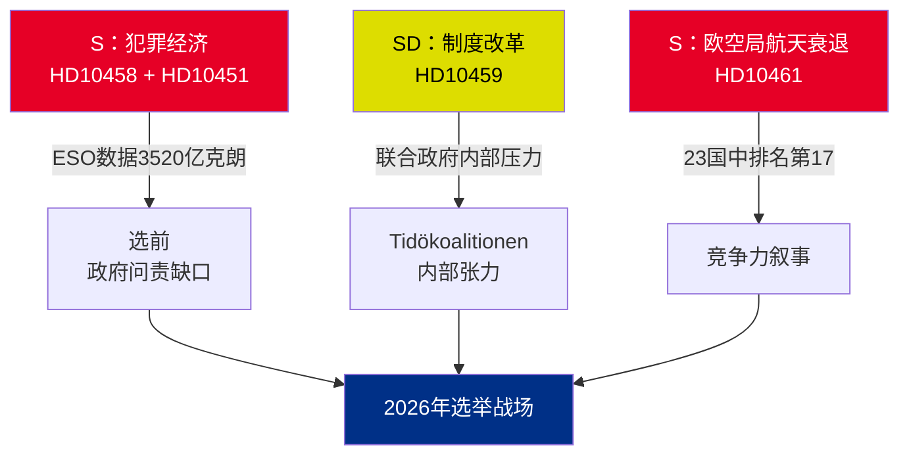

# 执行摘要 — 质询议案 2026-05-01

**BLUF（核心要点）**：2026年4月22日至30日提交的五份质询议案揭示了三个相互交织的危机——瑞典犯罪经济（3520亿克朗/占GDP的5.5%）、黑帮暴力以及航天领域竞争力下降——均在选前政治日程中同步到来。反对党S和执政党SD借助质询议案塑造2026年夏季选举叙事。

## 即刻所需决策

1. **司法部长斯特罗默（M）**：须在HD10458回复截止日期2026-05-19前将"4年内根除黑帮犯罪"付诸实施——否则在选举活动前将面临公信力损伤
2. **部长埃德霍尔姆（L）**：须在HD10461回复截止日期2026-05-19前解释瑞典跌至欧空局第17名的问题——Rymdstyrelsen申请的经费远超拨付的1亿克朗
3. **民政部长斯洛特纳（KD）**：须在2026-05-20前回应SD提出的宪法改革诉求（将任命权移交议会）——回应将表明联合政府对SD的让步容忍度

## 重要性汇总

| dok_id | 议题 | DIW得分 | 优先级 |
|--------|------|---------|-------|
| HD10458 | 根除黑帮犯罪承诺 | 8/10 | L2+优先 |
| HD10451 | 犯罪经济3520亿克朗 | 7/10 | L2战略级 |
| HD10461 | 欧空局/航天资金下降 | 7/10 | L2战略级 |
| HD10459 | 要求改革激进主义机构 | 6/10 | L2战略级 |
| HD10460 | SFV bidragsfastigheter（RiR 2025:30） | 5/10 | L3作战级 |

## 核心战略动态

## 时间紧迫指标

- **2026-05-19**：斯特罗默（黑帮）+ 埃德霍尔姆（航天）作答——最具曝光度的日期
- **2026-05-20**：斯洛特纳（机构激进主义）作答——联合政府紧张局势显现
- **2026-05-21**：布兰德贝里（SFV）作答——曝光度最低

**评估**：HD10458与HD10451的汇合为政府制造了最危险的反对派挑战：一个有独立来源佐证（ESO）且可核实的连贯叙事——"3520亿克朗犯罪经济 + 不断升级的暴力 + 束手无策的政府"。

---
*分析师：智能体情报管道 | 日期：2026-05-01 | 密级：非保密*

---

## 第二轮补充：深化战略评估

### 第一轮审查中发现的关键缺口

政府面临一个结构性问责悖论：**证据最充分的三份质询（HD10458、HD10451、HD10461）均引用独立来源数据**（ESO：3520亿克朗；欧空局：17/23名；暴力：2025年历史峰值统计）。这在分析上异乎寻常——反对党的质询通常依赖政治框架。在此批次中，S将竞选活动锚定在政府无法在不质疑独立专家机构（ESO）和Rymdstyrelsen的前提下加以可信否认的数据上。

### 改进版决策树

1. **斯特罗默**（HD10458 + HD10451）：在2026-05-12前（回复截止前7天）宣布立法方案（实施欧盟打击有组织犯罪指令 + 资产没收）——将防御时刻转化为政策宣示
2. **埃德霍尔姆**（HD10461）：VÅP追加拨款是唯一可信的应对路径；须与财政部协调
3. **斯洛特纳**（HD10459）：宣布对公民社会补贴进行定向审查——在不作宪法承诺的前提下对SD作出部分回应

### 经济背景（IMF/SCB）
- 瑞典2025年GDP：约6.4万亿克朗（估算）
- 3520亿克朗犯罪经济 = 约占GDP 5.5%（ESO测算）
- 欧盟对比：联合国毒品和犯罪问题办公室估计欧盟犯罪经济占GDP的2–4%；若ESO方法论具有一致性，瑞典的5.5%表明渗透程度高于平均水平

---
*第二轮补充：2026-05-01*

<!-- source-sha: 2d65e85af6ee6672a9ff7a4fcd257a8ea9b0651f -->
