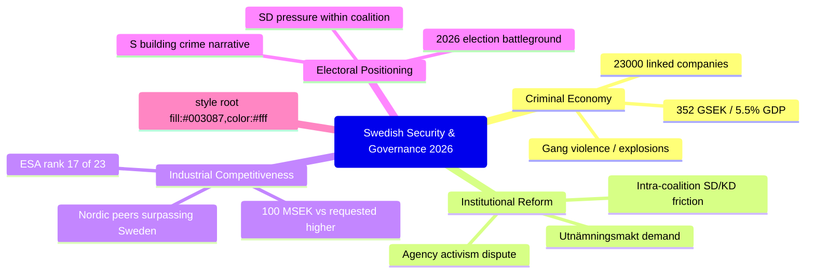

# Synthesis Summary — Interpellations 2026-05-01

## Lead Story

**Sweden's Security Crisis Converges: Gang Violence, Criminal Economy, and Institutional Erosion**

The five interpellations filed on or around 1 May 2026 reveal a Sweden confronting overlapping security and institutional challenges — all becoming political battlegrounds as the 2026 election campaign begins to take shape. Justice Minister Strömmer faces accountability for the most politically explosive pledge in recent Swedish politics ("eradicate gang crime in 4 years"), while economic data from ESO places the criminal economy at 352 billion SEK — 5.5% of GDP, with 23,000 companies linked to criminal networks.

## DIW-Weighted Significance Ranking

1. **HD10458** (DIW 8/10) — Gang crime eradication pledge: Highest-stakes accountability question; "eradicate in 4 years" is a concrete, falsifiable commitment made to national media
2. **HD10451** (DIW 7/10) — Criminal economy 352 GSEK: Structural, ESO-sourced, systemic governance failure claim
3. **HD10461** (DIW 7/10) — ESA/space funding decline: Concrete metric (rank 17/23), national security + industrial competitiveness
4. **HD10459** (DIW 6/10) — Agency activism reform: Constitutional dimension, intra-coalition SD/KD tension
5. **HD10460** (DIW 5/10) — SFV heritage properties (RiR 2025:30): Niche but Riksrevisionen-anchored accountability

## Cross-Cutting Themes

## Opposition Coordination Signal

S has filed two justice-focused interpellations within 7 days (HD10451 filed 22 April, HD10458 filed 29 April), targeting the same minister (Strömmer) with complementary narratives. This is a coordinated parliamentary strategy, not random activity. Expected pattern: S will connect these interpellations in media commentary and election campaign materials.

## Government Risk Assessment

The government (Tidökoalitionen: M+KD+L+SD support) faces maximum exposure on HD10458. Any Strömmer answer that cannot define measurable milestones for "eradication" will be characterised as political posturing. The ESO 352 GSEK figure (endorsed by expert body) is not dismissible — it will anchor the criminal economy narrative through summer 2026.

---
*Date: 2026-05-01 | Source: riksdag-regering MCP + ESO report data*
