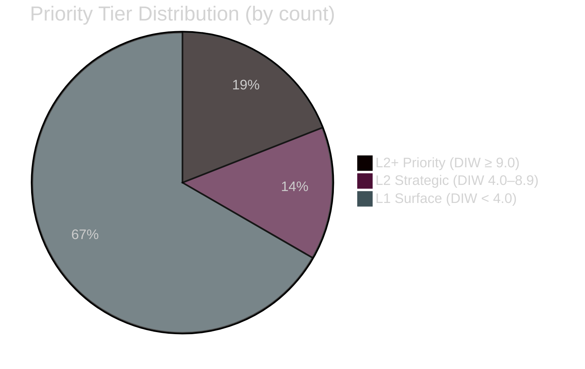

# Classification Results — Month Ahead, May–June 2026

**Author**: James Pether Sörling  
**Date**: 2026-05-01

---

## 7-Dimension Classification

### HD03262 — Utmönstring av permanent uppehållstillstånd

| Dimension | Classification |
|-----------|---------------|
| Policy domain | Migration law, EU alignment |
| Political alignment | Tidöalliansen (M, KD, L, SD coalition) |
| Constitutional salience | HIGH — novel rights architecture |
| Electoral relevance | HIGH — 149 days to election |
| Implementation complexity | HIGH — legal, operational, IT |
| GDPR Art. 9 data | Political opinions — OSINT public sources only |
| Priority tier | L2+ Priority (DIW 10.0) |

### HD03254 — Operativt militärt samarbete

| Dimension | Classification |
|-----------|---------------|
| Policy domain | Defence, NATO integration |
| Political alignment | Cross-party (Tidöalliansen + S support) |
| Constitutional salience | MEDIUM — treaty implementation |
| Electoral relevance | HIGH — national security frame |
| Implementation complexity | MEDIUM — bilateral treaty machinery |
| GDPR Art. 9 data | None — public source |
| Priority tier | L2+ Priority (DIW 9.75) |

### HD03265 — Skärpta regler om uppsikt och förvar

| Dimension | Classification |
|-----------|---------------|
| Policy domain | Migration enforcement, constitutional rights |
| Political alignment | Tidöalliansen |
| Constitutional salience | HIGH — ECHR Art. 5 detention |
| Electoral relevance | HIGH |
| Implementation complexity | HIGH — Lagrådet review required |
| Priority tier | L2+ Priority (DIW 9.6) |

### HD03263 — Stärkt återvändandeverksamhet

| Dimension | Classification |
|-----------|---------------|
| Policy domain | Migration enforcement |
| Political alignment | Tidöalliansen |
| Constitutional salience | MEDIUM |
| Electoral relevance | HIGH |
| Implementation complexity | HIGH — Migrationsverket capacity risk |
| Priority tier | L2+ Priority (DIW 9.3) |

### HD03264 — Vandel och uppehållstillstånd

| Dimension | Classification |
|-----------|---------------|
| Policy domain | Migration law |
| Political alignment | Tidöalliansen |
| Constitutional salience | MEDIUM |
| Electoral relevance | HIGH |
| Implementation complexity | MEDIUM |
| Priority tier | L2 Strategic (DIW 8.85) |

### HD03251 — Sammanhållen vård för beroende/psykiatri

| Dimension | Classification |
|-----------|---------------|
| Policy domain | Healthcare, social policy |
| Political alignment | Government (Socialdepartementet) |
| Constitutional salience | LOW |
| Electoral relevance | MEDIUM |
| Implementation complexity | HIGH — regional fragmentation |
| Priority tier | L2 Strategic (DIW 5.4) |

### HD03258 — Ökad insyn i politiska processer

| Dimension | Classification |
|-----------|---------------|
| Policy domain | Political transparency, democratic governance |
| Political alignment | Tidöalliansen (coalition tension) |
| Constitutional salience | MEDIUM — RF Ch. 2 expression/association |
| Electoral relevance | MEDIUM |
| Implementation complexity | LOW-MEDIUM |
| Priority tier | L2 Strategic (DIW 4.8) |

### Opposition Motions Cluster (S, SD, MP)

| Dimension | Classification |
|-----------|---------------|
| Policy domain | Social policy, environment, culture |
| Political alignment | S (11), SD (2), MP (2) |
| Constitutional salience | LOW |
| Electoral relevance | HIGH — agenda-setting signals |
| Passage probability | LOW (<5%) |
| Priority tier | L1 Surface (DIW 2.0–2.5) |

## Retention and Access

- All documents: PUBLIC, OSINT sources only
- Political opinion data: GDPR Art. 9(2)(e) publicly made / 9(2)(g) public interest applies
- No private personal data processed

