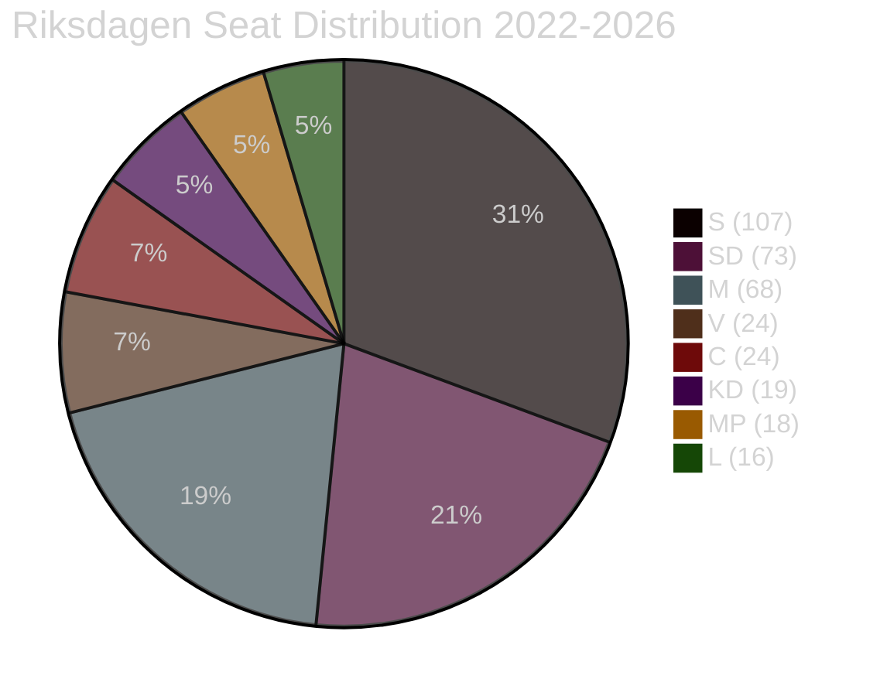

# Coalition Mathematics — Month Ahead, May–June 2026

**Author**: James Pether Sörling  
**Date**: 2026-05-01

---

## Current Riksdagen Composition (2022–2026)

Total seats: 349  
Simple majority: 175

| Party | Seats | Bloc |
|-------|-------|------|
| S (Socialdemokraterna) | 107 | Opposition |
| SD (Sverigedemokraterna) | 73 | Government support |
| M (Moderaterna) | 68 | Government |
| V (Vänsterpartiet) | 24 | Opposition |
| C (Centerpartiet) | 24 | Opposition |
| KD (Kristdemokraterna) | 19 | Government |
| MP (Miljöpartiet) | 18 | Opposition |
| L (Liberalerna) | 16 | Government |
| **Total** | **349** | |

**Government coalition (M+KD+L)**: 103 seats  
**SD external support**: 73 seats  
**Combined government-aligned**: 176 seats (majority = 175 ✅)

**Opposition bloc (S+V+MP+C)**: 173 seats (below majority)

---

## Key Vote Analysis — Migration Package

### HD03262/HD03263/HD03264 — Standard Vote

| Party | Position | Votes | Reasoning |
|-------|---------|-------|-----------|
| M | JA | 68 | Core policy |
| SD | JA | 73 | Core mandate |
| KD | JA | 19 | Coalition discipline |
| L | JA | 16 | Coalition discipline |
| C | JA (conditional) | 24 | Rural carve-out secured |
| S | NEJ | 107 | Opposition principle |
| V | NEJ | 24 | Human rights |
| MP | NEJ | 18 | Human rights |
| **Total JA (base)** | | **200** | Far above 175 threshold |

**Majority calculation**: 200 JA / 149 NEJ — passes with 51-seat margin

### HD03265 — If C demands JA with labour exemption and SD accepts

| Party | Position | Votes |
|-------|---------|-------|
| M | JA | 68 |
| SD | JA | 73 |
| KD | JA | 19 |
| L | JA | 16 |
| C | JA | 24 |
| **Total JA** | | **200** |

**Still passes** — C's 24 votes are additive, not essential (176 without C)

### Scenario: C abstains on HD03262

| Party | Position | Votes |
|-------|---------|-------|
| M | JA | 68 |
| SD | JA | 73 |
| KD | JA | 19 |
| L | JA | 16 |
| C | AVSTÅR | 24 → 0 |
| **Total JA (without C)** | | **176** |

**Still passes** — Government relies solely on M+KD+L+SD = 176 (majority = 175 ✅)

**Key finding**: C cannot block HD03262 by abstaining. Government majority exists without C.

### Scenario: C votes NEJ on HD03262

| Party | Position | Votes |
|-------|---------|-------|
| M | JA | 68 |
| SD | JA | 73 |
| KD | JA | 19 |
| L | JA | 16 |
| C | NEJ | 24 → counted against |
| **Total JA** | | **176** |
| **Total NEJ (S+V+MP+C)** | | **173** |

**Still passes** — M+KD+L+SD = 176 > 175 ✅

**Key finding**: Even if C votes against, HD03262 passes. C's leverage is political/relational, not arithmetic.

---

## Seat Map Visualization

---

## Confidence Vote Risk Assessment

| Trigger | Risk level | Assessment |
|---------|-----------|------------|
| HD03262/3/4 passes | NONE | 176 guaranteed |
| HD03265 Lagrådet delay | NONE | Procedural — no confidence vote |
| C switches bloc before election | LOW (15%) | After 2026 election, not before |
| SD withdraws support | VERY LOW (5%) | Core interest in package passage |
| Government falls before election | VERY LOW (3%) | No mechanism active |

**Bottom line**: Tidöalliansen majority is arithmetically secure through September 2026 election. C defection is politically damaging but not arithmetically decisive.
