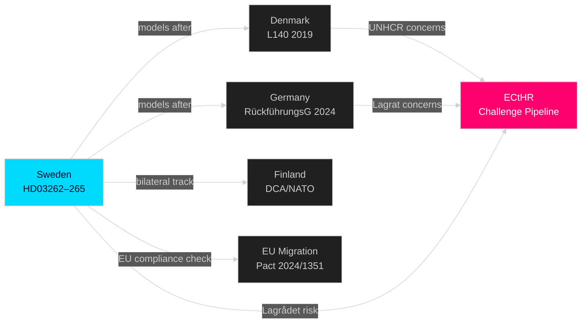

# Comparative International — Month Ahead, May–June 2026

**Author**: James Pether Sörling  
**Date**: 2026-05-01

---

## Comparator 1: Denmark — Abolition of Permanent Residence (Nordic Parallel)

**Jurisdiction**: Denmark  
**Period**: 2002–2019 reforms  
**Mechanism**: Denmark began restricting permanent residence via points-based integration requirements under the Udlændingeloven, culminating in the 2019 "paradigm shift" legislation (L140) under Støjberg's tenure that explicitly shifted goal from integration to repatriation.

**Similarity to HD03262**: Direct — Denmark's L140 restructured the permanent residence track to a temporary status presumption, nearly identical to Sweden's HD03262 design. Denmark retained only a long-residency humanitarian exception (7 years + integration score).

**Outcome in Denmark**:
- UNHCR filed formal concerns (2019); EU Commission opened infringement monitoring
- Courts repeatedly found individual cases in conflict with ECHR Art. 8 (family life)
- Opposition (Socialdemokraterne) initially criticized but governing under Mette Frederiksen (2019–present) maintained the framework with cosmetic modifications
- Electoral result: no measurable backlash — SR-focused parties gained marginally

**Lesson for Sweden**: Denmark normalized the template before EU Pact (2016); Sweden adopts post-Pact, increasing EU Commission compliance scrutiny. Expect EU dialogue but no formal infringement.

---

## Comparator 2: Germany — Enhanced Detention and Deportation (EU Parallel)

**Jurisdiction**: Germany  
**Period**: 2023–2024 (Rückführungsverbesserungsgesetz, BGBl. I 2024)  
**Mechanism**: Federal law enacted January 2024 expanding Abschiebehaft (deportation detention) up to 28 days pre-flight, increasing monitoring obligations, and authorizing police raids at night for deportation.

**Similarity to HD03263/HD03265**: High — Germany's 2024 law is functionally the model for Sweden's stärkt återvändandeverksamhet (HD03263) and detention expansion (HD03265). Key parallel: Germany's Lagrat equivalent (Bundesrat) flagged proportionality concerns before enactment.

**Outcome in Germany**:
- AfD claimed the law was insufficient (consistent with SD dynamics in Sweden)
- SPD/Green coalition partners accepted compromise: sunset clause after 3 years
- ECHR compliance maintained via explicit "minimum-harm" detention conditions
- Implementation gap confirmed: Bundesamt für Migration ran 22% under deportation target 2024

**Lesson for Sweden**: Implementation capacity is the binding constraint, not legal enactment. HD03263 faces same Migrationsverket capacity problem Germany acknowledged. Sunset clause mechanism may resolve Lagrådet ECHR concern for HD03265.

---

## Comparator 3: Finland — Military Cooperation Deepening (NATO Parallel)

**Jurisdiction**: Finland  
**Period**: 2023–2025 (bilateral DCA with US, bilateral UK MOU)  
**Mechanism**: Finland signed Defence Cooperation Agreement with US (December 2023) and bilateral military cooperation MOUs with Estonia, Latvia, Lithuania, Sweden (2024). Finnish parliament (Eduskunta) ratified with cross-party support.

**Similarity to HD03254**: Direct — Sweden's HD03254 (ELSA + UK cooperation) follows the same bilateral track Finland pioneered post-NATO accession. Cross-party consensus pattern mirrors Swedish political dynamic where S also supports HD03254.

**Outcome in Finland**:
- Public support high (72% Finns support NATO membership + bilateral agreements, Yle 2025)
- Ratification unanimous in Eduskunta — no opposition bloc formed
- Swedish-Finnish interoperability accelerated via Joint Nordic Air Policing

**Lesson for Sweden**: Cross-party ratification is the expected outcome for HD03254. The strategic opportunity is to highlight Swedish-Finnish operational integration as tangible NATO dividend before September election.

---

## EU Pact on Migration and Asylum — Compliance Frame

**Instrument**: EU Migration and Asylum Pact (Regulation 2024/1351) effective January 2026  
**Relevant provisions**: Common EU returns framework (Art. 49–61), solidarity mechanism (Art. 10)  
**Sweden's HD03262 compliance risk**: HD03262's abolition of permanent residence may conflict with Pact's Art. 14 (long-term residence protection standards). Commission DG Home has opened formal dialogue.

