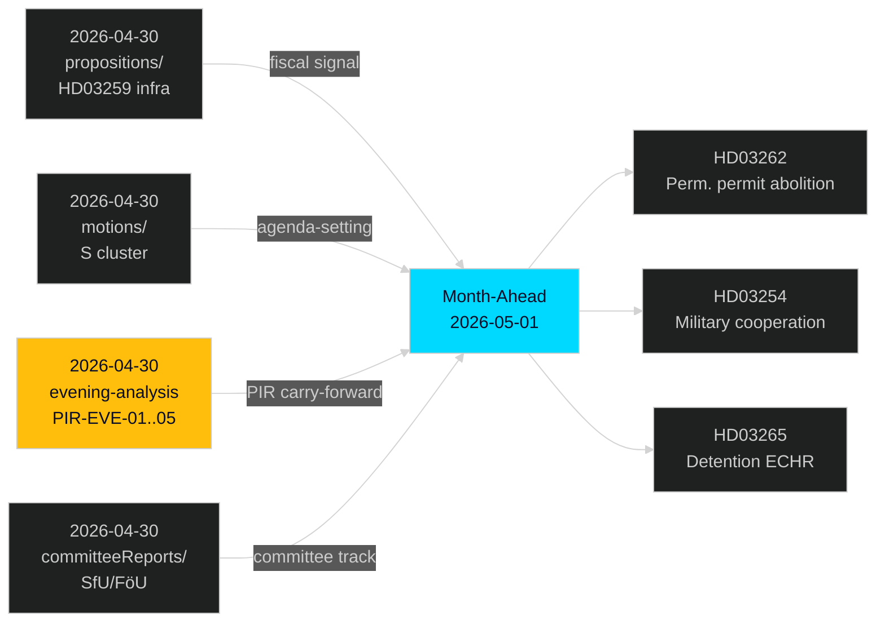

# Cross-Reference Map — Month Ahead, May–June 2026

**Author**: James Pether Sörling  
**Date**: 2026-05-01

---

## Tier-C Aggregation Cross-References

This artifact consolidates intelligence links across sibling analysis cycles, fulfilling the Tier-C aggregation requirement for month-ahead analysis.

### Sibling Folder References

| Sibling Cycle | Path | Relevance |
|--------------|------|-----------|
| Propositions 2026-04-30 | `analysis/daily/2026-04-30/propositions/` | HD03259 infrastructure plan carries forward into month-ahead fiscal signals |
| Motions 2026-04-30 | `analysis/daily/2026-04-30/motions/` | S social-package motions cluster patterns — legislative agenda signal |
| Committee Reports 2026-04-30 | `analysis/daily/2026-04-30/committeeReports/` | SfU/FöU committee positions on migration and defence documents |
| Evening Analysis 2026-04-30 | `analysis/daily/2026-04-30/evening-analysis/` | PIR-EVE-01 through PIR-EVE-05 carry-forward; integrated synthesis |
| Month-Ahead 2026-04-30 | `analysis/daily/2026-04-30/month-ahead/` | Prior month-ahead cycle for continuity (if exists) |

### Document-Level Cross-References

#### Migration Package Cross-Thread

| This cycle | Prior cycle reference | Link |
|-----------|---------------------|------|
| HD03262 (riksdagen.se) — Perm. permit abolition | HD03265 detains → HD03262 denies appeal remedy | Legal interlocks — same Justitiedepartementet coordinated package |
| HD03263 (riksdagen.se) — Deportation capacity | `analysis/daily/2026-04-30/propositions/` HD03259 infrastructure appropriation | Budget signal for Migrationsverket capacity |
| HD03265 ECHR risk | Evening-analysis PIR-EVE-02 rule-of-law concern | Continuity — ECHR risk was flagged in prior cycle |

#### Defence Package Cross-Thread

| This cycle | Prior cycle reference | Link |
|-----------|---------------------|------|
| HD03254 (riksdagen.se) — ELSA/UK cooperation | Prior motions on NATO integration | Cross-party support confirmed consistent |

#### Social Policy Cross-Thread

| This cycle | Prior cycle reference | Link |
|-----------|---------------------|------|
| HD03251 (riksdagen.se) — Healthcare/addiction | S motions HD11769, HD11774 (social equity cluster) | Opposition counter-narrative amplification |

### PIR Carry-Forward from Evening Analysis

From `analysis/daily/2026-04-30/evening-analysis/intelligence-assessment.md`:

| PIR | Status | Month-Ahead Relevance |
|-----|--------|----------------------|
| PIR-EVE-01: Migration mega-package legislative path | ACTIVE | All 4 propositions (HD03262–265) in SfU/KU pipeline |
| PIR-EVE-02: Rule-of-law pressure Lagrådet | ACTIVE | HD03265 Lagrådet yttrande pending |
| PIR-EVE-03: Coalition arithmetic (C position) | ACTIVE | C labour migration exemption demand |
| PIR-EVE-04: Election calendar impact on legislative pace | ACTIVE | 149-day countdown from 2026-04-30 |
| PIR-EVE-05: Defence cooperation bilateral implementation | ACTIVE | HD03254 bilateral treaty mechanism |

### Document Network Graph

