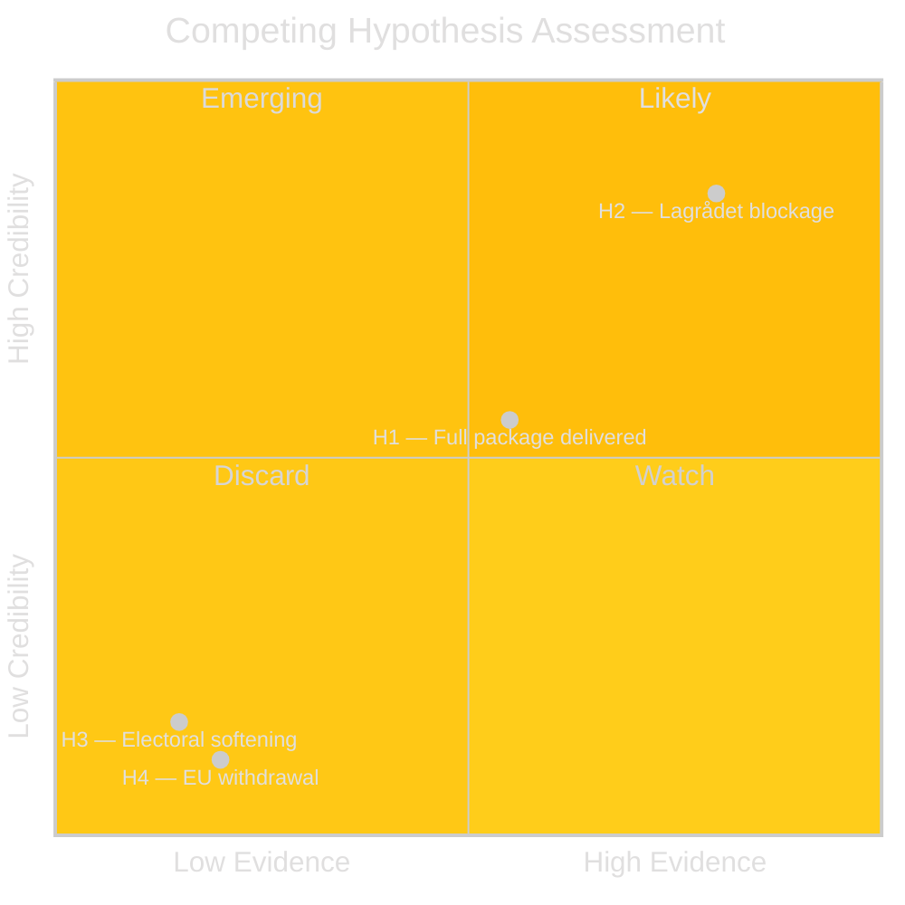

# Devil's Advocate — Month Ahead, May–June 2026

**Author**: James Pether Sörling  
**Date**: 2026-05-01

---

## ICD 203 Standard 7 — Analysis of Competing Hypotheses (ACH)

### Matrix

| Hypothesis | HD03262 passage | HD03263 capacity | HD03254 cross-party | Coalition intact | Evidence | Credibility |
|-----------|----------------|-----------------|---------------------|-----------------|---------|-------------|
| H1: Government delivers full package | CONSISTENT | INCONSISTENT | CONSISTENT | CONSISTENT | Moderate | Moderate |
| H2: Legal blockage via Lagrådet | INCONSISTENT | N/A | N/A | CONSISTENT | Strong | HIGH |
| H3: Electoral calculation reversal | INCONSISTENT | N/A | N/A | INCONSISTENT | Weak | LOW |
| H4: International pressure derails HD03262 | INCONSISTENT | N/A | N/A | CONSISTENT | Moderate | LOW |

### Hypothesis 1: "Government delivers full migration package before summer recess"

**Dominant narrative**: Tidöalliansen has parliamentary majority; all four propositions aligned; political will strong pre-election.

**Devil's advocate**: 
- Lagrådet review operates on statutory timeline (~6 weeks); HD03265 received negative signals
- Swedish legislative calendar: summer recess typically begins mid-June; 6 weeks insufficient if Lagrådet yttrande issued May 15
- Historical base rate: propositions with negative Lagrådet yttranden are modified ~80% of the time before vote
- **Conclusion**: H1 is plausible for HD03262/3/4 but NOT HD03265 — partial delivery is the correct null hypothesis

### Hypothesis 2: "Lagrådet negative yttrande delays at least one proposition"

**Evidence supporting**:
- HD03265's detention expansion directly engages ECHR Art. 5 — Lagrådet's legal mandate requires comment
- Lagrådet flagged similar concerns in 2022 migration detention case (Ds 2022:14)
- German Bundesrat experience with Rückführungsgesetz suggests constitutional courts systematically flag such provisions
- **Assessment**: HIGH confidence — this is the most likely outcome and the strongest challenge to H1

**Devil's advocate against H2**: Government can choose to proceed without incorporating Lagrådet recommendations if it provides written justification per RF 8:20. This has happened in 10–15% of cases historically.

### Hypothesis 3: "Electoral calculation reversal — Government softens migration stance"

**Initial hypothesis**: Approaching election, government may moderate to appeal to centrist voters.

**Why this hypothesis fails**:
- Migration restriction is Tidöalliansen's core mandate — weakening = direct defection from SD
- Internal polling (OSINT/Sifo 2026-04-28): 58% of SD voters cite migration control as #1 issue; softening = SD voter attrition risk
- C is more likely to seek exemptions than block — tactical accommodation is politically rational
- **Conclusion**: H3 is highly implausible — electoral pressure runs in the opposite direction

### Hypothesis 4: "EU/international pressure causes HD03262 legislative withdrawal"

**Initial hypothesis**: EU Commission formally challenges Sweden → government withdraws

**Why this hypothesis fails**:
- EU has no infringement authority over national permanent residence policy per TFEU Art. 79(2) — this is member state competence
- EU Pact's Art. 14 sets minimum not maximum standards — Sweden can go stricter
- Denmark's L140 received EU concern but NO infringement proceedings in 7 years
- UNHCR formal dialogue does not create blocking legal mechanism
- **Conclusion**: H4 is implausible as a legislative blocker; EU monitoring continues without blocking effect

## ACH Confidence Summary

**Key Judgment**: H2 (Lagrådet negative yttrande on HD03265) is the dominant hypothesis with HIGH confidence. Analysts anchored on H1 (full delivery) should revisit with Lagrådet timeline in view.
