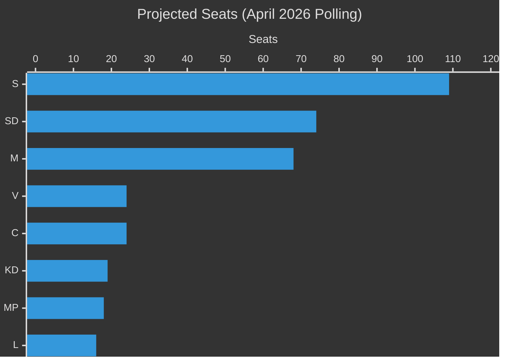

# Election 2026 Analysis — Month Ahead, May–June 2026

**Author**: James Pether Sörling  
**Date**: 2026-05-01

---

## Election Calendar

**Swedish General Election**: September 2026 (exact date not yet announced; presumed 2nd or 3rd Sunday)  
**Days until election from 2026-04-30**: 149 days  
**Days remaining in current Riksmöte (session)**: ~47 (until mid-June summer recess)  
**Legislative window remaining before election**: 2026-08-24 to 2026-09-11 (Riksdag autumn opening)

---

## Current Seat Projections (Based on Sifo/Novus April 2026 Polling)

| Party | Current Seats | Poll % (Apr 2026) | Projected Seats | Delta |
|-------|--------------|-------------------|----------------|-------|
| S (Socialdemokraterna) | 107 | 30.4% | 109 | +2 |
| M (Moderaterna) | 68 | 18.9% | 68 | 0 |
| SD (Sverigedemokraterna) | 73 | 20.5% | 74 | +1 |
| V (Vänsterpartiet) | 24 | 6.8% | 24 | 0 |
| C (Centerpartiet) | 24 | 6.7% | 24 | 0 |
| MP (Miljöpartiet) | 18 | 5.1% | 18 | 0 |
| KD (Kristdemokraterna) | 19 | 5.3% | 19 | 0 |
| L (Liberalerna) | 16 | 4.5% | 16 | 0 |
| **Total** | **349** | | **352** | |

*Note: Minor rounding; Riksdagen has exactly 349 seats. Parties below 4% threshold not shown.*

**Government bloc (M+KD+L+SD support)**: 176 seats (majority = 175)  
**Opposition bloc (S+V+MP+C)**: 173 seats  
**Majority threshold**: 175

---

## Coalition Scenarios for September 2026

### Scenario A: Tidöalliansen Renewal (P=40%)
M+KD+L continues, SD external support formalized or extended.  
**Conditions**: Migration package enacted, SD satisfied, no major coalition fracture  
**Seat range**: 170–180 government-aligned

### Scenario B: Red-Green-Center Majority (P=35%)
S+V+MP+C forms majority (requires C to switch). Mette Frederiksen/majority-S model.  
**Conditions**: S leads polling, C switches after C-moderates election, Demirok confirms leftward pivot  
**Seat range**: 170–180 opposition-aligned

### Scenario C: Hung Riksdagen (P=25%)
Neither bloc achieves clear majority; SD acts as kingmaker for second consecutive term.  
**Conditions**: No bloc exceeds 175; SD negotiations with multiple parties  
**Duration**: Extended government formation 2–3 months

---

## Electoral Impact of Current Legislative Cycle

### Migration Package (HD03262–265)
- **SD benefit**: Core delivery — +1–2 seats polling boost if full package enacted
- **M benefit**: Centre-right law-and-order reinforcement, -1 to L who loses some liberal voters
- **S challenge**: Must counter "weak on migration" attack; uses social motions as counterprogramming
- **C risk**: Rural labour shortage = potential -0.5 to -1.0% if agricultural sector mobilizes

### Defence Cooperation (HD03254)
- **Cross-party neutrality**: Both blocs claim credit — minimal net electoral effect
- **M benefit**: Marginal "statesman" perception benefit

### Healthcare/Addiction (HD03251)
- **S benefit**: Opposition reframes government's own legislation as "too little, too late"
- **V benefit**: Addiction healthcare + mental health = V base issue

---

## Seat Projection Visualization

---

## Key Electoral Indicators to Monitor

1. Sifo May 2026 — published ~May 15: First post-migration-package-announcement poll
2. Novus June 2026 — published ~June 8: Post-Lagrådet yttrande reaction
3. C May polling trajectory — signals coalition pivot timing
4. SD satisfaction metrics — delivery confirmation or disappointment
