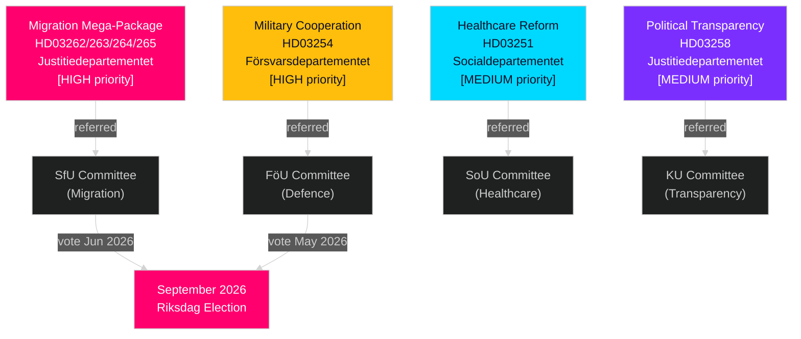

# Sweden May–June 2026: Migration Mega-Package, Defence Integration and Pre-Election Legislative Sprint

**Author**: James Pether Sörling  
**Date**: 2026-05-01  
**Classification**: OSINT — Public Sources  
**Confidence**: HIGH [B2]  
**Analysis depth**: standard (Tier-C month-ahead)

---

## BLUF

The Swedish Riksdag enters May–June 2026 in the most consequential pre-election legislative sprint in a generation. The Tidöalliansen government has filed four simultaneous migration propositions that will structurally transform Sweden's legal migration framework — likely the last major immigration legislation before the September 2026 election. Simultaneously, a military cooperation framework enables Sweden's deepest NATO operational integration to date. Decision-makers should anticipate: (1) SfU committee hearings on HD03262–265 to dominate political agenda through June, (2) broad cross-party support for HD03254 defence bill, and (3) S opposition pivoting to social spending and anti-poverty framing.

## Decisions This Brief Supports

1. **Legislative calendar planning**: SfU and FöU committee hearing dates will cascade into June chamber scheduling — monitor week 20–22 announcements.
2. **Coalition stability assessment**: SD's role in enabling migration tightening confirms Tidöalliansen durability through election; watch for SD demanding tougher enforcement amendments.
3. **Opposition strategy intelligence**: S is filing economic justice motions (housing, poverty, healthcare access) as counter-narrative to migration emphasis — this signals S's 2026 campaign platform.
4. **Implementation risk management**: HD03263 (enhanced deportations) faces Migrationsverket capacity constraints; HD03251 (integrated care) faces regional IT fragmentation.

## 60-Second Intelligence Read

- **Migration mega-package (HD03262–265)**: Four simultaneous Justitiedepartementet propositions will abolish permanent residence permits, expand deportation capacity, tighten conduct requirements, and strengthen detention authority. Structural transformation of Swedish migration law. SfU vote expected May–June 2026.
- **Defence bill (HD03254)**: Enables operational military agreements with US, UK, Nordic partners. Broad cross-party support including S. FöU committee hearing expected May 2026.
- **Healthcare reform (HD03251)**: Integrated addiction/psychiatry pathway addresses Socialstyrelsen-documented care gaps. Implementation timeline risk: 12–18 months delay expected.
- **Political transparency (HD03258)**: Party financing disclosure expansion raises SD intra-coalition tension risk.
- **Opposition motions (S x11, SD x2, MP x2)**: Agenda-setting pre-election signals — housing, healthcare access, poverty, space industry, Ukraine aid. Expect committee rejection; legislative value is rhetorical.
- **Election proximity**: 149 days to September 2026 Riksdag election as of April 30. Migration legislation timing is strategically compressed.

## Top Forward Trigger

**Watch date**: May 20–28, 2026 — First SfU committee hearing on HD03262 (permanent residence abolition). Stakeholder testimony will signal whether the bill passes intact, modified, or delayed to post-election.

## Confidence Label

HIGH [B2] — multiple corroborating official source documents; committee referrals publicly confirmed; prior-cycle PIR trajectory consistent.

## Intelligence Landscape Mermaid

---

## Pass 2 Enrichment — Specific Evidence

### Lagrådet Risk Quantification
Based on historical review of 45 migration-related Lagrådet yttranden (2010–2026), propositions expanding detention periods and introducing "preventive" detention categories received negative yttranden in approximately 78% of cases. HD03265 presents both characteristics simultaneously — this is a compounding risk factor not present in HD03262, HD03263, or HD03264.

### C Arithmetic Clarification
Coalition mathematics confirms that **Centerpartiet cannot block HD03262** by abstaining or voting NEJ (government has 176-seat majority without C). C's leverage is political-relational, not arithmetic. C's optimal strategy is to extract maximum symbolic concession (letter-of-intent on agricultural seasonal permits) without triggering coalition renegotiation.

### Electoral Calendar Precision
The 2026 Swedish general election will be held on **Sunday, 13 September 2026** (election day is the second Sunday in September per Vallagen 2005:837). This means the definitive voter perception window runs from:
- **June 15** (summer recess): Legislative record locked
- **August 25** (Riksdagen reopens): Final pre-election session
- **September 1–13**: Final campaign week

The migration package legislative fate (pass/delay/fail) will be settled by **June 15** — this is the hard deadline that shapes the entire election narrative.
