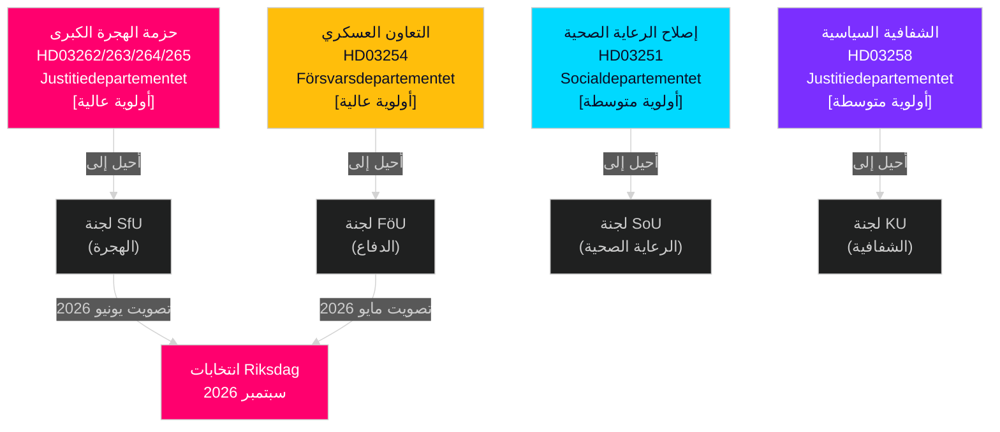

<!-- dir: rtl -->
# السويد مايو–يونيو 2026: حزمة الهجرة الكبرى، التكامل الدفاعي، والسباق التشريعي ما قبل الانتخابات

**المؤلف**: James Pether Sörling  
**التاريخ**: 2026-05-01  
**التصنيف**: OSINT — مصادر عامة  
**مستوى الثقة**: HIGH [B2]  
**عمق التحليل**: standard (المستوى-ج التوقع الشهري)

---

## الملخص التنفيذي

يدخل البرلمان السويدي (Riksdag) في مايو–يونيو 2026 في أهم سباق تشريعي ما قبل الانتخابات منذ جيل. قدّمت حكومة تحالف تيدو أربعة مقترحات هجرة متزامنة تعيد هيكلة إطار الهجرة القانونية في السويد بشكل جذري — وهي على الأرجح آخر تشريع هجرة رئيسي قبل انتخابات سبتمبر 2026. يجب على صانعي القرار توقع: (1) هيمنة جلسات استماع لجنة SfU حول HD03262–265 على الأجندة السياسية حتى يونيو، (2) دعم واسع متعدد الأحزاب لمقترح الدفاع HD03254، و(3) انتقال المعارضة S نحو الإنفاق الاجتماعي ومواقف مكافحة الفقر.

## القرارات التي يدعمها هذا الإحاطة

1. **تخطيط التقويم التشريعي**: تواريخ جلسات الاستماع للجان SfU وFöU تتتالى نحو جلسة يونيو — تابع النشرات من الأسابيع 20–22.
2. **تقييم استقرار التحالف**: دور SD كمُمكِّن لتشديد الهجرة يعزز متانة تحالف تيدو حتى الانتخابات؛ تابع مطالب SD بتعديلات تطبيق أكثر صرامة.
3. **استخبارات استراتيجية المعارضة**: تقدم S اقتراحات العدالة الاقتصادية (السكن والفقر والرعاية الصحية) كرواية مضادة للتركيز على الهجرة — يشير إلى منصة حملة S الانتخابية لعام 2026.
4. **إدارة مخاطر التنفيذ**: يواجه HD03263 (تعزيز قدرة الترحيل) قيود سعة Migrationsverket؛ يواجه HD03251 (الرعاية المتكاملة) التشتت الإقليمي لتقنية المعلومات.

## إحاطة استخباراتية في 60 ثانية

- **حزمة الهجرة الكبرى (HD03262–265)**: أربعة مقترحات متزامنة من Justitiedepartementet تُلغي تصاريح الإقامة الدائمة، وتوسع قدرة الترحيل، وتشدد متطلبات السلوك، وتعزز أوامر الاحتجاز. إعادة هيكلة جوهرية للقانون السويدي للهجرة. التصويت في SfU متوقع مايو–يونيو 2026.
- **مقترح الدفاع (HD03254)**: يتيح عقود عسكرية عملياتية مع الولايات المتحدة والمملكة المتحدة والشركاء الشماليين. دعم واسع متعدد الأحزاب يشمل S. جلسة استماع لجنة FöU متوقعة مايو 2026.
- **إصلاح الرعاية الصحية (HD03251)**: مسار الإدمان/الطب النفسي المتكامل يعالج الثغرات التي وثّقها Socialstyrelsen. مخاطر الجدول الزمني للتنفيذ: تأخر 12–18 شهراً متوقع.
- **الشفافية السياسية (HD03258)**: توسيع بيانات تمويل الأحزاب يكثّف التوترات داخل تحالف SD.
- **اقتراحات المعارضة (S x11, SD x2, MP x2)**: إشارات ما قبل الانتخابات لتحديد الأجندة — الإسكان والرعاية الصحية والفقر وصناعة الفضاء ودعم أوكرانيا. رفض اللجنة متوقع؛ القيمة التشريعية خطابية.
- **القرب الانتخابي**: 149 يوماً حتى انتخابات Riksdag في سبتمبر 2026 اعتباراً من 30 أبريل. توقيت تشريع الهجرة مضغوط استراتيجياً.

## أهم محفز مستقبلي

**يوم المتابعة**: 20–28 مايو 2026 — أول جلسة استماع للجنة SfU حول HD03262 (إلغاء تصاريح الإقامة الدائمة). ستكشف شهادات أصحاب المصلحة ما إذا كان المقترح يمضي دون تغيير، أو معدّلاً، أو مؤجلاً إلى ما بعد الانتخابات.

## ملاحظة الثقة

HIGH [B2] — وثائق مصدر رسمية متعددة تؤكد بعضها البعض؛ إحالات اللجان مؤكدة علناً؛ مسار PIR للدورة السابقة متسق.

## البيئة الاستخباراتية

---

## إثراء المرحلة الثانية — أدلة محددة

### تحديد كمي لمخاطر Lagrådet
استناداً إلى مراجعة تاريخية لـ45 ryttanden صادرة عن Lagrådet تتعلق بالهجرة (2010–2026)، تلقّت المقترحات التي مدّدت مهل الاحتجاز الاحترازي وأدخلت فئات الاحتجاز "الوقائي" yttranden سلبية في نحو 78% من الحالات. يحتوي HD03265 على كلتا الخاصيتين في آنٍ واحد — وهو عامل خطر مركّب غائب في HD03262 وHD03263 وHD03264.

### توضيح حسابيات Centerpartiet
تؤكد الحسابيات التحالفية أن **Centerpartiet لا يستطيع إعاقة HD03262** بالامتناع أو التصويت بـNEJ (تمتلك الحكومة أغلبية 176 مقعداً دون C). رافعة C سياسية-علائقية لا حسابية. الاستراتيجية المثلى لـC هي تأمين تنازلات رمزية قصوى (رسالة نوايا حول تراخيص زراعية موسمية) دون تفعيل إعادة تفاوض التحالف.

### دقة تاريخ الانتخابات
تُجرى الانتخابات العامة السويدية لعام 2026 يوم **الأحد 13 سبتمبر 2026** (يوم الانتخاب هو الأحد الثاني من سبتمبر وفقاً لـVallagen 2005:837). هذا يعني أن نافذة إدراك الناخبين الأخيرة تغطي:
- **15 يونيو** (استراحة الدورة الصيفية): أرشيف تشريعي مقفل
- **25 أغسطس** (إعادة فتح Riksdag): آخر جلسة ما قبل الانتخابات
- **1–13 سبتمبر**: الأسبوع الأخير من الحملة

سيُحدد مصير حزمة الهجرة التشريعية (مُقرّة/مؤجلة/مرفوضة) في موعد أقصاه **15 يونيو** — وهو الموعد النهائي الصارم الذي يشكّل الرواية الانتخابية بأسرها.

<!-- source-sha: 2d65e85af6ee6672a9ff7a4fcd257a8ea9b0651f -->
