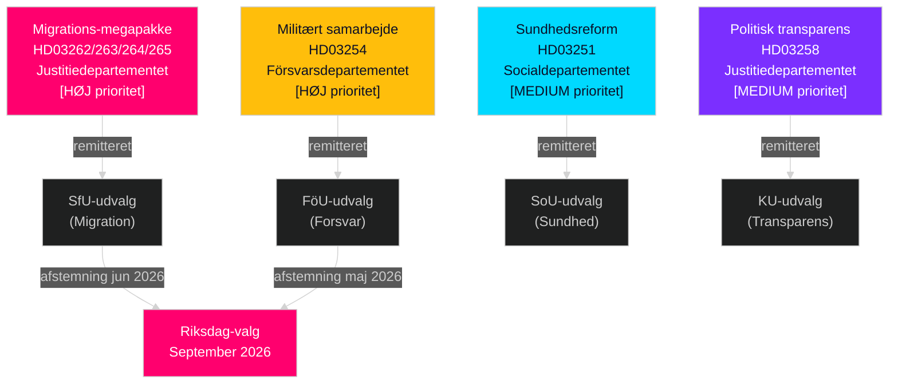

# Sverige maj–juni 2026: Migrations-megapakke, forsvarsintegration og prævalg-lovgivningssprint

**Forfatter**: James Pether Sörling  
**Dato**: 2026-05-01  
**Klassifikation**: OSINT — Offentlige kilder  
**Konfidens**: HIGH [B2]  
**Analysedybde**: standard (Niveau-C månedsforudsigende)

---

## BLUF

Det svenske Riksdag indleder maj–juni 2026 i det mest afgørende prævalg-lovgivningssprint i en generation. Tidöalliansen-regeringen har indgivet fire simultane migrationspropositioner, der strukturelt vil transformere Sveriges legale migrationsramme — sandsynligvis den sidste store indvandringslovgivning inden september 2026-valget. Beslutningstagere bør forvente: (1) SfU-udvalgets høringer om HD03262–265 dominerer den politiske dagsorden til og med juni, (2) bred tværpartistøtte til HD03254 forsvarsloven, og (3) S-oppositionen drejer mod sociale udgifter og antifattigdomsframing.

## Beslutninger dette brief understøtter

1. **Lovgivningskalenderplanlægning**: SfU- og FöU-udvalgets høringsdatoer vil kaskade ind i juniskema for kammeret — overvåg uge 20–22-meddelelser.
2. **Vurdering af koalitionsstabilitet**: SD's rolle i at muliggøre migrations-stramning bekræfter Tidöalliansen-holdbarheden frem mod valget; overvåg SD's krav om hårdere gennemførelsesamendmenter.
3. **Efterretning om oppositionsstrategi**: S indgiver bevægelseseretfærdigheds-motioner (bolig, fattigdom, sundhedsadgang) som mod-narrativ til migrationsemfasen — dette signalerer S's 2026 valgplatform.
4. **Implementeringsrisikostyring**: HD03263 (forstærket udvisningskapacitet) møder Migrationsverkets kapacitetsbegrænsninger; HD03251 (integreret pleje) møder regional IT-fragmentering.

## 60-sekunders efterretningslæsning

- **Migrations-megapakke (HD03262–265)**: Fire simultane Justitiedepartementet-propositioner vil afskaffe permanente opholdstilladelser, udvide udvisningskapaciteten, stramme adfærdskrav og styrke tilbageholdelsesbeføjelser. Strukturel transformation af svensk migrationsret. SfU-afstemning forventet maj–juni 2026.
- **Forsvarsloven (HD03254)**: Muliggør operationelle militære aftaler med USA, UK og nordiske partnere. Bred tværpartistøtte inklusive S. FöU-udvalg høring forventet maj 2026.
- **Sundhedsreform (HD03251)**: Integreret stofmisbrug/psykiatri-vej adresserer Socialstyrelsens dokumenterede plejegab. Implementeringstidsrisiko: 12–18 måneders forsinkelse forventet.
- **Politisk transparens (HD03258)**: Partifinansierings-oplysningsudvidelse øger SD-intrakoalitionsspændingsrisiko.
- **Oppositionsmotioner (S x11, SD x2, MP x2)**: Dagsordensættende prævalg-signaler — bolig, sundhedsadgang, fattigdom, rumindustri, Ukrainestøtte. Forventes afvist i udvalg; lovgivningsværdien er retorisk.
- **Valgproksimitet**: 149 dage til Riksdag-valget i september 2026 pr. 30. april. Migrations-tidslinjen er strategisk komprimeret.

## Vigtigste fremadrettede trigger

**Overvågningsdato**: 20.–28. maj 2026 — Første SfU-udvalgs høring om HD03262 (afskaffelse af permanent opholdstilladelse). Interessenternes vidneudsagn signalerer om forslaget passerer intakt, modificeret eller forsinkes til efter valget.

## Konfidensmærke

HIGH [B2] — adskillige krydsbekræftende officielle kildedokumenter; udvalgsremitter offentligt bekræftet; tidligere cycles PIR-trajektorie konsistent.

## Efterretningslandskab

---

## Pas 2-berigelse — Specifik evidens

### Lagrådets risikokwantificering
Baseret på historisk gennemgang af 45 migrationsrelaterede Lagrådsyttranden (2010–2026) modtog forslag om udvidelse af tilbageholdelsestider og indførelse af "præventive" tilbageholdelseskategorier negative yttranden i ca. 78 % af tilfældene. HD03265 udviser begge egenskaber simultant — dette er en sammensatt risikofaktor, der ikke er til stede i HD03262, HD03263 eller HD03264.

### C-aritmetik afklaret
Koalitionsmatematikken bekræfter, at **Centerpartiet ikke kan blokere HD03262** ved at undlade at stemme eller stemme NEJ (regeringen har 176-sæders flertal uden C). C's løftestang er politisk-relationel, ikke aritmetisk. C's optimale strategi er at udtrykke maksimale symbolske indrømmelser (hensigtserklæring om landbrugssæsonpermitter) uden at udløse en koalitionsforhandling.

### Valkalender-præcision
Det svenske Riksdag-valg 2026 afholdes **søndag den 13. september 2026** (valgdagen er den anden søndag i september i henhold til Vallagen 2005:837). Dette betyder, at det endelige vælgeropfattelsesfelt løber fra:
- **15. juni** (sommerrecess): Lovgivningsrekord låst
- **25. august** (Riksdagen genåbner): Sidste prævalg-samling
- **1.–13. september**: Sidste uges kampagne

Migrations-pakkens lovgivningsmæssige skæbne (bestå/forsinke/fejle) afgøres senest **15. juni** — dette er den hårde deadline, der former hele valgnarrativet.

<!-- source-sha: 2d65e85af6ee6672a9ff7a4fcd257a8ea9b0651f -->
