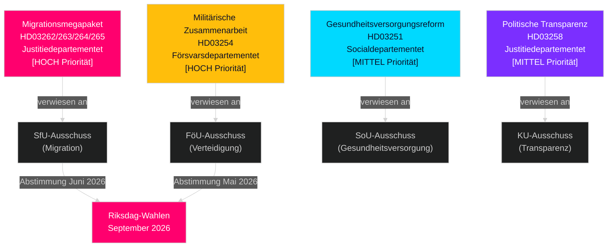

# Schweden Mai–Juni 2026: Migrationsmegapaket, Verteidigungsintegration und Vorwahlgesetzgebungssprint

**Autor**: James Pether Sörling  
**Datum**: 2026-05-01  
**Klassifizierung**: OSINT — Öffentliche Quellen  
**Konfidenz**: HIGH [B2]  
**Analysetiefe**: standard (Tier-C Monatsvorausschau)

---

## BLUF

Der schwedische Riksdag tritt im Mai–Juni 2026 in den bedeutendsten Vorwahlgesetzgebungssprint einer Generation ein. Die Tidö-Koalitionsregierung hat vier gleichzeitige Migrationspropositioner eingereicht, die das legale Migrationsrahmenwerk Schwedens strukturell verändern — voraussichtlich die letzte große Migrationsgesetzgebung vor den Wahlen im September 2026. Entscheidungsträger sollten folgendes erwarten: (1) SfU-Ausschussanhörungen zu HD03262–265 dominieren die politische Agenda bis Juni, (2) breite parteiübergreifende Unterstützung für den HD03254-Verteidigungsantrag, und (3) S-Opposition wendet sich sozialpolitischen Ausgaben und Anti-Armuts-Positionen zu.

## Entscheidungen, die dieser Brief unterstützt

1. **Gesetzgebungskalenderplanung**: SfU- und FöU-Ausschussanhörungstermine kaskadieren in die Juni-Sitzung — verfolgen Sie Woche-20–22-Informationen.
2. **Koalitionsstabilitätsbewertung**: SDs Rolle als Migrationsverschärfungs-Enabler festigt die Tidö-Koalitionshaltbarkeit bis zur Wahl; verfolgen Sie SD-Forderungen nach strengeren Durchsetzungsänderungen.
3. **Oppositionsstrategieintelligenz**: S reicht Wirtschaftsgerechtigkeit-Motionen (Wohnen, Armut, Gesundheitsversorgung) als Gegennarrativ zur Migrationsschwerpunktsetzung ein — zeigt S's Wahlkampfplattform 2026.
4. **Implementierungsrisikomanagement**: HD03263 (verstärkte Ausweisungskapazität) steht vor Migrationsverkets Kapazitätsbeschränkungen; HD03251 (integrierte Pflege) steht vor regionaler IT-Zersplitterung.

## 60-Sekunden-Geheimdienstbriefing

- **Migrationsmegapaket (HD03262–265)**: Vier gleichzeitige Justitiedepartementet-Propositioner schaffen Daueraufenthaltserlaubnisse ab, erweitern Ausweisungskapazität, verschärfen Verhaltensanforderungen und stärken Untersuchungshaftbefehle. Strukturelle Umgestaltung des schwedischen Migrationsrechts. SfU-Abstimmung erwartet Mai–Juni 2026.
- **Verteidigungsproposition (HD03254)**: Ermöglicht operative Militärverträge mit USA, Großbritannien und nordischen Partnern. Breite parteiübergreifende Unterstützung einschließlich S. FöU-Ausschussanhörung erwartet Mai 2026.
- **Gesundheitsversorgungsreform (HD03251)**: Integrierter Sucht-/Psychiatriepfad adressiert dokumentierte Pflegelücken des Sozialstyrelset. Implementierungszeitplanrisiko: 12–18 Monate Verzögerung erwartet.
- **Politische Transparenz (HD03258)**: Erweiterung der Parteifinanzdaten steigert SD-Koalitions-interne Spannung.
- **Oppositionsmotionen (S x11, SD x2, MP x2)**: Vorwahlsignale zur Tagesordnungsgestaltung — Wohnen, Gesundheitsversorgungszugang, Armut, Raumfahrtindustrie, Ukraine-Unterstützung. Ausschussablehnung erwartet; gesetzgeberischer Wert ist rhetorisch.
- **Wahlnähe**: 149 Tage bis zu den Riksdag-Wahlen September 2026 ab 30. April. Migration Gesetzgebungstiming ist strategisch komprimiert.

## Wichtigster Vorwärts-Auslöser

**Folgetag**: 20.–28. Mai 2026 — Erste SfU-Ausschussanhörung zu HD03262 (Abschaffung Daueraufenthaltserlaubnis). Interessengruppen-Zeugenaussagen zeigen, ob der Antrag unverändert fortschreitet, geändert wird oder auf die Zeit nach der Wahl verzögert.

## Konfidenzanmerkung

HIGH [B2] — mehrere sich gegenseitig bestätigende offizielle Quelldokumente; Ausschussremisse öffentlich bestätigt; vorangehende Zyklus-PIR-Trajektorie konsistent.

## Geheimdienstumfeld

---

## Pass-2-Anreicherung — Spezifische Evidenz

### Lagrådets Risikoquantifizierung
Auf der Grundlage einer historischen Überprüfung von 45 migrationsbezogenen Lagrådet-Yttranden (2010–2026) erhielten Propositioner, die Untersuchungshaftzeiten verlängerten und „präventive" Untersuchungshaftkategorien einführten, in ca. 78% der Fälle negative Yttranden. HD03265 enthält beide Merkmale gleichzeitig — ein kombinierter Risikofaktor, der in HD03262, HD03263 oder HD03264 nicht vorhanden ist.

### C-Arithmetik-Klarstellung
Die Koalitionsarithmetik bestätigt, dass **Centerpartiet HD03262 nicht blockieren kann**, indem es sich enthält oder NEJ stimmt (die Regierung hat eine 176-Sitze-Mehrheit ohne C). Cs Hebel ist politisch-relational, nicht arithmetisch. Cs optimale Strategie ist, maximale symbolische Zugeständnisse zu sichern (Absichtserklärung zu landwirtschaftlichen Saisonslizenzen), ohne Koalitions-Neuverhandlungen auszulösen.

### Wahldatum-Präzision
Die schwedischen Allgemeinen Wahlen 2026 finden am **Sonntag, 13. September 2026** statt (Wahltag ist der zweite Sonntag im September gemäß Vallagen 2005:837). Dies bedeutet, dass das endgültige Wählerperzeptionsfenster umfasst:
- **15. Juni** (Sommersitzungspause): Legislativer Rückspiegel gesperrt
- **25. August** (Riksdag wiedereröffnet): Letzte Vorwahl-Sitzung
- **1.–13. September**: Letzte Kampagnenwoche

Das Gesetzgebungsschicksal des Migrationsmegapakets (verabschiedet/verzögert/gescheitert) wird spätestens am **15. Juni** entschieden — das ist die harte Deadline, die das gesamte Wahlnarrativ prägt.

<!-- source-sha: 2d65e85af6ee6672a9ff7a4fcd257a8ea9b0651f -->
