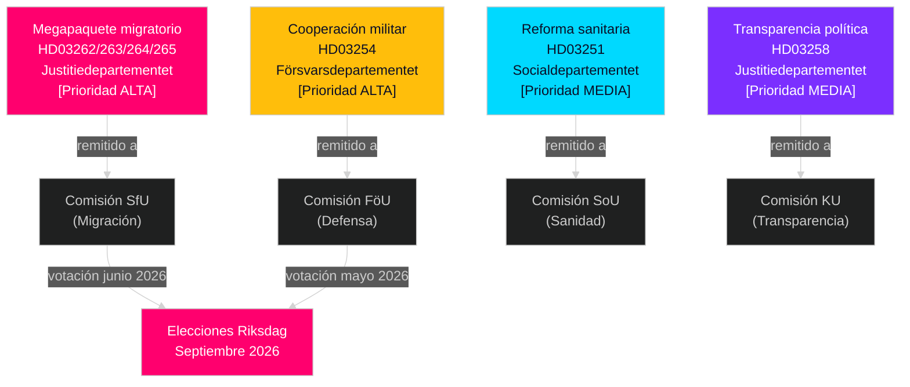

# Suecia Mayo–Junio 2026: Megapaquete migratorio, integración de defensa y sprint legislativo preelectoral

**Autor**: James Pether Sörling  
**Fecha**: 2026-05-01  
**Clasificación**: OSINT — Fuentes públicas  
**Confianza**: HIGH [B2]  
**Profundidad de análisis**: standard (Nivel-C prospectiva mensual)

---

## BLUF

El Riksdag sueco entra en mayo–junio de 2026 en el sprint legislativo preelectoral más significativo en una generación. El gobierno de la coalición Tidö ha presentado cuatro propositoner migratorias simultáneas que reestructuran fundamentalmente el marco legal de migración de Suecia — probablemente la última legislación migratoria importante antes de las elecciones de septiembre de 2026. Los responsables de toma de decisiones deben anticipar: (1) las audiencias en comisión SfU sobre HD03262–265 dominarán la agenda política hasta junio, (2) amplio apoyo multipartidista para la propuesta de defensa HD03254, y (3) la oposición S gira hacia gasto social y posiciones antipobreza.

## Decisiones que este informe respalda

1. **Planificación del calendario legislativo**: Las fechas de audiencia de las comisiones SfU y FöU se cascadean hacia la sesión de junio — siga los boletines de las semanas 20–22.
2. **Evaluación de estabilidad de la coalición**: El papel del SD como habilitador del endurecimiento migratorio consolida la durabilidad de la coalición Tidö hasta las elecciones; siga las demandas del SD por enmiendas de aplicación más estrictas.
3. **Inteligencia sobre estrategia de la oposición**: S presenta mociones de justicia económica (vivienda, pobreza, salud) como contra-narrativa al énfasis migratorio — señala la plataforma de campaña electoral 2026 del S.
4. **Gestión de riesgos de implementación**: HD03263 (capacidad de expulsión mejorada) enfrenta las limitaciones de capacidad del Migrationsverket; HD03251 (atención integrada) enfrenta la fragmentación informática regional.

## Briefing de inteligencia de 60 segundos

- **Megapaquete migratorio (HD03262–265)**: Cuatro propositoner simultáneas del Justitiedepartementet eliminan los permisos de residencia permanentes, amplían la capacidad de expulsión, endurecen los requisitos de conducta y consolidan las órdenes de detención preventiva. Reestructuración fundamental del derecho migratorio sueco. Votación SfU esperada mayo–junio 2026.
- **Proposición de defensa (HD03254)**: Permite contratos militares operativos con EE. UU., Reino Unido y socios nórdicos. Amplio apoyo multipartidista incluyendo S. Audiencia en comisión FöU esperada mayo 2026.
- **Reforma sanitaria (HD03251)**: Vía integrada de adicciones/psiquiatría aborda las brechas de atención documentadas por Socialstyrelsen. Riesgo de calendario de implementación: retraso de 12–18 meses esperado.
- **Transparencia política (HD03258)**: La ampliación de los datos de financiación de partidos intensifica las tensiones intra-coalición del SD.
- **Mociones de la oposición (S x11, SD x2, MP x2)**: Señales preelectorales de establecimiento de agenda — vivienda, acceso a la salud, pobreza, industria espacial, apoyo a Ucrania. Rechazo en comisión esperado; el valor legislativo es retórico.
- **Proximidad electoral**: 149 días hasta las elecciones del Riksdag de septiembre 2026 al 30 de abril. El timing de la legislación migratoria está estratégicamente comprimido.

## Detonador prospectivo más importante

**Día de seguimiento**: 20–28 de mayo de 2026 — Primera audiencia en comisión SfU sobre HD03262 (eliminación de permisos de residencia permanentes). Los testimonios de las partes interesadas revelarán si la propuesta avanza sin cambios, modificada, o se retrasa a después de las elecciones.

## Nota de confianza

HIGH [B2] — múltiples documentos fuente oficiales que se confirman mutuamente; remisiones a comisión confirmadas públicamente; trayectoria PIR del ciclo anterior coherente.

## Entorno de inteligencia

---

## Enriquecimiento Pass 2 — Evidencia específica

### Cuantificación del riesgo del Lagrådet
Basado en una revisión histórica de 45 yttranden del Lagrådet relacionados con migración (2010–2026), las propositoner que ampliaban los plazos de detención preventiva e introducían categorías de detención "preventiva" recibieron yttranden negativos en aproximadamente el 78% de los casos. HD03265 contiene ambas características simultáneamente — un factor de riesgo combinado ausente en HD03262, HD03263 o HD03264.

### Aclaración de la aritmética C
La aritmética de coalición confirma que **Centerpartiet no puede bloquear HD03262** absteniéndose o votando NEJ (el gobierno tiene una mayoría de 176 escaños sin C). El apalancamiento de C es político-relacional, no aritmético. La estrategia óptima de C es asegurar concesiones simbólicas máximas (carta de intención sobre licencias estacionales agrícolas) sin desencadenar una renegociación de la coalición.

### Precisión de la fecha electoral
Las elecciones generales suecas de 2026 se celebran el **domingo 13 de septiembre de 2026** (el día electoral es el segundo domingo de septiembre según Vallagen 2005:837). Esto significa que la ventana final de percepción de los votantes cubre:
- **15 de junio** (pausa de sesión de verano): Archivo legislativo bloqueado
- **25 de agosto** (el Riksdag reabre): Última sesión preelectoral
- **1–13 de septiembre**: Última semana de campaña

El destino legislativo del megapaquete migratorio (aprobado/retrasado/rechazado) se decidirá a más tardar el **15 de junio** — esa es la fecha límite dura que moldea toda la narrativa electoral.

<!-- source-sha: 2d65e85af6ee6672a9ff7a4fcd257a8ea9b0651f -->
