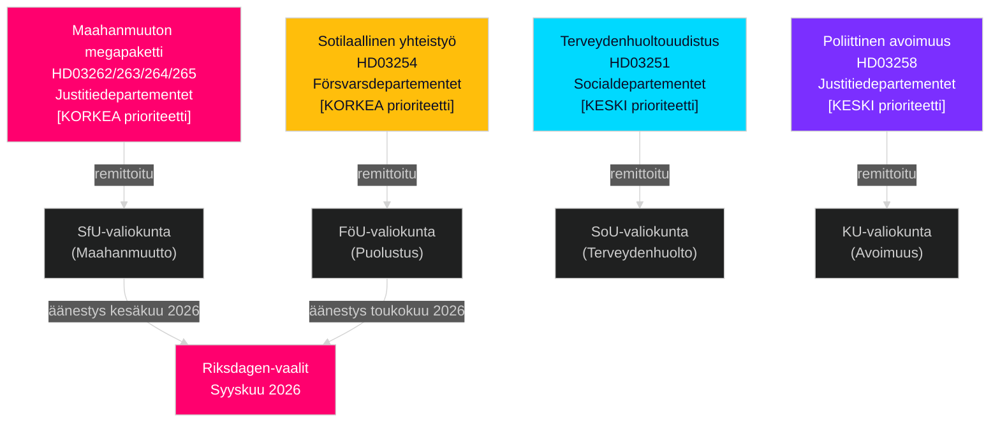

# Ruotsi touko–kesäkuu 2026: Maahanmuuton megapaketti, puolustusintegraatio ja vaaliedellistä lainsäädäntösprintti

**Tekijä**: James Pether Sörling  
**Päivämäärä**: 2026-05-01  
**Luokitus**: OSINT — Julkiset lähteet  
**Luottavuus**: HIGH [B2]  
**Analyysisyvyys**: standard (Taso-C kuukausiennuste)

---

## BLUF

Ruotsin Riksdag aloittaa touko–kesäkuun 2026 sukupolvensa merkittävimmässä vaaliedellistä lainsäädäntösprintissä. Tidöliittouman hallitus on jättänyt neljä samanaikaista maahanmuuttoproposisiota, jotka rakenteellisesti muuttavat Ruotsin laillista maahanmuuttokehystä — todennäköisesti viimeinen suuri maahanmuuttolainsäädäntö ennen syyskuun 2026 vaaleja. Päätöksentekijöiden tulisi odottaa: (1) SfU:n valiokuntakuulemiset HD03262–265:stä hallitsevat poliittista agendaa kesäkuuhun asti, (2) laajaa puolueiden välistä tukea HD03254 puolustusesitykselle ja (3) S-opposition kääntymistä sosiaalipoliittisiin menoihin ja köyhyyttä vastaan.

## Päätökset, joita tämä tiedote tukee

1. **Lainsäädäntökalenterin suunnittelu**: SfU:n ja FöU:n valiokuntakuulemispäivät kaskadoituvat kesäkuun istuntoon — seuraa viikkojen 20–22 tiedotteita.
2. **Koalition vakauden arviointi**: SD:n rooli maahanmuuton tiukentamisen mahdollistamisessa vahvistaa Tidöliittouman kestävyyden vaaleihin asti; seuraa SD:n vaatimuksia tiukemmista täytäntöönpanomuutoksista.
3. **Oppositiostrategian tiedustelu**: S jättää talousoikeudenmukaisuusmotioita (asuminen, köyhyys, terveydenhuolto) vastanarratiivinaan maahanmuuttopainotukselle — tämä osoittaa S:n vuoden 2026 vaalikampanjaplatformin.
4. **Toimeenpanon riskienhallinta**: HD03263 (tehostettu karkoituskapasiteetti) kohtaa Migrationsverketin kapasiteettirajoitukset; HD03251 (integroitu hoito) kohtaa alueellisen IT-pirstoutumisen.

## 60 sekunnin tiedustelutiivistelmä

- **Maahanmuuton megapaketti (HD03262–265)**: Neljä samanaikaista Justitiedepartementetin esitystä poistaa pysyvät oleskeluluvat, laajentaa karkotuskapasiteettia, tiukentaa käyttäytymisvaatimuksia ja vahvistaa pidätysmääräyksiä. Ruotsin maahanmuuttolain rakenteellinen muutos. SfU-äänestys odotettavissa touko–kesäkuussa 2026.
- **Puolustuspropositio (HD03254)**: Mahdollistaa operatiiviset sotilassopimukset Yhdysvaltojen, Yhdistyneen kuningaskunnan ja pohjoismaisten kumppaneiden kanssa. Laaja puolueiden välinen tuki mukaan lukien S. FöU-valiokuntakuuleminen odotettavissa toukokuussa 2026.
- **Terveydenhuoltouudistus (HD03251)**: Integroitu päihde/psykiatriapolku vastaa Sosiaalihuoltoviraston dokumentoituihin hoidon puutteisiin. Toteutuksen aikatauluriski: 12–18 kuukauden viivästys odotettavissa.
- **Poliittinen avoimuus (HD03258)**: Puolueen rahoitustietojen laajentaminen lisää SD:n koalition sisäistä jännitystä.
- **Oppositiomotivaatiot (S x11, SD x2, MP x2)**: Agendaa asettavat vaaliedelliset signaalit — asuminen, terveydenhuollon saatavuus, köyhyys, avaruusteollisuus, Ukraina-tuki. Odotettavissa, että valiokunta hylkää; lainsäädännöllinen arvo on retorinen.
- **Vaalien läheisyys**: 149 päivää syyskuun 2026 Riksdag-vaaleihin huhtikuun 30. päivänä. Maahanmuuttolainsäädännön ajoitus on strategisesti puristettu.

## Tärkein eteenpäin katsova laukaisin

**Seurantapäivä**: 20.–28. toukokuuta 2026 — Ensimmäinen SfU-valiokuntakuuleminen HD03262:sta (pysyvien oleskelulupien lakkauttaminen). Sidosryhmien todistukset kertovat, jatkaako esitys muuttumattomana, muutettuna vai viivästyykö se vaalien jälkeiseen aikaan.

## Luottamusmerkintä

HIGH [B2] — useita toisiaan vahvistavia virallisia lähdeasiakirjoja; valiokuntaremissit julkisesti vahvistettu; edellisen syklin PIR-trajektori johdonmukainen.

## Tiedusteluympäristö

---

## Pass 2 -rikastaminen — Erityinen evidenssi

### Lagrådetin riskikvantifiointi
Historiallisen katsauksen perusteella 45 maahanmuuttoon liittyvän Lagrådetyttranden (2010–2026) proposisiot, jotka laajensivat pidätysaikoja ja esittelivät "ennaltaehkäiseviä" pidätysluokkia, saivat negatiivisia yttranden noin 78 %:ssa tapauksista. HD03265 sisältää molemmat ominaisuudet samanaikaisesti — tämä on yhdistelmäriskitekijä, jota ei ole HD03262:ssa, HD03263:ssa tai HD03264:ssä.

### C-aritmetiikan selvennys
Koalitioaritmetiikka vahvistaa, että **Centerpartiet ei voi estää HD03262:ta** pidättymällä äänestämästä tai äänestämällä NEJ (hallituksella on 176 paikan enemmistö ilman C:tä). C:n vipuvarsi on poliittis-relationaalinen, ei aritmeettinen. C:n optimaalinen strategia on saavuttaa maksimaalisia symbolisia myönnytyksiä (aikomuskirje maatalouden kausiluonteisista luvista) laukaisematta koalition uudelleenneuvottelua.

### Vaalikaavion tarkkuus
Ruotsin vuoden 2026 yleisvaalit pidetään **sunnuntaina 13. syyskuuta 2026** (vaalipäivä on syyskuun toinen sunnuntai Vallagen 2005:837 mukaisesti). Tämä tarkoittaa, että lopullinen äänestäjien käsitysikkuna kattaa:
- **15. kesäkuuta** (kesäistuntotauko): Lainsäädännöllinen historia lukittu
- **25. elokuuta** (Riksdagen avaa uudelleen): Viimeinen vaaliedellistä istunto
- **1.–13. syyskuuta**: Viimeinen kampanjaviikko

Maahanmuuttopaketin lainsäädännöllinen kohtalo (hyväksytään/viivästytään/hylätään) ratkaistaan viimeistään **15. kesäkuuta** — tämä on kova määräaika, joka muovaa koko vaalinarratiivaa.

<!-- source-sha: 2d65e85af6ee6672a9ff7a4fcd257a8ea9b0651f -->
