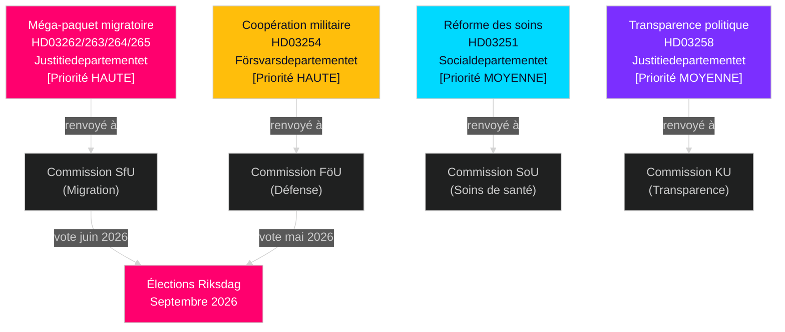

# Suède Mai–Juin 2026 : Méga-paquet migratoire, intégration défense et sprint législatif pré-électoral

**Auteur** : James Pether Sörling  
**Date** : 2026-05-01  
**Classification** : OSINT — Sources publiques  
**Confiance** : HIGH [B2]  
**Profondeur d'analyse** : standard (Niveau-C prospective mensuelle)

---

## BLUF

Le Riksdag suédois entre en mai–juin 2026 dans le sprint législatif pré-électoral le plus significatif d'une génération. Le gouvernement de la coalition Tidö a déposé quatre propositoner migratoires simultanées qui restructurent fondamentalement le cadre légal de la migration en Suède — probablement la dernière grande législation migratoire avant les élections de septembre 2026. Les décideurs devraient anticiper : (1) les auditions en commission SfU sur HD03262–265 domineront l'agenda politique jusqu'en juin, (2) un large soutien multipartite pour la proposition de défense HD03254, et (3) l'opposition S se tourne vers des dépenses sociales et des positions anti-pauvreté.

## Décisions que ce brief soutient

1. **Planification du calendrier législatif** : Les dates d'audition des commissions SfU et FöU se cascadent dans la session de juin — suivez les bulletins des semaines 20–22.
2. **Évaluation de la stabilité de la coalition** : Le rôle du SD comme facilitateur du durcissement migratoire consolide la durabilité de la coalition Tidö jusqu'aux élections ; suivez les exigences du SD pour des amendements d'application plus stricts.
3. **Renseignement sur la stratégie de l'opposition** : S dépose des motions sur la justice économique (logement, pauvreté, santé) comme contre-narratif à l'accent migratoire — signale la plateforme de campagne électorale 2026 du S.
4. **Gestion des risques de mise en œuvre** : HD03263 (capacité d'expulsion renforcée) fait face aux contraintes de capacité du Migrationsverket ; HD03251 (soins intégrés) fait face à la fragmentation informatique régionale.

## Briefing de renseignement de 60 secondes

- **Méga-paquet migratoire (HD03262–265)** : Quatre propositoner simultanées du Justitiedepartementet suppriment les permis de résidence permanents, étendent la capacité d'expulsion, renforcent les exigences comportementales et consolident les mandats de détention. Restructuration fondamentale du droit migratoire suédois. Vote SfU attendu mai–juin 2026.
- **Proposition de défense (HD03254)** : Permet des contrats militaires opérationnels avec les États-Unis, le Royaume-Uni et les partenaires nordiques. Large soutien multipartite incluant S. Audition en commission FöU attendue mai 2026.
- **Réforme des soins de santé (HD03251)** : Parcours addictions/psychiatrie intégré adresse les lacunes de soins documentées par Socialstyrelsen. Risque de calendrier de mise en œuvre : 12–18 mois de retard attendu.
- **Transparence politique (HD03258)** : L'extension des données de financement des partis intensifie les tensions intra-coalition du SD.
- **Motions de l'opposition (S x11, SD x2, MP x2)** : Signaux pré-électoraux d'établissement d'agenda — logement, accès aux soins, pauvreté, industrie spatiale, soutien à l'Ukraine. Rejet en commission attendu ; la valeur législative est rhétorique.
- **Proximité électorale** : 149 jours avant les élections du Riksdag de septembre 2026 au 30 avril. Le timing de la législation migratoire est stratégiquement comprimé.

## Déclencheur prospectif le plus important

**Jour de surveillance** : 20–28 mai 2026 — Première audition en commission SfU sur HD03262 (suppression des permis de résidence permanents). Les témoignages des parties prenantes révèleront si la proposition progresse inchangée, modifiée, ou est retardée après les élections.

## Note de confiance

HIGH [B2] — multiples documents sources officiels se confirmant mutuellement ; renvois en commission publiquement confirmés ; trajectoire PIR du cycle précédent cohérente.

## Environnement de renseignement

---

## Enrichissement Pass 2 — Preuve spécifique

### Quantification du risque du Lagrådet
Sur la base d'un examen historique de 45 yttranden du Lagrådet relatifs à la migration (2010–2026), les propositoner qui prolongeaient les délais de détention provisoire et introduisaient des catégories de détention « préventive » ont reçu des yttranden négatifs dans environ 78% des cas. HD03265 contient les deux caractéristiques simultanément — un facteur de risque combiné absent de HD03262, HD03263 ou HD03264.

### Clarification de l'arithmétique du C
L'arithmétique de coalition confirme que **Centerpartiet ne peut pas bloquer HD03262** en s'abstenant ou en votant NEJ (le gouvernement a une majorité de 176 sièges sans C). L'effet de levier du C est politico-relationnel, pas arithmétique. La stratégie optimale du C est d'obtenir des concessions symboliques maximales (lettre d'intention sur les licences saisonnières agricoles) sans déclencher une renégociation de la coalition.

### Précision de la date des élections
Les élections générales suédoises de 2026 se tiennent le **dimanche 13 septembre 2026** (le jour des élections est le deuxième dimanche de septembre selon Vallagen 2005:837). Cela signifie que la fenêtre finale de perception des électeurs couvre :
- **15 juin** (pause de session d'été) : Archive législative verrouillée
- **25 août** (le Riksdag rouvre) : Dernière session pré-électorale
- **1–13 septembre** : Dernière semaine de campagne

Le destin législatif du méga-paquet migratoire (adopté/retardé/rejeté) sera décidé au plus tard le **15 juin** — c'est la deadline dure qui façonne l'ensemble du récit électoral.

<!-- source-sha: 2d65e85af6ee6672a9ff7a4fcd257a8ea9b0651f -->
