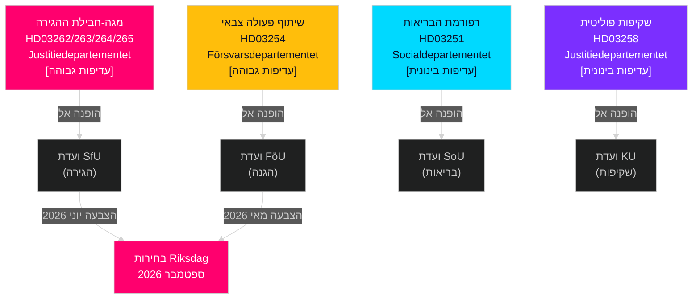

<!-- dir: rtl -->
# שוודיה מאי–יוני 2026: מגה-חבילת ההגירה, אינטגרציה ביטחונית וספרינט חקיקתי טרום-בחירות

**מחבר**: James Pether Sörling  
**תאריך**: 2026-05-01  
**סיווג**: OSINT — מקורות ציבוריים  
**רמת ביטחון**: HIGH [B2]  
**עומק ניתוח**: standard (שכבה-ג תחזית חודשית)

---

## תקציר מנהלים

הריקסדאג השוודי נכנס במאי–יוני 2026 לספרינט החקיקתי הטרום-בחירותי המשמעותי ביותר בדור. ממשלת קואליציית טידו הגישה ארבע פרופוזיציות הגירה בו-זמניות המשנות באופן מבני את מסגרת ההגירה החוקית של שוודיה — כנראה החקיקה הגדולה האחרונה בתחום ההגירה לפני בחירות ספטמבר 2026. מקבלי החלטות צריכים לצפות: (1) שימועי ועדת SfU על HD03262–265 ישלטו בסדר היום הפוליטי עד יוני, (2) תמיכה רחבה רב-מפלגתית להצעת ההגנה HD03254, ו-(3) האופוזיציה S פונה להוצאות חברתיות ועמדות נגד עוני.

## החלטות שמסמך זה תומך בהן

1. **תכנון לוח הזמנים החקיקתי**: תאריכי שימועי ועדות SfU ו-FöU מתגלגלים לכינוס יוני — עקבו אחר הניוזלטרים של שבועות 20–22.
2. **הערכת יציבות הקואליציה**: תפקיד ה-SD כמסייע להקשחת ההגירה מגבש את הסיבולת של קואליציית טידו עד לבחירות; עקבו אחר דרישות SD לתיקוני אכיפה מחמירים יותר.
3. **מודיעין אסטרטגיית האופוזיציה**: S מגישה הצעות צדק כלכלי (דיור, עוני, בריאות) כנרטיב נגדי לדגש ההגירה — מאותת על פלטפורמת מסע הבחירות 2026 של S.
4. **ניהול סיכוני יישום**: HD03263 (קיבולת גירוש מוגברת) מתמודד עם מגבלות קיבולת Migrationsverket; HD03251 (טיפול משולב) מתמודד עם פיצול IT אזורי.

## סיכום מודיעיני של 60 שניות

- **מגה-חבילת ההגירה (HD03262–265)**: ארבע פרופוזיציות בו-זמניות של Justitiedepartementet מבטלות רישיונות ישיבה קבועים, מרחיבות קיבולת גירוש, מחמירות דרישות התנהגות ומגבשות צווי מעצר. שינוי מבני של חוק ההגירה השוודי. הצבעת SfU צפויה מאי–יוני 2026.
- **פרופוזיצית ההגנה (HD03254)**: מאפשרת חוזים צבאיים מבצעיים עם ארה"ב, בריטניה ושותפים נורדיים. תמיכה רחבה רב-מפלגתית כולל S. שימוע ועדת FöU צפוי מאי 2026.
- **רפורמת הבריאות (HD03251)**: מסלול התמכרויות/פסיכיאטריה משולב מטפל בפערי טיפול מתועדים של Socialstyrelsen. סיכון לוח זמנים יישום: עיכוב של 12–18 חודשים צפוי.
- **שקיפות פוליטית (HD03258)**: הרחבת נתוני מימון מפלגות מגבירה מתחים תוך-קואליציוניים של SD.
- **הצעות האופוזיציה (S x11, SD x2, MP x2)**: אותות טרום-בחירותיים לקביעת סדר היום — דיור, גישה לבריאות, עוני, תעשיית חלל, תמיכה באוקראינה. דחיית ועדה צפויה; הערך החקיקתי הוא רטורי.
- **קרבת הבחירות**: 149 ימים לבחירות הריקסדאג ספטמבר 2026 נכון ל-30 באפריל. עיתוי חקיקת ההגירה דחוס אסטרטגית.

## הדק העתידי הקריטי ביותר

**יום מעקב**: 20–28 במאי 2026 — שימוע ועדת SfU הראשון על HD03262 (ביטול רישיונות ישיבה קבועים). עדויות בעלי עניין יחשפו האם ההצעה מתקדמת ללא שינוי, מתוקנת, או נדחית לאחר הבחירות.

## הערת ביטחון

HIGH [B2] — מסמכי מקור רשמיים מרובים המאשרים זה את זה; הפניות ועדות אושרו בפומבי; מסלול PIR של המחזור הקודם עקבי.

## סביבת המודיעין

---

## העשרת מעבר 2 — ראיות ספציפיות

### כימות סיכוני Lagrådet
על בסיס סקירה היסטורית של 45 yttranden של Lagrådet הקשורים להגירה (2010–2026), פרופוזיציות שהאריכו תקופות מעצר זמני והכניסו קטגוריות מעצר "מונע" קיבלו yttranden שליליים בכ-78% מהמקרים. HD03265 מכיל את שני המאפיינים בו-זמנית — גורם סיכון משולב הנעדר מ-HD03262, HD03263 או HD03264.

### הבהרת חשבון ה-C
חשבון הקואליציה מאשר כי **Centerpartiet אינו יכול לחסום את HD03262** על ידי הימנעות או הצבעה NEJ (לממשלה יש רוב של 176 מושבים ללא C). המינוף של C הוא פוליטי-יחסי, לא חשבוני. האסטרטגיה האופטימלית של C היא להשיג ויתורים סמליים מקסימליים (מכתב כוונות על רישיונות עונתיים חקלאיים) מבלי לעורר משא ומתן מחדש בקואליציה.

### דיוק תאריך הבחירות
הבחירות הכלליות השוודיות 2026 מתקיימות ביום **ראשון, 13 בספטמבר 2026** (יום הבחירות הוא ראשון שני בספטמבר לפי Vallagen 2005:837). פירוש הדבר שחלון תפיסת הבוחרים הסופי מכסה:
- **15 ביוני** (הפסקת כינוס קיץ): ארכיון חקיקתי נעול
- **25 באוגוסט** (ריקסדאג נפתח מחדש): כינוס טרום-בחירותי אחרון
- **1–13 בספטמבר**: שבוע קמפיין אחרון

גורל מגה-חבילת ההגירה החקיקתי (אושרה/נדחתה/נכשלה) יוחלט לא יאוחר מ**15 ביוני** — זהו המועד הסופי הקשיח המעצב את כל נרטיב הבחירות.

<!-- source-sha: 2d65e85af6ee6672a9ff7a4fcd257a8ea9b0651f -->
