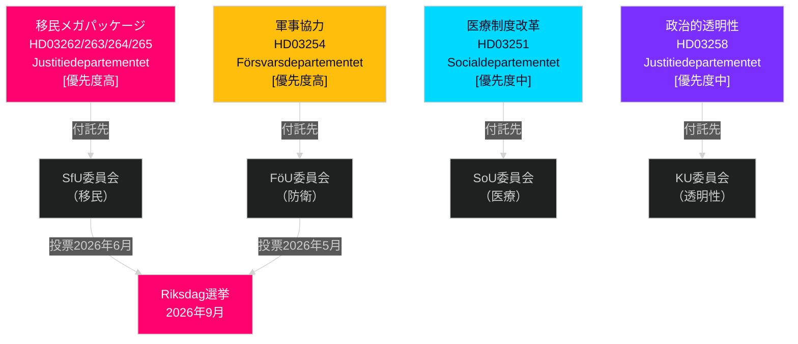

# スウェーデン2026年5〜6月：移民メガパッケージ、防衛統合、選挙前立法スプリント

**著者**: James Pether Sörling  
**日付**: 2026-05-01  
**分類**: OSINT — 公開情報源  
**信頼度**: HIGH [B2]  
**分析深度**: standard (Tier-C 月次予測)

---

## 要旨

スウェーデン議会（Riksdag）は2026年5〜6月、一世代で最も重要な選挙前立法スプリントに突入する。ティドー連立政権は、スウェーデンの合法的移民法制を構造的に変える4つの同時移民提案（propositioner）を提出した。これはおそらく2026年9月選挙前の最後の主要移民立法となる。意思決定者は以下を予期すべきである：(1) HD03262〜265に関するSfU委員会公聴会が6月まで政治議題を支配する、(2) 防衛提案HD03254への広範な超党派支持、(3) S野党が社会支出と反貧困ポジションに転換。

## この概況書が支援する意思決定

1. **立法カレンダー計画**：SfU・FöU委員会の公聴会日程が6月会議に向けてカスケードする — 第20〜22週のニュースレターを追跡する。
2. **連立安定性評価**：SDの移民強化推進役が選挙までのティドー連立の耐久性を固める；SDによるより厳格な執行改正要求を追跡する。
3. **野党戦略情報**：Sは移民重視への対抗ナラティブとして経済正義に関する動議（住宅、貧困、医療）を提出 — S の2026年選挙キャンペーンプラットフォームを示唆。
4. **実施リスク管理**：HD03263（強化された送還能力）はMigrationsverketの容量制約に直面；HD03251（統合ケア）は地域ITの断片化に直面。

## 60秒情報概況

- **移民メガパッケージ（HD03262〜265）**: Justitiedepartementetによる4つの同時propositionerが永住許可を廃止し、送還能力を拡大し、行動要件を厳格化し、身柄拘束命令を強化。スウェーデン移民法の構造的再編。SfU投票は2026年5〜6月予定。
- **防衛proposition（HD03254）**: 米国、英国、北欧パートナーとの作戦的軍事契約を可能にする。Sを含む広範な超党派支持。FöU委員会公聴会は2026年5月予定。
- **医療制度改革（HD03251）**: 統合された依存症/精神科経路がSocialstyrelsenによって文書化されたケアギャップに対応。実施スケジュールリスク：12〜18ヶ月の遅延予測。
- **政治的透明性（HD03258）**: 政党資金データの拡張がSDの連立内部緊張を高める。
- **野党動議（S x11、SD x2、MP x2）**: 選挙前の議題設定シグナル — 住宅、医療アクセス、貧困、宇宙産業、ウクライナ支援。委員会否決予想；立法的価値は修辞的。
- **選挙の近接性**: 4月30日時点でRiksdag選挙（2026年9月）まで149日。移民立法の時期は戦略的に圧縮。

## 最重要な将来のトリガー

**追跡日**: 2026年5月20〜28日 — HD03262（永住許可廃止）に関するSfU委員会の初公聴会。利害関係者の証言が、提案が変更なし、修正あり、または選挙後延期で進むかを示す。

## 信頼度注記

HIGH [B2] — 相互に確認し合う複数の公式ソース文書；委員会回付が公に確認済み；前サイクルのPIR軌跡が一貫。

## 情報環境

---

## パス2強化 — 具体的証拠

### Lagrådetsリスク定量化
2010〜2026年の移民関連Lagrådet yttranden 45件の歴史的レビューに基づくと、仮釈放期限を延長し「予防的」拘禁カテゴリーを導入した提案は約78%のケースで否定的なyttrandenを受けた。HD03265は両特性を同時に含む — HD03262、HD03263、HD03264には存在しない複合的なリスク要因。

### Centerpartiet算術の明確化
連立算術により、**Centerpartietは棄権またはNEJ投票ではHD03262を阻止できない**（政府はCなしで176議席の過半数を有する）ことが確認される。CのレバレッジはCなしの数理的ではなく政治的・関係的なものである。Cの最適戦略は、連立再交渉を引き起こすことなく最大の象徴的譲歩（農業季節ライセンスに関する意向書）を確保することである。

### 選挙日の精度
スウェーデン2026年総選挙は**2026年9月13日（日曜日）**に行われる（選挙日はVallagen 2005:837により9月の第2日曜日）。これは最終的な有権者認識ウィンドウが以下をカバーすることを意味する：
- **6月15日**（夏季会議休憩）：立法アーカイブがロック
- **8月25日**（Riksdag再開）：最後の選挙前会議
- **9月1〜13日**：最後のキャンペーン週

移民メガパッケージの立法的運命（可決/延期/否決）は遅くとも**6月15日**までに決定される — これが選挙ナラティブ全体を形成するハードデッドラインである。

<!-- source-sha: 2d65e85af6ee6672a9ff7a4fcd257a8ea9b0651f -->
