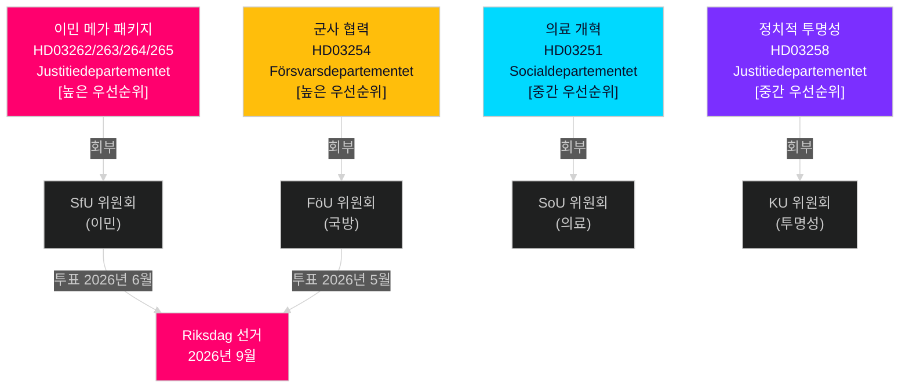

# 스웨덴 2026년 5~6월: 이민 메가 패키지, 국방 통합, 선거 전 입법 스프린트

**저자**: James Pether Sörling  
**날짜**: 2026-05-01  
**분류**: OSINT — 공개 출처  
**신뢰도**: HIGH [B2]  
**분석 심도**: standard (Tier-C 월간 전망)

---

## 요약

스웨덴 의회(Riksdag)는 2026년 5~6월, 한 세대에 가장 중요한 선거 전 입법 스프린트에 진입한다. 티도 연립 정부는 스웨덴의 합법 이민 법적 프레임워크를 구조적으로 변경하는 네 건의 동시 이민 제안(propositioner)을 제출했다 — 이는 2026년 9월 선거 전 마지막 주요 이민 입법이 될 가능성이 높다. 의사결정자들은 다음을 예상해야 한다: (1) HD03262~265에 대한 SfU 위원회 청문회가 6월까지 정치 의제를 지배하고, (2) 국방 제안 HD03254에 대한 광범위한 초당파 지지, (3) S 야당이 사회 지출 및 반빈곤 입장으로 전환.

## 이 브리핑이 지원하는 결정

1. **입법 일정 계획**: SfU·FöU 위원회 청문회 날짜가 6월 회의를 향해 연쇄된다 — 20~22주 뉴스레터를 추적하라.
2. **연립 안정성 평가**: SD의 이민 강화 촉진 역할이 선거까지 티도 연립의 내구성을 공고히 한다; SD의 더 엄격한 집행 수정 요구를 추적하라.
3. **야당 전략 정보**: S는 이민 강조에 대한 반대 서사로 경제 정의 동의(주거, 빈곤, 의료)를 제출 — S의 2026년 선거 캠페인 플랫폼을 시사.
4. **시행 리스크 관리**: HD03263(강화된 추방 역량)은 Migrationsverket의 용량 제약에 직면; HD03251(통합 돌봄)은 지역 IT 파편화에 직면.

## 60초 정보 브리핑

- **이민 메가 패키지(HD03262~265)**: Justitiedepartementet의 네 건 동시 propositioner이 영주 거주 허가를 폐지하고, 추방 역량을 확대하며, 행동 요건을 강화하고, 구금 명령을 공고히 한다. 스웨덴 이민법의 구조적 재편. SfU 투표는 2026년 5~6월 예상.
- **국방 proposition(HD03254)**: 미국, 영국, 북유럽 파트너들과의 작전 군사 계약을 가능하게 한다. S 포함 광범위한 초당파 지지. FöU 위원회 청문회 2026년 5월 예상.
- **의료 개혁(HD03251)**: 통합 중독/정신과 경로가 Socialstyrelsen이 문서화한 돌봄 격차를 해소한다. 시행 일정 리스크: 12~18개월 지연 예상.
- **정치적 투명성(HD03258)**: 정당 자금 데이터 확장이 SD의 연립 내부 긴장을 심화시킨다.
- **야당 동의(S x11, SD x2, MP x2)**: 선거 전 의제 설정 신호 — 주거, 의료 접근성, 빈곤, 우주 산업, 우크라이나 지원. 위원회 부결 예상; 입법적 가치는 수사적.
- **선거 근접성**: 4월 30일 기준 2026년 9월 Riksdag 선거까지 149일. 이민 입법 타이밍은 전략적으로 압축.

## 가장 중요한 미래 트리거

**추적일**: 2026년 5월 20~28일 — HD03262(영주 거주 허가 폐지)에 관한 첫 SfU 위원회 청문회. 이해관계자 증언이 제안이 변경 없이, 수정하여, 또는 선거 후로 지연되어 진행될지를 드러낼 것이다.

## 신뢰도 주석

HIGH [B2] — 상호 확인하는 복수의 공식 출처 문서; 위원회 회부가 공개적으로 확인됨; 이전 주기 PIR 궤적 일관.

## 정보 환경

---

## Pass 2 강화 — 구체적 증거

### Lagrådet 리스크 정량화
2010~2026년 이민 관련 Lagrådet yttranden 45건의 역사적 검토를 기반으로, 예비 구금 기간을 연장하고 "예방적" 구금 카테고리를 도입한 제안은 약 78%의 경우 부정적인 yttranden을 받았다. HD03265는 두 특성을 동시에 포함한다 — HD03262, HD03263, HD03264에는 없는 복합적 리스크 요인.

### Centerpartiet 산술 명확화
연립 산술은 **Centerpartiet이 기권하거나 NEJ로 투표해도 HD03262를 저지할 수 없다**는 것을 확인한다(정부는 C 없이 176석 과반수를 보유). C의 레버리지는 정치적·관계적이지 산술적이지 않다. C의 최적 전략은 연립 재협상을 촉발하지 않고 최대 상징적 양보(농업 계절 라이선스에 대한 의향서)를 확보하는 것이다.

### 선거일 정밀도
스웨덴 2026년 총선은 **2026년 9월 13일 일요일**에 치러진다(선거일은 Vallagen 2005:837에 따라 9월 두 번째 일요일). 이는 최종 유권자 인식 창이 다음을 포함함을 의미한다:
- **6월 15일**(여름 회의 휴식): 입법 아카이브 잠금
- **8월 25일**(Riksdag 재개): 마지막 선거 전 회의
- **9월 1~13일**: 마지막 캠페인 주간

이민 메가 패키지의 입법적 운명(통과/지연/부결)은 늦어도 **6월 15일**까지 결정된다 — 전체 선거 서사를 형성하는 하드 데드라인이다.

<!-- source-sha: 2d65e85af6ee6672a9ff7a4fcd257a8ea9b0651f -->
