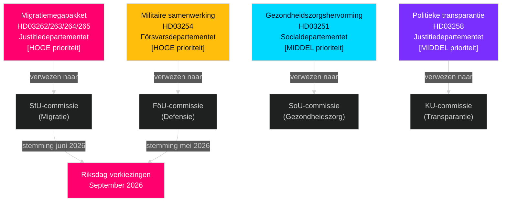

# Zweden Mei–Juni 2026: Migratiemegapakket, defensie-integratie en pre-electorale wetgevingssprint

**Auteur**: James Pether Sörling  
**Datum**: 2026-05-01  
**Classificatie**: OSINT — Publieke bronnen  
**Vertrouwen**: HIGH [B2]  
**Analysediepte**: standard (Niveau-C maandelijkse vooruitblik)

---

## BLUF

Het Zweedse Riksdag treedt in mei–juni 2026 de meest significante pre-electorale wetgevingssprint van een generatie in. De Tidö-coalitieregering heeft vier gelijktijdige migratie-propositoner ingediend die het legale migratierechtskader van Zweden structureel hervormen — waarschijnlijk de laatste grote migratiewetgeving vóór de verkiezingen van september 2026. Besluitvormers moeten anticiperen op: (1) SfU-commissieverhoren over HD03262–265 die de politieke agenda tot juni domineren, (2) brede meerpartijsteun voor het defensievoorstel HD03254, en (3) S-oppositie die zich wendt tot sociale bestedingen en anti-armoede-posities.

## Beslissingen die dit briefing ondersteunt

1. **Wetgevingskalenderplanning**: SfU- en FöU-commissieverhoordata cascaderen naar de juni-sessie — volg de bulletins van weken 20–22.
2. **Beoordeling van coalitiesstabiliteit**: SDs rol als migratieverscherpingsaanbieder consolideert de Tidö-coalitiehoudbaarheid tot de verkiezingen; volg SD-eisen voor strengere handhavingsamendamenten.
3. **Inlichtingen over oppositiestrategie**: S dient economische rechtvaardigheidsmotions in (huisvesting, armoede, gezondheidszorg) als tegenverhaal bij de migratieaccentuering — signaleert S's verkiezingscampagneplatform 2026.
4. **Implementatierisicobeheer**: HD03263 (verbeterde uitzettingscapaciteit) staat voor Migrationsverkets capaciteitsbeperkingen; HD03251 (geïntegreerde zorg) staat voor regionale IT-fragmentatie.

## 60-seconden inlichtingenbriefing

- **Migratiemegapakket (HD03262–265)**: Vier gelijktijdige Justitiedepartementet-propositoner schaffen permanente verblijfsvergunningen af, breiden uitzettingscapaciteit uit, verscherpen gedragseisen en consolideren bewakingsbevelen. Structurele hervorming van het Zweeds migratierecht. SfU-stemming verwacht mei–juni 2026.
- **Defensieproposition (HD03254)**: Maakt operationele militaire contracten mogelijk met de VS, het VK en Noordse partners. Brede meerpartijsteun inclusief S. FöU-commissieverhoor verwacht mei 2026.
- **Gezondheidszorgshervorming (HD03251)**: Geïntegreerd verslavings-/psychiatriepad adresseert gedocumenteerde zorgtekorten van Socialstyrelsen. Risico op implementatietijdschema: 12–18 maanden vertraging verwacht.
- **Politieke transparantie (HD03258)**: Uitbreiding van partijfinancieringsgegevens intensiveert SD-intra-coalitie spanning.
- **Oppositiemotions (S x11, SD x2, MP x2)**: Pre-electorale agenda-signalen — huisvesting, zorgtoegankelijkheid, armoede, ruimtevaartindustrie, Oekraïne-steun. Commissieafwijzing verwacht; legislatieve waarde is retorisch.
- **Electorale nabijheid**: 149 dagen tot Riksdag-verkiezingen september 2026 per 30 april. Migratiewetgevingstiming is strategisch gecomprimeerd.

## Belangrijkste voorwaartse trigger

**Volgdag**: 20–28 mei 2026 — Eerste SfU-commissieverhoor over HD03262 (afschaffing permanente verblijfsvergunning). Stakeholdertestimonie zal onthullen of het voorstel ongewijzigd doorgaat, gewijzigd wordt, of wordt uitgesteld tot na de verkiezingen.

## Vertrouwensaantekening

HIGH [B2] — meerdere onderling bevestigende officiële brondocumenten; commissieremissen publiekelijk bevestigd; vorige cyclus PIR-traject consistent.

## Inlichtingenomgeving

---

## Pass-2-verrijking — Specifiek bewijs

### Lagrådet risicokwantificering
Op basis van een historische review van 45 migratie-gerelateerde Lagrådet-yttranden (2010–2026) ontvingen propositoner die voorlopige hechtenistermijnen verlengden en "preventieve" hechtenisincarceratiecategorieën introduceerden negatieve yttranden in circa 78% van de gevallen. HD03265 bevat beide kenmerken tegelijkertijd — een gecombineerde risicofactor die afwezig is in HD03262, HD03263 of HD03264.

### C-aritmetiek verduidelijking
De coalitie-aritmetiek bevestigt dat **Centerpartiet HD03262 niet kan blokkeren** door zich te onthouden of NEJ te stemmen (de regering heeft een 176-zetelmeerderheid zonder C). De hefboom van C is politiek-relationeel, niet aritmetisch. C's optimale strategie is maximale symbolische concessies te behalen (intentieverklaring over agrarische seizoenslicenties) zonder coalitie-heronderhandeling te triggeren.

### Verkiezingsdatumprecisie
De Zweedse Algemene Verkiezingen 2026 vinden plaats op **zondag 13 september 2026** (verkiezingsdag is de tweede zondag van september per Vallagen 2005:837). Dit betekent dat het finale kiezersperceptievenster omvat:
- **15 juni** (zomersessieonderbreking): Wetgevingsarchief vergrendeld
- **25 augustus** (Riksdag heropent): Laatste pre-electorale sessie
- **1–13 september**: Laatste campagneweek

Het wetgevingslotsbestemming van het migratiemegapakket (aangenomen/uitgesteld/verworpen) wordt uiterlijk op **15 juni** beslist — dat is de harde deadline die het gehele verkiezingsverhaal vormt.

<!-- source-sha: 2d65e85af6ee6672a9ff7a4fcd257a8ea9b0651f -->
