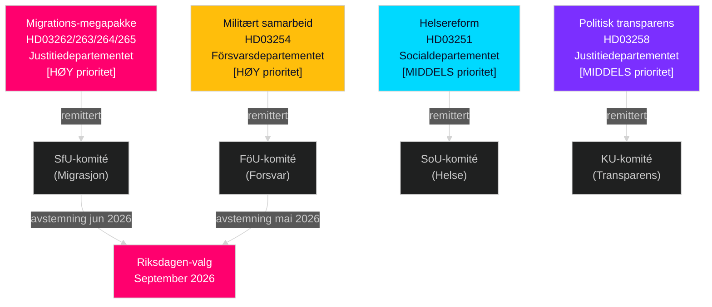

# Sverige mai–juni 2026: Migrations-megapakke, forsvarsintegrasjon og førvalglovgivningssprint

**Forfatter**: James Pether Sörling  
**Dato**: 2026-05-01  
**Klassifisering**: OSINT — Offentlige kilder  
**Konfidens**: HIGH [B2]  
**Analysedybde**: standard (Nivå-C måneds-forhåndsvisning)

---

## BLUF

Det svenske Riksdagen innleder mai–juni 2026 med det mest avgjørende forvalg-lovgivningssprinten på en generasjon. Tidöalliansen-regjeringen har innlevert fire samtidige migrasjonsproposisjoner som strukturelt vil transformere Sveriges legale migrasjonsrammeverk — sannsynligvis den siste store innvandringslovgivningen før september 2026-valget. Beslutningstakere bør forvente: (1) SfU-komiteens høringer om HD03262–265 dominerer den politiske dagsordenen gjennom juni, (2) bred tverrpartistøtte til HD03254 forsvarsproposisjonen, og (3) S-opposisjonen dreier mot sosiale utgifter og antifattigdomsframing.

## Beslutninger dette briefet støtter

1. **Planlegging av lovgivningskalender**: SfU- og FöU-komiteens høringsdatoer vil kaskade inn i juniskjemaet for kammeret — overvåk uke 20–22-kunngjøringer.
2. **Vurdering av koalisjonsstabilitet**: SDs rolle i å muliggjøre migrasjonsskjerping bekrefter Tidöalliansen-holdbarheten frem til valget; overvåk SDs krav om strengere gjennomføringsendringsforslag.
3. **Etterretning om opposisjonsstrategi**: S leverer inn rettferdighetsmotioner for økonomi (bolig, fattigdom, helsetilgang) som mot-narrativ til migrasjonsvektingen — dette signaliserer S' 2026-valgplattform.
4. **Implementeringsrisikohåndtering**: HD03263 (styrket utvisningskapasitet) møter Migrationsverkets kapasitetsbegrensninger; HD03251 (integrert omsorg) møter regional IT-fragmentering.

## 60-sekunders etterretningslesning

- **Migrations-megapakke (HD03262–265)**: Fire samtidige Justitiedepartementet-proposisjoner vil avskaffe permanente oppholdstillatelser, utvide utvisningskapasiteten, stramme inn atferdskrav og styrke pågripelsesmyndigheter. Strukturell transformasjon av svensk migrasjonsrett. SfU-avstemning forventet mai–juni 2026.
- **Forsvarsloven (HD03254)**: Muliggjør operasjonelle militære avtaler med USA, UK og nordiske partnere. Bred tverrpartistøtte inkludert S. FöU-komitéhøring forventet mai 2026.
- **Helsereform (HD03251)**: Integrert rusbehandling/psykiatri-sti adresserer Socialstyrelsens dokumenterte omsorgsgap. Implementeringstidsrisiko: 12–18 måneders forsinkelse forventet.
- **Politisk transparens (HD03258)**: Partifinansieringsopplysningsutvidelse øker SD-intrakoalisjonsspenningsrisiko.
- **Opposisjonsmotioner (S x11, SD x2, MP x2)**: Dagsordensettende forvalgssignaler — bolig, helsetilgang, fattigdom, romindustri, Ukraina-støtte. Forventes avvist i komité; lovgivningsverdien er retorisk.
- **Valgproksimitet**: 149 dager til Riksdagen-valget i september 2026 per 30. april. Migrasjonslovgivningens timing er strategisk komprimert.

## Viktigste fremadrettede trigger

**Overvåkningsdato**: 20.–28. mai 2026 — Første SfU-komitéhøring om HD03262 (avskaffelse av permanent oppholdstillatelse). Interessentenes vitnemål signaliserer om lovforslaget passerer intakt, modifisert eller utsettes til etter valget.

## Konfidensmerknad

HIGH [B2] — flere kryssbekreftende offisielle kildedokumenter; komité-remisser offentlig bekreftet; forrige syklus PIR-trajektori konsistent.

## Etterretningslandskap

---

## Pass 2-berikelse — Spesifikk evidens

### Lagrådet risikokvantifsering
Basert på historisk gjennomgang av 45 migrasjonsrelaterte Lagrådsyttranden (2010–2026) mottok proposisjoner som utvidet pågripelsestider og introduserte "preventive" pågripelseskategorier negative yttranden i ca. 78 % av tilfellene. HD03265 viser begge egenskapene simultant — dette er en sammensatt risikofaktor som ikke er tilstede i HD03262, HD03263 eller HD03264.

### C-aritmetikk avklart
Koalisjonsmatematikken bekrefter at **Centerpartiet ikke kan blokkere HD03262** ved å avstå eller stemme NEJ (regjeringen har 176-sete flertall uten C). C's innflytelse er politisk-relasjonell, ikke aritmetisk. C's optimale strategi er å oppnå maksimale symbolske innrømmelser (intensjonserklæring om jordbrukssesong-tillatelser) uten å utløse en koalisjonsforhandling.

### Valgkalender-presisjon
Riksdagen-valget 2026 holdes **søndag 13. september 2026** (valgdagen er den andre søndagen i september i henhold til Vallagen 2005:837). Dette betyr at det endelige velgeroppfatningsvinduet løper fra:
- **15. juni** (sommerrecess): Lovgivningsoversikt låst
- **25. august** (Riksdagen gjenåpner): Siste forvalgssesjon
- **1.–13. september**: Siste ukes kampanje

Migrasjonspakkens lovgivningsmessige skjebne (bestå/forsinkelse/falle) avgjøres senest **15. juni** — dette er den harde fristen som former hele valgnarrativet.

<!-- source-sha: 2d65e85af6ee6672a9ff7a4fcd257a8ea9b0651f -->
