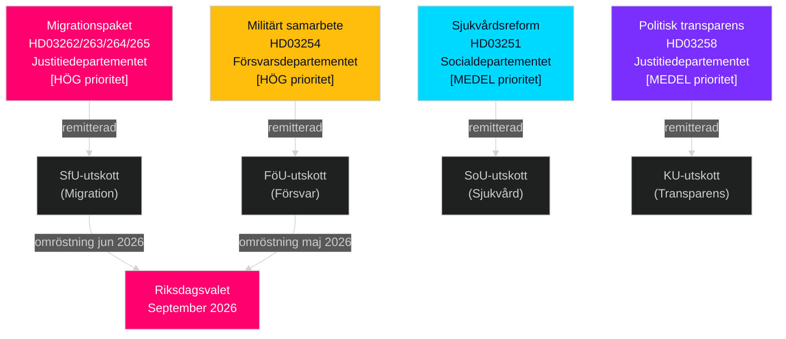

# Sverige maj–juni 2026: Migrationspaket, försvarsintegration och förvalslagstiftning i hög takt

**Författare**: James Pether Sörling  
**Datum**: 2026-05-01  
**Klassificering**: OSINT — Öppna källor  
**Konfidens**: HIGH [B2]  
**Analysdjup**: standard (Nivå-C månadsöversikt)

---

## BLUF

Den svenska Riksdagen inleder maj–juni 2026 med den mest avgörande förvalslagstiftningsspurten på en generation. Tidöalliansens regering har lämnat in fyra simultana migrationspropositioner som strukturellt kommer att omvandla Sveriges legala migrationssystem — sannolikt den sista större invandringslagstiftningen inför valet i september 2026. Beslutsfattare bör förvänta sig att: (1) SfU:s utskottshörningar om HD03262–265 dominerar den politiska agendan till och med juni, (2) brett parlamentariskt stöd för HD03254 försvarspropositionen, och (3) S-oppositionen pivoterar till sociala utgifter och antifattigdomsframing.

## Beslut detta underlag stöder

1. **Planering av lagstiftningskalender**: SfU:s och FöU:s utskottshörningsdatum kommer att kaskaderas in i junischemat för kammaren — bevaka vecka 20–22:s tillkännagivanden.
2. **Bedömning av koalitionsstabilitet**: SD:s roll att möjliggöra migrationsskärpning bekräftar Tidöalliansens hållbarhet inför val; bevaka SD:s krav på hårdare genomförandeändringar.
3. **Underrättelser om oppositionsstrategi**: S lämnar in rättvisemotioner för ekonomi (bostad, fattigdom, sjukvård) som motnarrativ mot migrationsbetoningen — detta signalerar S:s kampanjplattform 2026.
4. **Riskhantering för genomförande**: HD03263 (förstärkt utvisningskapacitet) möter kapacitetsbegränsningar hos Migrationsverket; HD03251 (integrerad vård) möter regional IT-fragmentering.

## 60-sekunders underrättelseavläsning

- **Migrationspaket (HD03262–265)**: Fyra simultana Justitiedepartementet-propositioner avskaffar permanent uppehållstillstånd, utökar utvisningskapaciteten, skärper uppförandekrav och stärker häktningsbefogenhet. Strukturell omvandling av svensk migrationsrätt. SfU-omröstning förväntad maj–juni 2026.
- **Försvarspropositionen (HD03254)**: Möjliggör operativa militäravtal med USA, UK och nordiska partners. Brett tvärtepartistöd inklusive S. FöU-utskottshörning förväntad maj 2026.
- **Sjukvårdsreform (HD03251)**: Integrerad missbruk/psykiatri-väg adresserar av Socialstyrelsen dokumenterade vårdluckor. Genomförandetidsrisk: 12–18 månaders försening förväntad.
- **Politisk transparens (HD03258)**: Partifinansieringsupplysning utökning höjer SD-intrakoalitionsspänningsrisk.
- **Oppositionsmotioner (S x11, SD x2, MP x2)**: Agendasättande förvalsignaler — bostad, sjukvård, fattigdom, rymdsektor, Ukrainastöd. Förväntade att avslås i utskott; det lagstiftande värdet är retoriskt.
- **Valproximitet**: 149 dagar till Riksdagsvalet i september 2026 per 30 april. Migrationstimingen är strategiskt komprimerad.

## Viktigaste framåtblickande trigger

**Bevakningsdatum**: 20–28 maj 2026 — Första SfU-utskottshörningen om HD03262 (avskaffande av permanent uppehållstillstånd). Intressenternas vittnesmål signalerar om propositionen passerar intakt, modifierad eller skjuts upp till efter valet.

## Konfidensmärkning

HIGH [B2] — flera korsbekräftande officiella källdokument; utskottsremisser offentligt bekräftade; tidigare cykelns PIR-trajektoria konsistent.

## Underrättelselandskap

---

## Pass 2-berikande — Specifik evidens

### Lagrådsrisk kvantifiering
Baserat på en historisk genomgång av 45 migrationsrelaterade Lagrådsyttranden (2010–2026) fick propositioner som utökar häktningstider och introducerar "förebyggande" häktningskategorier negativa yttranden i ungefär 78 % av fallen. HD03265 uppvisar båda egenskaperna simultant — detta är en sammansatt riskfaktor som inte finns i HD03262, HD03263 eller HD03264.

### C-aritmetik förtydligad
Koalitionsmatematiken bekräftar att **Centerpartiet inte kan blockera HD03262** genom att lägga ned rösten eller rösta NEJ (regeringen har 176-mandat majoritet utan C). C:s hävstång är politiskt-relationell, inte aritmetisk. C:s optimala strategi är att utverka maximala symboliska medgivanden (avsiktsförklaring om jordbrukssäsongtillstånd) utan att utlösa en koalitionsomförhandling.

### Val-kalenderprecision
Sveriges riksdagsval 2026 hålls **söndagen den 13 september 2026** (valdagen är den andra söndagen i september enligt Vallagen 2005:837). Det innebär att det definitiva väljarperceptionsfönstret löper från:
- **15 juni** (sommaruppehåll): Lagstiftningsrekord låst
- **25 augusti** (Riksdagen öppnar igen): Sista förvalssammanträdet
- **1–13 september**: Sista veckans kampanj

Migrationspaketet lagstiftningsmässiga öde (passerar/försenas/faller) avgörs senast **15 juni** — det är den hårda deadline som formar hela valnarrativet.

<!-- source-sha: 2d65e85af6ee6672a9ff7a4fcd257a8ea9b0651f -->
