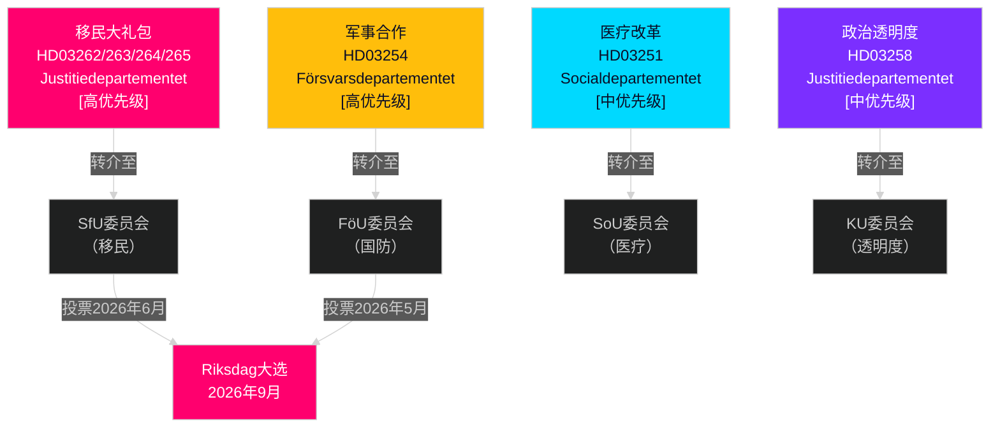

# 瑞典2026年5-6月：移民大礼包、国防整合与大选前立法冲刺

**作者**: James Pether Sörling  
**日期**: 2026-05-01  
**分类**: OSINT — 公开来源  
**置信度**: HIGH [B2]  
**分析深度**: standard（C级月度前瞻）

---

## 结论先行

瑞典议会（Riksdag）在2026年5-6月进入一代人中最重要的大选前立法冲刺阶段。提多联合政府同时提交了四项移民提案（propositioner），从结构上重塑瑞典的合法移民法律框架——这很可能是2026年9月大选前最后一次重大移民立法。决策者应预期：(1) SfU委员会关于HD03262-265的听证会将主导6月前的政治议程；(2) 国防提案HD03254获广泛跨党派支持；(3) S党反对派转向社会支出和反贫困立场。

## 本简报支持的决策

1. **立法日程规划**：SfU和FöU委员会听证会日期将级联至6月会议——关注第20-22周新闻通报。
2. **联合政府稳定性评估**：SD作为移民收紧推动者的角色巩固了提多联盟至选举的持续性；关注SD对更严格执法修正案的诉求。
3. **反对派战略情报**：S党提交经济公正动议（住房、贫困、医疗）作为移民重点的反叙事——预示S党2026年竞选纲领。
4. **实施风险管理**：HD03263（强化驱逐能力）面临Migrationsverket的容量限制；HD03251（整合护理）面临地区IT碎片化问题。

## 60秒情报摘要

- **移民大礼包（HD03262-265）**：Justitiedepartementet的四项同步propositioner取消永久居留许可，扩大驱逐能力，强化行为要求，巩固拘留令。瑞典移民法的结构性重组。SfU投票预计2026年5-6月举行。
- **国防proposition（HD03254）**：允许与美国、英国及北欧伙伴签订作战军事合同。包括S党在内的广泛跨党派支持。FöU委员会听证会预计2026年5月举行。
- **医疗改革（HD03251）**：综合成瘾/精神科路径解决Socialstyrelsen记录的医疗缺口。实施时间表风险：预计延迟12-18个月。
- **政治透明度（HD03258）**：扩大政党资金数据加剧SD联盟内部紧张。
- **反对派动议（S x11、SD x2、MP x2）**：大选前议程设置信号——住房、医疗可及性、贫困、航天工业、乌克兰支持。预计委员会否决；立法价值属修辞性质。
- **选举临近程度**：截至4月30日，距2026年9月Riksdag大选还有149天。移民立法时机受到战略性压缩。

## 最重要的前瞻触发因素

**跟踪日期**：2026年5月20-28日——SfU委员会就HD03262（取消永久居留许可）举行首次听证会。利益相关者证词将揭示提案是否不变推进、修改推进，或推迟至选举后。

## 置信度注记

HIGH [B2] — 多份相互印证的官方来源文件；委员会转介公开确认；前一周期PIR轨迹一致。

## 情报环境

---

## 第二轮深化——具体证据

### Lagrådet风险量化
基于对2010-2026年45份移民相关Lagrådet yttranden的历史回顾，延长临时羁押期限并引入"预防性"羁押类别的propositioner在约78%的案例中收到否定性yttranden。HD03265同时包含上述两个特征——这是HD03262、HD03263或HD03264中不存在的复合风险因素。

### Centerpartiet算术说明
联合政府算术证实，**Centerpartiet无法通过弃权或投NEJ来阻止HD03262**（政府在没有C党的情况下拥有176席多数）。C党的筹码是政治关系性的，而非算术性的。C党的最优策略是在不引发联盟重新谈判的前提下，争取最大限度的象征性让步（关于农业季节性许可的意向书）。

### 选举日期精确度
2026年瑞典大选于**2026年9月13日（周日）**举行（根据Vallagen 2005:837，选举日为9月第二个周日）。这意味着最后的选民认知窗口涵盖：
- **6月15日**（夏季会议休会）：立法档案封锁
- **8月25日**（Riksdag复会）：最后一次大选前会议
- **9月1-13日**：最后一周竞选活动

移民大礼包的立法命运（通过/推迟/否决）将不迟于**6月15日**决定——这是塑造整个选举叙事的硬性截止日期。

<!-- source-sha: 2d65e85af6ee6672a9ff7a4fcd257a8ea9b0651f -->
