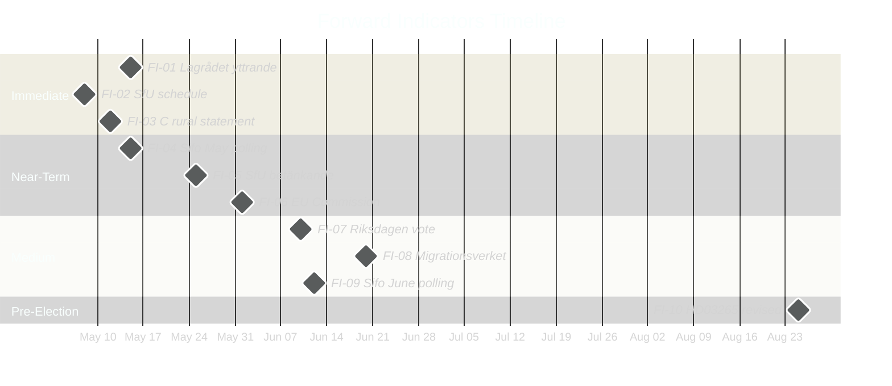

# Forward Indicators — Month Ahead, May–June 2026

**Author**: James Pether Sörling  
**Date**: 2026-05-01

---

## 10 Dated Forward Indicators Across 4 Horizons

### Horizon 1: Immediate (May 2026)

**FI-01: Lagrådet yttrande on HD03265**
- **Expected date**: 2026-05-12 to 2026-05-19 (statutory ~6 weeks from proposition submission)
- **Source**: Lagrådet website (lagradet.se)
- **Significance**: Determines whether HD03265 proceeds to vote or requires revision
- **Watch for**: Language on ECHR Art. 5 proportionality; recommendation to revise or proceed
- **Confidence**: HIGH (yttrande legally required, RF 8:20)

**FI-02: SfU Committee Schedule Publication for HD03262–265**
- **Expected date**: 2026-05-06 to 2026-05-10 (committee spring schedule)
- **Source**: Riksdagen SfU committee calendar (riksdagen.se)
- **Significance**: Confirms whether summer recess legislative window (June 1–15) is achievable
- **Watch for**: SfU beredning dates; any extra session requests

**FI-03: Centerpartiet Rural Business Statement**
- **Expected date**: 2026-05-01 to 2026-05-15
- **Source**: C party press releases; LRF joint statement
- **Significance**: Signals whether C will demand formal carve-out or accept letter-of-intent compromise
- **Watch for**: C press release with LRF joint signature = high-pressure signal; C silent = accommodation likely

---

### Horizon 2: Near-Term (Late May–Early June 2026)

**FI-04: Sifo/Novus Monthly Polling — May 2026**
- **Expected date**: 2026-05-12 to 2026-05-18
- **Source**: Sifo.se, Novus.se
- **Significance**: First post-migration-package-announcement polling — reveals initial electoral impact
- **Watch for**: SD +2% or more = pressure for full package delivery; S >31% = opposition momentum confirmed

**FI-05: SfU Betänkande (Committee Report) Published**
- **Expected date**: 2026-05-20 to 2026-05-28
- **Source**: Riksdagen SfU betänkande (riksdagen.se)
- **Significance**: Definitive text of what passes — any amendments, reservations, minority statements
- **Watch for**: Any majority-supported amendment on HD03265; C reservation on HD03262

**FI-06: EU Commission DG Home Contact to Sweden**
- **Expected date**: 2026-05-15 to 2026-06-15
- **Source**: EU Commission press releases; Swedish Permanent Representation OSINT
- **Significance**: EU Migration Pact compliance monitoring escalation signal
- **Watch for**: Formal letter (written question) vs. informal inquiry

---

### Horizon 3: Medium-Term (June 2026)

**FI-07: Riksdagen Vote on HD03262–264 (if HD03265 delayed)**
- **Expected date**: 2026-06-03 to 2026-06-15 (before summer recess)
- **Source**: Riksdagen chamber calendar
- **Significance**: Confirms partial or full delivery of migration package
- **Watch for**: Vote margin; any L abstentions; SD final position statement

**FI-08: Migrationsverket Capacity Statement on HD03263**
- **Expected date**: 2026-05-15 to 2026-06-30
- **Source**: Migrationsverket remiss response (migrationsverket.se)
- **Significance**: Confirms whether implementation is feasible within current appropriation
- **Watch for**: Any emergency appropriation request; "not fundable within current anslag" language

**FI-09: Sifo/Novus Monthly Polling — June 2026**
- **Expected date**: 2026-06-09 to 2026-06-15
- **Source**: Sifo.se, Novus.se
- **Significance**: Post-vote polling — measures actual electoral impact of migration legislation
- **Watch for**: SD plateau/decline if delivery disappointing; S vs. M trajectories heading into summer

---

### Horizon 4: Pre-Election (August–September 2026)

**FI-10: HD03265 Revised Proposition (if Lagrådet negative)**
- **Expected date**: 2026-08-18 to 2026-08-31 (autumn Riksmöte opening)
- **Source**: Riksdagen proposition tracker
- **Significance**: Determines whether final migration package is complete or arrives mid-campaign
- **Watch for**: Revised HD03265 submitted in August = government managed ECHR risk; no resubmission = election issue

---

## Indicator Priority Matrix

| Indicator | Horizon | Priority | Evidence Proximity |
|-----------|---------|---------|------------------|
| FI-01: Lagrådet yttrande | Immediate | CRITICAL | 2 weeks |
| FI-02: SfU schedule | Immediate | HIGH | 1 week |
| FI-03: C rural statement | Immediate | HIGH | 2 weeks |
| FI-04: Sifo May polling | Near-term | HIGH | 3 weeks |
| FI-05: SfU betänkande | Near-term | HIGH | 4 weeks |
| FI-06: EU Commission contact | Near-term | MEDIUM | 6 weeks |
| FI-07: Riksdagen vote | Medium | HIGH | 6 weeks |
| FI-08: Migrationsverket capacity | Medium | HIGH | 8 weeks |
| FI-09: Sifo June polling | Medium | HIGH | 7 weeks |
| FI-10: HD03265 revised | Pre-election | MEDIUM | 16 weeks |

