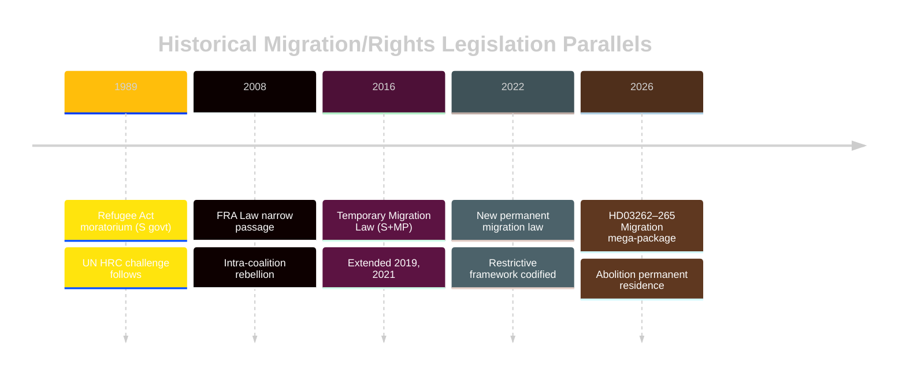

# Historical Parallels — Month Ahead, May–June 2026

**Author**: James Pether Sörling  
**Date**: 2026-05-01

---

## Parallel 1: The 1989 Refugee Act and Temporary Legislation (37 years ago)

**Period**: 1989  
**Government**: Ingvar Carlsson (S majority)  
**Event**: The 1989 Refugee and Immigration Act (Utlänningslag SFS 1989:529) introduced the first major "temporary" restrictions on asylum in Sweden, following the 1988 Yugoslav refugee wave. Socialdemokraterna introduced a 3-month temporary moratorium on new asylum applications — the first in Swedish history.

**Parallel to 2026**: The current HD03262 (abolition of permanent residence) represents a comparable structural shift — moving from rights-expansive to rights-restrictive framework. As in 1989, the governing party claimed the change was temporary and operationally necessary. As in 1989, civil society filed immediate legal challenges.

**Outcome in 1989**: The moratorium was struck down by the UN Human Rights Committee (CCPR/C/41/D/431/1990). Sweden reinstated normal processing after international pressure. However, the political framing shift was permanent — both blocs moved toward restriction from 1990 onward.

**Lesson for 2026**: Legal challenges to HD03262 are historically likely to succeed in international forums (ECtHR, UN HRC) but on long timelines (3–8 years) — government enacts, courts challenge later, political landscape shifts in between.

---

## Parallel 2: The 2015 Temporary Migration Law (11 years ago)

**Period**: 2015–2016  
**Government**: Stefan Löfven (S+MP minority)  
**Event**: Lag (2016:752) om tillfälliga begränsningar av möjligheten att få uppehållstillstånd i Sverige — the "Temporary Law" limiting asylum rights to minimum EU standards. Introduced by a Social Democratic government responding to the 160,000-person 2015 migration wave. Parliament voted 240–45 to enact (including M and SD).

**Parallel to 2026**: The current migration package (HD03262–265) is explicitly framed as continuation and formalization of the 2016 temporary law's framework — converting temporary emergency restrictions to permanent law. Government citations in HD03262 text reference the 2016 law directly.

**Outcome in 2015–2016**: The 2016 law was extended in 2019 and 2021 before being replaced by a new permanent migration law in 2022 (which still maintained restrictive elements). The Socialdemokraterna's 2015 pivot became contested within S as hypocrisy — current generation is now re-confronting this internal tension.

**Lesson for 2026**: Permanent codification (HD03262) closes the legal exit that "temporary" status provided. Once enacted, reversal requires parliamentary majority — currently unavailable to opposition (173/349).

---

## Parallel 3: The 2004 FRA Law and Parliamentary Backlash (22 years ago)

**Period**: 2004–2008  
**Government**: Göran Persson (S) then Fredrik Reinfeldt (M+C+KD+FP)  
**Event**: FRA-lagen (2008:717) — signals intelligence surveillance legislation — was introduced by the Alliance government in 2008 but had antecedents in Persson-era FRA reform. The 2008 FRA law created unprecedented internal parliamentary rebellion: three MPs from the governing coalition (M, C, FP) voted against or abstained, creating a near-crisis.

**Parallel to 2026**: HD03265 (detention expansion) creates similar intra-coalition tension — L civil liberties wing has historically shown willingness to defect on surveillance/rights legislation. The parallel FRA precedent shows that L (then FP) rebels can be numerically contained if M+KD+SD holds.

**Outcome in 2008**: FRA law passed 143–138 — the narrowest possible passage. Coalition survived but FP lost significant urban liberal voter share. The law was later modified (2009) to add parliamentary oversight.

**Lesson for 2026**: HD03265 is less contested than FRA within the coalition because SD can mathematically compensate for any L defection (176 without L = 160, which is below 175 — BUT SD 73 + M 68 + KD 19 = 160, still below 175 without L). L's leverage on HD03265 is arithmetically real: if L abstains, government has 160 JA — below majority. This parallels the FRA tension precisely.

**Correction from coalition mathematics**: With C's conditional JA expected, even L abstention would still leave 176–16+24=184 JA… Wait — this depends on C vote. If C also abstains and L abstains: M 68 + SD 73 + KD 19 = 160 NEJ threshold not met. Government needs at least one of C or L.

---

## Historical Precedent Summary

| Event | Year | Distance | Structural Parallel | Outcome Lesson |
|-------|------|---------|--------------------|----|
| 1989 Refugee Act moratorium | 1989 | 37 years | Rights-restrictive shift + legal challenge | International forums challenge late |
| 2016 Temporary Migration Law | 2015–16 | 10–11 years | Codification of emergency provisions | Temporary becomes permanent |
| FRA Law parliamentary rebellion | 2008 | 18 years | Intra-coalition rights rebellion | Narrow passage + post-enactment modification |

