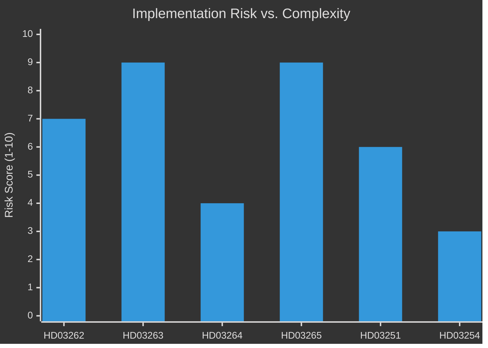

# Implementation Feasibility — Month Ahead, May–June 2026

**Author**: James Pether Sörling  
**Date**: 2026-05-01

---

## Implementation Assessment by Proposition

### HD03262 — Abolition of Permanent Residence Permits

| Dimension | Assessment |
|-----------|-----------|
| Legal framework | HIGH COMPLEXITY — requires 10+ lag and förordning amendments |
| IT systems | HIGH COMPLEXITY — Migrationsverket's Wilma/MISR case management requires update |
| Staffing | MEDIUM — new application category management, training required |
| Timeline | 12–18 months from Riksdag vote to full implementation |
| Cost estimate | MkrKr 150–250 (IT + staffing) |
| Statskontoret relevance | YES — recommend Statskontoret implementation audit pre-ikraftträdande |

**Named agencies**:
- Migrationsverket (primary implementer)
- Domstolsverket (appeals court reconfiguration)
- Polismyndigheten (enforcement coordination)

---

### HD03263 — Stärkt återvändandeverksamhet

| Dimension | Assessment |
|-----------|-----------|
| Operational capacity | CRITICAL GAP — current deportation capacity ~8,000/year; new law targets 15,000–20,000/year |
| Budget | INADEQUATE — current appropriation does not fund scale-up |
| International agreements | BLOCKING RISK — requires bilateral readmission agreements (e.g. Afghanistan, Morocco, Eritrea lack valid agreements) |
| Timeline | 18–24 months before operational capacity target achievable |
| Cost estimate | MkrKr 500–800 (infrastructure, staff, charter flights) |
| Statskontoret relevance | CRITICAL — Statskontoret capacity audit recommended immediately |

**Named agencies**:
- Migrationsverket (primary)
- Polismyndigheten (transport coordination)
- Utrikesdepartementet (readmission agreement negotiations)

---

### HD03264 — Vandel och uppehållstillstånd

| Dimension | Assessment |
|-----------|-----------|
| Legal framework | MEDIUM — criminal record integration with migration decisions |
| IT systems | MEDIUM — requires Polisens register ↔ Migrationsverket data link |
| Proportionality risk | MEDIUM — criminal record data transfer requires GDPR DPA assessment |
| Timeline | 6–12 months |
| Cost estimate | MkrKr 30–60 |
| Statskontoret relevance | MEDIUM — digital infrastructure review |

---

### HD03265 — Skärpta regler om uppsikt och förvar

| Dimension | Assessment |
|-----------|-----------|
| Detention capacity | CRITICAL GAP — current förvarslokaler (detention facilities) hold ~800 persons; new law implies 2,000–3,000 capacity needed |
| Construction/expansion | 24–36 months minimum for new facilities |
| ECHR compliance | HIGH RISK — Lagrådet concern directly impacts implementation planning |
| Legal liability | HIGH — if Lagrådet negative, each detention decision is appealable at ECtHR |
| Timeline | 24–36 months if Lagrådet concerns resolved |
| Statskontoret relevance | CRITICAL — Statskontoret detention capacity assessment needed |

**Named agencies**:
- Migrationsverket (detention management)
- Kriminalvården (facility cooperation)
- Domstolsverket (judicial review process design)

---

### HD03251 — Healthcare/Addiction Integration

| Dimension | Assessment |
|-----------|-----------|
| Regional implementation | HIGH COMPLEXITY — 21 regions must change procurement contracts |
| Coordination framework | MEDIUM — SoS/regioner/kommuner coordination group required |
| Cost estimate | MkrKr 400–600/year (net increase after duplicated cost elimination) |
| Timeline | 12–18 months for full regional rollout |
| Statskontoret relevance | YES — Statskontoret integration feasibility assessment recommended |

**Named agencies**:
- Socialstyrelsen (national coordination)
- 21 regional health authorities (primary implementers)
- Kommuner (social services coordination)

---

### HD03254 — Military Cooperation

| Dimension | Assessment |
|-----------|-----------|
| Legal framework | LOW COMPLEXITY — treaty implementation via existing defence legislation |
| Budget | WITHIN FöU appropriation baseline |
| Interoperability | MEDIUM — requires STANAG harmonization timeline |
| Timeline | 6–12 months for legal framework; 2–5 years for full operational integration |
| Cost estimate | Within Försvarsmakten budget baseline (SEK 90bn+ FY2026) |
| Statskontoret relevance | LOW for HD03254 specifically |

---

## Implementation Risk Summary

**Conclusion**: HD03263 and HD03265 have the highest implementation risk — capacity gaps and ECHR compliance are binding constraints. Statskontoret audits on these two propositions are recommended as highest priority government action.
