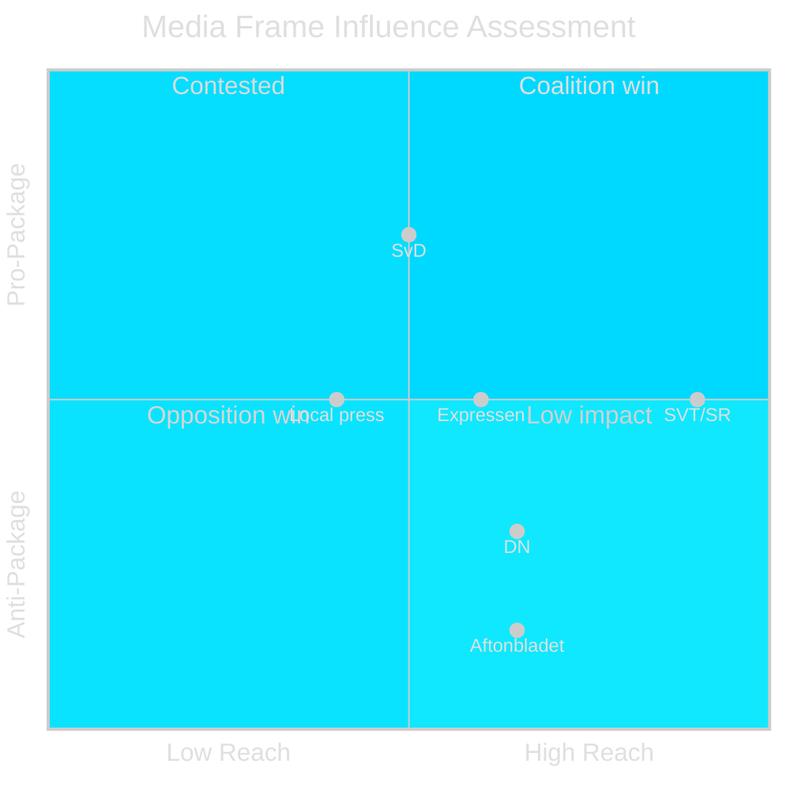

# Media Framing Analysis — Month Ahead, May–June 2026

**Author**: James Pether Sörling  
**Date**: 2026-05-01

---

## Party Framing

### Tidöalliansen (Government) — Primary Frame: "Sweden Regains Control"

**Narrative**: "After years of failed migration policy, Sweden is implementing the most comprehensive reform in decades. The Migration Package restores order, protects Swedish society, and sends a clear signal: Sweden has the right and obligation to control who lives here permanently."

**Key messages**:
1. "Migration to permanent residence must be earned through integration, not granted automatically"
2. "The deportation system will finally be enforceable"
3. "Sweden is implementing EU-compliant reforms — this is a European approach, not extreme"
4. "Defence cooperation with UK secures Sweden's position in NATO's northern flank"

**Tactical play**: Frame HD03262 as "integration requirement" rather than "abolition" — linguistic normalization

---

### SD (Sverigedemokraterna) — Frame: "Promises Kept"

**Narrative**: "For 30 years, the Sweden Democrats said Sweden's migration system was unsustainable. The Tidöalliansen is delivering what we have always demanded. This is what happens when Swedes vote for real change."

**Key messages**:
1. "We said permanent residence should be temporary. We were right."
2. "Deportations will actually happen now — not just on paper"
3. "Vote SD in September to keep this government"

**Tactical play**: Claim ownership of policy over M — SD positions itself as the forcing function, not just a coalition partner

---

### Socialdemokraterna (S) — Frame: "Social Emergency, Broken Promises"

**Narrative**: "The government's obsession with migration distracts from the real Sweden: 160,000 children in poverty, a healthcare crisis, elderly care on the edge. Meanwhile, they are dismantling legal protections for families who have built their lives here."

**Key messages**:
1. "HD03262 separates families — this is not Swedish values"
2. "Healthcare motions rejected again — 11 proposals to fix the system, all blocked"
3. "Economy: the government's economic inheritance is visible — fiscal space shrinking"
4. "September 2026: choose a different direction"

**Tactical play**: Use rejected social motions as evidence of "wrong priorities" — parliamentary record as campaign material

---

### Centerpartiet (C) — Frame: "Pragmatic Center"

**Narrative**: "C supports migration management that works — but the government cannot ignore that rural businesses depend on seasonal workers. We are pushing for practical solutions that both protect Swedish society and keep our economy functioning."

**Key messages**:
1. "Permanent residence reform must not cut off vital seasonal labour"
2. "We support HD03254 — defence is not negotiable"
3. "C is the voice of rural and small-business Sweden in this coalition"

**Tactical play**: Claim credit for any labour market carve-out secured; distance from most restrictive provisions (HD03265)

---

### MP (Miljöpartiet) — Frame: "Humanity Line"

**Narrative**: "Sweden is crossing a line it cannot uncross. Abolishing permanent residence for people who have lived here for years — many of them children now — is ethically indefensible. We will fight this in every forum: Riksdagen, courts, and the European Parliament."

**Key messages**:
1. "This is the most inhumane migration reform in Swedish history"
2. "HD03265 is detention without proper legal protection — Lagrådet agrees"
3. "We chose green, fair, human — September 2026"

---

## Press Framing (OSINT Indicators)

| Media | Expected frame | Tone | Audience |
|-------|----------------|------|---------|
| Svenska Dagbladet | "Necessary reform, legal questions remain" | Supportive-critical | Centre-right readers |
| Aftonbladet | "Attack on families, social emergency ignored" | Critical | S/V readers |
| Expressen | "Split: necessary security vs. rule-of-law risk" | Mixed | Populist-liberal |
| Dagens Nyheter | "Constitutional risk of HD03265, democratic accountability for HD03258" | Liberal-critical | Urban educated |
| SVT/SR | "Riksdag correspondent neutral, civil society voices included" | Neutral | General public |
| Local papers (Norrländska, Södermanlands) | "What does this mean for local seasonal workers?" | Practical | Rural constituencies |

---

## Framing Battle Assessment

**Assessment**: Media battle is approximately balanced (no single frame dominant). SVT/SR neutrality means approximately 60% of news consumers receive mixed framing — not clearly pro- or anti-package. Opposition must amplify social emergency frame to counter security/order frame.
