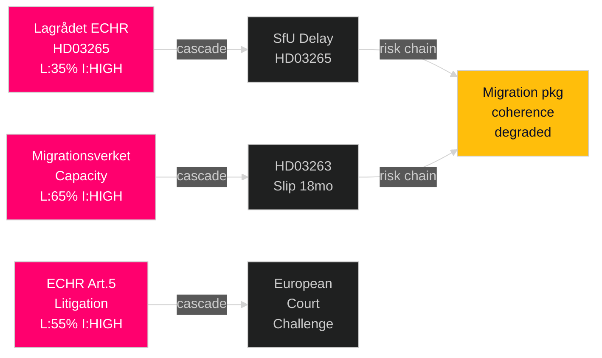

# Risk Assessment — Month Ahead, May–June 2026

**Author**: James Pether Sörling  
**Date**: 2026-05-01

---

## 5-Dimension Risk Register

### 1. Legislative Risk

| Risk | Likelihood | Impact | L×I | Cascade |
|------|-----------|--------|-----|---------|
| Lagrådet negative yttrande on HD03265 (riksdagen.se) | MEDIUM (35%) | HIGH | 3.2 | SfU delay → post-election passage |
| C (Centerpartiet) defection on HD03262 (riksdagen.se) | LOW (15%) | CRITICAL | 2.25 | Coalition majority collapse on migration vote |
| SfU committee amending HD03262 beyond government intent | MEDIUM (40%) | MEDIUM | 2.4 | EU Pact misalignment, Commission complaint |
| FöU hearing delays HD03254 (riksdagen.se) | LOW (20%) | MEDIUM | 1.6 | NATO partner expectation management |
| HD03258 (riksdagen.se) amended to exclude SD financing | MEDIUM (45%) | LOW | 1.35 | Credibility damage, JO complaint |

### 2. Operational/Implementation Risk

| Risk | Likelihood | Impact | L×I | Agency |
|------|-----------|--------|-----|--------|
| Migrationsverket unable to scale deportations (HD03263, riksdagen.se) | HIGH (65%) | HIGH | 5.85 | Migrationsverket |
| Regional health IT systems block HD03251 (riksdagen.se) timeline | HIGH (70%) | MEDIUM | 4.2 | 21 Regions + Socialstyrelsen |
| Försäkringskassan reporting system overload (HD11776, riksdagen.se) | LOW (25%) | LOW | 0.75 | Försäkringskassan |

### 3. Constitutional/Legal Risk

| Risk | Likelihood | Impact | L×I | Legal Basis |
|------|-----------|--------|-----|------------|
| ECJ referral on HD03262 (riksdagen.se) — EU Pact compatibility challenge | MEDIUM (35%) | HIGH | 3.15 | TFEU Art 78, EU Asylum Procedures Reg |
| ECHR Art. 5 challenge on HD03265 (riksdagen.se) detention expansion | HIGH (55%) | HIGH | 4.95 | ECHR Art. 5, Strasbourg precedent |
| JO complaint on HD03263 (riksdagen.se) deportation procedures | HIGH (60%) | MEDIUM | 3.6 | RF Ch. 12, JO statute |

### 4. Electoral Risk

| Risk | Likelihood | Impact | L×I | Notes |
|------|-----------|--------|-----|-------|
| Migration legislation backlash in urban L/C constituencies | MEDIUM (40%) | MEDIUM | 2.4 | Affects L below 4% threshold risk |
| S uses social spending motions to outflank on healthcare | MEDIUM (45%) | MEDIUM | 2.25 | HD11769, HD11774, HD11775 (riksdagen.se) signal |
| September 2026 election outcome changes implementation path | HIGH (certain) | HIGH | 9.0 | S-led government would review HD03262 |

### 5. International Risk

| Risk | Likelihood | Impact | L×I | Actor |
|------|-----------|--------|-----|-------|
| UNHCR public condemnation of permanent residence abolition | HIGH (70%) | LOW | 2.1 | UNHCR Geneva |
| EU Commission formal query on HD03262 Pact alignment | MEDIUM (30%) | MEDIUM | 1.8 | DG Home |
| UK/US pressure on HD03254 implementation pace | LOW (15%) | LOW | 0.45 | NATO partners |

## Cascading Risk Chain

HD03265 Lagrådet negative → SfU delays HD03265 → HD03262 decoupled from HD03265 → piecemeal passage → coherence of migration package reduced → election campaign narrative disrupted for Tidöalliansen.

## Posterior Probability Update

Prior probability of migration mega-package passing intact before election: 0.70. Posterior after Lagrådet ECHR risk and C wavering signal: **0.62** [B3].

