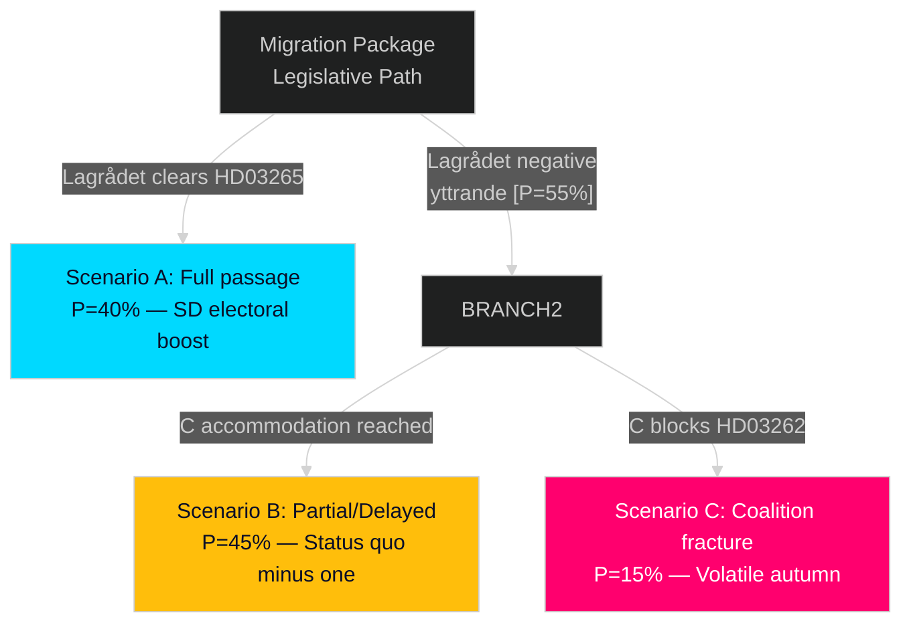

# Scenario Analysis — Month Ahead, May–June 2026

**Author**: James Pether Sörling  
**Date**: 2026-05-01

---

## Three Primary Scenarios

### Scenario A: "Tidal Wave" — Full Migration Package Enacted (P=40%)

**Conditions**: Lagrådet accepts HD03265 with minor modifications; C accepts HD03262 with labour migration carve-out; all four propositions pass SfU first reading by end June 2026.

**Trigger events**:
- SfU deliberation completes without major amendments (May 2026)
- C secures labour migration symbolic exemption language
- No ECJ referral before vote

**Consequences**:
- Sweden becomes first Nordic state to formally abolish permanent residence permits
- UNHCR opens formal country dialogue
- Migrationsverket receives emergency appropriation MkrKr 500–800
- SD pre-election boost (confirmed delivery)
- Opposition crystallizes around social equity vs. security frame for September 2026

**Electoral impact**: Tidöalliansen up 2–3 seats in polling, S stable, MP and V lose visibility

---

### Scenario B: "Delayed Passage" — HD03265 Held Back (P=45%)

**Conditions**: Lagrådet issues negative yttrande on HD03265; government must revise detention provisions; HD03262, HD03263, HD03264 proceed; HD03265 remitted for autumn.

**Trigger events**:
- Lagrådet yttrande issued mid-May 2026
- Government revises HD03265 (takes 6–8 weeks)
- Three propositions pass SfU by June; one delayed to autumn/next Riksmöte

**Consequences**:
- Partial migration package delivery — politically significant but incomplete
- SD signals mild dissatisfaction but maintains coalition support
- Civil society litigation threat reduced but not eliminated
- EU Commission notes partial alignment with Pact

**Electoral impact**: Neutral-to-slightly-positive for Tidöalliansen; S uses HD03265 delay as "court found it illegal" narrative

---

### Scenario C: "Coalition Fracture" — C Blocks HD03262 (P=15%)

**Conditions**: Centerpartiet receives intense rural constituency pressure on labour migration; C demands formal exemption mechanism for seasonal work permits; government refuses; C abstains or votes no on HD03262.

**Trigger events**:
- LRF (Lantbrukarnas Riksförbund) formal statement of opposition (April/May)
- C parliamentary group meeting produces public statement
- Government unwilling to create two-tier migrant categories

**Consequences**:
- HD03262 fails in Riksdagen (requires 175 votes; loss of C = 22 seats, insufficient with SD 73)
- Government faces confidence pressure from SD
- Migration agenda partially collapses pre-election
- C benefits from "protected rural economy" message
- SD sees this as betrayal — intensified pressure across all fronts

**Electoral impact**: Highly volatile — C up 0.5–1%, SD unchanged or up, Tidöalliansen weakened overall

---

## Probability Summary

| Scenario | Probability | Key Differentiator |
|----------|------------|---------------------|
| A: Full passage | 40% | Lagrådet acceptance + C accommodation |
| B: Delayed HD03265 | 45% | Lagrådet negative yttrande (most likely) |
| C: Coalition fracture | 15% | C formal opposition to HD03262 |
| **Total** | **100%** | |

## Scenario Decision Tree

