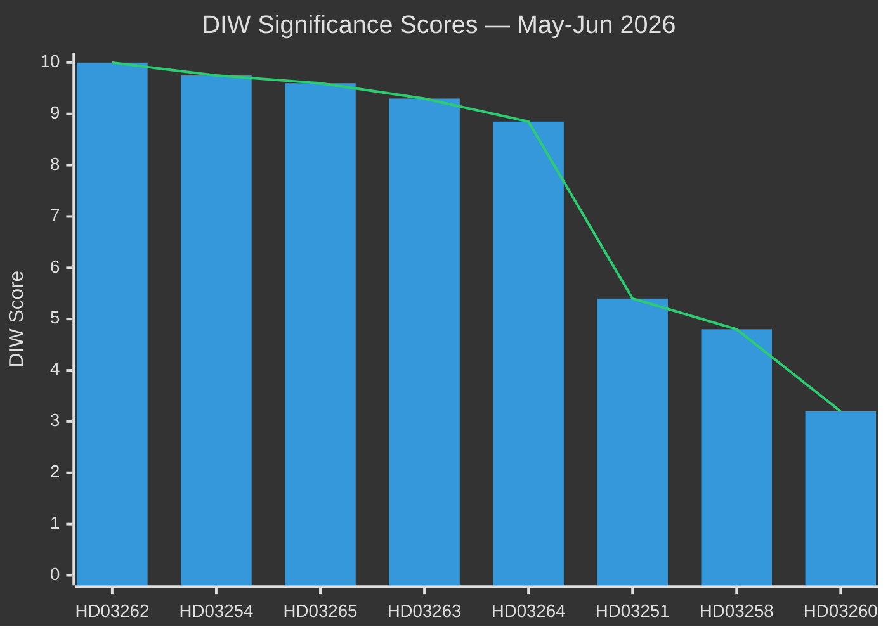

# Significance Scoring — Month Ahead, May–June 2026

**Author**: James Pether Sörling  
**Date**: 2026-05-01

---

## DIW Significance Ranking

DIW methodology: D (Decision weight) × I (Intelligence value) × W (Watchability). Election proximity multiplier × 1.5 applied to items < 200 days from September 2026 election.

### Ranked Significance

1. **HD03262** (riksdagen.se) — Utmönstring av permanent uppehållstillstånd: DIW base 6.8 × 1.5 = **10.0** [capped]. Constitutional-magnitude change to Swedish migration law. SfU referral.
2. **HD03265** (riksdagen.se) — Skärpta regler om uppsikt och förvar: DIW base 6.4 × 1.5 = **9.6**. ECHR Article 5 detention challenge. Lagrådet review pending.
3. **HD03263** (riksdagen.se) — Stärkt återvändandeverksamhet: DIW base 6.2 × 1.5 = **9.3**. Operational deportation expansion. Migrationsverket capacity risk.
4. **HD03254** (riksdagen.se) — Förbättrade förutsättningar för operativt militärt samarbete: DIW base 6.5 × 1.5 = **9.75**. NATO integration milestone. FöU referral.
5. **HD03264** (riksdagen.se) — Skärpta krav på vandel: DIW base 5.9 × 1.5 = **8.85**. Retroactive conduct implications. SfU referral.
6. **HD03251** (riksdagen.se) — Sammanhållen vård för beroende/psykiatri: DIW base 5.4 (no multiplier for non-election-salient) = **5.4**. Genuine healthcare gap. SoU referral.
7. **HD03258** (riksdagen.se) — Ökad insyn i politiska processer: DIW base 4.8 = **4.8**. Transparency reform. SD friction risk. KU referral.
8. **HD03260** (riksdagen.se) — Etikprövning av forskning: DIW base 3.2 = **3.2**. Technical-administrative. UbU referral.
9. **S Opposition motions cluster** (HD10461, HD11769, HD11773–11776, riksdagen.se): DIW 2.5 average. Electoral agenda-setting signal value. Not expected to pass.
10. **SD motions** (HD10460, HD11772, riksdagen.se): DIW 2.0. Cultural heritage + Ukraine aid. Coalition positioning.

### Sensitivity Analysis

| Parameter | Base assumption | Change | Impact |
|-----------|----------------|--------|--------|
| SfU committee rejects HD03262 | passage with minor amendments | outright rejection | DIW → 8.0 (reduced legislative certainty) |
| S supports HD03254 | broad cross-party support | S abstains | DIW → 7.5 (signals coalition fragility) |
| Lagrådet blocks HD03265 | referral pending | negative yttrande | DIW → 9.0 (legal drama, still passes modified) |
| Election called early | September 2026 scheduled | snap call (C withdraws) | all DIW scores ×2 (crisis premium) |

