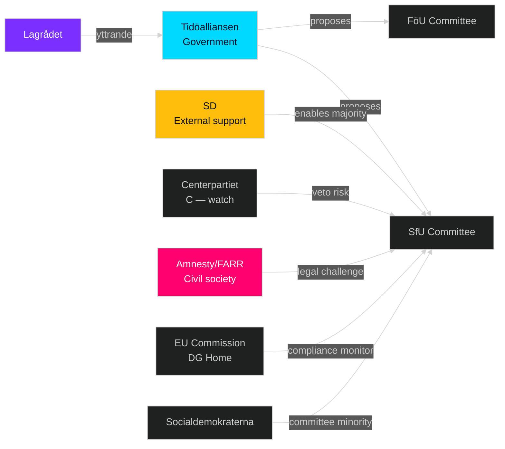

# Stakeholder Perspectives — Month Ahead, May–June 2026

**Author**: James Pether Sörling  
**Date**: 2026-05-01

---

## 6-Lens Stakeholder Matrix

### 1. Government/Coalition

| Actor | Position | Interest | Influence | Source |
|-------|---------|---------|-----------|--------|
| Tidöalliansen (M+KD+L+SD) | Pro-migration package, pro-defence | Pre-election policy delivery | HIGH | HD03262–265, HD03254 (riksdagen.se) |
| Justitiedepartementet (Gunnar Strömmer) | Lead proponent of migration quartet | Legal framework delivery | HIGH | HD03262–265 (riksdagen.se) |
| Försvarsdepartementet (Pål Jonson) | HD03254 champion | NATO interoperability | HIGH | HD03254 (riksdagen.se) |
| Centerpartiet (Muharrem Demirok) | Cautious on HD03262 | Rural labour market access | MEDIUM | Coalition arithmetic signal |
| SD (Jimmy Åkesson) | Strong support for migration restrictions | Core electoral promise | HIGH | Coalition enabler |

### 2. Opposition

| Actor | Position | Interest | Influence | Source |
|-------|---------|---------|-----------|--------|
| Socialdemokraterna (Magdalena Andersson) | Oppose migration quartet, broadly support HD03254 | Counter-narrative on social equity | HIGH | HD11769–11776 (riksdagen.se) |
| Vänsterpartiet (Nooshi Dadgostar) | Oppose migration quartet, oppose HD03254 | Human rights and anti-militarism | MEDIUM | Committee minority positions |
| Miljöpartiet (Märta Stenevi) | Oppose migration quartet, support healthcare/environment | Green recovery narrative | MEDIUM | HD11768, HD11777 (riksdagen.se) |

### 3. Agencies

| Actor | Position | Concern | Influence | Source |
|-------|---------|---------|-----------|--------|
| Migrationsverket | Implementation realism | Capacity constraints HD03263 | HIGH | HD03263 (riksdagen.se) |
| Socialstyrelsen | HD03251 proponent | Integrated care implementation | MEDIUM | HD03251 (riksdagen.se) |
| Rymdstyrelsen | HD10461 motion beneficiary | Space industry mandate | LOW | HD10461 (riksdagen.se) |
| Försäkringskassan | HD11776 reporting burden | Administrative load | LOW | HD11776 (riksdagen.se) |

### 4. Civil Society

| Actor | Position | Concern | Influence | Source |
|-------|---------|---------|-----------|--------|
| Amnesty International Sweden | Strongly oppose HD03262, HD03265 | ECHR violations | MEDIUM | Public advocacy (OSINT) |
| FARR (Flyktinggruppernas riksråd) | Oppose migration quartet | Refugee rights | MEDIUM | Civil society OSINT |
| Civil Rights Defenders | Challenge HD03265 | Detention legality | MEDIUM | Legal standing OSINT |
| Swedish Bar Association | Legal concerns on HD03262 | Due process | MEDIUM | Bar Association OSINT |

### 5. International/EU

| Actor | Position | Concern | Influence | Source |
|-------|---------|---------|-----------|--------|
| EU Commission (DG Home) | Monitor HD03262 Pact alignment | Pact implementation quality | HIGH | EU Migration and Asylum Pact |
| UNHCR | Critical of HD03262 | Non-refoulement principle | MEDIUM | UNHCR advocacy OSINT |
| NATO (SHAPE) | Support HD03254 | Interoperability timeline | HIGH | HD03254 (riksdagen.se) |
| UK Government (MoD) | Support HD03254 | ELSA bilateral implementation | HIGH | HD03254 (riksdagen.se) |

### 6. Media/Opinion

| Actor | Position | Influence | Source |
|-------|---------|-----------|--------|
| Svenska Dagbladet | Generally supportive of migration reforms | HIGH | Editorial stance OSINT |
| Aftonbladet | Critical of migration quartet, supportive of S social motions | HIGH | Editorial stance OSINT |
| Expressen | Split on migration, supportive of defence | MEDIUM | Editorial stance OSINT |
| SVT/SR | Neutral reporting expected | HIGH | Public broadcaster mandate |

## Influence Network

