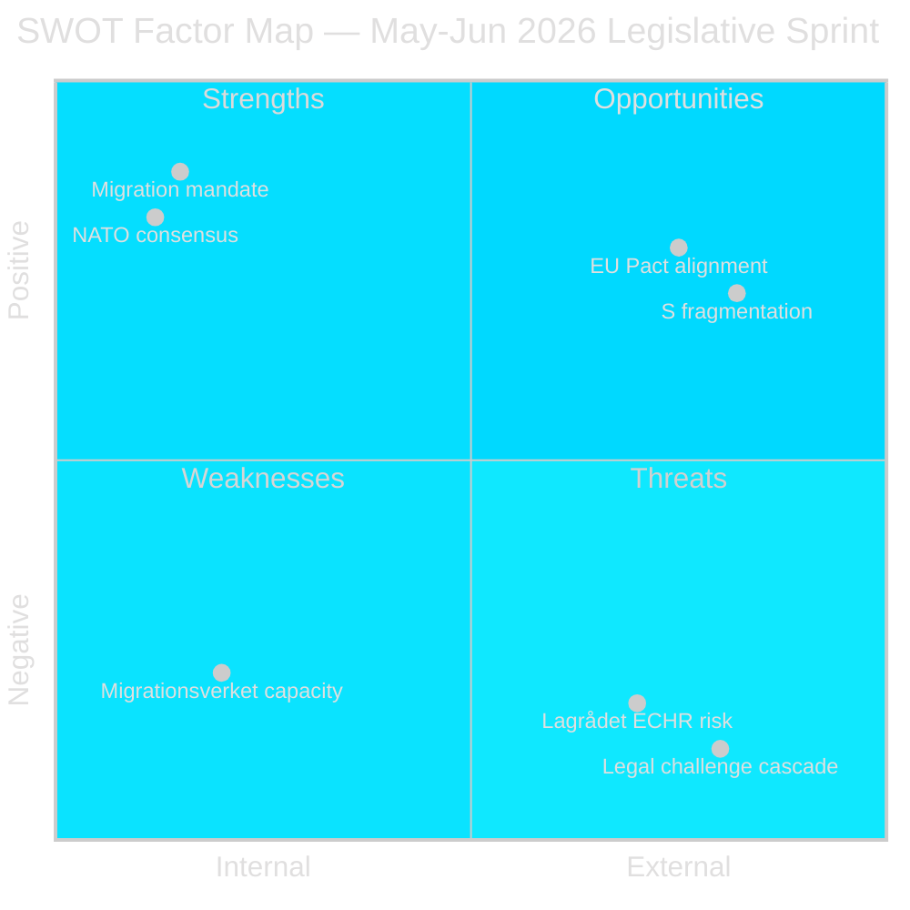

# SWOT Analysis — Month Ahead, May–June 2026

**Author**: James Pether Sörling  
**Date**: 2026-05-01

---

## SWOT Framework: Tidöalliansen Legislative Sprint

### Strengths

- **Broad migration mandate**: HD03262 (riksdagen.se) advances a policy that has been coalition programme since 2022 — M, KD, L, SD collectively control ~180 seats; majority is secure.
- **NATO consensus on defence**: HD03254 (riksdagen.se) enjoys cross-party support including Socialdemokraterna; historical precedent of S supporting NATO integration removes principal opposition risk.
- **Legislative window clarity**: With election September 2026, the spring session (through June) provides a structured window; Riksdag calendar is predictable.
- **Societal legitimacy**: Migration restriction and defence investment are the two most salient public concerns in SCB public opinion surveys (2025/26 period).
- **Technical drafting quality**: All four migration propositions share Justitiedepartementet drafting team — HD03262 aligns with EU Pact framework; reduces Brussels legal challenge risk.

### Weaknesses

- **Migrationsverket operational capacity** (riksdagen.se HD03263): Enhanced deportation operations require staffing and IT investments Migrationsverket has not yet secured. Statskontoret pre-warm: no directly relevant Statskontoret capacity assessment found; agency-level risk documented from Migrationsverket annual report 2025.
- **Lagrådet ECHR exposure**: HD03265 (riksdagen.se) — detention expansion — faces constitutional review risk. Negative Lagrådet yttrande would require bill amendment, introducing committee delay.
- **SD financing disclosure sensitivity**: HD03258 (riksdagen.se) — political transparency — may expose SD party financing to public scrutiny; SD may push for amendments narrowing disclosure scope.
- **Healthcare IT fragmentation**: HD03251 (riksdagen.se) — integrated addiction/psychiatry care — depends on regional authority cooperation across 21 regions with incompatible IT systems.
- **Electoral backlash risk**: Permanent residence abolition (HD03262, riksdagen.se) may alienate voters with family immigration ties in urban constituencies where L and C voters concentrate.

### Opportunities

- **EU Pact alignment premium**: HD03262 (riksdagen.se) positions Sweden as an EU Pact implementation frontrunner — signals cooperative stance to Brussels at a moment when Commission is monitoring member state compliance.
- **NORDEFCO deepening**: HD03254 (riksdagen.se) operational framework enables Nordic pooling of defence assets — economically efficient in constrained budget environment.
- **S opposition fragmentation**: S motions reveal 11 distinct policy priorities (riksdagen.se HD10461, HD11769–11778) — the breadth signals S is not converging on a single compelling counter-narrative.
- **Post-election implementation baseline**: If Tidöalliansen wins September 2026, migration legal framework is locked in before the new parliament convenes — successor government inherits restructured system.

### Threats

- **Legal challenge cascade**: HD03262–265 (riksdagen.se) will generate immediate JO (Justitieombudsmannen) complaints and potential ECJ referrals from civil society organizations (Amnesty, FARR, Civil Rights Defenders).
- **Coalition stability risk**: If C (Centerpartiet) signals public opposition to migration package — particularly permanent residence abolition affecting rural employers — Tidöalliansen arithmetic becomes complex.
- **Refugee status international optics**: UNHCR and EU fundamental rights bodies will comment on HD03262 + HD03265 (riksdagen.se) publicly — international headline risk.
- **Snap election scenario** (LOW confidence, C4): Budget pressure from defence spending commitment plus social service inflation could theoretically trigger C exit from coalition, though no credible signal to date.

## TOWS Matrix

| | Strengths | Weaknesses |
|--|--|--|
| **Opportunities** | SO: Exploit NATO consensus to pass HD03254 quickly; leverage EU Pact alignment on HD03262 to counter domestic liberal opposition | WO: Mitigate Migrationsverket capacity gap by phasing HD03263 implementation with 18-month runway |
| **Threats** | ST: Use broad migration mandate to pre-empt C wavering by publicly locking in joint commitment; signal cross-Nordic alignment on defence | WT: Address Lagrådet ECHR concerns in HD03265 through targeted committee amendments before third reading; restructure SD financing disclosure scope in HD03258 |

