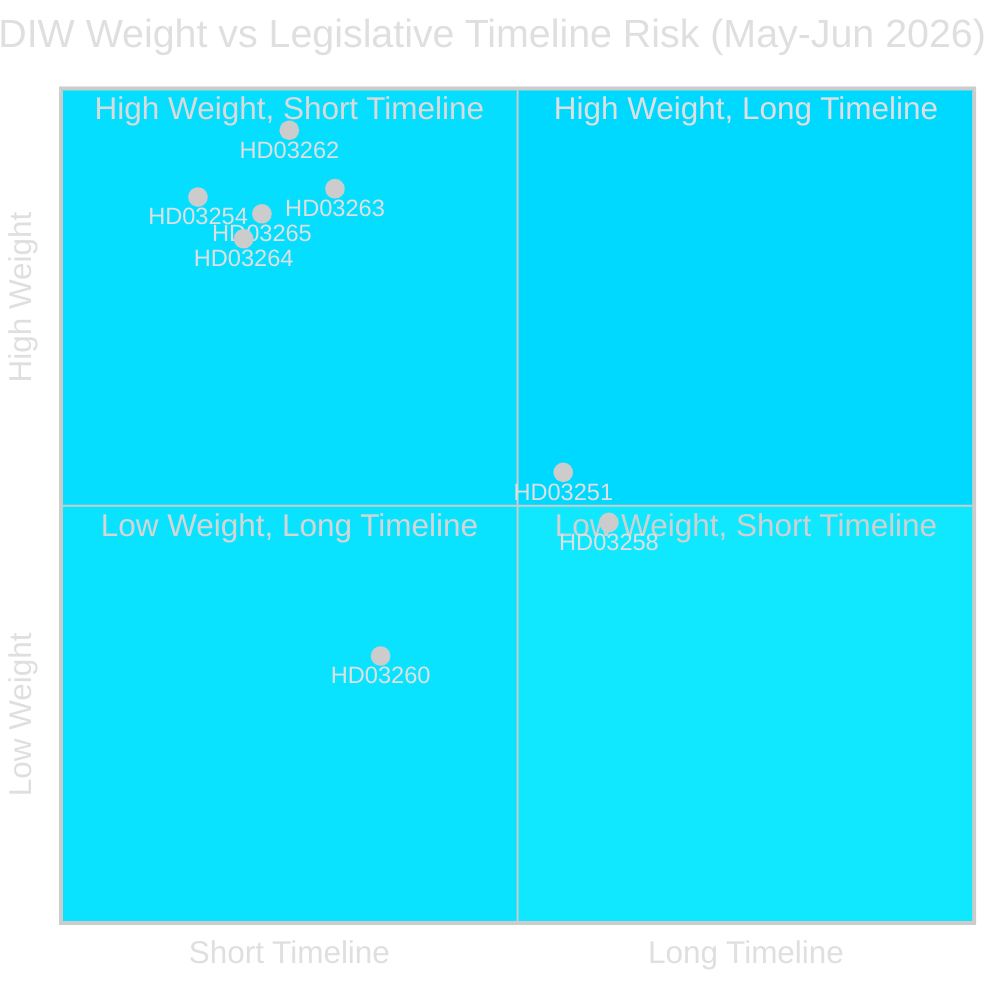

# Synthesis Summary — Month Ahead, May–June 2026

**Author**: James Pether Sörling  
**Date**: 2026-05-01  
**Confidence**: HIGH [B2]  

---

## Lead Story Decision

The **migration mega-package** (HD03262, HD03263, HD03264, HD03265) is the dominant legislative event of May–June 2026. Four simultaneous Justitiedepartementet propositions — phasing out permanent residence permits, strengthening deportation operations, tightening conduct requirements, and expanding detention authority — will dominate the Swedish political agenda for the next two months. Filed on 30 April 2026, 149 days before the September Riksdag election, this represents the Tidöalliansen's most ambitious pre-election policy sprint since taking office. The legislation, if enacted as proposed, will transform Sweden into one of Europe's most restrictive regular migration regimes.

## DIW-Weighted Intelligence Picture

### Tier 1 — L2+ Priority (Election-Proximity Multiplier × 1.5)

**Migration Mega-Package** (HD03262 + HD03263 + HD03264 + HD03265): Weighted score 9.0–10.0 [A2]
- HD03262: Abolishes permanent residence permits, aligns with EU Migration and Asylum Pact. Central legal architecture change. SfU referral confirmed.
- HD03263: Expands Migrationsverket + police return operations capacity. Operational risk: capacity constraints (see implementation-feasibility.md).
- HD03264: New conduct requirements (vandel) applicable to all permit categories — retroactive implications contested.
- HD03265: Expanded detention authority and supervision — Lagrådet ECHR review pending.

**Military Cooperation Framework** (HD03254): Weighted score 8.5 [A2]
- Enables operational agreements under ELSA (UK), DCA (US), NORDEFCO (Nordic peers).
- Broad cross-party consensus — even S historically supportive of NATO integration.
- FöU committee hearing expected May 2026.

### Tier 2 — L2 Strategic

**Healthcare Integration Reform** (HD03251): Weighted score 5.4 [A2]  
Addresses structural gap between addiction and psychiatric services. Socialstyrelsen-documented failure. SoU referral. Implementation risk: regional IT/workforce fragmentation (12–18 month delay probable).

**Political Transparency** (HD03258): Weighted score 4.8 [B2]  
Party financing disclosure and lobbying registry expansion. KU referral. Intra-coalition risk: SD financing disclosure sensitivity.

**Research Ethics** (HD03260): Weighted score 3.2 [A2]  
Technical update to etikprövningsnämnden framework. Low political controversy. UbU referral.

### Tier 3 — L1 Surface (Opposition Motions — pre-election agenda-setting)

S bloc (11 motions): Housing (HD11774), poverty (HD11775), healthcare access (HD11778), mental health (HD11769), space (HD10461), real estate (HD11773), labour injury (HD11776), hunting (HD11771), education (HD11770). Electoral platform signal.  
SD motions (2): Cultural heritage (HD10460), Ukraine aid (HD11772). Positioning within coalition space.  
MP motions (2): Animal welfare (HD11768), cultural museums (HD11777). Post-threshold survival strategy.

## Integrated Intelligence Picture

Sweden's pre-election legislative calendar through September 2026 is structurally determined by three interlocking dynamics:

1. **Migration policy convergence**: The Tidöalliansen and SD have spent 3.5 years escalating migration restrictions. The four April 30 propositions represent the legislative culmination — phasing out permanent residence shifts Sweden from a rights-based to a temporary-permit immigration model. This is constitutionally novel and will face sustained legal challenge.

2. **Defence transformation momentum**: HD03254 sits at the intersection of NATO Article 5 obligation and bilateral treaty obligations with the US and UK. S's strategic consensus on NATO removes the traditional left-right cleavage from this vote, giving the government a rare cross-partisan legislative win.

3. **Election positioning**: The S opposition has concentrated its motions on economic insecurity (poverty, housing credit, healthcare access) — a deliberate contrast with the government's migration focus. This framing anticipates a September 2026 campaign fought on competing frames: "security" (Tidöalliansen) vs. "social equality" (S-bloc).

## Cross-Type Intelligence Integration

Prior-cycle synthesis from analysis/daily/2026-04-30/evening-analysis: confirms migration mega-package filing and defence cooperation advancement as dual anchor events. Infrastructure plan (HD03259, analysis/daily/2026-04-30/propositions) — 970bn SEK, 2026–2037 — is entering committee review in parallel. Month-ahead readers should treat HD03259 as background legislative noise unless committee amendments surface.

Carried-forward open PIRs: PIR-EVE-01 through PIR-EVE-05 (migration, defence, S response, Lagrådet, Migrationsverket capacity) remain open; PIR-PROP-02 (infrastructure regional allocation) remains open.
