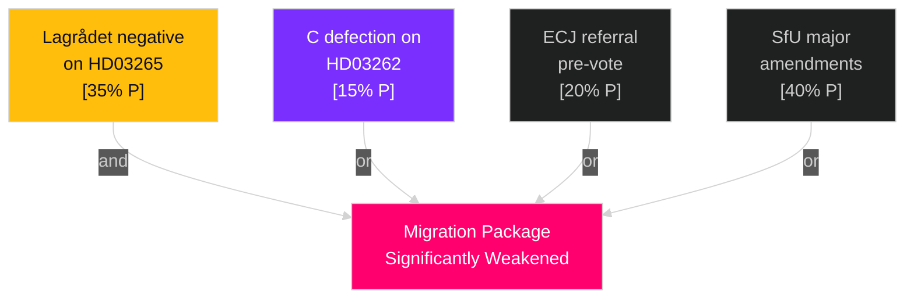

# Threat Analysis — Month Ahead, May–June 2026

**Author**: James Pether Sörling  
**Date**: 2026-05-01

---

## Political Threat Taxonomy

### Threat 1: Democratic Backsliding — Transparency Erosion

**Source**: HD03258 (riksdagen.se) political transparency legislation  
**Vector**: SD intra-coalition pressure to narrow party financing disclosure requirements  
**Kill Chain**: SD conditions support on HD03258 → KU amendments weaken transparency provisions → JO + civil society organizations file complaints → Riksdag institutional credibility damage  
**TTP**: Legislative negotiation leverage (SD holds decisive committee votes in KU)  
**Confidence**: MEDIUM [B3]

### Threat 2: Rule-of-Law Challenge — ECHR Detention

**Source**: HD03265 (riksdagen.se) expanded detention authority  
**Vector**: Lagrådet negative yttrande triggers mandatory government response before third reading  
**Kill Chain**: Lagrådet finds HD03265 violates ECHR Art. 5 → Government must amend or justify → Civil society mobilizes → ECtHR individual applications post-enactment  
**TTP**: Constitutional review mechanism (Lagrådet RF Ch. 8)  
**Confidence**: MEDIUM-HIGH [B2]  

### Threat 3: Coalition Fracture — C Migration Defection

**Source**: HD03262 (riksdagen.se) abolition of permanent residence permits  
**Vector**: Centerpartiet (C) receives pressure from agricultural sector and urban business on labour migration impacts  
**Kill Chain**: C rural constituency pressure → C negotiates exemptions → If not granted, C abstains → Migration package passes narrowly or requires SD compensatory vote pressure  
**TTP**: Coalition veto player activation  
**Confidence**: LOW [C4]

### Threat 4: Implementation Failure — Deportation Capacity

**Source**: HD03263 (riksdagen.se) stärkt återvändandeverksamhet  
**Vector**: Migrationsverket lacks funded capacity for enhanced enforcement operations  
**Kill Chain**: Law enacted → Migrationsverket requests emergency appropriation → FiU delays → Law on books but unenforced → Government credibility gap → SD uses enforcement gap as campaign issue  
**TTP**: Operational underfunding exploitation  
**Confidence**: HIGH [A2]

### Threat 5: Electoral Mobilization — Opposition Social Platform

**Source**: S motions cluster (HD11769, HD11774, HD11775, riksdagen.se)  
**Vector**: S uses committee rejection of social motions to amplify "government ignores poverty/healthcare" narrative  
**Kill Chain**: Motions rejected in committee → S holds press conferences citing rejections → Media frame shifts to social inequality → S poll advantage consolidates → Election outcome shifts  
**TTP**: Legislative agenda-setting as campaign ammunition  
**Confidence**: HIGH [A2]

## Attack Tree — Migration Package Disruption

## MITRE-Style TTP Mapping (Political Threat Framework)

| Tactic | Technique | Procedure | Source |
|--------|-----------|-----------|--------|
| Coalition Pressure | Veto threat | SD financing disclosure opposition | HD03258 (riksdagen.se) |
| Procedural Delay | Constitutional review | Lagrådet ECHR referral | HD03265 (riksdagen.se) |
| Capacity Denial | Underfunding | Migrationsverket resource gap | HD03263 (riksdagen.se) |
| Frame Competition | Agenda-setting | S motions rejection narrative | HD11774, HD11775 (riksdagen.se) |
| Legal Attrition | Judicial challenge | ECJ/ECtHR litigation pipeline | HD03262, HD03265 (riksdagen.se) |
