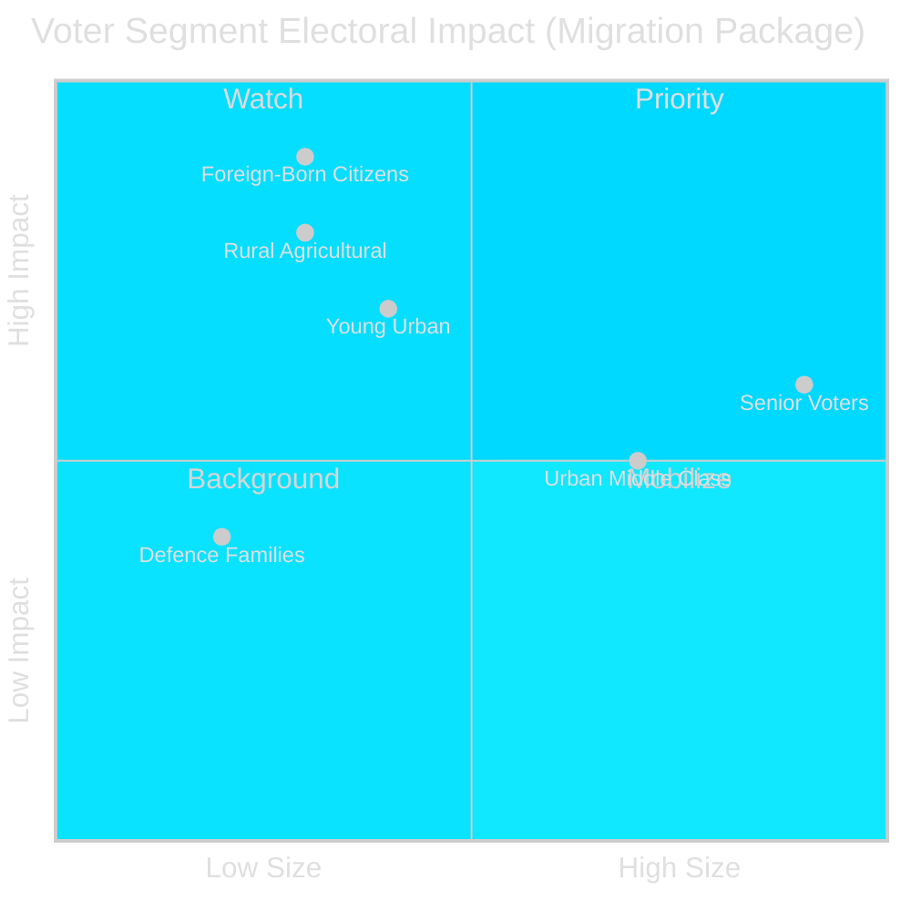

# Voter Segmentation — Month Ahead, May–June 2026

**Author**: James Pether Sörling  
**Date**: 2026-05-01

---

## Demographic Segment Impact Analysis

### Segment 1: Rural Sweden / Agricultural Communities

**Size**: ~800,000 voters, disproportionately in Norrland, Dalarna, Västra Götaland rural  
**Current alignment**: C 38%, M 22%, SD 20%, S 12%  
**Impact from HD03262 (abolition of permanent residence)**:
- HIGH NEGATIVE: Seasonal agricultural workers (bär/skördearbetare) disproportionately affected
- LRF (Lantbrukarnas Riksförbund) has signalled concern about labour supply disruption
- C's rural base = pressure on C leadership to demand carve-out

**Policy implications**: HD03262 without labour migration exemption = C rural voter attrition risk of -0.5% to -1.0%

---

### Segment 2: Urban Middle Class (Age 30–55)

**Size**: ~1,500,000 voters  
**Current alignment**: S 28%, M 26%, L 18%, C 14%  
**Impact from HD03265 (expanded detention)**:
- MEDIUM NEGATIVE for L voters — civil liberties concern
- MEDIUM POSITIVE for M voters — law-and-order frame
- L faces internal tension: civil liberties wing vs. governing-coalition loyalty

**Policy implications**: L may lose 0.3–0.5% of urban liberal voters to MP or blank votes if HD03265 passes unmodified.

---

### Segment 3: Senior Voters (65+)

**Size**: ~1,800,000 voters  
**Current alignment**: S 35%, M 24%, KD 15%, SD 14%  
**Impact from HD03251 (healthcare/addiction)**:
- HIGH RELEVANCE: Integrated addiction/psychiatric care resonates with seniors (often primary carers for affected family members)
- KD's traditional elder care messaging aligns; S opposition claims reforms insufficient
- **Healthcare quality narrative** = most salient issue for this segment

**Policy implications**: HD03251 is a mobilization opportunity for both KD (government credit) and S (insufficient reform criticism).

---

### Segment 4: Young Urban Voters (18–29)

**Size**: ~700,000 voters (first-time voters: ~180,000)  
**Current alignment**: S 32%, V 21%, MP 16%, SD 11%  
**Impact from migration package**:
- NEGATIVE for S/V/MP base: human rights framing resonates strongly
- POSITIVE for SD: young SD voters growing (Ungdomsbarometern 2025: SD 2nd among 18–25)
- MP benefits from positioning as "ethical opposition" on HD03262

**Policy implications**: First-time voter mobilization favors S/V/MP on rights framing; SD grows among young men specifically.

---

### Segment 5: Foreign-Born Swedish Citizens

**Size**: ~600,000 eligible voters  
**Current alignment**: S 55%, V 18%, MP 10%  
**Impact from migration package**:
- VERY HIGH NEGATIVE: HD03262 directly affects their family members' residence security
- ECHR right to family life (Art. 8) concerns are existential for this segment
- S benefits from being seen as defender; opposition to package = loyalty signal

**Policy implications**: Turnout motivation for S/V/MP voter bank; counter-mobilization risk for Tidöalliansen if HD03262 family reunification impacts become visible.

---

### Segment 6: Defence Industry / Military Families

**Size**: ~250,000 voters  
**Current alignment**: M 34%, KD 20%, SD 15%, S 18%  
**Impact from HD03254 (military cooperation)**:
- HIGH POSITIVE: Employment security + NATO integration = strong support
- Cross-party — S's defence policy shift means S military families no longer feel abandoned
- HD03254 bilateral track = economic opportunity for Saab, FOI affiliates

**Policy implications**: Positive electoral signal for all parties; low polarization value.

---

## Segmentation Summary Visualization

