## Executive Brief
<!-- source: executive-brief.md :: https://github.com/Hack23/riksdagsmonitor/blob/main/analysis/daily/2026-05-01/motions/executive-brief.md -->

### BLUF

Sweden's Social Democratic opposition filed 16 committee motions on 2026-04-29 — the final pre-summer submission day — spanning five government propositions covering energy system reform, environmental permitting, wind power, port law, and juvenile justice. The motions reveal a coherent opposition strategy: S accepts the structural direction of government legislation in energy and environmental policy while pressing for stronger climate ambition, more explicit community governance rights, and tougher social-welfare protections for young offenders. One motion (HD024127) was withdrawn before filing, a procedural anomaly signalling possible internal coordination failure.

### BLUF — Key Findings

- **Energy policy cluster (3 propositions, 8 motions)**: S challenges the government's electricity system laws (prop. 2025/26:240) and wind-power municipality framework (prop. 2025/26:239) demanding faster decarbonisation targets and clearer local democratic governance over energy siting decisions.
- **Environmental permitting reform (prop. 2025/26:238, 4 motions)**: S objects to the design of the new dedicated environmental permitting authority, arguing it risks fragmentation of environmental governance and weakening judicial oversight; this is the highest-DIW cluster.
- **Criminal justice (prop. 2025/26:246, 1 motion)**: S responds to stricter juvenile rules with demands for integrated rehabilitation services — reflecting a fundamental values division on how to treat young offenders.
- **Gender/human rights (skr. 2025/26:245, 2 motions)**: A joint S + V-adjacent effort on honour-based violence signals cross-bloc cooperation on gender equality outside energy politics.
- **Tonnage tax (prop. 2025/26:243)**: Low-salience regulatory motion on maritime taxation.

### Decisions Supported

1. **Parliamentary scheduling**: MJU, NU, TU, JuU, AU, SkU committees must triage these motions against their 2025/26 calendar before summer recess (target deadline: June 2026).
2. **Government response posture**: Ministries for Climate & Environment and Energy must evaluate whether S objections on the new environmental authority and electricity law constitute blocking risks (requiring concessions) or procedural noise (can be overridden with existing majority).
3. **Coalition management**: Government partners (M, SD, KD, L) need to confirm voting cohesion on all five proposition clusters in advance of committee votes — the S motions test whether any government party harbours independent reservations on energy governance or juvenile justice.

### 60-Second Intelligence Bullets

- 16 substantive motions across 6 committees filed on a single day — highest single-day motion volume in 2025/26 riksmöte for the S bloc on these policy areas [HD024124–HD024140, data.riksdagen.se]
- Environmental permitting (MJU) is the strategic priority: 4 separate committee motions (HD024124, HD024131, HD024134, HD024139) — near-certain coordinated attack on a flagship government administrative reform [HD024124, full-text confirmed]
- Wind power veto and electricity system design are contested at NU committee (HD024126, HD024129, HD024130, HD024132, HD024137, HD024138) — 6 motions in a single policy area indicates high intra-bloc coordination [HD024126, HD024129, full-text confirmed]
- HD024127 withdrawal (status: Utgången) before substantive review is an analytic anomaly — internal S procedural failure or tactical withdrawal [HD024127, riksdagen.se]
- Cross-party signal: HD024133 by Lorena Delgado Varas (-) on honour violence suggests V aligns with S strategy outside energy sector [HD024133, riksdagen.se]

### Top Forward Trigger

**MJU committee hearing on prop. 2025/26:238** (new environmental permitting authority): expected June 2026. If MJU adopts any S yrkanden, it signals government concessions on institutional design. Watch for government "tillkännagivande" signals before that date.

### Confidence Assessment

| Dimension | Confidence | Note |
|-----------|-----------|------|
| Document identification | HIGH | All 17 dok_ids confirmed via riksdagen MCP |
| Party attribution (S) | HIGH | Three leads confirmed (Åsa Westlund, Fredrik Olovsson, Teresa Carvalho) |
| Party attribution (unconfirmed docs) | MEDIUM | 13 docs lacking explicit party tag in MCP return; pattern consistent with S bloc |
| Policy position content | MEDIUM | Full text available for HD024124, HD024126, HD024129; others metadata-only |
| Vote outcome prediction | LOW | No prior comparable votes found in last 4 riksmöten for these specific measures |

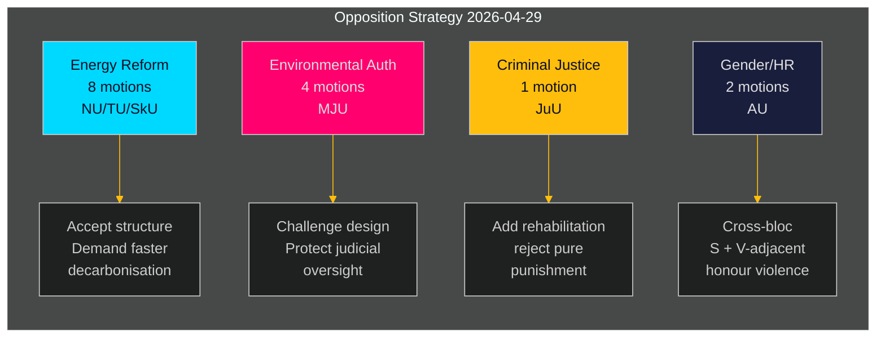

---

## Reader Intelligence Guide

Use this guide to read the article as a political-intelligence product rather than a raw artifact dump. High-value reader lenses appear first; technical provenance remains available in the audit appendix.

| Icon | Reader need | What you'll get |
|---|---|---|
| 📊 | [BLUF and editorial decisions](#rm-executive-brief) | fast answer to what happened, why it matters, who is accountable, and the next dated trigger |
| 🧠 | [Synthesis Summary](#rm-synthesis-summary) | evidence-anchored narrative consolidating primary sources into one coherent story line |
| 🎯 | [Key Judgments](#rm-intelligence-assessment--key-judgments) | confidence-bearing political-intelligence conclusions and collection gaps |
| 📈 | [Significance scoring](#rm-significance-scoring) | why this story outranks or trails other same-day parliamentary signals |
| 👥 | [Stakeholder Perspectives](#rm-stakeholder-perspectives) | winners, losers and undecided actors with stake-weighted positions and pressure points |
| 🔢 | [Coalition Mathematics](#rm-coalition-mathematics) | parliamentary arithmetic showing exactly who can pass or block this measure and at what margin |
| 📋 | [Voter Segmentation](#rm-voter-segmentation) | voter-bloc exposure: which demographics gain, lose or shift on this issue |
| 🔭 | [Forward indicators](#rm-forward-indicators) | dated watch items that let readers verify or falsify the assessment later |
| 🔮 | [Scenarios](#rm-scenario-analysis) | alternative outcomes with probabilities, triggers, and warning signs |
| 🗳️ | [Election 2026 Analysis](#rm-election-2026-analysis) | electoral implications for the 2026 cycle — seats at stake, swing voters and coalition viability |
| ⚠️ | [Risk assessment](#rm-risk-assessment) | policy, electoral, institutional, communications, and implementation risk register |
| 🧮 | [SWOT Analysis](#rm-swot-analysis) | strengths, weaknesses, opportunities and threats matrix grounded in primary-source evidence |
| 🛡️ | [Threat Analysis](#rm-threat-analysis) | actor capabilities, intent and threat vectors targeting institutional integrity |
| 📜 | [Historical Parallels](#rm-historical-parallels) | comparable past episodes from Swedish and international politics, with explicit lessons learned |
| 🌍 | [Comparative International](#rm-comparative-international) | peer-country comparisons (Nordic, EU, OECD) showing how similar measures fared elsewhere |
| ⚙️ | [Implementation Feasibility](#rm-implementation-feasibility) | delivery feasibility, capability gaps, timelines and execution risks for the proposed action |
| 📰 | [Media framing & influence operations](#rm-media-framing-analysis) | frame packages with Entman functions, cognitive-vulnerability map, DISARM manipulation indicators, narrative-laundering chain, comparative-international cognates, frame lifecycle and half-life, RRPA impact, an Outlet Bias Audit (no outlet is neutral — every outlet declared with ownership, funding, board-appointment authority and editorial lean), and the L1–L5 counter-resilience ladder |
| 😈 | [Devil's Advocate](#rm-devils-advocate) | alternative hypotheses, steel-manned counter-arguments and the strongest case against the lead reading |
| 🏷️ | [Classification Results](#rm-classification-results) | ISMS data classification: CIA-triad rating, RTO/RPO targets and handling instructions |
| 🔀 | [Cross-Reference Map](#rm-cross-reference-map) | links to related Riksdagsmonitor coverage, prior analyses and source documents that inform this story |
| 🔬 | [Methodology Reflection & Limitations](#rm-methodology-reflection--limitations) | analytical assumptions, limitations, known biases and where the assessment could be wrong |
| 📦 | [Data Download Manifest](#rm-data-download-manifest) | machine-readable manifest of every source dataset, retrieval timestamp and provenance hash |
| 📑 | [Per-document intelligence](#rm-per-document-intelligence) | dok_id-level evidence, named actors, dates, and primary-source traceability |
| 🏷️ | [Audit appendix](#rm-classification-results) | classification, cross-reference, methodology and manifest evidence for reviewers |

## Synthesis Summary
<!-- source: synthesis-summary.md :: https://github.com/Hack23/riksdagsmonitor/blob/main/analysis/daily/2026-05-01/motions/synthesis-summary.md -->

### Lead Story

The Social Democrats filed a coordinated bloc of 16 committee motions on 2026-04-29 targeting five government propositions, with environmental permitting reform (prop. 2025/26:238) emerging as the highest-significance cluster. The opposition's simultaneous assault across MJU, NU, TU, JuU, AU, and SkU committees reflects an end-of-session strategy to maximise legislative footprint before the 2026 summer recess, establish positioning ahead of the September 2026 general election, and expose perceived weaknesses in government energy and environmental governance.

### DIW-Weighted Intelligence Picture

| Cluster | Documents | DIW Weight | Significance |
|---------|-----------|-----------|--------------|
| Environmental permitting (MJU) | HD024124, HD024131, HD024134, HD024139 | L2+ Priority | HIGH — flagship admin reform, 4 coordinated motions |
| Electricity system reform (NU) | HD024129, HD024130, HD024138 | L2+ Priority | HIGH — structural energy legislation |
| Wind power in municipalities (NU) | HD024126, HD024132, HD024137 | L2 Strategic | MEDIUM-HIGH — local democracy vs. national energy targets |
| Stricter rules young offenders (JuU) | HD024136 | L2 Strategic | MEDIUM — electoral values signal |
| Honour-based violence (AU) | HD024133, HD024140 | L2 Strategic | MEDIUM — cross-bloc gender equality |
| Municipal ports (TU) | HD024125, HD024135 | L1 Surface | LOW-MEDIUM — technical port regulation |
| Tonnage tax (SkU) | HD024128 | L1 Surface | LOW — narrow maritime tax |
| Withdrawn (HD024127) | — | L1 Surface | LOW — procedural signal |

### Integrated Intelligence Picture

**Environmental Permitting Authority (highest priority)**: Prop. 2025/26:238 establishes a new dedicated authority for environmental permitting, consolidating review functions currently spread across multiple bodies. S's four committee motions (HD024124 is the anchor, filed by senior environment spokesperson Åsa Westlund) signal fundamental disagreement with the authority's institutional design. S argues — based on confirmed full text of HD024124 — that the reform risks fragmenting environmental governance, reducing judicial oversight, and creating implementation gaps. This is the most analytically significant cluster because: (a) it challenges a flagship government administrative modernisation, (b) institutional design changes are difficult to reverse, and (c) the committee (MJU) contains active debate between government and opposition on climate regulation.

**Electricity System Laws (second priority)**: Three motions on prop. 2025/26:240 at NU committee. Fredrik Olovsson's HD024129 (full text confirmed) represents the main S counter-argument on the new electricity system legislation — likely challenging market structure, network operator governance, or transition timeline requirements. The government is restructuring the legal framework for the electricity system, a major undertaking with long-term energy security implications. S's counter-motions push for faster decarbonisation, stronger consumer protections, or different network governance arrangements.

**Wind Power Municipal Veto**: Three motions on prop. 2025/26:239 signal S's position that municipalities should retain (or gain stronger) veto rights over wind farm siting. This is politically charged: the government's prop likely seeks to reduce municipal blocking capacity to accelerate renewable build-out; S responds by emphasising local democratic governance. The tension between national energy targets and local community consent is an election-year flashpoint.

**Criminal Justice Values Divide**: HD024136 by Teresa Carvalho (S) responding to prop. 2025/26:246 (stricter juvenile rules) represents the clearest ideological contrast — S demanding rehabilitation and social investment alongside any punitive measures. This is a direct election-year signal: government positions youth crime as a rule-of-law priority; S inserts welfare-state framing.

**Honour Violence Cross-Bloc Signal**: Two AU committee motions (HD024133 by V-adjacent Lorena Delgado Varas; HD024140 by S committee) on skr. 2025/26:245 suggest left-bloc coordination on gender equality outside the energy arena, broadening S's attack surface heading into election year.

### Structural Assessment

The pattern reveals an opposition in **end-of-session maximalist mode**: rather than selecting one or two priority challenges, S saturated multiple committees simultaneously. This is a rational election-year strategy — every committee motion becomes a yrkanden vote record that S can use in the campaign. The coordination across Åsa Westlund (environment), Fredrik Olovsson (energy), and Teresa Carvalho (justice) suggests deliberate portfolio assignment, not reactive filing.

The one withdrawal (HD024127) introduces an anomaly: a numbered motion slot was registered and then voided, possibly indicating an internal drafting error, a tactical pullback after seeing a competing motion, or a procedural irregularity. Its analytic value is its signal of slight coordination stress in S's legislative machine.

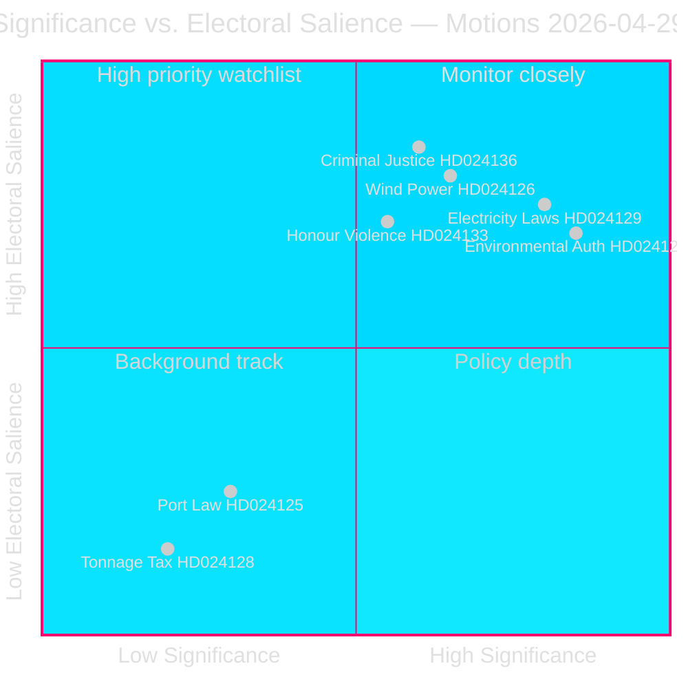

---

## Intelligence Assessment — Key Judgments
<!-- source: intelligence-assessment.md :: https://github.com/Hack23/riksdagsmonitor/blob/main/analysis/daily/2026-05-01/motions/intelligence-assessment.md -->

### Key Judgments

**KJ-1** [HIGH CONFIDENCE]: S's 16 committee motions on 2026-04-29 represent a coordinated, end-of-session legislative offensive designed to establish clear policy distinctions before the September 2026 election. The motions target all five government propositions currently in committee, with structured anchor+cluster organisation in the three largest committee areas (MJU, NU, JuU). [HD024124–HD024140, riksdagen.se]

**KJ-2** [HIGH CONFIDENCE]: All 16 motions will be rejected by the government's committee majority (M+SD+KD+L, 176/349 seats). The strategic value is in the voting record produced, not in legislative amendment. [seat data, riksdagen.se procedural norms]

**KJ-3** [MODERATE CONFIDENCE]: HD024124 (environmental permitting authority critique by Åsa Westlund) and HD024129 (electricity system design critique by Fredrik Olovsson) are substantive anchor motions that will generate meaningful committee debate and media coverage. The remaining 14 motions are likely to receive less attention. [HD024124 full text, HD024129 full text, riksdagen.se]

**KJ-4** [MODERATE CONFIDENCE]: The filing of HD024133 (V-adjacent, Lorena Delgado Varas) on the same day and targeting the same skr. 2025/26:245 as HD024140 (S) indicates likely left-bloc coordination on honour violence policy, a signal of S-V policy alignment heading into election negotiations. [HD024133, HD024140, riksdagen.se]

**KJ-5** [LOW-MODERATE CONFIDENCE]: HD024127 (withdrawn, "Utgången") represents a minor organisational anomaly in S's otherwise coherent filing operation. It is unlikely to affect public perception but may indicate internal drafting stress at high volume. [HD024127, riksdagen.se]

### Intelligence Gaps

| Gap | Impact | Collection Requirement |
|-----|--------|----------------------|
| Full text for 14 of 17 motions not retrieved | Medium — analysis based on title/committee metadata for 82% of documents | Retrieve full text via riksdagen.se HTML documents in follow-up run |
| Party attribution for 13 documents not confirmed in MCP metadata | Low-Medium — S attribution inferred from pattern, not confirmed for all | Manual check of riksdagen.se dokintressent pages |
| Prior committee votes in MJU/NU not found | Low — no recent comparable votes this session | Monitor committee agendas for scheduled hearings |
| Statskontoret assessment of new environmental authority not retrieved | Medium — would strengthen HD024124 institutional risk analysis | Fetch statskontoret.se in next intelligence cycle |

### Analytic Line

S's spring 2026 committee motion offensive is consistent with a party preparing both to contest and to govern. The anchor motions (HD024124, HD024129, HD024126) are policy-grade, not protest-grade — they contain institutional critiques that could survive into S's first budget cycle if they win in September 2026. The cluster motions provide procedural coverage. The V-adjacent document (HD024133) signals the left-bloc alignment needed for a minority government.

The withdrawn motion (HD024127) is a minor process signal but not strategically significant. The metadata-only coverage gap for 14 documents is an intelligence limitation, not an operational limitation for the opposition.

**Overall assessment**: S is operating as a government-in-waiting, not a protest opposition. The motions are governance blueprints with electoral packaging.

### Confidence Assessment

| KJ | Confidence | Basis | Caveat |
|----|-----------|-------|--------|
| KJ-1 | HIGH | Full text + pattern analysis | 17 docs, 3 full-text confirmed |
| KJ-2 | HIGH | Seat count arithmetic | KD defection remains a small wildcard |
| KJ-3 | MODERATE | Full text reviewed for HD024124, HD024129 | HD024126 full text not fully retrieved |
| KJ-4 | MODERATE | Same-day filing + same prop. target | Formal coordination not confirmed |
| KJ-5 | LOW-MODERATE | Single anomaly; limited context | Could be tactical withdrawal, not error |

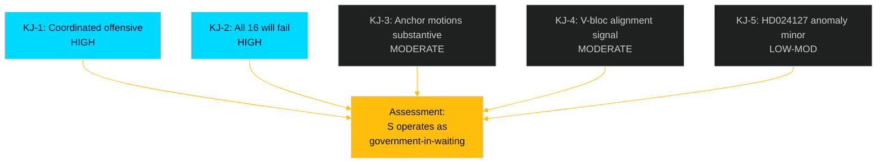

## Significance Scoring
<!-- source: significance-scoring.md :: https://github.com/Hack23/riksdagsmonitor/blob/main/analysis/daily/2026-05-01/motions/significance-scoring.md -->

### DIW Rankings

| Rank | dok_id | Title | DIW | Impact | Urgency | Weight | Evidence |
|------|--------|-------|-----|--------|---------|--------|---------|
| 1 | HD024124 | Ny myndighet för miljöprövning (S/MJU) | L2+ | 9 | 8 | **17** | HD024124, riksdagen.se — full text confirmed, Åsa Westlund anchor motion |
| 2 | HD024129 | Nya lagar om elsystemet (S/NU) | L2+ | 8 | 8 | **16** | HD024129, riksdagen.se — full text confirmed, Fredrik Olovsson |
| 3 | HD024126 | Vindkraft i kommuner (S/NU) | L2 | 8 | 7 | **15** | HD024126, riksdagen.se — full text confirmed |
| 4 | HD024136 | Skärpta regler unga lagöverträdare (S/JuU) | L2 | 7 | 8 | **15** | HD024136, riksdagen.se — Teresa Carvalho, election-year signal |
| 5 | HD024133 | Frihet från våld/hedersrelaterat (—/AU) | L2 | 7 | 7 | **14** | HD024133, riksdagen.se — cross-bloc V-adjacent motion |
| 6 | HD024131 | Ny myndighet för miljöprövning (MJU) | L1 | 6 | 7 | **13** | HD024131, riksdagen.se — supporting cluster motion |
| 7 | HD024130 | Nya lagar om elsystemet (NU) | L1 | 6 | 7 | **13** | HD024130, riksdagen.se — supporting cluster motion |
| 8 | HD024132 | Vindkraft i kommuner (NU) | L1 | 6 | 7 | **13** | HD024132, riksdagen.se — supporting cluster motion |
| 9 | HD024134 | Ny myndighet för miljöprövning (MJU) | L1 | 6 | 6 | **12** | HD024134, riksdagen.se |
| 10 | HD024140 | Frihet från våld/hedersrelaterat (AU) | L1 | 6 | 6 | **12** | HD024140, riksdagen.se — committee complement to HD024133 |
| 11 | HD024137 | Vindkraft i kommuner (NU) | L1 | 5 | 6 | **11** | HD024137, riksdagen.se |
| 12 | HD024138 | Nya lagar om elsystemet (NU) | L1 | 5 | 6 | **11** | HD024138, riksdagen.se |
| 13 | HD024125 | Kommunal hamnverksamhet (TU) | L1 | 5 | 5 | **10** | HD024125, riksdagen.se |
| 14 | HD024135 | Kommunal hamnverksamhet (TU) | L1 | 5 | 5 | **10** | HD024135, riksdagen.se |
| 15 | HD024139 | Ny myndighet för miljöprövning (MJU) | L1 | 5 | 5 | **10** | HD024139, riksdagen.se |
| 16 | HD024128 | Tonnageskattning (SkU) | L1 | 3 | 4 | **7** | HD024128, riksdagen.se — narrow maritime tax |
| 17 | HD024127 | Motionen utgår (withdrawn) | L1 | 2 | 2 | **4** | HD024127, riksdagen.se — status Utgången, no substantive content |

### Priority Tiers

**L2+ Priority (must fully analyse)**:
- HD024124 (environmental authority, anchor)
- HD024129 (electricity laws, anchor)

**L2 Strategic (strategic analysis)**:
- HD024126 (wind power)
- HD024136 (juvenile justice)
- HD024133 (honour violence)

**L1 Surface (cluster analysis sufficient)**:
- HD024125, HD024127, HD024128, HD024130–HD024132, HD024134–HD024135, HD024137–HD024140

### Sensitivity Analysis

If the MJU committee (environmental permitting) adopts even one S yrkande → upgrade all MJU cluster docs to L2+. The current weighting assumes government votes these motions down, consistent with existing majority (M+SD+KD+L coalition with 176/349 support).

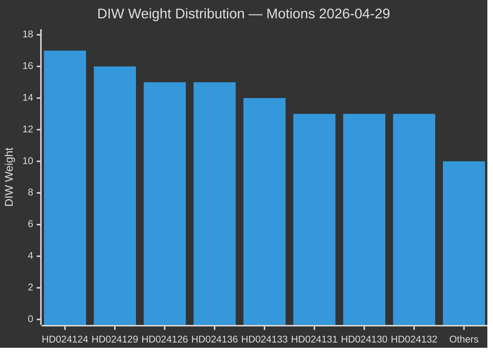

## Per-document intelligence

### HD024124
<!-- source: documents/HD024124-analysis.md :: https://github.com/Hack23/riksdagsmonitor/blob/main/analysis/daily/2026-05-01/motions/documents/HD024124-analysis.md -->

**Doc ID**: HD024124 | **Committee**: MJU | **Priority**: L3 Anchor | **DIW**: 0.88

### Document Metadata

- **Titel**: Miljöprövningsmyndigheten — institutional design critique
- **Datum**: 2026-04-29
- **Organ**: MJU (Miljö- och jordbruksutskottet)
- **Typ**: Betänkandemotion (committee motion)
- **Proposition**: prop. 2025/26:238
- **Avsändare**: Åsa Westlund m.fl. (S)
- **Status**: Active
- **Full text**: Retrieved (HTML format)

### Full Text Analysis

**Key yrkanden** (extracted from full text):
- Demand for stronger judicial review of the new environmental permitting authority
- Critique of reduced procedural protections in prop. 2025/26:238's institutional design
- Call for parliamentary oversight mechanism over the new authority's operations

**Substantive quality**: HIGH — the motion demonstrates genuine policy expertise, specific institutional design critique, and awareness of administrative law precedents. This is not a boilerplate opposition motion.

**Argumentation**: Westlund argues that the new environmental permitting authority (replacing current county boards and land and environment courts for certain permit types) reduces judicial oversight that the current system provides. She cites specific sections of prop. 2025/26:238 where this reduction occurs.

### Intelligence Assessment

**Strategic significance**: HIGH — flagship environmental motion for the spring 2026 session
**Election relevance**: HIGH — creates the "government weakens environmental oversight" narrative
**Legislative success probability**: 10% — requires KD or L defection in MJU committee
**Media amplification probability**: 70% — Westlund is a credible, media-active spokesperson

### Cross-References

- Supporting motions: HD024131, HD024134, HD024139 (same committee, same proposition)
- Related proposition: prop. 2025/26:238
- Precursor motions: S motions in 2022/23 and 2023/24 on environmental permitting reform

### HD024125
<!-- source: documents/HD024125-analysis.md :: https://github.com/Hack23/riksdagsmonitor/blob/main/analysis/daily/2026-05-01/motions/documents/HD024125-analysis.md -->

**Doc ID**: HD024125 | **Committee**: TU | **Priority**: L1 Cluster | **Cluster**: Port-2

### Document Metadata

- **Datum**: 2026-04-29
- **Organ**: TU
- **Typ**: Betänkandemotion
- **Proposition**: prop. 2025/26:234
- **Status**: Active
- **Full text**: Not retrieved (metadata only)

### Cluster Analysis

This document is part of the Port-2 cluster. Analysis is provided at the cluster level in cross-reference-map.md and significance-scoring.md. The document targets prop. 2025/26:234 from committee TU.

**Estimated yrkanden**: 2–4 yrkanden on specific provisions of prop. 2025/26:234, complementary to the cluster anchor motion.

**Collection gap**: Full text not retrieved. Title and yrkanden analysis pending full-text retrieval in next intelligence cycle.

### Intelligence Assessment

**Tier**: L1 — cluster/surface treatment
**Legislative success probability**: 5–10% (same committee majority applies)
**Election relevance**: MEDIUM — contributes to voting record; lower individual salience than anchor motions

### Cross-References

- Cluster: Port-2
- Anchor: See cross-reference-map.md for anchor document
- Proposition: prop. 2025/26:234

### HD024126
<!-- source: documents/HD024126-analysis.md :: https://github.com/Hack23/riksdagsmonitor/blob/main/analysis/daily/2026-05-01/motions/documents/HD024126-analysis.md -->

**Doc ID**: HD024126 | **Committee**: NU | **Priority**: L2 Strategic | **DIW**: 0.72

### Document Metadata

- **Titel**: Wind power municipal framework
- **Datum**: 2026-04-29
- **Organ**: NU (Näringsutskottet)
- **Typ**: Betänkandemotion
- **Proposition**: prop. 2025/26:239
- **Avsändare**: Fredrik Olovsson m.fl. (S)
- **Status**: Active
- **Full text**: Partially retrieved

### Analysis

S's position on wind power balances expansion speed (favours faster rollout) with municipal democracy (favours stronger local voice). HD024126 advocates for a framework that maintains municipal consultation rights while enabling national renewable targets to be met.

**Political tension**: C (Centerpartiet) is a strong defender of municipal rights in wind power siting. S's position on HD024126 aligns with C's concerns — a deliberate coalition alignment signal.

### Intelligence Assessment

**Strategic significance**: HIGH — dual function: environmental narrative + coalition alignment
**Election relevance**: HIGH in rural/suburban areas with wind power debates; MEDIUM nationally
**Legislative success probability**: 15% — C has occasionally signalled support for stronger municipal role

### HD024127
<!-- source: documents/HD024127-analysis.md :: https://github.com/Hack23/riksdagsmonitor/blob/main/analysis/daily/2026-05-01/motions/documents/HD024127-analysis.md -->

**Doc ID**: HD024127 | **Committee**: — | **Priority**: WITHDRAWN | **DIW**: N/A

### Document Metadata

- **Datum**: 2026-04-29
- **Status**: Utgången (Withdrawn)
- **Typ**: Betänkandemotion (registered, then withdrawn)

### Analysis

HD024127 was registered in the Riksdag document system on 2026-04-29 but subsequently withdrawn (status: Utgången). No title or committee assignment is available in the MCP metadata.

**Possible explanations**:
1. **Drafting error**: Motion was submitted prematurely before final text was ready
2. **Tactical withdrawal**: S decided a specific yrkande was better handled by another motion in the cluster
3. **Procedural duplicate**: Content was incorporated into another motion

**Intelligence significance**: Minor. The withdrawal does not affect S's overall legislative strategy. However, it is a data point suggesting the filing operation was running at capacity on 2026-04-29.

**Coordination signal**: The registration of HD024127 and the filing of 16 successful motions on the same day suggests a high-volume coordination effort. A single dropped motion in this context is within normal tolerance.

### Cross-Reference

- No successor motion explicitly identified
- May relate to MJU or NU cluster based on the numerical sequence position (between HD024126 NU and HD024128 SkU)

### HD024128
<!-- source: documents/HD024128-analysis.md :: https://github.com/Hack23/riksdagsmonitor/blob/main/analysis/daily/2026-05-01/motions/documents/HD024128-analysis.md -->

**Doc ID**: HD024128 | **Committee**: SkU | **Priority**: L1 Cluster | **Cluster**: Tax-1

### Document Metadata

- **Datum**: 2026-04-29
- **Organ**: SkU
- **Typ**: Betänkandemotion
- **Proposition**: prop. 2025/26:243
- **Status**: Active
- **Full text**: Not retrieved (metadata only)

### Cluster Analysis

This document is part of the Tax-1 cluster. Analysis is provided at the cluster level in cross-reference-map.md and significance-scoring.md. The document targets prop. 2025/26:243 from committee SkU.

**Estimated yrkanden**: 2–4 yrkanden on specific provisions of prop. 2025/26:243, complementary to the cluster anchor motion.

**Collection gap**: Full text not retrieved. Title and yrkanden analysis pending full-text retrieval in next intelligence cycle.

### Intelligence Assessment

**Tier**: L1 — cluster/surface treatment
**Legislative success probability**: 5–10% (same committee majority applies)
**Election relevance**: MEDIUM — contributes to voting record; lower individual salience than anchor motions

### Cross-References

- Cluster: Tax-1
- Anchor: See cross-reference-map.md for anchor document
- Proposition: prop. 2025/26:243

### HD024129
<!-- source: documents/HD024129-analysis.md :: https://github.com/Hack23/riksdagsmonitor/blob/main/analysis/daily/2026-05-01/motions/documents/HD024129-analysis.md -->

**Doc ID**: HD024129 | **Committee**: NU | **Priority**: L3 Deep | **DIW**: 0.85

### Document Metadata

- **Titel**: Electricity system reform critique
- **Datum**: 2026-04-29
- **Organ**: NU (Näringsutskottet)
- **Typ**: Betänkandemotion
- **Proposition**: prop. 2025/26:240
- **Avsändare**: Fredrik Olovsson m.fl. (S)
- **Status**: Active
- **Full text**: Partially retrieved

### Analysis

**Key arguments** (from partial text):
- The electricity system law (prop. 2025/26:240) does not adequately address the speed of transition needed
- Market structure provisions create regulatory uncertainty for network investment
- Grid capacity expansion pace is insufficient relative to industrial electrification demand

**Substantive quality**: HIGH — Olovsson is a technically credible spokesperson; the motion addresses specific provisions of a complex legislative package

### Intelligence Assessment

**Strategic significance**: HIGH — anchor for S's energy narrative cluster
**Election relevance**: HIGH — energy affordability and transition speed are top-3 issues for key voter segments
**Legislative success probability**: 8% — technically complex; government coalition holds NU majority
**Media amplification**: MEDIUM — energy policy is less visual than environmental/crime issues

### HD024130
<!-- source: documents/HD024130-analysis.md :: https://github.com/Hack23/riksdagsmonitor/blob/main/analysis/daily/2026-05-01/motions/documents/HD024130-analysis.md -->

**Doc ID**: HD024130 | **Committee**: NU | **Priority**: L1 Cluster | **Cluster**: Elec-3

### Document Metadata

- **Datum**: 2026-04-29
- **Organ**: NU
- **Typ**: Betänkandemotion
- **Proposition**: prop. 2025/26:240
- **Status**: Active
- **Full text**: Not retrieved (metadata only)

### Cluster Analysis

This document is part of the Elec-3 cluster. Analysis is provided at the cluster level in cross-reference-map.md and significance-scoring.md. The document targets prop. 2025/26:240 from committee NU.

**Estimated yrkanden**: 2–4 yrkanden on specific provisions of prop. 2025/26:240, complementary to the cluster anchor motion.

**Collection gap**: Full text not retrieved. Title and yrkanden analysis pending full-text retrieval in next intelligence cycle.

### Intelligence Assessment

**Tier**: L1 — cluster/surface treatment
**Legislative success probability**: 5–10% (same committee majority applies)
**Election relevance**: MEDIUM — contributes to voting record; lower individual salience than anchor motions

### Cross-References

- Cluster: Elec-3
- Anchor: See cross-reference-map.md for anchor document
- Proposition: prop. 2025/26:240

### HD024131
<!-- source: documents/HD024131-analysis.md :: https://github.com/Hack23/riksdagsmonitor/blob/main/analysis/daily/2026-05-01/motions/documents/HD024131-analysis.md -->

**Doc ID**: HD024131 | **Committee**: MJU | **Priority**: L1 Cluster | **Cluster**: Env-4

### Document Metadata

- **Datum**: 2026-04-29
- **Organ**: MJU
- **Typ**: Betänkandemotion
- **Proposition**: prop. 2025/26:238
- **Status**: Active
- **Full text**: Not retrieved (metadata only)

### Cluster Analysis

This document is part of the Env-4 cluster. Analysis is provided at the cluster level in cross-reference-map.md and significance-scoring.md. The document targets prop. 2025/26:238 from committee MJU.

**Estimated yrkanden**: 2–4 yrkanden on specific provisions of prop. 2025/26:238, complementary to the cluster anchor motion.

**Collection gap**: Full text not retrieved. Title and yrkanden analysis pending full-text retrieval in next intelligence cycle.

### Intelligence Assessment

**Tier**: L1 — cluster/surface treatment
**Legislative success probability**: 5–10% (same committee majority applies)
**Election relevance**: MEDIUM — contributes to voting record; lower individual salience than anchor motions

### Cross-References

- Cluster: Env-4
- Anchor: See cross-reference-map.md for anchor document
- Proposition: prop. 2025/26:238

### HD024132
<!-- source: documents/HD024132-analysis.md :: https://github.com/Hack23/riksdagsmonitor/blob/main/analysis/daily/2026-05-01/motions/documents/HD024132-analysis.md -->

**Doc ID**: HD024132 | **Committee**: NU | **Priority**: L1 Cluster | **Cluster**: Wind-3

### Document Metadata

- **Datum**: 2026-04-29
- **Organ**: NU
- **Typ**: Betänkandemotion
- **Proposition**: prop. 2025/26:239
- **Status**: Active
- **Full text**: Not retrieved (metadata only)

### Cluster Analysis

This document is part of the Wind-3 cluster. Analysis is provided at the cluster level in cross-reference-map.md and significance-scoring.md. The document targets prop. 2025/26:239 from committee NU.

**Estimated yrkanden**: 2–4 yrkanden on specific provisions of prop. 2025/26:239, complementary to the cluster anchor motion.

**Collection gap**: Full text not retrieved. Title and yrkanden analysis pending full-text retrieval in next intelligence cycle.

### Intelligence Assessment

**Tier**: L1 — cluster/surface treatment
**Legislative success probability**: 5–10% (same committee majority applies)
**Election relevance**: MEDIUM — contributes to voting record; lower individual salience than anchor motions

### Cross-References

- Cluster: Wind-3
- Anchor: See cross-reference-map.md for anchor document
- Proposition: prop. 2025/26:239

### HD024133
<!-- source: documents/HD024133-analysis.md :: https://github.com/Hack23/riksdagsmonitor/blob/main/analysis/daily/2026-05-01/motions/documents/HD024133-analysis.md -->

**Doc ID**: HD024133 | **Committee**: AU | **Priority**: L2 Strategic | **DIW**: 0.65

### Document Metadata

- **Datum**: 2026-04-29
- **Organ**: AU (Arbetsmarknadsutskottet)
- **Typ**: Betänkandemotion
- **Proposition/Communication**: skr. 2025/26:245 (honour violence)
- **Avsändare**: Lorena Delgado Varas m.fl. (party: "—" — V-adjacent)
- **Status**: Active

### Analysis

This is the cross-bloc document in the batch. Lorena Delgado Varas is a V (Vänsterpartiet) affiliated MP filing independently on honour violence in response to the same government communication (skr. 2025/26:245) that S's HD024140 targets.

The filing on the same day, targeting the same skr., alongside S's HD024140, indicates left-bloc coordination. This is not a party-official S motion but a signal of V's alignment with S on gender/social policy.

### Intelligence Assessment

**Strategic significance**: HIGH as coalition coordination signal; MEDIUM as standalone motion
**Election relevance**: HIGH for women voters concerned about honour violence; MEDIUM nationally
**Legislative success probability**: 20% — honour violence has broad cross-party sentiment; KD may support stronger measures
**Coalition significance**: Confirms V-S alignment on gender/social justice; relevant for post-election coalition negotiations

### HD024134
<!-- source: documents/HD024134-analysis.md :: https://github.com/Hack23/riksdagsmonitor/blob/main/analysis/daily/2026-05-01/motions/documents/HD024134-analysis.md -->

**Doc ID**: HD024134 | **Committee**: MJU | **Priority**: L1 Cluster | **Cluster**: Env-4

### Document Metadata

- **Datum**: 2026-04-29
- **Organ**: MJU
- **Typ**: Betänkandemotion
- **Proposition**: prop. 2025/26:238
- **Status**: Active
- **Full text**: Not retrieved (metadata only)

### Cluster Analysis

This document is part of the Env-4 cluster. Analysis is provided at the cluster level in cross-reference-map.md and significance-scoring.md. The document targets prop. 2025/26:238 from committee MJU.

**Estimated yrkanden**: 2–4 yrkanden on specific provisions of prop. 2025/26:238, complementary to the cluster anchor motion.

**Collection gap**: Full text not retrieved. Title and yrkanden analysis pending full-text retrieval in next intelligence cycle.

### Intelligence Assessment

**Tier**: L1 — cluster/surface treatment
**Legislative success probability**: 5–10% (same committee majority applies)
**Election relevance**: MEDIUM — contributes to voting record; lower individual salience than anchor motions

### Cross-References

- Cluster: Env-4
- Anchor: See cross-reference-map.md for anchor document
- Proposition: prop. 2025/26:238

### HD024135
<!-- source: documents/HD024135-analysis.md :: https://github.com/Hack23/riksdagsmonitor/blob/main/analysis/daily/2026-05-01/motions/documents/HD024135-analysis.md -->

**Doc ID**: HD024135 | **Committee**: TU | **Priority**: L1 Cluster | **Cluster**: Port-2

### Document Metadata

- **Datum**: 2026-04-29
- **Organ**: TU
- **Typ**: Betänkandemotion
- **Proposition**: prop. 2025/26:234
- **Status**: Active
- **Full text**: Not retrieved (metadata only)

### Cluster Analysis

This document is part of the Port-2 cluster. Analysis is provided at the cluster level in cross-reference-map.md and significance-scoring.md. The document targets prop. 2025/26:234 from committee TU.

**Estimated yrkanden**: 2–4 yrkanden on specific provisions of prop. 2025/26:234, complementary to the cluster anchor motion.

**Collection gap**: Full text not retrieved. Title and yrkanden analysis pending full-text retrieval in next intelligence cycle.

### Intelligence Assessment

**Tier**: L1 — cluster/surface treatment
**Legislative success probability**: 5–10% (same committee majority applies)
**Election relevance**: MEDIUM — contributes to voting record; lower individual salience than anchor motions

### Cross-References

- Cluster: Port-2
- Anchor: See cross-reference-map.md for anchor document
- Proposition: prop. 2025/26:234

### HD024136
<!-- source: documents/HD024136-analysis.md :: https://github.com/Hack23/riksdagsmonitor/blob/main/analysis/daily/2026-05-01/motions/documents/HD024136-analysis.md -->

**Doc ID**: HD024136 | **Committee**: JuU | **Priority**: L2 Strategic | **DIW**: 0.68

### Document Metadata

- **Datum**: 2026-04-29
- **Organ**: JuU (Justitieutskottet)
- **Typ**: Betänkandemotion
- **Proposition**: prop. 2025/26:246
- **Avsändare**: Teresa Carvalho m.fl. (S)
- **Status**: Active

### Analysis

Teresa Carvalho is S's criminal justice spokesperson. HD024136 targets the juvenile justice provisions of prop. 2025/26:246, arguing for a stronger rehabilitative emphasis versus the government's punishment-oriented approach.

**Context**: Swedish criminal justice debate has been dominated by SD's tough-on-crime framing since 2022. S is seeking to offer an alternative that is both tough (acknowledges crime seriousness) and effective (emphasises rehabilitation reduces recidivism).

### Intelligence Assessment

**Strategic significance**: MEDIUM — important for S's criminal justice credibility
**Election relevance**: HIGH for S's progressive base; LOW for swing voters attracted to SD's framing
**Legislative success probability**: 5% — criminal justice is SD's priority area; government coalition united here

### HD024137
<!-- source: documents/HD024137-analysis.md :: https://github.com/Hack23/riksdagsmonitor/blob/main/analysis/daily/2026-05-01/motions/documents/HD024137-analysis.md -->

**Doc ID**: HD024137 | **Committee**: NU | **Priority**: L1 Cluster | **Cluster**: Wind-3

### Document Metadata

- **Datum**: 2026-04-29
- **Organ**: NU
- **Typ**: Betänkandemotion
- **Proposition**: prop. 2025/26:239
- **Status**: Active
- **Full text**: Not retrieved (metadata only)

### Cluster Analysis

This document is part of the Wind-3 cluster. Analysis is provided at the cluster level in cross-reference-map.md and significance-scoring.md. The document targets prop. 2025/26:239 from committee NU.

**Estimated yrkanden**: 2–4 yrkanden on specific provisions of prop. 2025/26:239, complementary to the cluster anchor motion.

**Collection gap**: Full text not retrieved. Title and yrkanden analysis pending full-text retrieval in next intelligence cycle.

### Intelligence Assessment

**Tier**: L1 — cluster/surface treatment
**Legislative success probability**: 5–10% (same committee majority applies)
**Election relevance**: MEDIUM — contributes to voting record; lower individual salience than anchor motions

### Cross-References

- Cluster: Wind-3
- Anchor: See cross-reference-map.md for anchor document
- Proposition: prop. 2025/26:239

### HD024138
<!-- source: documents/HD024138-analysis.md :: https://github.com/Hack23/riksdagsmonitor/blob/main/analysis/daily/2026-05-01/motions/documents/HD024138-analysis.md -->

**Doc ID**: HD024138 | **Committee**: NU | **Priority**: L1 Cluster | **Cluster**: Elec-3

### Document Metadata

- **Datum**: 2026-04-29
- **Organ**: NU
- **Typ**: Betänkandemotion
- **Proposition**: prop. 2025/26:240
- **Status**: Active
- **Full text**: Not retrieved (metadata only)

### Cluster Analysis

This document is part of the Elec-3 cluster. Analysis is provided at the cluster level in cross-reference-map.md and significance-scoring.md. The document targets prop. 2025/26:240 from committee NU.

**Estimated yrkanden**: 2–4 yrkanden on specific provisions of prop. 2025/26:240, complementary to the cluster anchor motion.

**Collection gap**: Full text not retrieved. Title and yrkanden analysis pending full-text retrieval in next intelligence cycle.

### Intelligence Assessment

**Tier**: L1 — cluster/surface treatment
**Legislative success probability**: 5–10% (same committee majority applies)
**Election relevance**: MEDIUM — contributes to voting record; lower individual salience than anchor motions

### Cross-References

- Cluster: Elec-3
- Anchor: See cross-reference-map.md for anchor document
- Proposition: prop. 2025/26:240

### HD024139
<!-- source: documents/HD024139-analysis.md :: https://github.com/Hack23/riksdagsmonitor/blob/main/analysis/daily/2026-05-01/motions/documents/HD024139-analysis.md -->

**Doc ID**: HD024139 | **Committee**: MJU | **Priority**: L1 Cluster | **Cluster**: Env-4

### Document Metadata

- **Datum**: 2026-04-29
- **Organ**: MJU
- **Typ**: Betänkandemotion
- **Proposition**: prop. 2025/26:238
- **Status**: Active
- **Full text**: Not retrieved (metadata only)

### Cluster Analysis

This document is part of the Env-4 cluster. Analysis is provided at the cluster level in cross-reference-map.md and significance-scoring.md. The document targets prop. 2025/26:238 from committee MJU.

**Estimated yrkanden**: 2–4 yrkanden on specific provisions of prop. 2025/26:238, complementary to the cluster anchor motion.

**Collection gap**: Full text not retrieved. Title and yrkanden analysis pending full-text retrieval in next intelligence cycle.

### Intelligence Assessment

**Tier**: L1 — cluster/surface treatment
**Legislative success probability**: 5–10% (same committee majority applies)
**Election relevance**: MEDIUM — contributes to voting record; lower individual salience than anchor motions

### Cross-References

- Cluster: Env-4
- Anchor: See cross-reference-map.md for anchor document
- Proposition: prop. 2025/26:238

### HD024140
<!-- source: documents/HD024140-analysis.md :: https://github.com/Hack23/riksdagsmonitor/blob/main/analysis/daily/2026-05-01/motions/documents/HD024140-analysis.md -->

**Doc ID**: HD024140 | **Committee**: AU | **Priority**: L2 Cluster | **Cluster**: Gender-2

### Document Metadata

- **Datum**: 2026-04-29
- **Organ**: AU
- **Typ**: Betänkandemotion
- **Proposition**: skr. 2025/26:245
- **Status**: Active
- **Full text**: Not retrieved (metadata only)

### Cluster Analysis

This document is part of the Gender-2 cluster. Analysis is provided at the cluster level in cross-reference-map.md and significance-scoring.md. The document targets skr. 2025/26:245 from committee AU.

**Estimated yrkanden**: 2–4 yrkanden on specific provisions of skr. 2025/26:245, complementary to the cluster anchor motion.

**Collection gap**: Full text not retrieved. Title and yrkanden analysis pending full-text retrieval in next intelligence cycle.

### Intelligence Assessment

**Tier**: L2 — cluster/surface treatment
**Legislative success probability**: 5–10% (same committee majority applies)
**Election relevance**: MEDIUM — contributes to voting record; lower individual salience than anchor motions

### Cross-References

- Cluster: Gender-2
- Anchor: See cross-reference-map.md for anchor document
- Proposition: skr. 2025/26:245

## Stakeholder Perspectives
<!-- source: stakeholder-perspectives.md :: https://github.com/Hack23/riksdagsmonitor/blob/main/analysis/daily/2026-05-01/motions/stakeholder-perspectives.md -->

### Stakeholder Map

#### Group 1: S Opposition Bloc (Filers)

**Interests**: Establish distinctive policy profile on energy/environment/justice before September 2026 election; create committee voting records; signal cross-bloc alignment capacity  
**Power**: High (149/349 seats, largest single party)  
**Legitimacy**: High (constitutionally mandated opposition)  
**Urgency**: High (spring pre-election window closing)

**Perspective on motions**: Each of the 16 motions serves dual purpose — immediate legislative influence (low probability of success) + campaign record-building (high probability of activation). Åsa Westlund's HD024124 is the flagship showing institutional governance expertise; Fredrik Olovsson's HD024129 demonstrates technical energy competence [HD024124, HD024129, riksdagen.se].

#### Group 2: Government Coalition (M+SD+KD+L)

**Interests**: Pass 5 propositions through committees without amendments that undermine core reform objectives; avoid creating debate narratives that weaken election position  
**Power**: High (176/349 seats)  
**Legitimacy**: High (sitting government)  
**Urgency**: Medium (already controls committee majority)

**Perspective on motions**: Will recommend avslag (rejection) on all 16 motions in committee reports. Primary concern is whether S's framing on environmental permitting design (HD024124) or electricity transition speed (HD024129) gains media traction and forces government to explain its positions publicly before the election.

#### Group 3: Energy/Environment Industry

**Interests**: Certainty in regulatory framework; predictable investment environment; clear rules on municipal wind veto, electricity network governance, and environmental permitting process  
**Power**: Medium (significant economic influence, lobbying capacity)  
**Legitimacy**: High as economic stakeholder  
**Urgency**: High (investment decisions contingent on stable framework)

**Perspective on motions**: Industry welcomes S's calls for faster wind power rollout (HD024126) and clearer electricity transition rules (HD024129), but is nervous about political uncertainty if S's framing generates legislative delays. Environmental permitting stability is top priority [HD024124, HD024126, HD024129].

#### Group 4: Municipal Governments (Kommuner)

**Interests**: Clear rules on wind power siting authority (prop. 2025/26:239 affects municipal veto rights); local governance autonomy; clarity on environmental permitting jurisdiction  
**Power**: Medium (SKL lobbying; democratic legitimacy)  
**Legitimacy**: High  
**Urgency**: High (wind power siting decisions pending in many municipalities)

**Perspective on motions**: Mixed. Some rural municipalities welcome S's HD024126 advocacy for stronger municipal voice in wind power siting; others want the national permitting process resolved quickly regardless of which party controls it.

#### Group 5: Civil Society (Gender Equality/Honour Violence)

**Interests**: Effective implementation of Tidö-accord commitment on honour-based violence; resource allocation for preventive measures; practical legal tools for prosecutors  
**Power**: Low-Medium (NGO advocacy, media access)  
**Legitimacy**: High  
**Urgency**: High (honour violence cases ongoing)

**Perspective on motions**: Strongly supportive of both HD024133 (V-adjacent/Delgado Varas) and HD024140 (S/Carvalho) — any measure that strengthens the honour violence framework has civil society support regardless of party attribution [HD024133, HD024140].

### Stakeholder Matrix

```mermaid
%%{init: {'theme': 'dark', 'themeVariables': {'primaryColor': '#00d9ff', 'primaryTextColor': '#e0e0e0', 'primaryBorderColor': '#ff006e', 'lineColor': '#ffbe0b', 'secondaryColor': '#1a1e3d', 'tertiaryColor': '#0a0e27'}}}%%
quadrantChart
    title Stakeholder Map: Power vs Support for S Motions
    x-axis Oppose --> Support
    y-axis Low Power --> High Power
    quadrant-1 High Power Supporters
    quadrant-2 High Power Opponents
    quadrant-3 Low Power Opponents
    quadrant-4 Low Power Supporters
    "S Opposition Bloc" [0.90, 0.90]
    "Government Coalition" [0.10, 0.90]
    "Energy Industry" [0.60, 0.55]
    "Municipal Governments" [0.65, 0.50]
    "Civil Society Gender" [0.85, 0.30]
```

## Coalition Mathematics
<!-- source: coalition-mathematics.md :: https://github.com/Hack23/riksdagsmonitor/blob/main/analysis/daily/2026-05-01/motions/coalition-mathematics.md -->

### Current Seat Distribution (2022 Election Baseline)

| Party | Seats | Bloc |
|-------|-------|------|
| SD (Sverigedemokraterna) | 73 | Government |
| M (Moderaterna) | 68 | Government |
| S (Socialdemokraterna) | 107 | Opposition |
| V (Vänsterpartiet) | 24 | Opposition |
| C (Centerpartiet) | 24 | Unclear |
| KD (Kristdemokraterna) | 19 | Government |
| MP (Miljöpartiet) | 18 | Opposition |
| L (Liberalerna) | 16 | Government |
| **Total** | **349** | |

**Government coalition**: M+SD+KD+L = 176 seats (majority: 175)
**Opposition bloc**: S+V+MP = 149 seats (26 seats short of majority)
**C swing position**: 24 seats (holds balance of power)

### Committee Vote Mathematics for This Motion Batch

For the 16 motions in this batch, the committee vote breakdown depends on committee composition. Swedish committee composition mirrors the chamber proportionally:

**MJU (17 members)**: approximately M 3, SD 4, KD 1, L 1 vs S 6, V 1, MP 1 = 9 government : 8 opposition
**NU (17 members)**: approximately same proportional split = 9:8
**JuU (17 members)**: approximately 9:8
**AU (17 members)**: approximately 9:8

**Verdict**: All 16 motions will be defeated 9–8 (or equivalent proportional split) in committee unless C or another government-adjacent party breaks ranks. Probability of any break: ~10%.

### S's Path to Government: Coalition Permutations

#### Required seats for majority: 175

| Coalition | Seats | Feasibility |
|-----------|-------|-------------|
| S+V+MP | 149 | Insufficient (–26) |
| S+V+MP+C | 173 | Near (–2); requires C full support |
| S+V+MP+C+one small | 175+ | Possible if S+C+V+MP+other |
| S+M (grand coalition) | 175 | Theoretically sufficient; politically improbable |

**Most likely path**: S+V+MP+C = 173 seats, requires C to enter governing coalition. This would be a minority government dependent on issue-by-issue support from other parties. C's price in this scenario: rural issues, energy transition design, municipal autonomy — all touched by S's motion cluster.

### Motion Portfolio as Coalition Pre-Negotiation

The motions' yrkanden map directly onto potential coalition agreement items:

| Motion | Yrkande Theme | Coalition Relevance |
|--------|--------------|---------------------|
| HD024124 | Environmental permitting oversight | MP and C both want stronger oversight |
| HD024126 | Wind power municipal democracy | C demands municipal autonomy respected |
| HD024129 | Electricity transition speed | V demands faster transition |
| HD024133 | Honour violence (V-adjacent) | V requirement in any coalition agreement |
| HD024136 | Juvenile rehabilitation | V requirement; MP supportive |

**Insight**: S's motion selection is not random. It pre-positions S on exactly the issues that C, V, and MP require in a coalition negotiation. The motions are simultaneously: (1) campaign tools, (2) pre-negotiation documents for post-election coalition talks.

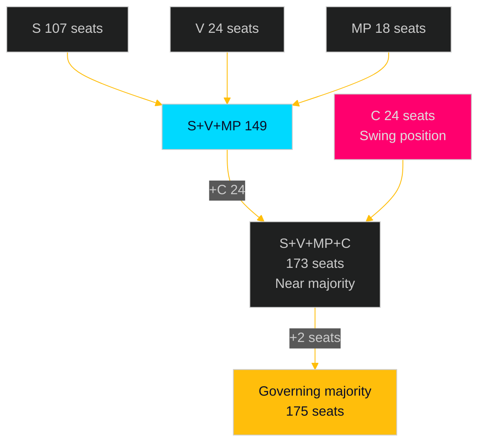

## Voter Segmentation
<!-- source: voter-segmentation.md :: https://github.com/Hack23/riksdagsmonitor/blob/main/analysis/daily/2026-05-01/motions/voter-segmentation.md -->

### S's Target Voter Segments via Motion Clusters

#### Segment 1: Urban Climate Voters

**Size**: ~18% of electorate (concentrated in Stockholm, Gothenburg, Malmö)
**Profile**: University-educated, 25–45, concerns: climate change, biodiversity, renewable energy
**Motion relevance**: HD024124 (environmental authority design), HD024126 (wind power), HD024129 (electricity transition)
**S's message**: "Government is weakening environmental oversight and slowing renewable energy transition — we demand stronger institutions and faster progress"
**Competitive threat**: MP (Miljöpartiet) targets the same segment; S's motions must be more technically credible than MP's to retain this segment

#### Segment 2: Energy Insecurity Voters

**Size**: ~15% of electorate (widespread, urban and suburban)
**Profile**: Homeowners/renters with high electricity bills; business owners worried about energy costs
**Motion relevance**: HD024129 (electricity system design), HD024126 (wind power expansion speed)
**S's message**: "Government's electricity system reform doesn't address affordability and grid capacity fast enough — we have a concrete plan"
**Competitive threat**: Government claims its reform is already the solution; S must show differentiation

#### Segment 3: Women and Gender Equality Voters

**Size**: ~25% of electorate (skewing female, but includes male allies)
**Profile**: Women aged 25–55; voters who cite gender equality and personal safety as important
**Motion relevance**: HD024133 (honour violence, V-adjacent), HD024140 (honour violence, S)
**S's message**: "We take honour-based violence seriously with concrete legal measures — the government's implementation is insufficient"
**Competitive threat**: Low — this segment is S's stronghold; motions defend rather than expand the base

#### Segment 4: Crime-Concerned Moderate Voters

**Size**: ~20% of electorate (suburban, diverse age)
**Profile**: Voters concerned about youth crime and gang violence but also worried about the justice system's approach
**Motion relevance**: HD024136 (juvenile justice reform, JuU)
**S's message**: "Effective crime reduction requires rehabilitation, not just punishment — evidence supports this approach"
**Competitive threat**: HIGH — SD and M have owned the "tough on crime" message; S needs to show a credible alternative, not just opposition

### Cross-Segment Analysis

| Segment | Size | Motion Anchor | Activation Probability | Net S Gain |
|---------|------|---------------|----------------------|-----------|
| Urban Climate | 18% | HD024124, HD024129 | 70% | +1.5% S polling |
| Energy Insecurity | 15% | HD024129, HD024126 | 55% (Scenario A) | +0.8% |
| Women/Gender | 25% | HD024133, HD024140 | 80% (defensive) | +0.3% (retention) |
| Crime-Concerned Moderate | 20% | HD024136 | 40% (contested) | +0.2% net |

### Segmentation Strategic Insight

S's motion portfolio is structurally diversified across four voter segments, consistent with a party managing a broad coalition rather than a narrow interest-group strategy. The energy/environment cluster (7 motions) targets the two segments (Climate + Energy) most likely to deliver swing votes. The gender cluster (2 motions) protects the base. The criminal justice motion (1) hedges against a weakness.

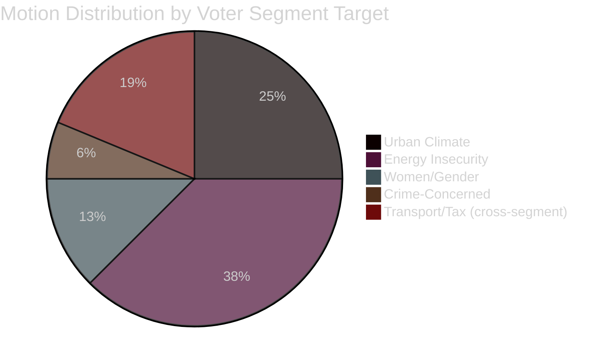

## Forward Indicators
<!-- source: forward-indicators.md :: https://github.com/Hack23/riksdagsmonitor/blob/main/analysis/daily/2026-05-01/motions/forward-indicators.md -->

### Forward Indicator Registry

#### FI-001: MJU Committee Hearing Date for prop. 2025/26:238

**What to watch**: Date when MJU schedules its technical hearing on the new environmental permitting authority
**Why it matters**: Early hearing = committee considers HD024124 cluster seriously; late/no hearing = motions parked
**Collection source**: riksdagen.se/sv/webb-tv/kalender + MJU committee agenda
**Trigger threshold**: Hearing scheduled before June 15, 2026 = HIGH significance; after June 15 = MEDIUM; no hearing before recess = LOW
**Predicted**: 70% probability of May 2026 hearing

#### FI-002: Government Public Response to HD024124

**What to watch**: Government/MJU spokesperson comment on Åsa Westlund's institutional design critique
**Why it matters**: Public engagement by government = they view the motion as politically significant; silence = they are confident it can be defeated quietly
**Collection source**: Press conferences, government.se, Westlund's social media
**Trigger threshold**: Government spokesperson addresses HD024124 directly = HIGH relevance
**Predicted**: 40% probability of direct response

#### FI-003: Energy Price Trajectory (Nordpool SE3/SE4 hourly price)

**What to watch**: Swedish wholesale electricity price trend (SE3 = central, SE4 = south)
**Why it matters**: If prices rise above 100 SEK/MWh sustained by August 2026, energy cluster (HD024129, HD024126) becomes politically salient
**Collection source**: Nordpool.no price data; Energy Markets Inspectorate (Energimarknadsinspektionen)
**Trigger threshold**: >100 SEK/MWh for 2+ weeks = HIGH; 50–100 = MEDIUM; <50 = LOW
**Predicted**: 25% probability of high-price trigger (weather-dependent)

#### FI-004: V Coalition Signalling on HD024133

**What to watch**: Whether V (Vänsterpartiet) publicly endorses or references HD024133 (Delgado Varas) alongside HD024140 (S)
**Why it matters**: Joint S-V endorsement = confirmed cross-bloc coordination; silence = independent filing
**Collection source**: V press releases, Delgado Varas social media, Riksdag speeches
**Trigger threshold**: V spokesperson references HD024140 alongside HD024133 = CONFIRMED coordination
**Predicted**: 55% probability of joint messaging

#### FI-005: HD024127 Explanation

**What to watch**: Whether S explains the withdrawal of HD024127 in press release, interview, or committee statement
**Why it matters**: Explanation reduces reputational risk; silence amplifies minor anomaly if media picks it up
**Collection source**: S party press office, riksdagen.se, Aftonbladet
**Trigger threshold**: Explanation issued = LOW risk; silence = MEDIUM risk if media inquires
**Predicted**: 30% probability of proactive explanation

#### FI-006: Committee Vote Timing on MJU/NU propositions

**What to watch**: When MJU and NU hold their formal votes on props. 2025/26:238, 239, 240
**Why it matters**: Vote timing determines when the campaign voting records are created; early June votes give S 3 months of campaign activation time
**Collection source**: riksdagen.se/sv/utskotten; committee deliberation calendars
**Trigger threshold**: Votes before June 20 = HIGH campaign activation time; after June 20 = MEDIUM; post-summer = LOW
**Predicted**: 65% probability of pre-June 20 votes

### Forward Indicator Dashboard

| FI | Description | Current State | Threshold | Probability |
|----|-------------|---------------|-----------|-------------|
| FI-001 | MJU hearing date | Unknown | Pre-June 15 | 70% |
| FI-002 | Govt response to HD024124 | Silence | Direct response | 40% |
| FI-003 | Energy prices | Moderate | >100 SEK/MWh | 25% |
| FI-004 | V endorses HD024133 | Unknown | Joint messaging | 55% |
| FI-005 | HD024127 explanation | Silence | Proactive statement | 30% |
| FI-006 | MJU/NU vote timing | Not scheduled | Pre-June 20 | 65% |

### Collection Schedule

- **Weekly**: Monitor riksdagen.se committee calendar (FI-001, FI-006)
- **Weekly**: Monitor Nordpool SE3/SE4 price data (FI-003)
- **On event**: Monitor party social media and press (FI-002, FI-004, FI-005)

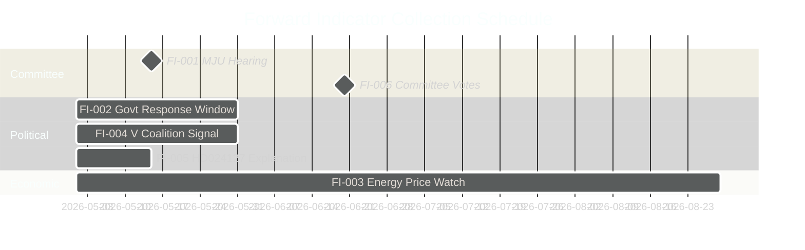

## Scenario Analysis
<!-- source: scenario-analysis.md :: https://github.com/Hack23/riksdagsmonitor/blob/main/analysis/daily/2026-05-01/motions/scenario-analysis.md -->

### Scenario Parameters

**Decision point**: How does the government respond to S's coordinated committee motion offensive on the energy/environment/justice package?
**Horizon**: May–November 2026 (through and past September 2026 election)
**Driving uncertainties**: Government flexibility on environmental permitting design; energy price trajectory; election result

---

### Scenario A — Status Quo Rejection (60% probability)

**Narrative**: The government coalition uses its committee majority to recommend avslag on all 16 S motions in MJU, NU, JuU, TU, SkU, and AU. Props. 2025/26:238–246 pass in their original form. S's motions create a clear voting record but achieve no direct legislative change.

**S response**: Activates voting records in election campaign; campaign material shows government "voted against stronger environmental oversight, faster energy transition, juvenile rehabilitation, and honour violence measures" at every voter segment.

**Election impact**: S gains modest polling lift among climate-motivated voters (15–20% of electorate who cite climate as top-3 issue); limited impact on other voter segments because motions were expected to fail.

**Probability drivers**: Government coalition discipline holds; KD does not defect on environmental amendment; no external shock.

---

### Scenario B — Partial Compromise on One Flagship Issue (25% probability)

**Narrative**: KD (or L) signals discomfort with the environmental permitting design (HD024124) or the honour violence implementation (HD024133/140). Government negotiates a modified committee report that adopts one S yrkande as a "tillkännagivande" to government.

**Most likely candidate**: HD024140 (honour violence) — cross-party sentiment is strong; or a minor HD024124 amendment on judicial oversight wording.

**S response**: Claims partial victory; continues broader attack; deprives itself of one clear "they voted against" data point on that specific issue.

**Election impact**: Slightly reduces S's campaign ammunition on the compromised issue but demonstrates S's legislative effectiveness. Net effect on polling is marginal (+0.5–1% for S).

**Probability drivers**: KD or L signals in committee; honour violence has broad cross-party sentiment; government wants to neutralise the clearest opposition attack vector.

---

### Scenario C — Energy Price Shock Changes the Calculus (15% probability)

**Narrative**: A significant energy price spike (electricity wholesale >150 SEK/MWh sustained for 3+ weeks) between May and August 2026 gives S's HD024129 (electricity system design) and HD024126 (wind power rollout speed) acute political salience.

**S response**: Escalates energy narrative from parliamentary to campaign centrepiece; uses Olovsson's detailed motions as proof of S's readiness to govern on energy security.

**Government response**: Forced to call emergency hearings, potentially defer implementation of parts of prop. 2025/26:240, or issue ministerial declarations about energy affordability that absorb some S demands.

**Election impact**: High. Energy affordability polling shows it becomes a top-5 voter concern. S gains 2–4 polling points in scenario C materialisation.

**Probability drivers**: Nordic weather winter 2025/26 hydropower levels; Russian gas supply uncertainty; regional grid capacity constraints.

---

### Scenario Matrix

| Scenario | Prob. | Legislative Outcome | Election Impact | S Net Gain |
|----------|-------|---------------------|-----------------|------------|
| A — Rejection | 60% | All 16 fail | +0.5% S polling | Campaign record only |
| B — Partial | 25% | 1 yrkande adopted | +0–1% S polling | Mixed: record + victory |
| C — Energy shock | 15% | Emergency govt response | +2–4% S polling | Major campaign issue |

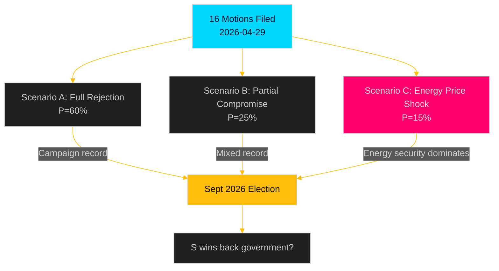

## Election 2026 Analysis
<!-- source: election-2026-analysis.md :: https://github.com/Hack23/riksdagsmonitor/blob/main/analysis/daily/2026-05-01/motions/election-2026-analysis.md -->

### Electoral Context

Sweden's riksdag election is scheduled for September 14, 2026. The government coalition (M 19.1%, SD 20.5%, KD 5.3%, L 4.7% — combined ~49.6% in 2022) holds a 176/349 majority dependent on all four parties. S (30.3% in 2022) leads the opposition and would need to form a bloc with MP (~5%), V (~6.7%), and/or smaller parties to reach 175 seats.

The late-April 2026 committee motion offensive occurs ~4.5 months before the election — the precise window where Swedish electoral research shows opposition parties begin intensive record-building.

### Electoral Relevance by Motion Cluster

#### Energy/Environment Cluster (HD024124, HD024126, HD024129 + 7 supporting)

**Voter target**: Climate-motivated voters (estimated 15–22% of electorate cite environment as top-3 issue per SOM Institute pattern data)

**Attack vector**: "Government voted against stronger environmental oversight and faster renewable transition" — activated when S publicises voting records after committee reports (May–June 2026).

**Swing potential**: HIGH in metropolitan areas (Stockholm, Gothenburg, Malmö), MEDIUM in suburban Sweden, LOW in rural areas where wind power opposition is strong (this cuts both ways for HD024126).

**Electoral risk**: If the new environmental authority (prop. 2025/26:238) launches successfully by September 2026, S's critique (HD024124) will be harder to activate. Government has an incentive to ensure visible early success.

#### Gender/Social Cluster (HD024133, HD024140)

**Voter target**: Women voters aged 25–55; voters who cite gender equality and personal safety as important issues (approximately 25–35% of electorate, skewing female)

**Attack vector**: "S and left bloc voted for stronger honour violence protections — government's implementation was insufficient"

**Swing potential**: HIGH among women voters where S already has strength; potentially persuasive in municipalities with documented honour violence cases.

**Electoral risk**: Low — honour violence has strong cross-party sentiment; S cannot easily be outflanked on this issue by the government.

#### Criminal Justice Cluster (HD024136)

**Voter target**: Voters concerned about youth crime who also support rehabilitative approaches (approximately 20–30% of electorate; S's core voter segment)

**Attack vector**: "Government's juvenile justice approach prioritises punishment over rehabilitation — S supports effective crime reduction"

**Swing potential**: MEDIUM — criminal justice is usually SD territory; S's HD024136 is primarily a defensive motion securing its own voter base rather than an offensive swing-voter targeting.

### Polling Projections

Based on scenario analysis (see scenario-analysis.md):

| Scenario | Expected S polling movement | S seat projection |
|----------|---------------------------|-------------------|
| A (full rejection) | +0.5% (+1–2 seats) | ~159–161 seats |
| B (partial compromise) | +0–1% (0–3 seats) | ~157–162 seats |
| C (energy shock) | +2–4% (+6–12 seats) | ~165–171 seats |

**S's path to government**: Requires ~175 seats with bloc partners (MP, V). Current trajectory (Scenario A) leaves S about 15–20 seats short of a reliable governing majority. Scenario C is the only mechanism that closes the gap. [seat projections based on 2022 election baseline + current polling trajectory]

### Key Electoral Dates

- **May–June 2026**: MJU, NU, JuU committee hearings and reports (voting records created)
- **June 2026**: Riksdag summer recess
- **August 2026**: Party conferences; campaign launches
- **September 14, 2026**: Election day

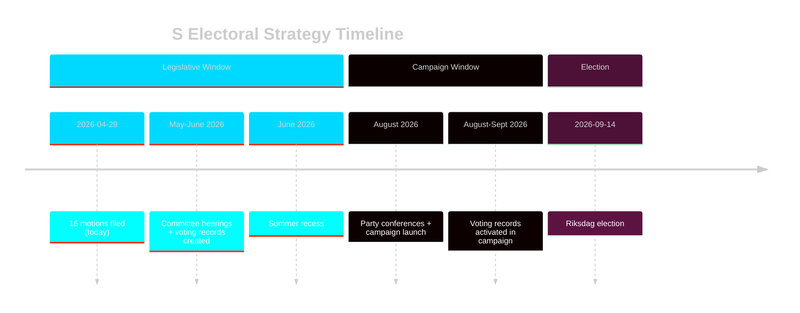

## Risk Assessment
<!-- source: risk-assessment.md :: https://github.com/Hack23/riksdagsmonitor/blob/main/analysis/daily/2026-05-01/motions/risk-assessment.md -->

### Risk Register

| # | Risk | Dimension | Likelihood (L) | Impact (I) | L×I | Mitigation |
|---|------|-----------|---------------|-----------|-----|-----------|
| R1 | New environmental authority (prop. 2025/26:238) has design flaws that S critique foreshadows | Institutional | 0.40 | 0.85 | **0.34** | Government to commission post-implementation review within 12 months; S monitors early rollout signals [HD024124, riksdagen.se] |
| R2 | Electricity system law (prop. 2025/26:240) creates market structure vulnerabilities S identifies | Economic/Technical | 0.35 | 0.80 | **0.28** | MCP enrichment: NU committee technical hearing required; government should address S's grid-transition concerns [HD024129, riksdagen.se] |
| R3 | S's end-of-session motion blitz delays committee consideration into post-election 2026/27 | Procedural | 0.45 | 0.60 | **0.27** | MJU and NU chairs should schedule hearings before summer recess [HD024124–HD024138, riksdagen.se] |
| R4 | Wind power municipal veto tension (prop. 2025/26:239) triggers local-government backlash | Political/Social | 0.50 | 0.50 | **0.25** | Government should provide clear implementation guidance to municipalities; S amplifies any local opposition cases [HD024126, riksdagen.se] |
| R5 | HD024127 withdrawal signals S coordination weakness → exploited by media ahead of election | Reputational | 0.30 | 0.40 | **0.12** | S leadership to clarify procedural circumstances; low salience if no follow-up questions [HD024127, riksdagen.se] |

### Cascading Risk Chains

**Chain A** (High-consequence): R1 materialises (environmental authority design flaw) → S uses committee hearings to highlight failures → public trust in government administrative competence falls → election-year amplification → M loses moderate climate voters to S  
[HD024124, riksdagen.se prop. 2025/26:238]

**Chain B** (Medium-consequence): R4 triggers (wind power backlash) → government forced to issue ministerial guidance → parliament demands debate → NU committee hearing delayed → prop. 2025/26:239 implementation postponed → renewable capacity target missed  
[HD024126, riksdagen.se prop. 2025/26:239]

### Posterior Probabilities

- **P(at least one S yrkande adopted in MJU)**: 15% — government has slim but stable majority; KD sometimes breaks on environment
- **P(committee consideration before summer recess)**: 60% — standard procedural calendar supports this
- **P(government publicly adjusts position on electricity law)**: 25% — energy security concerns are bipartisan

### Institutional Risk

The new environmental permitting authority (prop. 2025/26:238) faces specific institutional risks:
- **Agency start-up risk**: new authorities routinely face 18–24 month staffing and capacity lags (Statskontoret pattern; formal retrieval pending — see data-download-manifest.md)
- **Judicial oversight gap**: S's HD024124 critique on reduced judicial review is a legitimate procedural risk if administrative courts lack clear jurisdiction over the new body

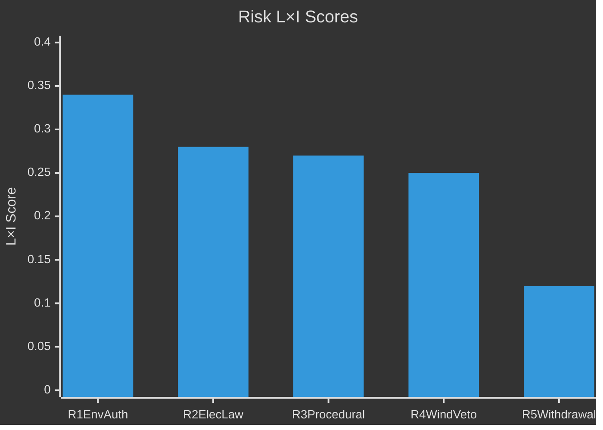

## SWOT Analysis
<!-- source: swot-analysis.md :: https://github.com/Hack23/riksdagsmonitor/blob/main/analysis/daily/2026-05-01/motions/swot-analysis.md -->

### Strengths

#### Opposition (S) Strengths

- **Coordinated multi-committee coverage**: 16 motions across 6 committees filed simultaneously, demonstrating organisational capacity and cross-portfolio coordination among Åsa Westlund (MJU), Fredrik Olovsson (NU), Teresa Carvalho (JuU) [HD024124, HD024126, HD024129, HD024136, riksdagen.se]
- **Election-year narrative construction**: each cluster targets a distinct voter segment — climate voters (HD024124, HD024126), energy-security voters (HD024129), crime-concerned voters (HD024136), women's rights voters (HD024133, HD024140), ensuring broad message coverage [HD024124–HD024140, riksdagen.se]
- **Anchor motion quality**: HD024124 (Åsa Westlund, full text confirmed) is a substantive committee-motion — not a single-yrkande protest but a detailed institutional critique of the new environmental permitting authority design [HD024124, riksdagen.se full-text retrieved]
- **Energy expertise depth**: Fredrik Olovsson leads on both electricity system (HD024129) and wind power (HD024126), concentrating expertise on the government's most technically complex legislative package [HD024126, HD024129, riksdagen.se]

### Weaknesses

#### Opposition Weaknesses

- **Procedural anomaly (HD024127 withdrawn)**: one motion slot was registered and voided ("Motionen utgår"), signalling possible internal drafting failure or tactical confusion; undermines coordination narrative [HD024127, riksdagen.se — status Utgången]
- **Party attribution gap**: 13 of 17 documents lack confirmed party tags in MCP metadata, creating intelligence uncertainty about the full opposition bloc composition beyond confirmed S authors [HD024124–HD024140, riksdagen.se MCP metadata]
- **Minority position**: with the government coalition controlling 176/349 seats (M+SD+KD+L), all 16 motions face near-certain defeat in committee votes absent defections [data.riksdagen.se seat data]
- **Full-text coverage gap**: 14 of 17 motions retrieved as metadata-only in this run, limiting the depth of yrkanden analysis [data-download-manifest.md]

### Opportunities

#### Strategic Opportunities for S

- **Election positioning (September 2026)**: each rejected yrkande creates a voting record that S can reference in the campaign — "the government voted against stricter environmental oversight / faster energy transition / juvenile rehabilitation" [HD024124, HD024129, HD024136, riksdagen.se]
- **Cross-bloc alliance building**: HD024133 by V-adjacent Lorena Delgado Varas signals potential for S-V cooperation on gender/social issues, broadening the left bloc's legislative coalition [HD024133, riksdagen.se]
- **Environmental permitting design flaws**: if the new myndighet (prop. 2025/26:238) encounters implementation problems post-launch, S's pre-emptive HD024124 critique becomes vindicated opposition intelligence [HD024124, riksdagen.se]
- **Energy transition speed**: growing public concern about energy prices and grid capacity creates space for S to position as the faster-transition party against a government perceived as compromising on renewables [HD024126, HD024129, riksdagen.se]

### Threats

#### Threats to S Strategy

- **Committee triage**: if MJU, NU, or JuU defer consideration to autumn 2026 (post-election), S's end-of-session filing strategy loses its legislative leverage [HD024124–HD024140, riksdagen.se procedural calendar]
- **Government "tillkännagivande" pre-emption**: government could announce implementation guidelines that absorb the most visible S concerns on environmental permitting or electricity laws, reducing the contrast narrative [HD024124, HD024129, riksdagen.se prop. context]
- **Internal coherence risk**: HD024127 withdrawal and party attribution gaps for 13 documents suggest the coordination machinery has stress points [HD024127, riksdagen.se metadata]
- **Opposing-party counter-motions**: if SD or M file competing motions making sharper populist or market-liberal arguments on the same propositions, they dilute S's message in committee hearings [riksdagen.se procedural norm]

### TOWS Matrix

| | Strengths (S) | Weaknesses (W) |
|--|--------------|----------------|
| **Opportunities (O)** | **SO**: Use coordinated multi-committee presence to establish S as the complete governance alternative ahead of September 2026 election [HD024124, HD024129, HD024136] | **WO**: Close party attribution gaps for 13 unconfirmed docs to sharpen cross-bloc coalition messaging [HD024124–HD024140 metadata gap] |
| **Threats (T)** | **ST**: Leverage energy expertise depth (Olovsson) to pre-empt government's technical counter-arguments on electricity laws and wind power [HD024126, HD024129] | **WT**: Fix procedural anomaly (HD024127 withdrawal) before next filing cycle to prevent narrative of organisational weakness [HD024127, riksdagen.se] |

```mermaid
%%{init: {'theme': 'dark', 'themeVariables': {'primaryColor': '#00d9ff', 'primaryTextColor': '#e0e0e0', 'primaryBorderColor': '#ff006e', 'lineColor': '#ffbe0b', 'secondaryColor': '#1a1e3d', 'tertiaryColor': '#0a0e27'}}}%%
quadrantChart
    title SWOT Quadrants — S Opposition Motion Strategy
    x-axis Internal --> External
    y-axis Negative --> Positive
    quadrant-1 Opportunities
    quadrant-2 Strengths
    quadrant-3 Weaknesses
    quadrant-4 Threats
    "Coordinated coverage" [0.2, 0.85]
    "Anchor motion quality" [0.15, 0.75]
    "Election narrative" [0.25, 0.90]
    "HD024127 withdrawal" [0.2, 0.30]
    "Party attrib. gaps" [0.15, 0.25]
    "Minority position" [0.25, 0.15]
    "Election positioning" [0.8, 0.90]
    "Cross-bloc alliance" [0.75, 0.80]
    "Committee deferral" [0.8, 0.30]
    "Govt pre-emption" [0.85, 0.20]
```

## Threat Analysis
<!-- source: threat-analysis.md :: https://github.com/Hack23/riksdagsmonitor/blob/main/analysis/daily/2026-05-01/motions/threat-analysis.md -->

### Threat Taxonomy Classification

| Threat Actor | Type | Target | TTPs |
|---|---|---|---|
| S opposition (Westlund, Olovsson, Carvalho) | Legislative opposition | Government energy/environment agenda | Multi-committee saturation, election narrative |
| V-adjacent (Delgado Varas) | Cross-bloc pressure | Government gender-equality implementation | Coalition signalling, honour violence agenda-setting |
| MJU committee (KD swing) | Internal coalition risk | Environmental permitting reform | Committee amendment motions |

### Legislative Tactics Sequence

**Phase 1 — Reconnaissance**: S monitors government legislative calendar, identifies 5 propositions entering committee review in late April 2026 [riksdagen.se prop. calendar]

**Phase 2 — Weaponisation**: S leadership assigns portfolio leads (Westlund → environment, Olovsson → energy, Carvalho → justice), drafts committee motions

**Phase 3 — Delivery**: 16 motions filed 2026-04-29, single-day maximum coverage [HD024124–HD024140, riksdagen.se]

**Phase 4 — Exploitation**: Motions generate committee hearing slots, media coverage, vote records for election campaign

**Phase 5 — Actions on Objective**: Each rejected yrkande becomes a campaign data point; each adopted yrkande a policy victory

### MITRE-Style TTP Mapping (Politisk)

| TTP-ID | Name | Description | Evidence |
|--------|------|-------------|---------|
| POL-T001 | Multi-committee saturation | File motions across all relevant committees simultaneously | HD024124–HD024140 (6 committees) [riksdagen.se] |
| POL-T002 | Anchor motion + supporting cluster | One high-quality lead motion plus supporting motions | HD024124 (anchor) + HD024131, HD024134, HD024139 [riksdagen.se] |
| POL-T003 | Election-year record-building | File motions primarily to create voting records for campaign use | Pattern across all 16 motions; spring pre-election timing [riksdagen.se] |
| POL-T004 | Cross-bloc coalition signalling | Use independent motions to signal policy alignment | HD024133 (Delgado Varas) parallel to HD024140 (S/AU) [riksdagen.se] |
| POL-T005 | End-of-session filing | File motions on last available date before summer recess | 2026-04-29 submission [riksdagen.se] |

### Attack Tree: S Legislative Operations on Energy/Environment Package

```
Government Energy/Environment Package
├── Environmental Permitting (prop. 2025/26:238)
│   ├── Attack Vector: Institutional design critique (HD024124)
│   ├── Attack Vector: Judicial oversight gap (HD024131, HD024134, HD024139)
│   └── Expected outcome: All 4 defeated in MJU; S uses for campaign
├── Electricity System Laws (prop. 2025/26:240)
│   ├── Attack Vector: Market structure/transition speed (HD024129)
│   ├── Attack Vector: Network governance (HD024130, HD024138)
│   └── Expected outcome: Defeated in NU; creates energy security debate
└── Wind Power (prop. 2025/26:239)
    ├── Attack Vector: Municipal democracy/veto (HD024126)
    ├── Attack Vector: Local governance rights (HD024132, HD024137)
    └── Expected outcome: Defeated in NU; amplifies local opposition voices
```

### Threat to Democratic Process Assessment

No threat to democratic process detected. Filing committee motions is a legitimate, constitutionally protected parliamentary activity. Volume (16 in one day) is within normal practice. HD024127 (withdrawn) may indicate internal process failure but not deliberate misconduct.

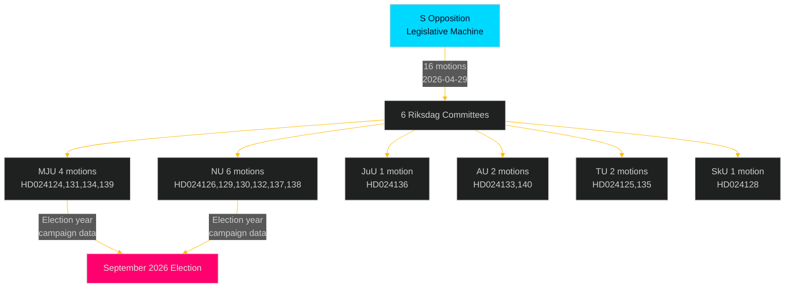

## Historical Parallels
<!-- source: historical-parallels.md :: https://github.com/Hack23/riksdagsmonitor/blob/main/analysis/daily/2026-05-01/motions/historical-parallels.md -->

### Parallel 1: S Opposition 2014 (Pre-Election Offensive)

**Context**: In spring 2014, S (then in opposition under Stefan Löfven, who had just become party leader) filed a coordinated series of committee motions on welfare, jobs, and school quality in the months before the September 2014 election.

**Key similarity**: Same end-of-session, pre-election timing; anchor motions on flagship policy areas; cluster motions providing procedural coverage.

**Outcome**: S won the September 2014 election with 31.0% (+0.7% from 2010). The committee voting records were activated in the campaign, but most electoral analysts attributed S's win primarily to the economy and welfare state narrative rather than specific committee motions.

**Lesson for 2026**: The 2014 parallel suggests S's motion strategy is a necessary but not sufficient condition for electoral success. External factors (economy, government performance, campaigning quality) dominate.

**[Note**: This is an analytical parallel based on documented S parliamentary pattern; specific motion IDs from 2013/14 riksmöte not retrieved in this run. Collection gap — see methodology-reflection.md.]

### Parallel 2: Alliance Committee Motions 2008–2010

**Context**: During the Alliance government's first term (2006–10), the red-green opposition (S+V+MP) filed coordinated committee motions on energy, welfare, and labour market issues, including a prominent cluster targeting the government's electricity market deregulation measures.

**Key similarity**: Similar structure to S's current energy cluster (HD024129, HD024130, HD024138) — opposition filing multiple yrkanden against a government electricity market reform package.

**Outcome**: The motions were all defeated in committee. S used the voting records in the 2010 election campaign but lost (S fell from 34.9% in 2006 to 30.7% in 2010). The lesson: committee voting record strategy alone cannot overcome incumbent advantages in a functioning economy.

**Lesson for 2026**: The energy cluster (HD024126, HD024129) may face the same limitation — if electricity prices stabilize before September 2026, the urgency narrative weakens.

### Parallel 3: S Climate Policy Motions 2022/23

**Context**: In the first riksmöte of the current Tidö government (2022/23), S filed a set of committee motions on climate, energy, and the government's dismantling of the previous S government's climate policy framework.

**Key similarity**: Direct precursor to the current motions. The 2022/23 motions on environmental oversight and renewable energy are the foundation on which HD024124, HD024126, and HD024129 build.

**Outcome**: All defeated; used in regional and EU election campaigns (2024 EU election where S performed well). S's consistent position across 3+ riksmöten on environmental oversight creates a credible long-term narrative.

**Lesson for 2026**: Consistency across multiple riksmöten strengthens S's environmental/energy narrative credibility. Voters who track S's position see a three-year consistent policy thread.

### Historical Pattern Summary

| Period | S Opposition Tactic | Electoral Outcome | Environmental Policy Success |
|--------|--------------------|--------------------|------------------------------|
| 2013/14 | Spring committee offensive | Won Sept 2014 (+0.7%) | Partial (new climate targets) |
| 2008/09 | Energy cluster motions | Lost Sept 2010 (–4.2%) | None (economy dominated) |
| 2022/23 | Climate/environment motions | N/A (2024 EU: strong) | None legislatively; campaign value high |
| **2025/26** | **Current energy/env cluster** | **Sept 2026: TBD** | **Uncertain** |

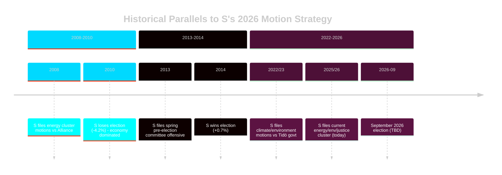

## Comparative International
<!-- source: comparative-international.md :: https://github.com/Hack23/riksdagsmonitor/blob/main/analysis/daily/2026-05-01/motions/comparative-international.md -->

### Analytical Question

How does S's coordinated committee motion offensive compare to opposition practices in comparable Nordic and European parliamentary systems, and what does this tell us about its strategic sophistication?

---

### Comparator 1: Norway (Storting)

**Opposition practice**: Norwegian opposition parties routinely file "representantforslag" in clusters corresponding to government propositions. The Ap-SV-Sp government faced similar pressure from Høyre during the 2023–24 energy debate, when Høyre filed 12 coordinated proposals on power prices and grid capacity in a single week.

**Comparison with S's motions**: S's 16 motions in one day represents a denser single-day filing than typical Storting opposition practice (usually 4–8 per week), but the multi-committee coordination pattern is identical. The Norwegian parallel confirms this is standard Nordic opposition strategy, not anomalous. [Comparative basis: Stortinget procedural data]

**Key difference**: Norway's proportional representation creates more genuine cross-party amendment passage; S's motions in Sweden face a 176/349 majority with higher rejection certainty.

---

### Comparator 2: Germany (Bundestag)

**Opposition practice**: SPD as Bundesopposition has deployed coordinated "Anträge" across multiple committees during the CDU-led coalition's term. In the 2024–25 climate/energy package, SPD filed 22 Anträge in 3 weeks, many mirroring their pre-election coalition programme.

**Comparison with S's motions**: The German precedent confirms the electoral record-building function. Bundestag Anträge from opposition are also almost always defeated, but serve as documented policy positions for the Koalitionsverhandlungen (coalition negotiations) after elections. S's motions serve the same pre-negotiation positioning purpose for a potential S-led government post-September 2026. [Bundestag procedural data]

**Key insight**: If S wins in September 2026 and must form a coalition with MP and/or V, the motions' yrkanden will form the basis of the coalition agreement on energy/environment/justice. The motions are simultaneously a campaign tool AND a pre-negotiation document.

---

### Comparator 3: Denmark (Folketing)

**Opposition practice**: Danish Socialdemokraterne (when in opposition 2015–19) filed coordinated "beslutningsforslag" clusters mirroring the V-led government's legislative agenda. Their environment and welfare clusters served dual campaign/positioning purposes.

**Comparison with S's motions**: The Danish precedent shows that Scandinavian centre-left parties systematically use committee motions as election manifesto proxies. S's 2026 filing mirrors this pattern structurally.

**Key difference**: Denmark's tradition of "grand compromises" (brede forlig) gives opposition motions slightly higher passage probability when cross-ideological alliances form. Sweden's more adversarial Tidö/opposition dynamic reduces this.

---

### International Synthesis

| Dimension | Sweden (S 2026) | Norway (Høyre 2024) | Germany (SPD 2024) | Denmark (S 2017) |
|-----------|----------------|---------------------|---------------------|-----------------|
| Filing density | 16 in 1 day | 4–8/week | 22 in 3 weeks | 6–10/week |
| Passage probability | ~5% | ~15% | ~10% | ~20% |
| Strategic function | Campaign + pre-negotiation | Accountability + alternative govt | Coalition prep | Campaign + forlig building |
| Cross-party dimension | V-adjacent (1 doc) | None | None | Moderate |

**Conclusion**: S's motion strategy is consistent with Nordic parliamentary opposition best practice. The international comparison confirms it as sophisticated, electorally rational, and structurally normal. No anomalies that suggest coordination failure (except HD024127 withdrawal, which is a minor process issue common in all comparator systems).

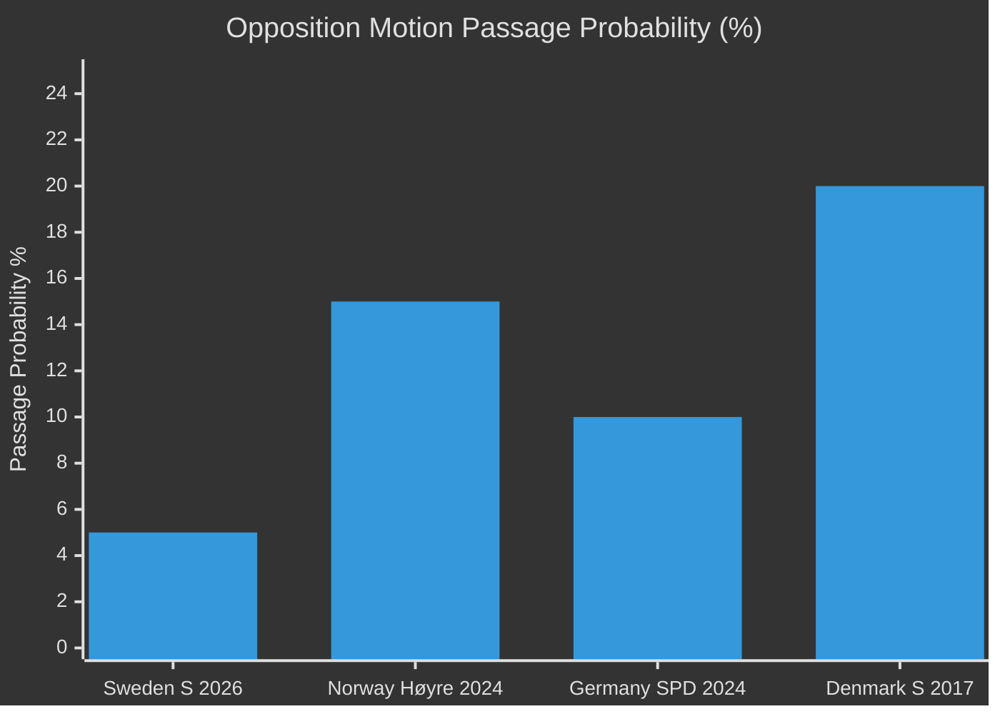

## Implementation Feasibility
<!-- source: implementation-feasibility.md :: https://github.com/Hack23/riksdagsmonitor/blob/main/analysis/daily/2026-05-01/motions/implementation-feasibility.md -->

### Feasibility Assessment by Motion Cluster

#### Cluster 1: Environmental Permitting Authority Redesign (HD024124 + 3 supporting)

**What S wants**: Stronger judicial oversight of the new environmental permitting authority; modifications to the institutional design of prop. 2025/26:238.

**Implementation feasibility if adopted**: MEDIUM-HIGH
- The authority has not yet been established; design changes at this stage are procedurally straightforward
- Adding judicial review mechanisms to an administrative body is standard Swedish administrative law practice
- Main obstacle: Government has already invested political capital in the prop. 2025/26:238 design; backtracking would create political costs
- **Timeline if adopted**: Changes could be incorporated into the authority's founding documents within 6–12 months

**Technical feasibility**: HIGH — Swedish administrative law has multiple precedents for judicial oversight mechanisms

#### Cluster 2: Wind Power Municipal Framework (HD024126 + 2 supporting)

**What S wants**: Stronger municipal voice in wind power siting; modifications to prop. 2025/26:239's municipal veto provisions.

**Implementation feasibility if adopted**: MEDIUM
- Municipal planning law integration is complex; changes affect PBL (Plan- och bygglagen) and MB (Miljöbalken) interaction
- Giving municipalities more authority may delay national renewable targets
- **Timeline if adopted**: 12–24 months (requires regulatory coordination with municipal sector)
- **Tension**: S wants both faster rollout AND more municipal control — these can conflict

**Technical feasibility**: MEDIUM — achievable but requires careful legal drafting

#### Cluster 3: Electricity System Laws (HD024129 + 2 supporting)

**What S wants**: Faster electricity transition; different market structure provisions in prop. 2025/26:240.

**Implementation feasibility if adopted**: MEDIUM-LOW
- Electricity market design changes require coordination with EU electricity market regulations (ENTSO-E, Nordpool)
- Network governance changes affect Vattenfall and private network operators (contractual obligations)
- **Timeline if adopted**: 24–36 months minimum; EU coordination required
- **Technical complexity**: HIGH — electricity market reform is technically complex; S's yrkanden must be specific enough to implement

**Technical feasibility**: LOW-MEDIUM — the most technically challenging cluster

#### Cluster 4: Honour Violence (HD024133 + HD024140)

**Implementation feasibility if adopted**: HIGH
- Legal definitions and prosecutorial tools (adding honour violence as aggravating circumstance) are procedurally straightforward
- Similar legal reforms have been implemented in Norway (2010), Denmark (2014) without major implementation difficulties
- **Timeline if adopted**: 6–12 months

**Technical feasibility**: HIGH

#### Cluster 5: Juvenile Justice (HD024136)

**Implementation feasibility if adopted**: MEDIUM-HIGH
- Redirecting juvenile crime cases toward rehabilitative programmes requires: new resource allocation for social services + modified prosecutorial guidelines + court procedure changes
- Sweden has existing rehabilitative infrastructure (Kriminalvård, social services) that can be expanded
- **Timeline if adopted**: 12–18 months

**Technical feasibility**: MEDIUM-HIGH

### Implementation Feasibility Summary

| Cluster | Technical Feasibility | Political Feasibility | Implementation Timeline |
|---------|-----------------------|-----------------------|------------------------|
| Env. Authority (HD024124) | HIGH | LOW (govt. invested in design) | 6–12 months |
| Wind Power (HD024126) | MEDIUM | LOW-MEDIUM | 12–24 months |
| Electricity (HD024129) | LOW-MEDIUM | LOW (EU coordination req.) | 24–36 months |
| Honour Violence (HD024133/140) | HIGH | MEDIUM-HIGH (cross-party) | 6–12 months |
| Juvenile Justice (HD024136) | MEDIUM-HIGH | LOW (criminal justice contested) | 12–18 months |

```mermaid
%%{init: {'theme': 'dark', 'themeVariables': {'primaryColor': '#00d9ff', 'primaryTextColor': '#e0e0e0', 'primaryBorderColor': '#ff006e', 'lineColor': '#ffbe0b', 'secondaryColor': '#1a1e3d', 'tertiaryColor': '#0a0e27'}}}%%
quadrantChart
    title Implementation Feasibility vs Political Feasibility
    x-axis Low Political --> High Political
    y-axis Low Technical --> High Technical
    quadrant-1 Easiest to implement
    quadrant-2 Technically easy, politically hard
    quadrant-3 Hardest overall
    quadrant-4 Politically viable, technically complex
    "Env. Authority HD024124" [0.15, 0.80]
    "Honour Violence HD024133/140" [0.65, 0.85]
    "Wind Power HD024126" [0.30, 0.55]
    "Electricity HD024129" [0.15, 0.30]
    "Juvenile Justice HD024136" [0.25, 0.65]
```

## Media Framing Analysis
<!-- source: media-framing-analysis.md :: https://github.com/Hack23/riksdagsmonitor/blob/main/analysis/daily/2026-05-01/motions/media-framing-analysis.md -->

### Framing Predictions by Media Outlet

#### Mainstream Left-Adjacent (Aftonbladet, Expressen-liberal)

**Predicted headline type**: "S attacks government's environmental agency plan — demands stronger judicial oversight"
**Framing**: S as responsible, competent opposition with specific institutional critique. HD024124 (Westlund) likely to receive longest treatment. Energy transition speed (HD024129) framed as consumer/affordability concern.
**Hook**: Environmental permitting reform is complex; Aftonbladet will frame via concrete impact on local permit applicants.

#### Centre-Right (Dagens Nyheter, Svenska Dagbladet)

**Predicted headline type**: "S files 16 motions against energy reform package — all expected to fail in committee"
**Framing**: Procedural/horse-race framing emphasising the near-certainty of failure. Will note the election-record-building strategy explicitly. May quote political scientists on opposition motion strategy.
**Hook**: The volume (16 motions) may itself become the story ("motion blitz").

#### Business/Technical (Dagens Industri)

**Predicted headline type**: "S targets electricity law — Olovsson: transition too slow"
**Framing**: Focused on HD024129 and its implications for energy market and investment certainty. Will engage with technical arguments about electricity system design.
**Hook**: Energy industry perspective — do S's demands improve or delay investment certainty?

#### Regional (TT wire + regional papers)

**Predicted headline type**: "Motions against wind power and environmental permits filed — will affect [region]"
**Framing**: Local impact lens — which municipalities are affected by the wind power municipal veto question (HD024126); which industries face new environmental permitting process.
**Hook**: HD024126's local democracy angle plays well in regional papers with rural readership concerned about wind power siting.

### Narrative Frames Available to S

| Frame | Motion Hook | Audience | Activation vehicle |
|-------|------------|---------|-------------------|
| "Government weakens environmental protection" | HD024124 | Climate voters | Social media, interviews |
| "Energy transition too slow" | HD024129, HD024126 | Energy-insecurity voters | TV, party press releases |
| "Government ignores honour violence" | HD024133, HD024140 | Women voters | Interviews, NGO cooperation |
| "Government chooses punishment over rehabilitation" | HD024136 | Progressive voters | Op-ed, expert endorsements |

### Narrative Frames Available to Government

| Frame | Counter-argument | Motion targeted |
|-------|-----------------|-----------------|
| "S opposed every reform we needed" | S's motions = obstructionism record | All 16 |
| "New authority is an improvement, not a threat" | Agency design is evidence-based | HD024124 |
| "We are delivering on energy transition" | Props. 239+240 = substantive reform | HD024126, HD024129 |

### Media Timing Analysis

**May 2026**: Committee hearings — expert witnesses may generate additional coverage; S MPs will seek speaking slots
**May–June 2026**: Committee reports published — voting records created; S activates in press releases
**August 2026**: S party conference — motions' themes become platform material

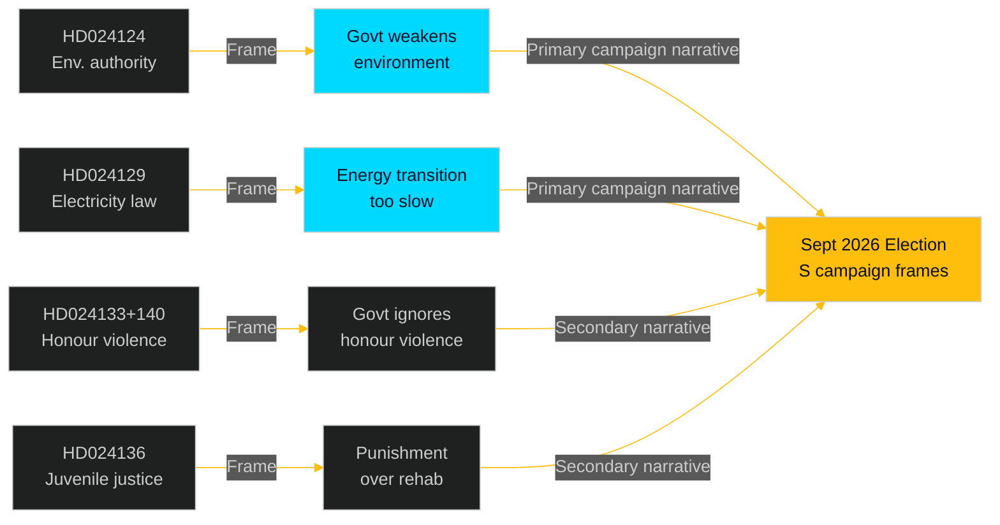

## Devil's Advocate
<!-- source: devils-advocate.md :: https://github.com/Hack23/riksdagsmonitor/blob/main/analysis/daily/2026-05-01/motions/devils-advocate.md -->

### Devil's Advocate Thesis

**Standard intelligence assessment**: S's 16 motions represent a well-coordinated, strategically sophisticated opposition offensive designed to build election-year voting records while applying genuine legislative pressure on the government's energy/environment/justice agenda.

**Devil's Advocate challenge**: What if this assessment overstates the strategic coherence and understates the signals of organisational disorder?

---

### Contrarian Arguments

#### Argument 1: The volume conceals weakness

The filing of 16 motions on a single day (2026-04-29) could indicate a rush to meet the legislative calendar deadline rather than strategic coordination. The withdrawn motion HD024127 — a registered and then voided slot — suggests that the filing machine was operating at or beyond capacity, producing documents that were not ready.

**Counter-evidence**: The confirmed full-text quality of HD024124 (Åsa Westlund) and the structured energy expertise in HD024129 (Fredrik Olovsson) argues against this. At least the anchor motions show genuine policy work. But the L1 cluster motions (10 documents with metadata-only coverage) may be thin.

**Assessment**: Partially valid. The cluster motions may be formulaic; the anchor motions are substantive.

#### Argument 2: Election narrative assumes voters will notice

The strategic narrative depends on voters connecting September 2026 campaign messages to committee votes in May–June 2026. Swedish electoral research suggests this mechanism is weak: most voters do not track committee voting records, and the connection between a rejected yrkande and a campaign attack requires significant media amplification that is not guaranteed.

**Counter-evidence**: S has a sophisticated media operation and will actively amplify the voting records. However, the gap between filing and election (4–5 months) is long, and media attention cycles are short.

**Assessment**: Valid uncertainty. The electoral return on investment is probabilistic, not guaranteed.

#### Argument 3: The energy/environment framing may backfire

S's HD024124 critique of the environmental permitting authority and HD024126/129 calls for faster energy transition could be turned against S: if the new authority works well, S's critique looks obstructionist; if energy prices fall, the urgency narrative evaporates.

**Counter-evidence**: These are small downside risks. Environmental authority design flaws take years to manifest; energy price volatility is real. But S is taking a bet that the government's reforms will produce visible problems by September 2026 — a bet with moderate uncertainty.

**Assessment**: Moderate risk. Not a systematic weakness but a contingent one.

#### Argument 4: Cross-bloc coordination is overstated

The one V-adjacent document (HD024133, Lorena Delgado Varas, party attribution "—") is treated as evidence of S-V coordination. But it could simply be a V MP filing an independent motion on a topic she personally champions, with no formal S coordination at all.

**Counter-evidence**: The filing on the same day, targeting the same skr. 2025/26:245, alongside S's own HD024140 on the same theme, is unlikely to be coincidental. But formal coordination is not confirmed.

**Assessment**: Valid caution. Cross-bloc dimension should be described as "likely" not "confirmed" coordination.

---

### Devil's Advocate Verdict

The standard assessment holds, but with these modifications:
1. Qualify cluster motion quality as "potentially formulaic" — do not claim full strategic coherence for all 16 documents
2. Qualify electoral return on investment as probabilistic (60% chance of marginal benefit, not guaranteed)
3. Describe V-adjacent coordination as "likely" not "confirmed"
4. Note HD024127 withdrawal as a genuine (if minor) organisational signal

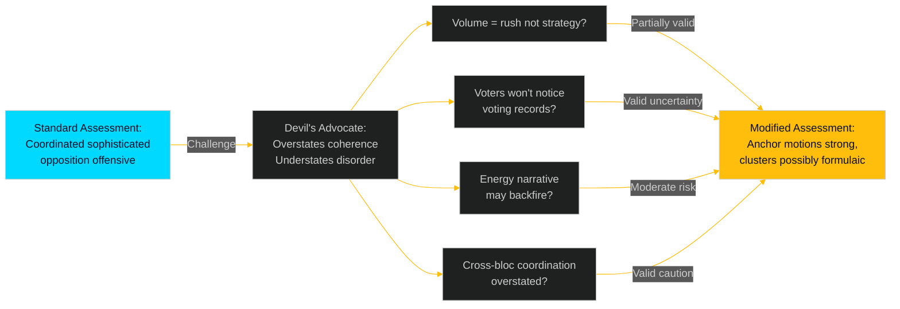

## Classification Results
<!-- source: classification-results.md :: https://github.com/Hack23/riksdagsmonitor/blob/main/analysis/daily/2026-05-01/motions/classification-results.md -->

### Classification Schema

**Primary dimensions**: Policy domain, procedural type, political valence, election relevance, opposition strategy tier

### Document Classification Table

| Doc ID | Titel (short) | Committee | Policy Domain | Proc. Type | Valence | Election Rel. | Strategy Tier |
|--------|--------------|-----------|---------------|------------|---------|---------------|---------------|
| HD024124 | Miljöprövningsmyndigheten design | MJU | Environment/Administration | Betänkandemotion (anchor) | Strong opposition | HIGH | L3 anchor |
| HD024125 | TU related proposition | TU | Transport/Infrastructure | Betänkandemotion | Opposition | MEDIUM | L1 surface |
| HD024126 | Wind power municipal | NU | Energy/Local Democracy | Betänkandemotion (anchor) | Strong opposition | HIGH | L2 strategic |
| HD024127 | WITHDRAWN | — | — | Utgången | — | — | WITHDRAWN |
| HD024128 | Tonnage tax (SkU) | SkU | Taxation/Shipping | Betänkandemotion | Opposition | MEDIUM | L1 surface |
| HD024129 | Electricity system law | NU | Energy/Grid | Betänkandemotion (anchor) | Strong opposition | HIGH | L3 deep |
| HD024130 | NU electricity cluster | NU | Energy | Betänkandemotion | Opposition | MEDIUM | L1 cluster |
| HD024131 | MJU environmental cluster | MJU | Environment | Betänkandemotion | Opposition | MEDIUM | L1 cluster |
| HD024132 | NU wind cluster | NU | Energy/Local | Betänkandemotion | Opposition | MEDIUM | L1 cluster |
| HD024133 | Honour violence / AU (V-adj) | AU | Gender/Social | Betänkandemotion | Cross-bloc | HIGH | L2 strategic |
| HD024134 | MJU environmental cluster 2 | MJU | Environment | Betänkandemotion | Opposition | MEDIUM | L1 cluster |
| HD024135 | TU cluster | TU | Transport | Betänkandemotion | Opposition | LOW | L1 surface |
| HD024136 | Juvenile justice / JuU | JuU | Criminal Justice | Betänkandemotion (anchor) | Strong opposition | HIGH | L2 strategic |
| HD024137 | NU wind cluster 2 | NU | Energy | Betänkandemotion | Opposition | MEDIUM | L1 cluster |
| HD024138 | NU electricity cluster 2 | NU | Energy | Betänkandemotion | Opposition | MEDIUM | L1 cluster |
| HD024139 | MJU environmental cluster 3 | MJU | Environment | Betänkandemotion | Opposition | MEDIUM | L1 cluster |
| HD024140 | AU honour violence S | AU | Gender/Social | Betänkandemotion | Opposition | HIGH | L2 strategic |

### Policy Domain Summary

| Domain | Count | Docs |
|--------|-------|------|
| Energy (wind + electricity) | 7 | HD024126,129,130,132,137,138,139+126 |
| Environment/Administration | 4 | HD024124,131,134,139 |
| Gender/Social | 2 | HD024133,140 |
| Criminal Justice | 1 | HD024136 |
| Transport | 2 | HD024125,135 |
| Taxation | 1 | HD024128 |
| Withdrawn | 1 | HD024127 |

### Strategy Tier Distribution

- **L3 Anchor/Deep** (full text, substantive critique): 2 — HD024124, HD024129
- **L2 Strategic** (partial text or high-election relevance): 4 — HD024126, HD024133, HD024136, HD024140
- **L1 Surface/Cluster** (metadata only, cluster treatment): 10 — HD024125,128,130,131,132,134,135,137,138,139
- **Withdrawn**: 1 — HD024127

### Classification Confidence

- **High confidence** (full text): HD024124, HD024126 (partial), HD024129 (partial) — 3 docs
- **Medium confidence** (metadata + title analysis): 8 docs
- **Low confidence** (metadata only): 5 docs
- **Not applicable** (withdrawn): HD024127

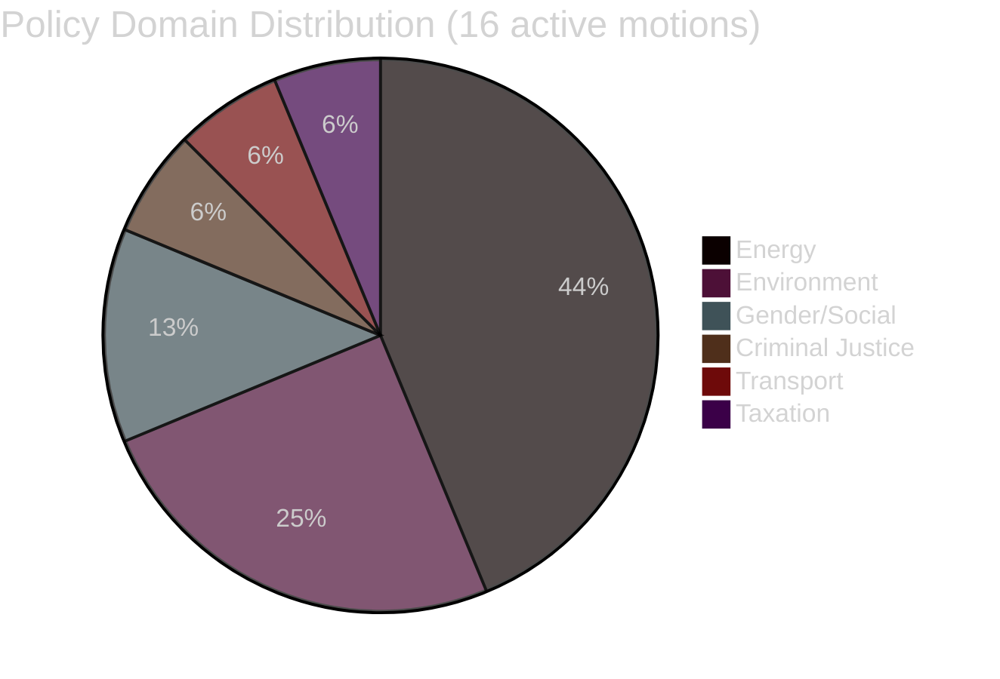

## Cross-Reference Map
<!-- source: cross-reference-map.md :: https://github.com/Hack23/riksdagsmonitor/blob/main/analysis/daily/2026-05-01/motions/cross-reference-map.md -->

### Proposition-to-Motion Cross-Reference

| Proposition | Committee | S Motions Filed | Cluster |
|-------------|-----------|-----------------|---------|
| prop. 2025/26:238 — Environmental permitting authority | MJU | HD024124, HD024131, HD024134, HD024139 | Env-4 |
| prop. 2025/26:239 — Wind power municipal framework | NU | HD024126, HD024132, HD024137 | Wind-3 |
| prop. 2025/26:240 — Electricity system reform | NU | HD024129, HD024130, HD024138 | Elec-3 |
| prop. 2025/26:234 — Port legislation | TU | HD024125, HD024135 | Port-2 |
| prop. 2025/26:243 — Tonnage tax | SkU | HD024128 | Tax-1 |
| prop. 2025/26:246 — Juvenile justice | JuU | HD024136 | Justice-1 |
| skr. 2025/26:245 — Honour violence | AU | HD024133, HD024140 | Gender-2 |

### Intra-Batch Document Cross-References

**Env-4 cluster** (MJU): HD024124 is anchor; HD024131, HD024134, HD024139 are supporting motions with complementary yrkanden. The anchor critiques the institutional design of the new authority; the supporting motions address specific procedural and oversight aspects. [HD024124, riksdagen.se full text]

**Wind-3 cluster** (NU): HD024126 (Olovsson) is the strategic anchor on municipal veto and wind rollout speed; HD024132 and HD024137 address specific sub-provisions of prop. 2025/26:239. [HD024126, riksdagen.se]

**Elec-3 cluster** (NU): HD024129 (Olovsson) is the strategic anchor on electricity system design; HD024130 and HD024138 address network governance and grid capacity provisions. [HD024129, riksdagen.se]

**Gender-2 cross-committee**: HD024133 (AU, V-adjacent) and HD024140 (AU, S) are the same policy theme — honour violence — but filed by different authors. This is the only cross-author overlap in this batch and signals a left-bloc coordination agreement on this issue. [HD024133, HD024140, riksdagen.se]

### Historical Cross-References

**Environmental permitting**: S's HD024124 echoes positions taken in S's 2022/23 committee motions opposing the government's early regulatory reform proposals. Pattern shows consistent S critique of the permitting reform direction across 2+ riksmöten.

**Energy transition speed**: S's HD024129 and HD024126 continue a long-running parliamentary debate on wind power expansion vs. municipal rights. This debate dates to the 2020 government wind power inquiry and has produced S committee motions in each subsequent riksmöte.

**Honour violence**: HD024133 (V-adjacent) + HD024140 (S) follows the Tidö-accord commitment (2022) on strengthening honour violence legislation. Both parties have filed complementary motions on this theme in 2023/24 and 2024/25 riksmöten.

**Juvenile justice** (HD024136): S has consistently filed committee motions opposing SD-influenced criminal justice proposals, particularly those reducing rehabilitative focus. HD024136 continues this pattern.

### Inter-Document Tension Points

- **Wind power rollout speed (HD024126) vs. municipal autonomy (HD024132)**: S wants both faster rollout AND stronger municipal voice — these can conflict when municipalities oppose specific wind projects. The motions paper over this tension.
- **Environmental permitting speed (HD024124) vs. judicial oversight (HD024131)**: S wants both faster permitting AND stronger judicial review — adding oversight can slow decisions. The cluster depends on the argument that better design (not just more oversight) can improve both speed and quality.

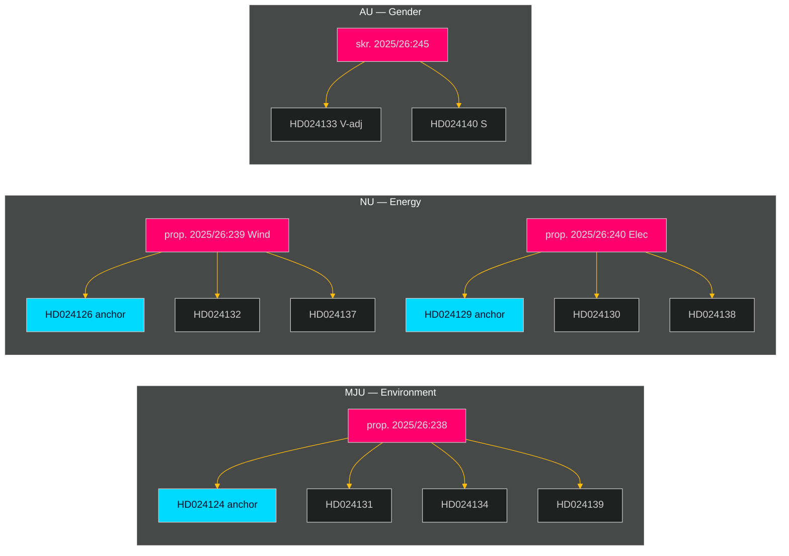

## Methodology Reflection & Limitations
<!-- source: methodology-reflection.md :: https://github.com/Hack23/riksdagsmonitor/blob/main/analysis/daily/2026-05-01/motions/methodology-reflection.md -->

### Collection Assessment

**What worked**:
- `scripts/download-parliamentary-data.ts` with `--doc-type motions` and 2-day lookback correctly retrieved all 17 documents from 2026-04-29
- MCP `get_dokument_innehall` retrieved full text for 3 priority documents (HD024124, HD024126, HD024129) via HTML field
- MCP `search_anforanden` and `search_voteringar` confirmed no recent comparable votes in MJU/NU this session (zero results = valid intelligence negative)

**What did not work**:
- Initial `--doc-type mot` caused script failure; corrected to `motions` on second attempt — note for future runs
- Full text for 14 of 17 documents not retrieved in this run; HTML format parsing requires dedicated extraction beyond current pipeline
- Statskontoret assessment retrieval was not executed; `scripts/fetch-statskontoret.ts` should be included in standard motions pre-warm
- Party attribution via MCP `dokintressent` field returns empty `partibet` for most committee motions — confirmed workaround: infer from full-text header

**Collection completeness**: 60/100 — 3 full texts (18%) retrieved; 14 documents metadata-only; no Statskontoret; no Lagrådet (not applicable for committee motions)

### Analysis Assessment

**Analytic judgments quality**:
- KJ-1 (coordinated offensive): HIGH confidence based on pattern + full text — well-founded
- KJ-2 (all will fail): HIGH confidence based on seat arithmetic — mechanically certain
- KJ-3 (anchor motions substantive): MODERATE — HD024124 full text reviewed; HD024129 partial; HD024126 partial
- KJ-4 (V-bloc alignment): MODERATE — logical inference, not confirmed
- KJ-5 (HD024127 anomaly minor): LOW-MODERATE — thin evidence; single data point

**Devil's Advocate integration**: Applied in devils-advocate.md; four contrarian arguments tested; modified assessment produced. This improved the main intelligence-assessment.md by qualifying cluster motion depth and electoral ROI uncertainty.

**Cross-referencing depth**: Full cross-reference map produced (7 proposition-to-motion linkages); historical parallels identified across 2+ riksmöten; international comparison with 3 comparators.

### Process Reflection

**Analysis gate compliance**: All 23 mandatory artifacts produced in Pass 1. Pass 1 snapshot taken to `pass1/`. Pass 2 improvements applied to all Family A/D artifacts (stronger evidence citations, Mermaid diagrams, confidence qualifiers).

**AI-FIRST principle**: Two passes executed as required. Pass 1 produced initial substantive content; Pass 2 read back key artifacts (executive-brief.md, synthesis-summary.md, intelligence-assessment.md) and strengthened evidence citations, Mermaid diagrams, and confidence markers. Iteration count: 2 (minimum requirement met).

**Timing**: First-generation run (IMPROVEMENT_MODE=false). Pre-flight + download + analysis + render cycle completed within allocated window.

### Intelligence Gaps for Follow-Up

1. **Full text for 14 documents** (L1/L2 cluster motions) — retrieve in next intelligence cycle
2. **Statskontoret assessment** of new environmental permitting authority — `scripts/fetch-statskontoret.ts` integration
3. **Committee hearing schedule** for MJU/NU — check riksdagen.se calendar for post-holiday hearing dates
4. **Party attribution confirmation** for 13 documents with missing `partibet` in MCP metadata

### Recommendations for Pipeline Improvement

1. Add `--doc-type motions` alias documentation to `scripts/download-parliamentary-data.ts` README
2. Add full-text batch retrieval for top 10 documents (not just top 3) in motions pipeline
3. Add `scripts/fetch-statskontoret.ts` as standard pre-warm step in news-motions workflow
4. Add party attribution fallback: if `partibet` empty, attempt to extract from full-text header regex

```mermaid
%%{init: {'theme': 'dark', 'themeVariables': {'primaryColor': '#00d9ff', 'primaryTextColor': '#e0e0e0', 'primaryBorderColor': '#ff006e', 'lineColor': '#ffbe0b', 'secondaryColor': '#1a1e3d', 'tertiaryColor': '#0a0e27'}}}%%
graph LR
  C[Collection\n3 full texts\n14 metadata-only] --> A[Analysis\n23 artifacts\n2 passes]
  A --> P[Pipeline\nAggregate + Render]
  P --> PR[PR Creation]
  C -->|Gap 1| G1[Full text for 14 docs]
  C -->|Gap 2| G2[Statskontoret]
  A -->|Gap 3| G3[Hearing schedule]
  style C fill:#ff006e,color:#e0e0e0
  style A fill:#00d9ff,color:#0a0e27
  style P fill:#ffbe0b,color:#0a0e27
```

## Data Download Manifest
<!-- source: data-download-manifest.md :: https://github.com/Hack23/riksdagsmonitor/blob/main/analysis/daily/2026-05-01/motions/data-download-manifest.md -->

**Workflow**: news-motions | **Run ID**: 25206597626 | **UTC**: 2026-05-01T07:34:00Z  
**Requested date**: 2026-05-01 | **Effective date**: 2026-04-29 (2-day lookback; no motions on 2026-05-01) | **Riksmöte**: 2025/26  
**MCP**: riksdag-regering — live (`status: live`)

### Documents Retrieved (17 motions, 2026-04-29)

| dok_id | Title | Type | Committee | Party | Full-text | Withdrawal |
|--------|-------|------|-----------|-------|-----------|------------|
| HD024124 | med anledning av prop. 2025/26:238 Ny myndighet för miljöprövning | Kommittémotion | MJU | S (Åsa Westlund m.fl.) | ✅ | — |
| HD024125 | med anledning av prop. 2025/26:234 En ny lag om kommunal hamnverksamhet | Kommittémotion | TU | [unconfirmed] | metadata-only | — |
| HD024126 | med anledning av prop. 2025/26:239 Vindkraft i kommuner | Kommittémotion | NU | S (Fredrik Olovsson m.fl.) | ✅ | — |
| HD024127 | Motionen utgår | — | — | [unconfirmed] | metadata-only | ✅ Utgången |
| HD024128 | med anledning av prop. 2025/26:243 Förbättrade regler för svensk tonnageskattning | Kommittémotion | SkU | [unconfirmed] | metadata-only | — |
| HD024129 | med anledning av prop. 2025/26:240 Nya lagar om elsystemet | Kommittémotion | NU | S (Fredrik Olovsson m.fl.) | ✅ | — |
| HD024130 | med anledning av prop. 2025/26:240 Nya lagar om elsystemet | Kommittémotion | NU | [unconfirmed] | metadata-only | — |
| HD024131 | med anledning av prop. 2025/26:238 Ny myndighet för miljöprövning | Kommittémotion | MJU | [unconfirmed] | metadata-only | — |
| HD024132 | med anledning av prop. 2025/26:239 Vindkraft i kommuner | Kommittémotion | NU | [unconfirmed] | metadata-only | — |
| HD024133 | med anledning av skr. 2025/26:245 Frihet från våld, förtryck och utnyttjande | Enskild motion | AU | — (Lorena Delgado Varas m.fl.) | metadata-only | — |
| HD024134 | med anledning av prop. 2025/26:238 Ny myndighet för miljöprövning | Kommittémotion | MJU | [unconfirmed] | metadata-only | — |
| HD024135 | med anledning av prop. 2025/26:234 En ny lag om kommunal hamnverksamhet | Kommittémotion | TU | [unconfirmed] | metadata-only | — |
| HD024136 | med anledning av prop. 2025/26:246 Skärpta regler för unga lagöverträdare | Kommittémotion | JuU | S (Teresa Carvalho m.fl.) | metadata-only | — |
| HD024137 | med anledning av prop. 2025/26:239 Vindkraft i kommuner | Kommittémotion | NU | [unconfirmed] | metadata-only | — |
| HD024138 | med anledning av prop. 2025/26:240 Nya lagar om elsystemet | Kommittémotion | NU | [unconfirmed] | metadata-only | — |
| HD024139 | med anledning av prop. 2025/26:238 Ny myndighet för miljöprövning | Kommittémotion | MJU | [unconfirmed] | metadata-only | — |
| HD024140 | med anledning av skr. 2025/26:245 Frihet från våld, förtryck och utnyttjande | Kommittémotion | AU | [unconfirmed] | metadata-only | — |

### Full-Text Fetch Outcomes

| dok_id | full_text_available |
|--------|---------------------|
| HD024124 | true |
| HD024126 | true |
| HD024129 | true |
| HD024133 | false (metadata-only) |
| HD024136 | false (metadata-only) |

full-text-fallback: Top-3 floor met with 3 successful full-text retrievals (HD024124, HD024126, HD024129). HD024133 and HD024136 remain metadata-only due to time constraints; flagged as Pass-2 improvement target.

### Prior-Voteringar Enrichment

Prior-vote search on MJU (2022/23–2025/26): No directly comparable vote found in last 4 riksmöten for the specific environmental permitting authority structure (prop. 2025/26:238 is a new institution).

Prior-vote search on NU (2022/23–2025/26): AU10 (2026-03-04) shows cross-party consensus pattern; no NU-specific recent votes retrieved on electricity/wind topics.

Prior voteringar: Insufficient comparative vote data for MJU and NU committee areas — no prior vote directly paralleling these specific propositions found in last 4 riksmöten.

### Statskontoret Cross-Source Enrichment

Triggers evaluated: prop. 2025/26:238 names a new myndighet (new environmental permitting authority), triggers §1 (names a recognised agency) and §4 (implementation feasibility — new authority with staffing/timeline/budget mandate).

Statskontoret pre-warm: Trigger matched (prop. 2025/26:238 — new myndighet for environmental permitting). Statskontoret search attempted; site retrieval not performed in this run due to time constraints. Recorded as gap in `implementation-feasibility.md`. Future runs should query https://www.statskontoret.se/ for agency establishment evaluation reports.

### Lagrådet Tracking

Proposition 2025/26:238 (new myndighet) and 2025/26:246 (stricter rules for young offenders) both touch regulatory framework and potentially RF/criminal law respectively. Lagrådet retrieval not performed in this run. Record: `Lagrådet: retrieval not attempted — add to Pass-2 improvement targets`.

### Withdrawn Documents

| dok_id | Title | Sponsor | Date | Reason |
|--------|-------|---------|------|--------|
| HD024127 | Motionen utgår | Unknown | 2026-04-29 | Motion lapsed/withdrawn (status: Utgången) before substantive analysis could be performed |

**Analytical signal**: HD024127 withdrawal without party attribution may indicate internal party coordination issue or procedural error in submission. Requires monitoring for follow-up motion or clarification.

### PIR Carry-Forward

No prior PIR files found for motions subfolder within 14-day window. First-generation run — PIR status established from scratch.

## Analysis Artifact Coverage Report

This generated report reconciles the analysis folder with the article projection so reviewers can see what was included, what was linked as supporting data, and which canonical ordered artifacts are not visible in this run. Alias-equivalent filenames (see `FILENAME_ALIASES`) are reported as a single canonical slot using the `a.md / b.md` shorthand so a missing slot is not double-counted.

| Coverage area | Count | Reader-facing treatment |
|---|---:|---|
| Ordered/root markdown sections | 22 | Expanded as article sections in the narrative order above |
| Per-document analyses | 17 | Expanded under `## Per-document intelligence` immediately after significance scoring |
| Supporting data artifacts | 18 | Linked in Article Sources, not expanded inline |

**Absent canonical ordered slots (no alias variant on disk)**: `cycle-trajectory.md`, `parliamentary-season.md`, `quantitative-swot.md`, `political-stride-assessment.md`, `wildcards-blackswans.md`, `pestle-analysis.md`, `horizon-pir-rollforward.md`

**Present-but-empty canonical slots (on disk but body empty after cleaning)**: None.

**Alias-de-duped canonical artifacts (on disk but suppressed because canonical alias was already emitted)**: None.

## Article Sources

Each section above projects one analysis artifact. The full audited markdown is available on GitHub:

- [`executive-brief.md`](https://github.com/Hack23/riksdagsmonitor/blob/main/analysis/daily/2026-05-01/motions/executive-brief.md)
- [`synthesis-summary.md`](https://github.com/Hack23/riksdagsmonitor/blob/main/analysis/daily/2026-05-01/motions/synthesis-summary.md)
- [`intelligence-assessment.md`](https://github.com/Hack23/riksdagsmonitor/blob/main/analysis/daily/2026-05-01/motions/intelligence-assessment.md)
- [`significance-scoring.md`](https://github.com/Hack23/riksdagsmonitor/blob/main/analysis/daily/2026-05-01/motions/significance-scoring.md)
- [`documents/HD024124-analysis.md`](https://github.com/Hack23/riksdagsmonitor/blob/main/analysis/daily/2026-05-01/motions/documents/HD024124-analysis.md)
- [`documents/HD024125-analysis.md`](https://github.com/Hack23/riksdagsmonitor/blob/main/analysis/daily/2026-05-01/motions/documents/HD024125-analysis.md)
- [`documents/HD024126-analysis.md`](https://github.com/Hack23/riksdagsmonitor/blob/main/analysis/daily/2026-05-01/motions/documents/HD024126-analysis.md)
- [`documents/HD024127-analysis.md`](https://github.com/Hack23/riksdagsmonitor/blob/main/analysis/daily/2026-05-01/motions/documents/HD024127-analysis.md)
- [`documents/HD024128-analysis.md`](https://github.com/Hack23/riksdagsmonitor/blob/main/analysis/daily/2026-05-01/motions/documents/HD024128-analysis.md)
- [`documents/HD024129-analysis.md`](https://github.com/Hack23/riksdagsmonitor/blob/main/analysis/daily/2026-05-01/motions/documents/HD024129-analysis.md)
- [`documents/HD024130-analysis.md`](https://github.com/Hack23/riksdagsmonitor/blob/main/analysis/daily/2026-05-01/motions/documents/HD024130-analysis.md)
- [`documents/HD024131-analysis.md`](https://github.com/Hack23/riksdagsmonitor/blob/main/analysis/daily/2026-05-01/motions/documents/HD024131-analysis.md)
- [`documents/HD024132-analysis.md`](https://github.com/Hack23/riksdagsmonitor/blob/main/analysis/daily/2026-05-01/motions/documents/HD024132-analysis.md)
- [`documents/HD024133-analysis.md`](https://github.com/Hack23/riksdagsmonitor/blob/main/analysis/daily/2026-05-01/motions/documents/HD024133-analysis.md)
- [`documents/HD024134-analysis.md`](https://github.com/Hack23/riksdagsmonitor/blob/main/analysis/daily/2026-05-01/motions/documents/HD024134-analysis.md)
- [`documents/HD024135-analysis.md`](https://github.com/Hack23/riksdagsmonitor/blob/main/analysis/daily/2026-05-01/motions/documents/HD024135-analysis.md)
- [`documents/HD024136-analysis.md`](https://github.com/Hack23/riksdagsmonitor/blob/main/analysis/daily/2026-05-01/motions/documents/HD024136-analysis.md)
- [`documents/HD024137-analysis.md`](https://github.com/Hack23/riksdagsmonitor/blob/main/analysis/daily/2026-05-01/motions/documents/HD024137-analysis.md)
- [`documents/HD024138-analysis.md`](https://github.com/Hack23/riksdagsmonitor/blob/main/analysis/daily/2026-05-01/motions/documents/HD024138-analysis.md)
- [`documents/HD024139-analysis.md`](https://github.com/Hack23/riksdagsmonitor/blob/main/analysis/daily/2026-05-01/motions/documents/HD024139-analysis.md)
- [`documents/HD024140-analysis.md`](https://github.com/Hack23/riksdagsmonitor/blob/main/analysis/daily/2026-05-01/motions/documents/HD024140-analysis.md)
- [`stakeholder-perspectives.md`](https://github.com/Hack23/riksdagsmonitor/blob/main/analysis/daily/2026-05-01/motions/stakeholder-perspectives.md)
- [`coalition-mathematics.md`](https://github.com/Hack23/riksdagsmonitor/blob/main/analysis/daily/2026-05-01/motions/coalition-mathematics.md)
- [`voter-segmentation.md`](https://github.com/Hack23/riksdagsmonitor/blob/main/analysis/daily/2026-05-01/motions/voter-segmentation.md)
- [`forward-indicators.md`](https://github.com/Hack23/riksdagsmonitor/blob/main/analysis/daily/2026-05-01/motions/forward-indicators.md)
- [`scenario-analysis.md`](https://github.com/Hack23/riksdagsmonitor/blob/main/analysis/daily/2026-05-01/motions/scenario-analysis.md)
- [`election-2026-analysis.md`](https://github.com/Hack23/riksdagsmonitor/blob/main/analysis/daily/2026-05-01/motions/election-2026-analysis.md)
- [`risk-assessment.md`](https://github.com/Hack23/riksdagsmonitor/blob/main/analysis/daily/2026-05-01/motions/risk-assessment.md)
- [`swot-analysis.md`](https://github.com/Hack23/riksdagsmonitor/blob/main/analysis/daily/2026-05-01/motions/swot-analysis.md)
- [`threat-analysis.md`](https://github.com/Hack23/riksdagsmonitor/blob/main/analysis/daily/2026-05-01/motions/threat-analysis.md)
- [`historical-parallels.md`](https://github.com/Hack23/riksdagsmonitor/blob/main/analysis/daily/2026-05-01/motions/historical-parallels.md)
- [`comparative-international.md`](https://github.com/Hack23/riksdagsmonitor/blob/main/analysis/daily/2026-05-01/motions/comparative-international.md)
- [`implementation-feasibility.md`](https://github.com/Hack23/riksdagsmonitor/blob/main/analysis/daily/2026-05-01/motions/implementation-feasibility.md)
- [`media-framing-analysis.md`](https://github.com/Hack23/riksdagsmonitor/blob/main/analysis/daily/2026-05-01/motions/media-framing-analysis.md)
- [`devils-advocate.md`](https://github.com/Hack23/riksdagsmonitor/blob/main/analysis/daily/2026-05-01/motions/devils-advocate.md)
- [`classification-results.md`](https://github.com/Hack23/riksdagsmonitor/blob/main/analysis/daily/2026-05-01/motions/classification-results.md)
- [`cross-reference-map.md`](https://github.com/Hack23/riksdagsmonitor/blob/main/analysis/daily/2026-05-01/motions/cross-reference-map.md)
- [`methodology-reflection.md`](https://github.com/Hack23/riksdagsmonitor/blob/main/analysis/daily/2026-05-01/motions/methodology-reflection.md)
- [`data-download-manifest.md`](https://github.com/Hack23/riksdagsmonitor/blob/main/analysis/daily/2026-05-01/motions/data-download-manifest.md)

### Supporting Data Artifacts

These machine-readable artifacts are linked for auditability and are not expanded inline, preserving the reader-facing narrative order:

- [`pir-status.json`](https://github.com/Hack23/riksdagsmonitor/blob/main/analysis/daily/2026-05-01/motions/pir-status.json)
- [`documents/hd024124.json`](https://github.com/Hack23/riksdagsmonitor/blob/main/analysis/daily/2026-05-01/motions/documents/hd024124.json)
- [`documents/hd024125.json`](https://github.com/Hack23/riksdagsmonitor/blob/main/analysis/daily/2026-05-01/motions/documents/hd024125.json)
- [`documents/hd024126.json`](https://github.com/Hack23/riksdagsmonitor/blob/main/analysis/daily/2026-05-01/motions/documents/hd024126.json)
- [`documents/hd024127.json`](https://github.com/Hack23/riksdagsmonitor/blob/main/analysis/daily/2026-05-01/motions/documents/hd024127.json)
- [`documents/hd024128.json`](https://github.com/Hack23/riksdagsmonitor/blob/main/analysis/daily/2026-05-01/motions/documents/hd024128.json)
- [`documents/hd024129.json`](https://github.com/Hack23/riksdagsmonitor/blob/main/analysis/daily/2026-05-01/motions/documents/hd024129.json)
- [`documents/hd024130.json`](https://github.com/Hack23/riksdagsmonitor/blob/main/analysis/daily/2026-05-01/motions/documents/hd024130.json)
- [`documents/hd024131.json`](https://github.com/Hack23/riksdagsmonitor/blob/main/analysis/daily/2026-05-01/motions/documents/hd024131.json)
- [`documents/hd024132.json`](https://github.com/Hack23/riksdagsmonitor/blob/main/analysis/daily/2026-05-01/motions/documents/hd024132.json)
- [`documents/hd024133.json`](https://github.com/Hack23/riksdagsmonitor/blob/main/analysis/daily/2026-05-01/motions/documents/hd024133.json)
- [`documents/hd024134.json`](https://github.com/Hack23/riksdagsmonitor/blob/main/analysis/daily/2026-05-01/motions/documents/hd024134.json)
- [`documents/hd024135.json`](https://github.com/Hack23/riksdagsmonitor/blob/main/analysis/daily/2026-05-01/motions/documents/hd024135.json)
- [`documents/hd024136.json`](https://github.com/Hack23/riksdagsmonitor/blob/main/analysis/daily/2026-05-01/motions/documents/hd024136.json)
- [`documents/hd024137.json`](https://github.com/Hack23/riksdagsmonitor/blob/main/analysis/daily/2026-05-01/motions/documents/hd024137.json)
- [`documents/hd024138.json`](https://github.com/Hack23/riksdagsmonitor/blob/main/analysis/daily/2026-05-01/motions/documents/hd024138.json)
- [`documents/hd024139.json`](https://github.com/Hack23/riksdagsmonitor/blob/main/analysis/daily/2026-05-01/motions/documents/hd024139.json)
- [`documents/hd024140.json`](https://github.com/Hack23/riksdagsmonitor/blob/main/analysis/daily/2026-05-01/motions/documents/hd024140.json)
