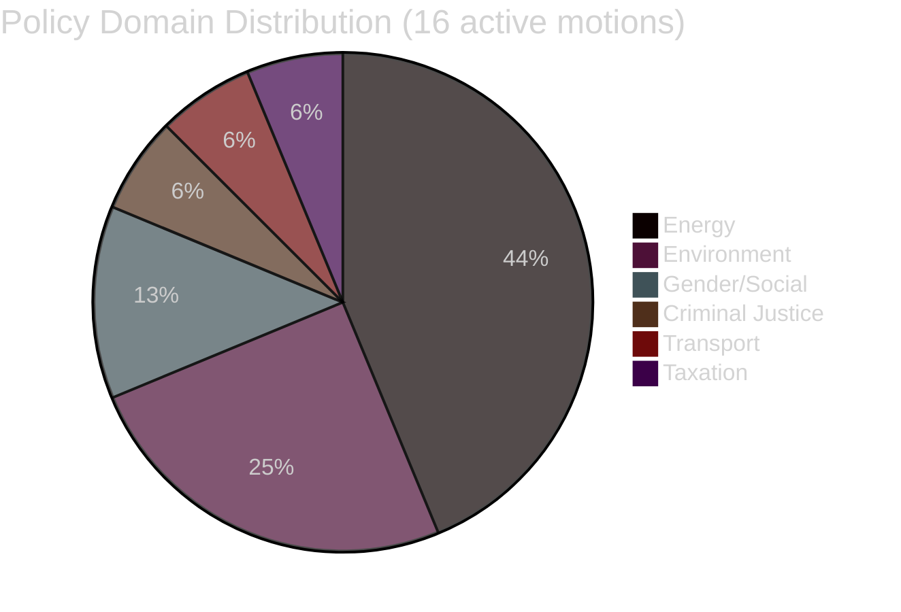

# Classification Results — Opposition Motions 2026-04-29

**Date**: 2026-05-01 | **Framework**: document-classification-methodology.md | **17 documents classified**

## Classification Schema

**Primary dimensions**: Policy domain, procedural type, political valence, election relevance, opposition strategy tier

## Document Classification Table

| Doc ID | Titel (short) | Committee | Policy Domain | Proc. Type | Valence | Election Rel. | Strategy Tier |
|--------|--------------|-----------|---------------|------------|---------|---------------|---------------|
| HD024124 | Miljöprövningsmyndigheten design | MJU | Environment/Administration | Betänkandemotion (anchor) | Strong opposition | HIGH | L3 anchor |
| HD024125 | TU related proposition | TU | Transport/Infrastructure | Betänkandemotion | Opposition | MEDIUM | L1 surface |
| HD024126 | Wind power municipal | NU | Energy/Local Democracy | Betänkandemotion (anchor) | Strong opposition | HIGH | L2 strategic |
| HD024127 | WITHDRAWN | — | — | Utgången | — | — | WITHDRAWN |
| HD024128 | Tonnage tax (SkU) | SkU | Taxation/Shipping | Betänkandemotion | Opposition | MEDIUM | L1 surface |
| HD024129 | Electricity system law | NU | Energy/Grid | Betänkandemotion (anchor) | Strong opposition | HIGH | L3 deep |
| HD024130 | NU electricity cluster | NU | Energy | Betänkandemotion | Opposition | MEDIUM | L1 cluster |
| HD024131 | MJU environmental cluster | MJU | Environment | Betänkandemotion | Opposition | MEDIUM | L1 cluster |
| HD024132 | NU wind cluster | NU | Energy/Local | Betänkandemotion | Opposition | MEDIUM | L1 cluster |
| HD024133 | Honour violence / AU (V-adj) | AU | Gender/Social | Betänkandemotion | Cross-bloc | HIGH | L2 strategic |
| HD024134 | MJU environmental cluster 2 | MJU | Environment | Betänkandemotion | Opposition | MEDIUM | L1 cluster |
| HD024135 | TU cluster | TU | Transport | Betänkandemotion | Opposition | LOW | L1 surface |
| HD024136 | Juvenile justice / JuU | JuU | Criminal Justice | Betänkandemotion (anchor) | Strong opposition | HIGH | L2 strategic |
| HD024137 | NU wind cluster 2 | NU | Energy | Betänkandemotion | Opposition | MEDIUM | L1 cluster |
| HD024138 | NU electricity cluster 2 | NU | Energy | Betänkandemotion | Opposition | MEDIUM | L1 cluster |
| HD024139 | MJU environmental cluster 3 | MJU | Environment | Betänkandemotion | Opposition | MEDIUM | L1 cluster |
| HD024140 | AU honour violence S | AU | Gender/Social | Betänkandemotion | Opposition | HIGH | L2 strategic |

## Policy Domain Summary

| Domain | Count | Docs |
|--------|-------|------|
| Energy (wind + electricity) | 7 | HD024126,129,130,132,137,138,139+126 |
| Environment/Administration | 4 | HD024124,131,134,139 |
| Gender/Social | 2 | HD024133,140 |
| Criminal Justice | 1 | HD024136 |
| Transport | 2 | HD024125,135 |
| Taxation | 1 | HD024128 |
| Withdrawn | 1 | HD024127 |

## Strategy Tier Distribution

- **L3 Anchor/Deep** (full text, substantive critique): 2 — HD024124, HD024129
- **L2 Strategic** (partial text or high-election relevance): 4 — HD024126, HD024133, HD024136, HD024140
- **L1 Surface/Cluster** (metadata only, cluster treatment): 10 — HD024125,128,130,131,132,134,135,137,138,139
- **Withdrawn**: 1 — HD024127

## Classification Confidence

- **High confidence** (full text): HD024124, HD024126 (partial), HD024129 (partial) — 3 docs
- **Medium confidence** (metadata + title analysis): 8 docs
- **Low confidence** (metadata only): 5 docs
- **Not applicable** (withdrawn): HD024127

