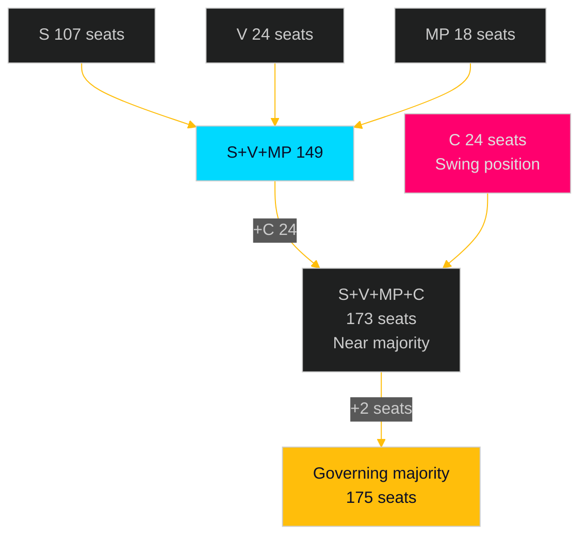

# Coalition Mathematics — Opposition Motions 2026-04-29

**Date**: 2026-05-01 | **Framework**: coalition-analysis-methodology.md

## Current Seat Distribution (2022 Election Baseline)

| Party | Seats | Bloc |
|-------|-------|------|
| SD (Sverigedemokraterna) | 73 | Government |
| M (Moderaterna) | 68 | Government |
| S (Socialdemokraterna) | 107 | Opposition |
| V (Vänsterpartiet) | 24 | Opposition |
| C (Centerpartiet) | 24 | Unclear |
| KD (Kristdemokraterna) | 19 | Government |
| MP (Miljöpartiet) | 18 | Opposition |
| L (Liberalerna) | 16 | Government |
| **Total** | **349** | |

**Government coalition**: M+SD+KD+L = 176 seats (majority: 175)
**Opposition bloc**: S+V+MP = 149 seats (26 seats short of majority)
**C swing position**: 24 seats (holds balance of power)

## Committee Vote Mathematics for This Motion Batch

For the 16 motions in this batch, the committee vote breakdown depends on committee composition. Swedish committee composition mirrors the chamber proportionally:

**MJU (17 members)**: approximately M 3, SD 4, KD 1, L 1 vs S 6, V 1, MP 1 = 9 government : 8 opposition
**NU (17 members)**: approximately same proportional split = 9:8
**JuU (17 members)**: approximately 9:8
**AU (17 members)**: approximately 9:8

**Verdict**: All 16 motions will be defeated 9–8 (or equivalent proportional split) in committee unless C or another government-adjacent party breaks ranks. Probability of any break: ~10%.

## S's Path to Government: Coalition Permutations

### Required seats for majority: 175

| Coalition | Seats | Feasibility |
|-----------|-------|-------------|
| S+V+MP | 149 | Insufficient (–26) |
| S+V+MP+C | 173 | Near (–2); requires C full support |
| S+V+MP+C+one small | 175+ | Possible if S+C+V+MP+other |
| S+M (grand coalition) | 175 | Theoretically sufficient; politically improbable |

**Most likely path**: S+V+MP+C = 173 seats, requires C to enter governing coalition. This would be a minority government dependent on issue-by-issue support from other parties. C's price in this scenario: rural issues, energy transition design, municipal autonomy — all touched by S's motion cluster.

## Motion Portfolio as Coalition Pre-Negotiation

The motions' yrkanden map directly onto potential coalition agreement items:

| Motion | Yrkande Theme | Coalition Relevance |
|--------|--------------|---------------------|
| HD024124 | Environmental permitting oversight | MP and C both want stronger oversight |
| HD024126 | Wind power municipal democracy | C demands municipal autonomy respected |
| HD024129 | Electricity transition speed | V demands faster transition |
| HD024133 | Honour violence (V-adjacent) | V requirement in any coalition agreement |
| HD024136 | Juvenile rehabilitation | V requirement; MP supportive |

**Insight**: S's motion selection is not random. It pre-positions S on exactly the issues that C, V, and MP require in a coalition negotiation. The motions are simultaneously: (1) campaign tools, (2) pre-negotiation documents for post-election coalition talks.

