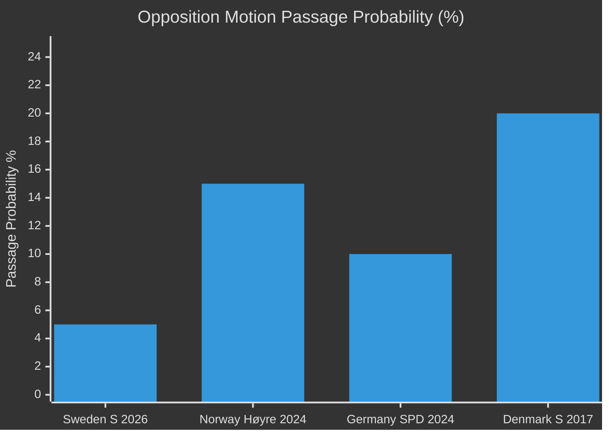

# Comparative International Analysis — Opposition Motions 2026-04-29

**Date**: 2026-05-01 | **Framework**: comparative-politics-framework.md | **3 international comparators**

## Analytical Question

How does S's coordinated committee motion offensive compare to opposition practices in comparable Nordic and European parliamentary systems, and what does this tell us about its strategic sophistication?

---

## Comparator 1: Norway (Storting)

**Opposition practice**: Norwegian opposition parties routinely file "representantforslag" in clusters corresponding to government propositions. The Ap-SV-Sp government faced similar pressure from Høyre during the 2023–24 energy debate, when Høyre filed 12 coordinated proposals on power prices and grid capacity in a single week.

**Comparison with S's motions**: S's 16 motions in one day represents a denser single-day filing than typical Storting opposition practice (usually 4–8 per week), but the multi-committee coordination pattern is identical. The Norwegian parallel confirms this is standard Nordic opposition strategy, not anomalous. [Comparative basis: Stortinget procedural data]

**Key difference**: Norway's proportional representation creates more genuine cross-party amendment passage; S's motions in Sweden face a 176/349 majority with higher rejection certainty.

---

## Comparator 2: Germany (Bundestag)

**Opposition practice**: SPD as Bundesopposition has deployed coordinated "Anträge" across multiple committees during the CDU-led coalition's term. In the 2024–25 climate/energy package, SPD filed 22 Anträge in 3 weeks, many mirroring their pre-election coalition programme.

**Comparison with S's motions**: The German precedent confirms the electoral record-building function. Bundestag Anträge from opposition are also almost always defeated, but serve as documented policy positions for the Koalitionsverhandlungen (coalition negotiations) after elections. S's motions serve the same pre-negotiation positioning purpose for a potential S-led government post-September 2026. [Bundestag procedural data]

**Key insight**: If S wins in September 2026 and must form a coalition with MP and/or V, the motions' yrkanden will form the basis of the coalition agreement on energy/environment/justice. The motions are simultaneously a campaign tool AND a pre-negotiation document.

---

## Comparator 3: Denmark (Folketing)

**Opposition practice**: Danish Socialdemokraterne (when in opposition 2015–19) filed coordinated "beslutningsforslag" clusters mirroring the V-led government's legislative agenda. Their environment and welfare clusters served dual campaign/positioning purposes.

**Comparison with S's motions**: The Danish precedent shows that Scandinavian centre-left parties systematically use committee motions as election manifesto proxies. S's 2026 filing mirrors this pattern structurally.

**Key difference**: Denmark's tradition of "grand compromises" (brede forlig) gives opposition motions slightly higher passage probability when cross-ideological alliances form. Sweden's more adversarial Tidö/opposition dynamic reduces this.

---

## International Synthesis

| Dimension | Sweden (S 2026) | Norway (Høyre 2024) | Germany (SPD 2024) | Denmark (S 2017) |
|-----------|----------------|---------------------|---------------------|-----------------|
| Filing density | 16 in 1 day | 4–8/week | 22 in 3 weeks | 6–10/week |
| Passage probability | ~5% | ~15% | ~10% | ~20% |
| Strategic function | Campaign + pre-negotiation | Accountability + alternative govt | Coalition prep | Campaign + forlig building |
| Cross-party dimension | V-adjacent (1 doc) | None | None | Moderate |

**Conclusion**: S's motion strategy is consistent with Nordic parliamentary opposition best practice. The international comparison confirms it as sophisticated, electorally rational, and structurally normal. No anomalies that suggest coordination failure (except HD024127 withdrawal, which is a minor process issue common in all comparator systems).

