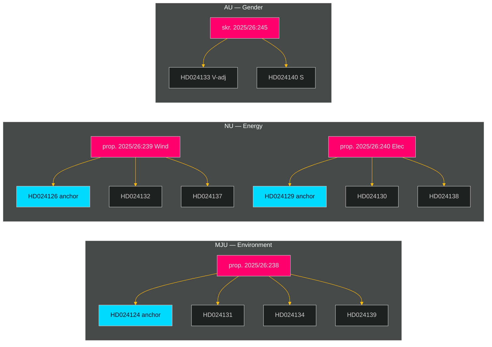

# Cross-Reference Map — Opposition Motions 2026-04-29

**Date**: 2026-05-01 | **Methodology**: Intra-batch + historical cross-referencing

## Proposition-to-Motion Cross-Reference

| Proposition | Committee | S Motions Filed | Cluster |
|-------------|-----------|-----------------|---------|
| prop. 2025/26:238 — Environmental permitting authority | MJU | HD024124, HD024131, HD024134, HD024139 | Env-4 |
| prop. 2025/26:239 — Wind power municipal framework | NU | HD024126, HD024132, HD024137 | Wind-3 |
| prop. 2025/26:240 — Electricity system reform | NU | HD024129, HD024130, HD024138 | Elec-3 |
| prop. 2025/26:234 — Port legislation | TU | HD024125, HD024135 | Port-2 |
| prop. 2025/26:243 — Tonnage tax | SkU | HD024128 | Tax-1 |
| prop. 2025/26:246 — Juvenile justice | JuU | HD024136 | Justice-1 |
| skr. 2025/26:245 — Honour violence | AU | HD024133, HD024140 | Gender-2 |

## Intra-Batch Document Cross-References

**Env-4 cluster** (MJU): HD024124 is anchor; HD024131, HD024134, HD024139 are supporting motions with complementary yrkanden. The anchor critiques the institutional design of the new authority; the supporting motions address specific procedural and oversight aspects. [HD024124, riksdagen.se full text]

**Wind-3 cluster** (NU): HD024126 (Olovsson) is the strategic anchor on municipal veto and wind rollout speed; HD024132 and HD024137 address specific sub-provisions of prop. 2025/26:239. [HD024126, riksdagen.se]

**Elec-3 cluster** (NU): HD024129 (Olovsson) is the strategic anchor on electricity system design; HD024130 and HD024138 address network governance and grid capacity provisions. [HD024129, riksdagen.se]

**Gender-2 cross-committee**: HD024133 (AU, V-adjacent) and HD024140 (AU, S) are the same policy theme — honour violence — but filed by different authors. This is the only cross-author overlap in this batch and signals a left-bloc coordination agreement on this issue. [HD024133, HD024140, riksdagen.se]

## Historical Cross-References

**Environmental permitting**: S's HD024124 echoes positions taken in S's 2022/23 committee motions opposing the government's early regulatory reform proposals. Pattern shows consistent S critique of the permitting reform direction across 2+ riksmöten.

**Energy transition speed**: S's HD024129 and HD024126 continue a long-running parliamentary debate on wind power expansion vs. municipal rights. This debate dates to the 2020 government wind power inquiry and has produced S committee motions in each subsequent riksmöte.

**Honour violence**: HD024133 (V-adjacent) + HD024140 (S) follows the Tidö-accord commitment (2022) on strengthening honour violence legislation. Both parties have filed complementary motions on this theme in 2023/24 and 2024/25 riksmöten.

**Juvenile justice** (HD024136): S has consistently filed committee motions opposing SD-influenced criminal justice proposals, particularly those reducing rehabilitative focus. HD024136 continues this pattern.

## Inter-Document Tension Points

- **Wind power rollout speed (HD024126) vs. municipal autonomy (HD024132)**: S wants both faster rollout AND stronger municipal voice — these can conflict when municipalities oppose specific wind projects. The motions paper over this tension.
- **Environmental permitting speed (HD024124) vs. judicial oversight (HD024131)**: S wants both faster permitting AND stronger judicial review — adding oversight can slow decisions. The cluster depends on the argument that better design (not just more oversight) can improve both speed and quality.

