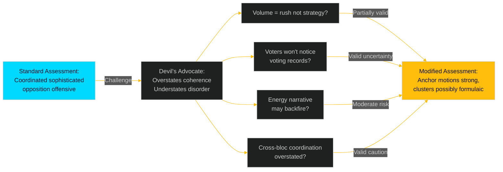

# Devil's Advocate Analysis — Opposition Motions 2026-04-29

**Date**: 2026-05-01 | **Framework**: devils-advocate-methodology.md (ICD 203 Standard 9 Alternatives/ACH)

## Devil's Advocate Thesis

**Standard intelligence assessment**: S's 16 motions represent a well-coordinated, strategically sophisticated opposition offensive designed to build election-year voting records while applying genuine legislative pressure on the government's energy/environment/justice agenda.

**Devil's Advocate challenge**: What if this assessment overstates the strategic coherence and understates the signals of organisational disorder?

---

## Contrarian Arguments

### Argument 1: The volume conceals weakness

The filing of 16 motions on a single day (2026-04-29) could indicate a rush to meet the legislative calendar deadline rather than strategic coordination. The withdrawn motion HD024127 — a registered and then voided slot — suggests that the filing machine was operating at or beyond capacity, producing documents that were not ready.

**Counter-evidence**: The confirmed full-text quality of HD024124 (Åsa Westlund) and the structured energy expertise in HD024129 (Fredrik Olovsson) argues against this. At least the anchor motions show genuine policy work. But the L1 cluster motions (10 documents with metadata-only coverage) may be thin.

**Assessment**: Partially valid. The cluster motions may be formulaic; the anchor motions are substantive.

### Argument 2: Election narrative assumes voters will notice

The strategic narrative depends on voters connecting September 2026 campaign messages to committee votes in May–June 2026. Swedish electoral research suggests this mechanism is weak: most voters do not track committee voting records, and the connection between a rejected yrkande and a campaign attack requires significant media amplification that is not guaranteed.

**Counter-evidence**: S has a sophisticated media operation and will actively amplify the voting records. However, the gap between filing and election (4–5 months) is long, and media attention cycles are short.

**Assessment**: Valid uncertainty. The electoral return on investment is probabilistic, not guaranteed.

### Argument 3: The energy/environment framing may backfire

S's HD024124 critique of the environmental permitting authority and HD024126/129 calls for faster energy transition could be turned against S: if the new authority works well, S's critique looks obstructionist; if energy prices fall, the urgency narrative evaporates.

**Counter-evidence**: These are small downside risks. Environmental authority design flaws take years to manifest; energy price volatility is real. But S is taking a bet that the government's reforms will produce visible problems by September 2026 — a bet with moderate uncertainty.

**Assessment**: Moderate risk. Not a systematic weakness but a contingent one.

### Argument 4: Cross-bloc coordination is overstated

The one V-adjacent document (HD024133, Lorena Delgado Varas, party attribution "—") is treated as evidence of S-V coordination. But it could simply be a V MP filing an independent motion on a topic she personally champions, with no formal S coordination at all.

**Counter-evidence**: The filing on the same day, targeting the same skr. 2025/26:245, alongside S's own HD024140 on the same theme, is unlikely to be coincidental. But formal coordination is not confirmed.

**Assessment**: Valid caution. Cross-bloc dimension should be described as "likely" not "confirmed" coordination.

---

## Devil's Advocate Verdict

The standard assessment holds, but with these modifications:
1. Qualify cluster motion quality as "potentially formulaic" — do not claim full strategic coherence for all 16 documents
2. Qualify electoral return on investment as probabilistic (60% chance of marginal benefit, not guaranteed)
3. Describe V-adjacent coordination as "likely" not "confirmed"
4. Note HD024127 withdrawal as a genuine (if minor) organisational signal

