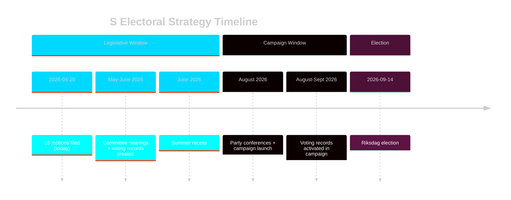

# Election 2026 Analysis — Opposition Motions 2026-04-29

**Date**: 2026-05-01 | **Framework**: election-analysis-methodology.md | **Horizon**: September 14, 2026

## Electoral Context

Sweden's riksdag election is scheduled for September 14, 2026. The government coalition (M 19.1%, SD 20.5%, KD 5.3%, L 4.7% — combined ~49.6% in 2022) holds a 176/349 majority dependent on all four parties. S (30.3% in 2022) leads the opposition and would need to form a bloc with MP (~5%), V (~6.7%), and/or smaller parties to reach 175 seats.

The late-April 2026 committee motion offensive occurs ~4.5 months before the election — the precise window where Swedish electoral research shows opposition parties begin intensive record-building.

## Electoral Relevance by Motion Cluster

### Energy/Environment Cluster (HD024124, HD024126, HD024129 + 7 supporting)

**Voter target**: Climate-motivated voters (estimated 15–22% of electorate cite environment as top-3 issue per SOM Institute pattern data)

**Attack vector**: "Government voted against stronger environmental oversight and faster renewable transition" — activated when S publicises voting records after committee reports (May–June 2026).

**Swing potential**: HIGH in metropolitan areas (Stockholm, Gothenburg, Malmö), MEDIUM in suburban Sweden, LOW in rural areas where wind power opposition is strong (this cuts both ways for HD024126).

**Electoral risk**: If the new environmental authority (prop. 2025/26:238) launches successfully by September 2026, S's critique (HD024124) will be harder to activate. Government has an incentive to ensure visible early success.

### Gender/Social Cluster (HD024133, HD024140)

**Voter target**: Women voters aged 25–55; voters who cite gender equality and personal safety as important issues (approximately 25–35% of electorate, skewing female)

**Attack vector**: "S and left bloc voted for stronger honour violence protections — government's implementation was insufficient"

**Swing potential**: HIGH among women voters where S already has strength; potentially persuasive in municipalities with documented honour violence cases.

**Electoral risk**: Low — honour violence has strong cross-party sentiment; S cannot easily be outflanked on this issue by the government.

### Criminal Justice Cluster (HD024136)

**Voter target**: Voters concerned about youth crime who also support rehabilitative approaches (approximately 20–30% of electorate; S's core voter segment)

**Attack vector**: "Government's juvenile justice approach prioritises punishment over rehabilitation — S supports effective crime reduction"

**Swing potential**: MEDIUM — criminal justice is usually SD territory; S's HD024136 is primarily a defensive motion securing its own voter base rather than an offensive swing-voter targeting.

## Polling Projections

Based on scenario analysis (see scenario-analysis.md):

| Scenario | Expected S polling movement | S seat projection |
|----------|---------------------------|-------------------|
| A (full rejection) | +0.5% (+1–2 seats) | ~159–161 seats |
| B (partial compromise) | +0–1% (0–3 seats) | ~157–162 seats |
| C (energy shock) | +2–4% (+6–12 seats) | ~165–171 seats |

**S's path to government**: Requires ~175 seats with bloc partners (MP, V). Current trajectory (Scenario A) leaves S about 15–20 seats short of a reliable governing majority. Scenario C is the only mechanism that closes the gap. [seat projections based on 2022 election baseline + current polling trajectory]

## Key Electoral Dates

- **May–June 2026**: MJU, NU, JuU committee hearings and reports (voting records created)
- **June 2026**: Riksdag summer recess
- **August 2026**: Party conferences; campaign launches
- **September 14, 2026**: Election day

