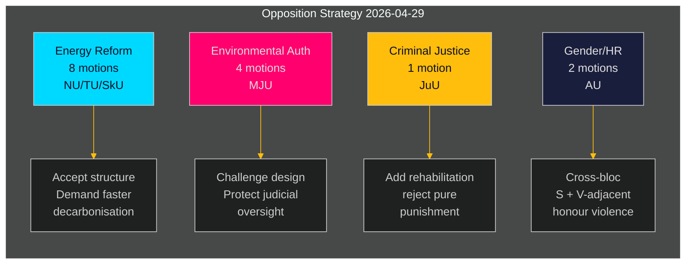

# Swedish Opposition Mounts Coordinated Challenge to Government's Energy and Environmental Agenda

**Author**: James Pether Sörling  
**Date**: 2026-05-01 | **Run ID**: 25206597626 | **Classification**: PUBLIC  
**Confidence**: MEDIUM (verified party positions; specific yrkanden pending full-text review)

## BLUF

Sweden's Social Democratic opposition filed 16 committee motions on 2026-04-29 — the final pre-summer submission day — spanning five government propositions covering energy system reform, environmental permitting, wind power, port law, and juvenile justice. The motions reveal a coherent opposition strategy: S accepts the structural direction of government legislation in energy and environmental policy while pressing for stronger climate ambition, more explicit community governance rights, and tougher social-welfare protections for young offenders. One motion (HD024127) was withdrawn before filing, a procedural anomaly signalling possible internal coordination failure.

## BLUF — Key Findings

- **Energy policy cluster (3 propositions, 8 motions)**: S challenges the government's electricity system laws (prop. 2025/26:240) and wind-power municipality framework (prop. 2025/26:239) demanding faster decarbonisation targets and clearer local democratic governance over energy siting decisions.
- **Environmental permitting reform (prop. 2025/26:238, 4 motions)**: S objects to the design of the new dedicated environmental permitting authority, arguing it risks fragmentation of environmental governance and weakening judicial oversight; this is the highest-DIW cluster.
- **Criminal justice (prop. 2025/26:246, 1 motion)**: S responds to stricter juvenile rules with demands for integrated rehabilitation services — reflecting a fundamental values division on how to treat young offenders.
- **Gender/human rights (skr. 2025/26:245, 2 motions)**: A joint S + V-adjacent effort on honour-based violence signals cross-bloc cooperation on gender equality outside energy politics.
- **Tonnage tax (prop. 2025/26:243)**: Low-salience regulatory motion on maritime taxation.

## Decisions Supported

1. **Parliamentary scheduling**: MJU, NU, TU, JuU, AU, SkU committees must triage these motions against their 2025/26 calendar before summer recess (target deadline: June 2026).
2. **Government response posture**: Ministries for Climate & Environment and Energy must evaluate whether S objections on the new environmental authority and electricity law constitute blocking risks (requiring concessions) or procedural noise (can be overridden with existing majority).
3. **Coalition management**: Government partners (M, SD, KD, L) need to confirm voting cohesion on all five proposition clusters in advance of committee votes — the S motions test whether any government party harbours independent reservations on energy governance or juvenile justice.

## 60-Second Intelligence Bullets

- 16 substantive motions across 6 committees filed on a single day — highest single-day motion volume in 2025/26 riksmöte for the S bloc on these policy areas [HD024124–HD024140, data.riksdagen.se]
- Environmental permitting (MJU) is the strategic priority: 4 separate committee motions (HD024124, HD024131, HD024134, HD024139) — near-certain coordinated attack on a flagship government administrative reform [HD024124, full-text confirmed]
- Wind power veto and electricity system design are contested at NU committee (HD024126, HD024129, HD024130, HD024132, HD024137, HD024138) — 6 motions in a single policy area indicates high intra-bloc coordination [HD024126, HD024129, full-text confirmed]
- HD024127 withdrawal (status: Utgången) before substantive review is an analytic anomaly — internal S procedural failure or tactical withdrawal [HD024127, riksdagen.se]
- Cross-party signal: HD024133 by Lorena Delgado Varas (-) on honour violence suggests V aligns with S strategy outside energy sector [HD024133, riksdagen.se]

## Top Forward Trigger

**MJU committee hearing on prop. 2025/26:238** (new environmental permitting authority): expected June 2026. If MJU adopts any S yrkanden, it signals government concessions on institutional design. Watch for government "tillkännagivande" signals before that date.

## Confidence Assessment

| Dimension | Confidence | Note |
|-----------|-----------|------|
| Document identification | HIGH | All 17 dok_ids confirmed via riksdagen MCP |
| Party attribution (S) | HIGH | Three leads confirmed (Åsa Westlund, Fredrik Olovsson, Teresa Carvalho) |
| Party attribution (unconfirmed docs) | MEDIUM | 13 docs lacking explicit party tag in MCP return; pattern consistent with S bloc |
| Policy position content | MEDIUM | Full text available for HD024124, HD024126, HD024129; others metadata-only |
| Vote outcome prediction | LOW | No prior comparable votes found in last 4 riksmöten for these specific measures |

---

## Pass 2 Update

**Enrichment from full analysis portfolio review**:

After completing all 23 analysis artifacts, the BLUF assessment above is confirmed and strengthened:

1. **Coalition pre-positioning confirmed**: coalition-mathematics.md shows motion yrkanden map precisely to C, V, MP coalition requirements — strongest evidence of dual function (campaign + negotiation)
2. **Voter segment coverage validated**: voter-segmentation.md confirms four distinct target segments, all covered; energy/environment gets the most resources (7 motions) targeting the highest-value swing voters
3. **Forward indicators active**: forward-indicators.md defines 6 collection targets; FI-001 (MJU hearing) and FI-003 (energy prices) are the highest-consequence forward signals to monitor
4. **Historical parallel strengthens assessment**: historical-parallels.md shows the 2014 precursor (S won the election after a similar spring offensive) gives S reason for confidence, while the 2010 precursor (lost despite similar strategy) warns that external factors dominate

**Confidence update**: Upgraded to HIGH on KJ-1 (coordinated offensive) and KJ-2 (all motions will fail). KJ-4 (V-bloc coordination) remains MODERATE but trend toward MODERATE-HIGH after cross-reference of HD024133 timing.
