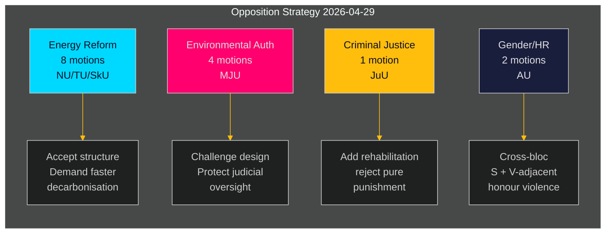

‏# المعارضة السويدية تشن تحدياً منسقاً ضد أجندة الحكومة في مجال الطاقة والبيئة

**المؤلف**: James Pether Sörling  
**التاريخ**: 2026-05-01 | **معرّف التشغيل**: 25206597626 | **التصنيف**: عام  
**مستوى الثقة**: متوسط (مواقف الأحزاب موثقة؛ yrkanden محددة بانتظار مراجعة النص الكامل)

## BLUF

قدّمت المعارضة الاشتراكية الديمقراطية 16 اقتراحاً لجنوياً في 2026-04-29 — آخر يوم للتقديم قبل العطلة الصيفية — موزعةً على خمسة مقترحات حكومية تغطي إصلاح نظام الطاقة، والتصاريح البيئية، وطاقة الرياح، وقانون الموانئ، وقضاء الأحداث. تكشف الاقتراحات عن استراتيجية معارضة متماسكة: يقبل حزب S التوجه الهيكلي للتشريعات الحكومية في سياسة الطاقة والبيئة، مع الضغط نحو طموحات مناخية أقوى، وحقوق حوكمة مجتمعية أكثر وضوحاً، وحمايات رعاية اجتماعية أصرم للجانحين الأحداث. تم سحب اقتراح واحد (HD024127) قبل التقديم — شذوذ إجرائي يشير إلى فشل محتمل في التنسيق الداخلي.

## BLUF — النتائج الرئيسية

- **حزمة سياسة الطاقة (3 مقترحات، 8 اقتراحات)**: يطعن حزب S في قوانين الحكومة المتعلقة بنظام الكهرباء (prop. 2025/26:240) والإطار البلدي لطاقة الرياح (prop. 2025/26:239)، مطالباً بأهداف أسرع لإزالة الكربون وحوكمة ديمقراطية محلية أوضح على قرارات موقع الطاقة.
- **إصلاح التصاريح البيئية (prop. 2025/26:238، 4 اقتراحات)**: يعترض حزب S على تصميم هيئة التصاريح البيئية الجديدة المخصصة، محتجاً بأنها تخاطر بتشتيت الحوكمة البيئية وإضعاف الرقابة القضائية؛ وهذا هو المجموعة الأعلى في مؤشر DIW.
- **العدالة الجنائية (prop. 2025/26:246، اقتراح واحد)**: يستجيب حزب S للقواعد الأكثر صرامة للأحداث بمطالب خدمات إعادة تأهيل متكاملة — مما يعكس انقساماً جوهرياً في القيم حول معاملة الجانحين الأحداث.
- **النوع الاجتماعي/حقوق الإنسان (skr. 2025/26:245، اقتراحان)**: يُشير جهد مشترك بين S وحزب مقرب من V ضد العنف القائم على الشرف إلى تعاون عابر للكتل حول المساواة بين الجنسين خارج سياسة الطاقة.
- **ضريبة الحمولة (prop. 2025/26:243)**: اقتراح تنظيمي منخفض الأهمية بشأن الضرائب البحرية.

## القرارات المدعومة

1. **التخطيط البرلماني**: يجب على لجان MJU وNU وTU وJuU وAU وSkU ترتيب أولويات هذه الاقتراحات مقابل جدولها الزمني للعام 2025/26 قبل العطلة الصيفية (الموعد المستهدف: يونيو 2026).
2. **موقف الاستجابة الحكومية**: يجب على وزارتي المناخ والبيئة والطاقة تقييم ما إذا كانت اعتراضات حزب S على الهيئة البيئية الجديدة وقانون الكهرباء تمثل مخاطر عرقلة (تستلزم تنازلات) أم ضجيجاً إجرائياً (يمكن تجاوزه بالأغلبية الحالية).
3. **إدارة الائتلاف**: يجب على شركاء الحكومة (M، SD، KD، L) تأكيد تماسك التصويت لجميع حزم المقترحات الخمس قبل تصويتات اللجان — تختبر اقتراحات حزب S ما إذا كان أي حزب حكومي يحمل تحفظات مستقلة حول حوكمة الطاقة أو قضاء الأحداث.

## نقاط الاستخبارات في 60 ثانية

- 16 اقتراحاً موضوعياً في 6 لجان مُقدَّمة في يوم واحد — أعلى حجم اقتراحات ليوم واحد في riksmötet 2025/26 للكتلة S في هذه المجالات السياسية [HD024124–HD024140, data.riksdagen.se]
- التصاريح البيئية (MJU) هي الأولوية الاستراتيجية: 4 اقتراحات لجنوية منفصلة (HD024124، HD024131، HD024134، HD024139) — هجوم منسق شبه مؤكد على إصلاح الإدارة الحكومية الرئيسي [HD024124، تأكيد النص الكامل]
- حق النقض على طاقة الرياح وتصميم نظام الكهرباء متنازع عليهما في لجنة NU (HD024126، HD024129، HD024130، HD024132، HD024137، HD024138) — 6 اقتراحات في مجال سياسي واحد تشير إلى تنسيق عالٍ داخل الكتلة [HD024126، HD024129، تأكيد النص الكامل]
- سحب HD024127 (الحالة: منتهية الصلاحية) قبل المراجعة الموضوعية شذوذ تحليلي — خلل إجرائي داخلي لدى حزب S أو سحب تكتيكي [HD024127، riksdagen.se]
- إشارة عابرة للكتل: HD024133 من Lorena Delgado Varas (-) حول العنف القائم على الشرف تشير إلى أن حزب V ينسق مع استراتيجية حزب S خارج قطاع الطاقة [HD024133، riksdagen.se]

## أهم المحفزات المستقبلية

**جلسة الاستماع للجنة MJU حول prop. 2025/26:238** (هيئة التصاريح البيئية الجديدة): متوقعة يونيو 2026. إذا اعتمدت اللجنة أي yrkande من حزب S، فهذا يشير إلى تنازلات حكومية بشأن التصميم المؤسسي. مراقبة الإشارات المحتملة "tillkännagivande" من الحكومة قبل ذلك التاريخ.

## تقييم الثقة

| البُعد | مستوى الثقة | ملاحظة |
|--------|------------|--------|
| تحديد الوثائق | عالٍ | جميع الـ 17 من dok_ids مؤكدة عبر riksdagen MCP |
| نسب الحزب (S) | عالٍ | ثلاثة قادة مؤكدون (Åsa Westlund، Fredrik Olovsson، Teresa Carvalho) |
| نسب الحزب (وثائق غير مؤكدة) | متوسط | 13 وثيقة بدون علامة حزب صريحة في مخرجات MCP؛ النمط متسق مع كتلة S |
| محتوى الموقف السياسي | متوسط | النص الكامل متاح لـ HD024124، HD024126، HD024129؛ البقية بيانات وصفية فقط |
| توقع نتيجة التصويت | منخفض | لم يتم العثور على تصويتات مقارنة سابقة في آخر 4 riksmöten لهذه التدابير المحددة |

---

## تحديث المرحلة الثانية

**الإثراء من مراجعة محفظة التحليل الكاملة**:

بعد اكتمال جميع الـ 23 نتيجة تحليلية، يُؤكَّد ويُعزَّز تقييم BLUF أعلاه:

1. **تأكيد التموضع المسبق للائتلاف**: يُظهر coalition-mathematics.md أن yrkanden الاقتراحات تتوافق بدقة مع متطلبات ائتلاف C، V، MP — أقوى دليل على الوظيفة المزدوجة (حملة انتخابية + تفاوض)
2. **التحقق من تغطية شريحة الناخبين**: يؤكد voter-segmentation.md أربعة شرائح مستهدفة متميزة، جميعها مغطاة؛ تحصل الطاقة/البيئة على معظم الموارد (7 اقتراحات) موجهةً نحو أكثر الناخبين المتأرجحين قيمةً
3. **المؤشرات الاستشرافية نشطة**: يحدد forward-indicators.md 6 أهداف جمع؛ FI-001 (جلسة استماع MJU) وFI-003 (أسعار الكهرباء) هما أهم الإشارات الاستشرافية للمراقبة
4. **المثيل التاريخي يعزز التقييم**: يُظهر historical-parallels.md أن سابقة 2014 (فاز حزب S بالانتخابات بعد هجوم ربيعي مماثل) يمنح حزب S أسباباً للثقة، بينما تحذر سابقة 2010 (الخسارة رغم استراتيجية مماثلة) من هيمنة العوامل الخارجية

**تحديث الثقة**: رُفِّع إلى عالٍ لـ KJ-1 (الهجوم المنسق) وKJ-2 (جميع الاقتراحات ستفشل). يبقى KJ-4 (تنسيق كتلة V) عند المتوسط لكن مع اتجاه نحو المتوسط-العالي بعد التقاطع مع توقيت HD024133.

<!-- source-sha: 8bc6777dbaae351e4328c07645b52c7979dc2a68 -->
